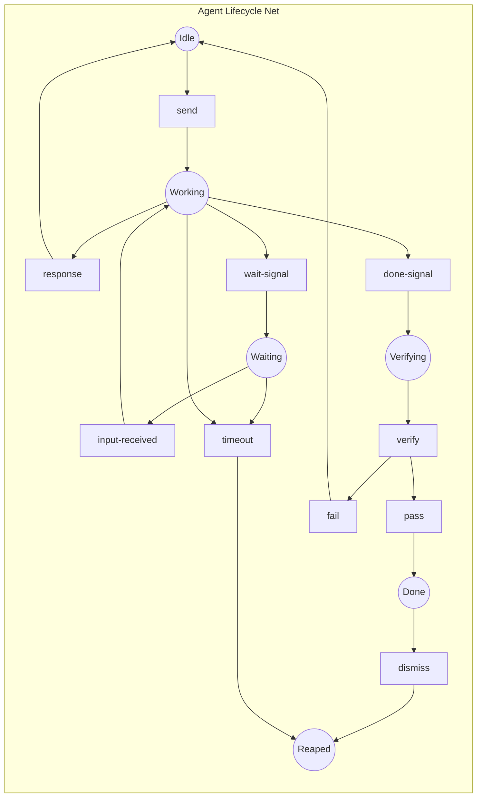

# Petri Nets Architecture

**One-line summary:** Formal model using places, transitions, and tokens to represent agent states and coordination; concurrency is explicit, analyzable, and provably deadlock-free.

## Core Concept

Petri Nets provide a mathematical model for concurrent systems that has been used for decades in manufacturing, workflow management, and distributed systems. Unlike state machines which track single entities, Petri Nets model the flow of resources (tokens) through a network of places and transitions. This makes them particularly suited for multi-agent orchestration where multiple agents operate concurrently and compete for shared resources.

In the Tavern context, *places* represent conditions that can be true (agent is idle, commitment is pending, user attention is available). *Tokens* represent resources that flow through the system (active agents, pending tasks, verification requests). *Transitions* fire when their input places have sufficient tokens, consuming inputs and producing outputs atomically. This models operations like "spawn agent" (consumes assignment token, produces agent-in-idle-place token) or "verify commitment" (consumes verification-request token, produces passed-or-failed token).

The power of Petri Nets lies in their analyzability. Properties like deadlock freedom (no reachable state where no transition can fire), boundedness (token counts never exceed limits), and liveness (every transition can eventually fire) can be proven mathematically. The PRD's emphasis on "deterministic shell around non-deterministic agents" aligns with Petri Net's ability to prove coordination properties independent of agent behavior.

## Key Components

## Pros

- **Provable correctness** - Deadlock freedom, boundedness, and liveness can be mathematically verified before runtime; the PRD's invariant "failures must be visible" becomes "failures are impossible by construction"

- **Explicit concurrency** - Multiple tokens flowing simultaneously makes parallelism visible in the model; "Multi-Slop Madness" (parallel agents) is naturally represented

- **Resource modeling** - Shared resources (user attention, token budgets, Claude API capacity) are tokens; contention becomes visible as places with limited capacity

- **Visual debugging** - Petri Net tools provide animated token flow visualization; diagnosing stuck states means finding places where tokens accumulate

- **Compositional** - Subnets can be designed, tested, and proven correct independently; agent lifecycle net + coordination net + verification net compose into system net

- **Well-established theory** - 60+ years of research, tools (LoLA, TAPAAL, CPN Tools), and industrial applications

- **Natural fit for commitments** - Commitment verification maps to colored tokens (commitment data) flowing through verification transitions

## Cons

- **Learning curve** - Petri Net formalism is unfamiliar to most Swift developers; requires training investment

- **Impedance mismatch** - Swift has no native Petri Net constructs; requires custom infrastructure or external tools for analysis

- **State explosion** - Complex systems can have exponentially many reachable states; analysis becomes computationally expensive

- **Dynamic structure limitations** - Classic Petri Nets assume static topology; agent spawning requires higher-order nets or workarounds

- **Verbosity** - Simple behaviors require multiple places and transitions; overhead for straightforward flows

- **Runtime overhead** - Token tracking and transition firing add indirection compared to direct method calls

## When to Choose This Architecture

Choose Petri Nets when:

1. **Concurrency correctness is paramount** - The PRD emphasizes multiple agents working in parallel; Petri Nets prove properties like "no two agents can hold exclusive resource simultaneously"

2. **Resource contention is explicit** - User attention, API rate limits, and token budgets are shared resources that can be modeled as place capacities

3. **Workflow visualization matters** - The PRD mentions metrics dashboard; Petri Net visualization shows where work is flowing and where it's blocked

4. **Deterministic verification is required** - The PRD's commitment system (agent says done, system verifies) maps naturally to token flow through verification transitions

5. **The team can invest in tooling** - Building or integrating Petri Net analysis tools requires upfront investment that pays off over time

Do not choose this architecture if:

- The team needs to ship v1 quickly without learning a new formalism
- Agent interactions remain simple request-response without complex coordination
- Runtime performance is critical and token tracking overhead is unacceptable
- The codebase will not grow complex enough to warrant formal analysis
