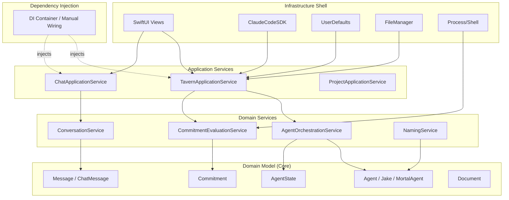

# Onion Architecture

**One-line summary:** Concentric layers with domain model at the absolute center, strict inward dependency flow, and dependency injection pushing all infrastructure to the outer shell.

## Core Concept

Onion Architecture, introduced by Jeffrey Palermo in 2008, structures applications as concentric circles with the Domain Model at the center, surrounded by Domain Services, then Application Services, and finally Infrastructure at the outermost edge. The fundamental rule: dependencies flow inward only. Outer layers know about inner layers, but inner layers are completely ignorant of what consumes them. This creates a system where the domain remains pure and the entire infrastructure shell is replaceable.

The key distinction from Clean Architecture and Hexagonal is Onion's explicit emphasis on the Domain Model as the gravitational center. While Clean Architecture organizes around use cases and Hexagonal focuses on ports/adapters symmetry, Onion demands that domain entities and domain services form a cohesive inner core that can exist and be tested with zero references to any external framework. The Domain Services layer (containing Jake's orchestration logic, commitment verification rules, agent state machines) sits just outside the pure domain model but still inside the application core.

For Tavern, this means `Agent`, `AgentState`, `Commitment`, `Message`, and `Document` become the inner domain model with no dependencies. Domain Services like `AgentOrchestration`, `CommitmentEvaluation`, and `ConversationManagement` use these models but know nothing of ClaudeCodeSDK or persistence. Application Services orchestrate use cases by calling domain services and receiving injected infrastructure. Infrastructure (ClaudeCodeSDK, UserDefaults, FileManager, SwiftUI) lives entirely at the outer edge, injected inward through constructor dependency injection.

## Key Components

## Pros

- **Domain purity**: Inner layers have zero external imports. `Agent`, `Commitment`, `Message` are testable with simple assertions, no mocks required.

- **Testable at every layer**: Domain model tests are trivial. Domain service tests mock only other domain services. Application service tests mock infrastructure via DI.

- **Infrastructure fully replaceable**: Swap ClaudeCodeSDK for OpenAI, UserDefaults for SQLite, or SwiftUI for AppKit without touching domain code.

- **Clear separation of domain and application logic**: Domain services contain business rules. Application services orchestrate user interactions. Boundaries are explicit.

- **Dependency injection encourages loose coupling**: All dependencies flow through constructors, making the object graph explicit and testable.

- **Natural migration path**: Current codebase protocols (`ClaudeCode`, `AssertionRunner`) already hint at the DI pattern.

## Cons

- **Deep layering overhead**: Four layers (Domain Model, Domain Services, Application Services, Infrastructure) may feel excessive for ~2000 lines of code.

- **Ambiguous layer placement**: "Is this domain logic or application logic?" debates arise frequently. Where does Jake's system prompt live?

- **DI complexity**: Manual dependency injection creates verbose constructors. DI containers add runtime complexity and learning curve.

- **Duplication between domain and application services**: Similar methods may exist at both layers with slight differences in abstraction level.

- **Cross-cutting concerns**: Logging, error handling, and metrics don't fit cleanly into the layer model.

- **Initial refactoring cost**: Moving from current flat TavernCore to four-layer onion requires significant restructuring.

## When to Choose This Architecture

Choose Onion Architecture when:

- Domain model complexity justifies a dedicated innermost layer (10+ core entities, complex state machines, business rules)
- The team has experience with dependency injection and layer discipline
- Long-term maintainability outweighs short-term velocity
- Multiple infrastructure implementations are anticipated (different LLM backends, persistence options, UI frameworks)
- Testability without any framework involvement is a hard requirement

Avoid Onion Architecture when:

- Rapid prototyping is the goal (v1 proof of concept)
- The team is small (1-3 developers) with high-bandwidth communication
- Domain logic is thin relative to infrastructure integration
- The distinction between domain services and application services would be arbitrary
- Simpler patterns (MVVM, Coordinator) provide sufficient organization
