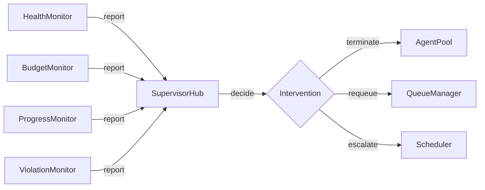

# Scheduler-Agent-Supervisor Architecture: Complete Analysis

This document contains the full analysis and reasoning behind the Scheduler-Agent-Supervisor architectural proposal for The Tavern at the Spillway.


## Research Findings


### Current Codebase State

The existing Tavern implementation has these components relevant to the pattern:

**Scheduling (Current: TavernCoordinator + Jake)**

- `TavernCoordinator` orchestrates agent lifecycle and selection
- `Jake` receives user requests but doesn't decompose or queue work yet
- No work queue abstraction exists - agents are spawned directly with assignments
- `AgentSpawner` creates agents on-demand, no pooling

**Execution (Current: MortalAgent)**

- `MortalAgent` executes assignments via Claude API
- State machine: `idle` -> `working` -> `waiting`/`verifying` -> `done`
- Session persistence via `SessionStore`
- No queue attachment - agents own their assignment at creation time

**Supervision (Current: None, Planned: Monitor Daemons)**

- No supervision infrastructure exists yet
- PRD Section 4.1 describes "Monitor Daemons" as background workers for Jake
- `CommitmentVerifier` is closest to supervision - verifies assertions after completion
- No health checks, no budget monitoring, no progress tracking

**Relevant PRD Sections:**

| Section | Concept | Scheduler-Agent-Supervisor Mapping |
|---------|---------|-----------------------------------|
| 4.1 | Agent Types | Jake=Scheduler, Mortal=Agent, Monitor Daemon=Supervisor |
| 4.4 | Operating Modes | Perseverance mode = background queue processing |
| 6.3 | Work Queues | Core primitive for scheduler-agent communication |
| 6.6 | Hygiene | Supervisor responsibility: cleanup daemons |
| 12 | Fish or Cut Bait | Supervisor authority to terminate agents |
| 16 | Violation Monitoring | Supervisor function: rule enforcement |


### Azure Scheduler-Agent-Supervisor Pattern

The pattern originates from Azure's cloud design patterns for reliable background task execution:

**Scheduler Role:**
- Decomposes requests into discrete work items
- Assigns work items to queues based on type, priority, affinity
- Maintains work item metadata (created, assigned, due, dependencies)
- Does NOT monitor execution - only cares about "was work queued?"

**Agent Role:**
- Pulls work items from queues (may be dedicated or pooled)
- Executes work items to completion or failure
- Reports completion/failure back to queue
- Has no knowledge of other agents or overall system state
- Stateless (ideally) or state-recoverable

**Supervisor Role:**
- Monitors agent health (heartbeats, responsiveness)
- Monitors work item progress (stuck detection, SLA violations)
- Takes corrective action (restart agent, requeue work, escalate)
- Does NOT assign work - only observes and intervenes

**Queue Role:**
- Durable storage for work items
- Visibility timeout (work in progress is hidden from other agents)
- Dead-letter queue (failed work items after max retries)
- Priority ordering
- FIFO within priority

**Key Property: Independence**

The power of this pattern comes from role independence:
- Scheduler can be replaced without touching agents or supervisor
- Agents can scale horizontally without scheduler changes
- Supervisor can be enhanced without affecting execution
- Queues can be swapped (memory -> Redis -> cloud) transparently


### Comparison with Supervisor Trees (#4)

Supervisor Trees and Scheduler-Agent-Supervisor solve overlapping problems differently:

| Aspect | Supervisor Trees | Scheduler-Agent-Supervisor |
|--------|-----------------|---------------------------|
| **Primary concern** | Failure recovery | Work distribution |
| **Supervisor role** | Lifecycle + restart | Monitoring + intervention |
| **Work assignment** | Parent assigns to child | Scheduler queues, agent pulls |
| **Coupling** | Tight (tree hierarchy) | Loose (queue decoupling) |
| **Scaling model** | Spawn more children | Add agents to pool |
| **Failure scope** | Restart strategies (one_for_one, etc.) | Requeue work item, restart agent |
| **State recovery** | Agent rebuilds from checkpoint | Work item retried by any agent |
| **Erlang analog** | OTP supervision | GenStage/Flow |
| **Best for** | Stateful long-lived processes | Stateless job processing |

**Key Differences:**

1. **Who assigns work?**
   - Supervisor Trees: Parent supervisor assigns work when spawning child
   - S-A-S: Scheduler queues work; agents pull independently

2. **Who decides restart?**
   - Supervisor Trees: Same entity that assigned work (supervisor)
   - S-A-S: Separate entity (Supervisor) with no assignment role

3. **Work item durability:**
   - Supervisor Trees: Work lost if agent dies (must be re-assigned)
   - S-A-S: Work item survives in queue; any agent can pick it up

4. **Agent identity:**
   - Supervisor Trees: Named agents with identity ("Frodo handles X")
   - S-A-S: Anonymous workers in pool ("some agent handles X")


### Hybrid Possibility

These patterns can coexist:

```
Scheduler (Jake)
    |
    v
Work Queues
    |
    v
Agent Pool Supervisor (Supervisor Trees)
    |
    +-- Mortal 1 (supervised)
    +-- Mortal 2 (supervised)
    +-- Mortal 3 (supervised)
    |
External Supervisor Layer (S-A-S)
    +-- HealthMonitor
    +-- BudgetMonitor
    +-- ProgressMonitor
```

Here, Supervisor Trees manage agent lifecycle (restart on crash), while the external Supervisor layer handles cross-cutting concerns (budget, progress, health). This hybrid gets benefits of both patterns.


## Mapping to PRD Requirements


### Agent Types (Section 4.1)

| PRD Type | S-A-S Role | Behavior |
|----------|-----------|----------|
| Jake | Scheduler | Accepts requests, queues work, coordinates priorities |
| Mortal | Agent | Pulls work, executes, reports completion |
| Drone | Agent (disposable) | Single-task agent, no recovery, cheap to fail |
| Monitor Daemon | Supervisor component | Health, budget, progress, hygiene monitors |

**Jake as Scheduler:**

Jake's current implementation is interactive (chat-based). As Scheduler, Jake would:
1. Parse user requests
2. Decompose into work items
3. Create queue entries with metadata
4. Assign priorities based on request type
5. Handle dependency ordering
6. Return acknowledgment to user
7. Not wait for completion (async)

```swift
actor JakeScheduler {
    let queues: WorkQueueManager

    func handleUserRequest(_ request: String) async throws -> String {
        // Parse intent
        let intent = await classifyIntent(request)

        // Decompose into work items
        let workItems = await decompose(intent)

        // Queue with appropriate priority
        for item in workItems {
            let queue = queues.queueFor(item.type)
            try await queue.enqueue(item)
        }

        // Acknowledge (don't wait for execution)
        return "Queued \(workItems.count) items. I'll let you know when they're done."
    }
}
```

**Mortals as Agents:**

Mortal agents would change from owning assignments to pulling from queues:

```swift
actor MortalWorker {
    let attachedQueues: [WorkQueue]
    var currentWork: WorkItem?

    func workLoop() async {
        while !Task.isCancelled {
            // Pull next item from any attached queue
            guard let item = await pullNextItem() else {
                try? await Task.sleep(for: .seconds(1))
                continue
            }

            currentWork = item

            do {
                let result = try await execute(item)
                await item.markCompleted(result)
            } catch {
                await item.markFailed(error)
            }

            currentWork = nil
        }
    }

    private func pullNextItem() async -> WorkItem? {
        for queue in attachedQueues {
            if let item = try? await queue.dequeue() {
                return item
            }
        }
        return nil
    }
}
```

**Monitor Daemons as Supervisors:**

Monitor Daemons become specialized supervisors:

```swift
// Health supervisor - detects stuck/unresponsive agents
actor HealthSupervisor {
    func monitorAgent(_ agent: MortalWorker) async {
        while !Task.isCancelled {
            let healthy = await checkHealth(agent)
            if !healthy {
                await supervisorHub.report(.unhealthy(agent.id))
            }
            try? await Task.sleep(for: .seconds(10))
        }
    }

    private func checkHealth(_ agent: MortalWorker) async -> Bool {
        // Check last heartbeat, responsiveness, etc.
    }
}

// Budget supervisor - tracks token usage
actor BudgetSupervisor {
    func monitorAgent(_ agent: MortalWorker, budget: TokenBudget) async {
        while !Task.isCancelled {
            let usage = await getTokenUsage(agent)
            if usage > budget.limit {
                await supervisorHub.report(.budgetExceeded(agent.id, usage))
            }
            try? await Task.sleep(for: .seconds(5))
        }
    }
}

// Progress supervisor - detects stalled work
actor ProgressSupervisor {
    func monitorWorkItem(_ item: WorkItem, deadline: Duration) async {
        let started = Date()
        while !Task.isCancelled && item.status == .inProgress {
            if Date().timeIntervalSince(started) > deadline.seconds {
                await supervisorHub.report(.stalled(item.id))
            }
            try? await Task.sleep(for: .seconds(30))
        }
    }
}
```


### Work Queues (Section 6.3)

PRD explicitly describes work queues:
- "Live in document store"
- "Parents create them"
- "Agents attach at spawn or mid-task"
- "Agents have instructions for empty queue (idle, hibernate, terminate)"

**Queue Design:**

```swift
struct WorkQueue: Identifiable {
    let id: UUID
    let name: String
    let type: WorkItemType          // feature, bug, drone-task
    let priority: QueuePriority     // affects pull order across queues
    var emptyBehavior: EmptyBehavior  // idle, hibernate, terminate

    private var items: [WorkItem] = []
    private var inProgress: [UUID: WorkItem] = [:]

    mutating func enqueue(_ item: WorkItem) {
        items.append(item)
        items.sort { $0.priority > $1.priority }
    }

    mutating func dequeue() -> WorkItem? {
        guard let item = items.first else { return nil }
        items.removeFirst()
        var working = item
        working.status = .inProgress
        working.startedAt = Date()
        inProgress[item.id] = working
        return working
    }

    mutating func complete(_ id: UUID, result: WorkResult) {
        inProgress.removeValue(forKey: id)
        // Persist result to doc store
    }

    mutating func fail(_ id: UUID, error: Error, retry: Bool) {
        guard var item = inProgress.removeValue(forKey: id) else { return }
        if retry && item.attempts < item.maxAttempts {
            item.attempts += 1
            item.status = .pending
            items.append(item)
        } else {
            item.status = .failed
            // Move to dead-letter queue
        }
    }
}
```

**Queue Persistence:**

PRD says queues live in doc store. Implementation:

```swift
// Queue state as markdown document
/*
---
id: "queue-123"
name: "Feature Queue"
type: "feature"
priority: "high"
empty_behavior: "idle"
---

## Pending Items

- [ ] WI-001: Implement auth (priority: 2, created: 2026-01-24)
- [ ] WI-002: Add tests (priority: 1, created: 2026-01-24)

## In Progress

- [x] WI-003: Fix login bug (agent: Frodo, started: 2026-01-24T10:00:00)

## Completed

- [x] WI-000: Setup project (completed: 2026-01-23T15:00:00)
*/

actor WorkQueueStore {
    let docStore: DocStore

    func load(_ id: UUID) async throws -> WorkQueue {
        let doc = try await docStore.read(id: id)
        return WorkQueue(from: doc)
    }

    func save(_ queue: WorkQueue) async throws {
        let doc = queue.toDocument()
        try await docStore.write(doc)
    }
}
```


### Fish or Cut Bait (Section 12)

S-A-S handles this through the Supervisor layer:

```swift
actor SupervisorHub {
    var monitors: [any Monitor] = []
    var interventions: [Intervention] = []

    func report(_ signal: MonitorSignal) async {
        let intervention = await classify(signal)
        interventions.append(intervention)
        await execute(intervention)
    }

    private func classify(_ signal: MonitorSignal) async -> Intervention {
        switch signal {
        case .budgetExceeded(let agentId, let usage):
            // Fish or cut bait: kill the agent
            return .terminate(agentId, reason: .budgetExceeded(usage))

        case .stalled(let workItemId):
            // Requeue the work, let another agent try
            return .requeue(workItemId, reason: .stalled)

        case .unhealthy(let agentId):
            // Restart the agent
            return .restart(agentId, reason: .unhealthy)

        case .violation(let agentId, let violation):
            // Per PRD: log, notify, pause, reap, or warn
            return .handleViolation(agentId, violation)

        case .gangDivergence(let agentIds):
            // Whole gang going wrong - kill all, requeue all work
            return .restartGang(agentIds, reason: .divergence)
        }
    }

    private func execute(_ intervention: Intervention) async {
        switch intervention {
        case .terminate(let agentId, _):
            await agentPool.terminate(agentId)

        case .restart(let agentId, _):
            await agentPool.restart(agentId)

        case .requeue(let workItemId, _):
            await workQueueManager.requeue(workItemId)

        case .restartGang(let agentIds, _):
            for id in agentIds {
                await agentPool.terminate(id)
            }
            // Agents will be recreated by pool on demand

        case .handleViolation(let agentId, let violation):
            // Per PRD Section 16
            switch violation.configuredAction {
            case .log:
                TavernLogger.violations.warning("\(violation)")
            case .notify:
                await escalateToJake(agentId, violation)
            case .pause:
                await agentPool.pause(agentId)
            case .reap:
                await agentPool.terminate(agentId)
            case .warn:
                await injectWarning(agentId, violation)
            }
        }
    }
}
```


### Operating Modes (Section 4.4)

**Chat Mode vs Perseverance Mode:**

S-A-S naturally supports both:

- **Chat Mode**: User interacts directly with agent. Agent is not pulling from queue - it's in interactive session. Scheduler is bypassed.

- **Perseverance Mode**: Agent works from queue. System auto-prompts to continue. User notified only on explicit request or completion.

```swift
enum AgentMode {
    case chat(userId: UUID)           // Interactive, user present
    case perseverance(queue: UUID)    // Background, queue-driven
}

actor MortalAgent {
    var mode: AgentMode

    func run() async {
        switch mode {
        case .chat(let userId):
            await runChatMode(userId)
        case .perseverance(let queueId):
            await runPerseveranceMode(queueId)
        }
    }

    private func runPerseveranceMode(_ queueId: UUID) async {
        let queue = await workQueueManager.get(queueId)

        while !Task.isCancelled {
            guard let item = await queue.dequeue() else {
                switch queue.emptyBehavior {
                case .idle:
                    try? await Task.sleep(for: .seconds(5))
                case .hibernate:
                    await enterHibernation()
                case .terminate:
                    return // Exit work loop
                }
                continue
            }

            await execute(item)
        }
    }
}
```


### Preflight Checks (Section 6.4)

In S-A-S, preflight checks happen in the Agent Pool before work starts:

```swift
actor AgentPool {
    func assignWork(_ workItem: WorkItem, to agent: MortalAgent) async throws {
        // Preflight checks before allowing work to start
        let preflight = PreflightChecker(workItem: workItem, agent: agent)

        let result = try await preflight.run()

        if !result.passed {
            // Don't start work, notify scheduler
            await scheduler.workItemPreflightFailed(workItem.id, result.failures)
            throw PreflightError.failed(result.failures)
        }

        // Preflight passed, agent can proceed
        await agent.startWork(workItem)
    }
}

struct PreflightChecker {
    let workItem: WorkItem
    let agent: MortalAgent

    func run() async -> PreflightResult {
        var failures: [PreflightFailure] = []

        // Check sandbox configuration
        if !await verifySandbox(workItem.sandboxConfig) {
            failures.append(.sandboxMisconfigured)
        }

        // Check resource access
        for resource in workItem.requiredResources {
            if !await verifyAccess(resource) {
                failures.append(.resourceUnavailable(resource))
            }
        }

        // Check no permission prompts expected
        if await wouldPromptForPermissions(workItem) {
            failures.append(.permissionPromptExpected)
        }

        // Check external accounts
        for account in workItem.externalAccounts {
            if !await verifyAuthenticated(account) {
                failures.append(.notAuthenticated(account))
            }
        }

        return PreflightResult(passed: failures.isEmpty, failures: failures)
    }
}
```


## Trade-offs Considered


### Queue Durability vs Latency

**Durable Queues:**
- Work items survive crashes
- Can use doc store (filesystem) as backing
- Higher latency (disk I/O)
- Perfect for background work

**In-Memory Queues:**
- Zero latency
- Work items lost on crash
- Good for interactive mode
- Bad for perseverance mode

**Proposed Approach:**

Hybrid: In-memory queue backed by doc store.

```swift
actor HybridWorkQueue {
    private var inMemory: [WorkItem] = []
    private let docStore: DocStore
    private let persistInterval: Duration = .seconds(5)

    func enqueue(_ item: WorkItem) async {
        inMemory.append(item)
        // Async persist (don't block enqueue)
        Task { await persistToDocStore() }
    }

    func dequeue() -> WorkItem? {
        // Fast path: in-memory
        return inMemory.isEmpty ? nil : inMemory.removeFirst()
    }

    private func persistToDocStore() async {
        // Batch persist to reduce I/O
        let doc = Document(content: serializeQueue(inMemory))
        try? await docStore.write(doc)
    }

    func recover() async throws {
        // On startup, reload from doc store
        let doc = try await docStore.read(id: queueId)
        inMemory = deserializeQueue(doc.content)
    }
}
```


### Agent Anonymity vs Identity

**Anonymous Agents (Pure S-A-S):**
- Any agent can handle any work item
- Easy horizontal scaling
- No agent affinity
- Lost context between work items

**Named Agents (Current Tavern):**
- Agents have identity and themed names
- Users relate to "Frodo" not "Worker-3"
- Context maintained across interactions
- Harder to substitute on failure

**Proposed Approach:**

Named agents with queue pooling. Agents have identity for user interaction but pull from shared queues for background work.

```swift
actor MortalAgent {
    let name: String           // "Frodo" - for user interaction
    let id: UUID               // For pool management
    var attachedQueues: [WorkQueue]  // Can pull from any

    // Named agent, but work item could have been pulled by anyone
    func execute(_ item: WorkItem) async {
        // Context includes item history, not agent history
    }
}
```


### Centralized vs Distributed Supervision

**Centralized SupervisorHub:**
- Single point of decision
- Clear authority
- Potential bottleneck
- Single point of failure

**Distributed Supervisors:**
- Each monitor acts independently
- No coordination overhead
- Conflicting decisions possible
- Harder to reason about

**Proposed Approach:**

Centralized hub with distributed monitors. Monitors observe and report; hub decides and acts.



This keeps decision authority centralized while allowing parallel observation.


### Scheduler Complexity

Jake-as-Scheduler is more complex than Jake-as-Coordinator:

**Current Jake:**
- Receives message
- Spawns agent with assignment
- Done

**Scheduler Jake:**
- Receives message
- Classifies intent
- Decomposes into work items
- Assigns priorities
- Creates dependencies
- Routes to queues
- Tracks completion for user response

**Trade-off:**

More front-loaded complexity in scheduling, but simpler execution (agents just pull and work). The complexity moves from distributed (each agent managing its own assignment) to centralized (scheduler manages all assignments).

**Mitigation:**

Jake can start simple and evolve:

```swift
// Phase 1: Simple pass-through
func schedule(_ request: String) async {
    let item = WorkItem(assignment: request, priority: .normal)
    await defaultQueue.enqueue(item)
}

// Phase 2: Classification
func schedule(_ request: String) async {
    let type = await classify(request)  // bug, feature, question
    let queue = queueFor(type)
    let item = WorkItem(assignment: request, priority: .normal)
    await queue.enqueue(item)
}

// Phase 3: Decomposition
func schedule(_ request: String) async {
    let intent = await parseIntent(request)
    let items = await decompose(intent)
    for item in items {
        await queueFor(item.type).enqueue(item)
    }
}
```


## Implementation Complexity


### Required New Components

1. **WorkQueue** (~200 LOC)
   - Durable priority queue
   - Visibility timeout
   - Dead-letter support
   - Doc store persistence

2. **WorkQueueManager** (~150 LOC)
   - Queue creation/deletion
   - Cross-queue priority
   - Queue statistics

3. **AgentPool** (~250 LOC)
   - Agent lifecycle management
   - Pool sizing (min/max agents)
   - Agent selection for work

4. **SupervisorHub** (~200 LOC)
   - Monitor registration
   - Signal aggregation
   - Intervention decision and execution

5. **HealthMonitor** (~100 LOC)
   - Heartbeat tracking
   - Responsiveness checks
   - Stuck detection

6. **BudgetMonitor** (~100 LOC)
   - Token usage tracking
   - Budget threshold alerts

7. **ProgressMonitor** (~100 LOC)
   - Work item duration tracking
   - SLA violation detection

8. **ViolationMonitor** (~150 LOC)
   - Rule evaluation
   - Violation classification
   - Action selection per PRD

9. **JakeScheduler Extension** (~300 LOC)
   - Request classification
   - Work decomposition
   - Priority assignment
   - Queue routing


### Modifications to Existing Code

1. **MortalAgent**
   - Add queue attachment
   - Add work loop for perseverance mode
   - Add heartbeat emission
   - Separate chat mode from work mode

2. **TavernCoordinator**
   - Delegate to AgentPool for agent lifecycle
   - Delegate to SupervisorHub for health
   - Add queue visibility for UI

3. **Jake**
   - Add scheduler role
   - Decompose requests before spawning

4. **AgentRegistry**
   - May merge with AgentPool
   - Or remain as lookup service


### Estimated Effort

| Component | New LOC | Modified LOC | Complexity |
|-----------|---------|--------------|------------|
| Queue system | 350 | - | Medium |
| Agent pool | 250 | 100 | Medium |
| Supervisor hub | 200 | - | Low |
| Monitors (4x) | 450 | - | Low |
| Jake scheduler | 300 | 200 | High |
| UI integration | - | 150 | Low |
| Tests | 600 | 200 | Medium |
| **Total** | **2150** | **650** | - |

Timeline estimate: 3-4 weeks for full implementation. Could be staged:
- Week 1: Queue system + agent pool
- Week 2: Supervisor hub + monitors
- Week 3: Jake scheduler role
- Week 4: Integration + polish


## Migration Path from Current State


### Phase 1: Work Queues (Week 1)

Add work queue infrastructure without changing agent behavior:

1. Implement `WorkQueue` and `WorkQueueManager`
2. Add doc store persistence for queues
3. Create queue visualization in UI (read-only)
4. Tests for queue operations

Agents still receive assignments directly; queues exist but aren't used.


### Phase 2: Agent Pool (Week 1-2)

Replace direct spawning with pool management:

1. Implement `AgentPool` wrapping `AgentRegistry`
2. `AgentSpawner` delegates to pool
3. Add pool statistics to UI
4. Tests for pool lifecycle

Agents still work on assigned tasks; pool just manages lifecycle.


### Phase 3: Queue-Driven Execution (Week 2)

Connect agents to queues:

1. Add queue attachment to `MortalAgent`
2. Implement work loop for perseverance mode
3. Jake starts queuing work (simple pass-through)
4. Tests for queue-to-agent flow

At this point, basic S-A-S is working.


### Phase 4: Supervision Layer (Week 2-3)

Add monitoring infrastructure:

1. Implement `SupervisorHub`
2. Add `HealthMonitor`, `BudgetMonitor`, `ProgressMonitor`
3. Wire monitors to hub, hub to pool
4. Tests for intervention flows


### Phase 5: Jake as Full Scheduler (Week 3)

Enhance Jake's scheduling capabilities:

1. Add request classification
2. Add work decomposition
3. Add priority and dependency handling
4. Tests for scheduling logic


### Phase 6: Polish (Week 4)

1. UI for queues, pool, supervision
2. Configuration (pool sizes, budgets, thresholds)
3. Documentation
4. Integration tests


### Rollback Strategy

Each phase is independently rollbackable:

- Phase 1: Queues are additive, unused
- Phase 2: Pool wraps registry, can unwrap
- Phase 3: Can revert to direct assignment
- Phase 4: Supervision is additive, can disable
- Phase 5: Jake can fallback to simple spawning


## Open Questions


### 1. Queue Ownership

Who owns work queues?

**Options:**
- A: Jake owns all queues (centralized)
- B: Each mortal can create queues for sub-work (distributed)
- C: Queues are global resources (shared)

**Recommendation:** Option C for v1. Queues are project-level resources. Jake routes to them. This simplifies queue management.


### 2. Agent-Queue Affinity

Can agents attach to multiple queues?

**Options:**
- A: One agent, one queue (simple)
- B: One agent, multiple queues with priority (flexible)
- C: Agents poll all queues (dynamic)

**Recommendation:** Option B. Agents attach to queues in priority order, pull from highest-priority first.


### 3. Work Item Granularity

How big is a work item?

**Options:**
- A: Large (whole feature)
- B: Medium (one file change)
- C: Small (one function)
- D: Variable (context-dependent)

**Recommendation:** Option D. Jake decides granularity based on request complexity. Large requests get decomposed.


### 4. Supervisor Authority

When supervisor says "kill agent," who executes?

**Options:**
- A: Supervisor directly terminates
- B: Supervisor requests, Pool executes
- C: Supervisor requests, Scheduler approves, Pool executes

**Recommendation:** Option B. Clear chain of command: Supervisor observes and recommends, Pool acts.


### 5. Jake's Dual Role

Jake is both user-facing (chat) and backend (scheduler). Conflict?

**Considerations:**
- User asks "how's my feature going?" - Jake as chat answers
- User asks "build feature X" - Jake as scheduler queues

**Recommendation:** Jake handles both roles, but they're distinct code paths. User-facing chat doesn't queue work; it provides status. Requests that imply work get scheduled.


### 6. Queue Visualization

How should queues appear in UI?

**Options:**
- A: Hidden (implementation detail)
- B: Visible but read-only
- C: User can manipulate (reprioritize, cancel)

**Recommendation:** Option C eventually, Option B for v1. Users should see what's queued but not manage it initially.


### 7. Cross-Queue Dependencies

Can a work item depend on items in other queues?

**Example:** Feature work depends on bug fix completing first.

**Recommendation:** Yes, but defer to v2. For v1, dependencies are within-queue only.


### 8. Supervisor Consensus

Multiple monitors report conflicting signals - how to resolve?

**Example:** HealthMonitor says "restart," BudgetMonitor says "terminate."

**Recommendation:** Priority ordering. Budget violations are terminal; health issues allow restart. Configurable escalation.


## Conclusion

The Scheduler-Agent-Supervisor pattern provides clean role separation that aligns with the PRD's explicit mention of work queues and monitor daemons. It differs from Supervisor Trees by decoupling work assignment from supervision, creating a "checks and balances" structure.

**Strengths for Tavern:**
- Work queues are already in the PRD
- Monitor Daemons map directly to supervisors
- Background execution (perseverance mode) is queue-natural
- Horizontal scaling is trivial

**Weaknesses for Tavern:**
- More infrastructure than Supervisor Trees
- Queue latency in interactive scenarios
- Jake becomes more complex as scheduler

**Verdict:**

S-A-S is a good fit if the Tavern evolves toward job processing (many background tasks, few interactive sessions). Supervisor Trees is better if the Tavern stays interactive-first.

A hybrid approach may be optimal: use Supervisor Trees for agent lifecycle management, use S-A-S patterns for work distribution and cross-cutting monitoring. Jake can be both scheduler (queuing work) and coordinator (managing interactive sessions).

For v1, consider implementing queue infrastructure (Phase 1-2) without full scheduler commitment. This lays groundwork for either direction.
