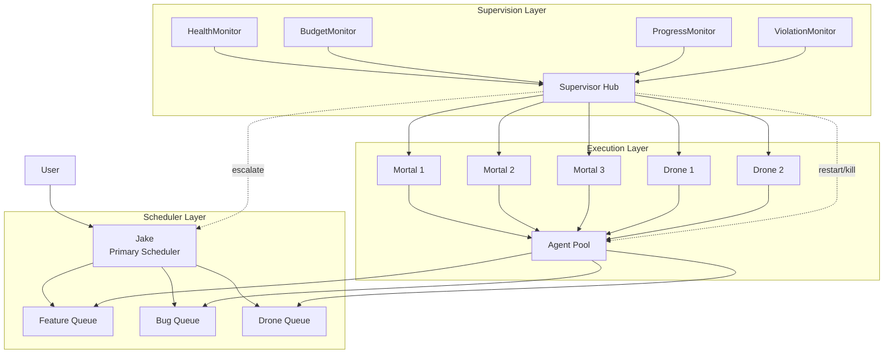

# Architecture Proposal: Scheduler-Agent-Supervisor

**One-line summary:** Three distinct coordinated roles (scheduling, execution, monitoring) for reliable background work with clean separation of concerns.

## Core Concept

The Scheduler-Agent-Supervisor pattern separates background work orchestration into three explicit roles with distinct responsibilities. The Scheduler queues and prioritizes work items. Agents execute work items from queues. Supervisors monitor agent health, progress, and resource consumption, triggering interventions when needed.

This differs from Supervisor Trees (proposal #4) in a fundamental way: Supervisor Trees combine supervision and work assignment in the same hierarchy (parent supervises children AND assigns them work). Scheduler-Agent-Supervisor decouples these concerns entirely. A Supervisor doesn't assign work - it only monitors. The Scheduler doesn't monitor - it only queues. Agents don't self-manage - they only execute.

The pattern maps naturally to the PRD's role taxonomy: Jake becomes the Scheduler (accepts user requests, decomposes work, queues tasks). Mortal Agents become the execution layer (pull from queues, do the work, report completion). Monitor Daemons become Supervisors (watch health, track budgets, detect violations, trigger fish-or-cut-bait). This creates a "checks and balances" structure where no single component has unchecked authority.

## Key Components

**Role Interactions:**

- **Jake (Scheduler)**: Receives user requests, decomposes into work items, assigns priorities, routes to appropriate queues
- **Work Queues**: Durable, prioritized, typed. Agents attach to queues and pull work
- **Agent Pool**: Manages agent lifecycle. Agents are workers with no scheduling logic
- **Supervisor Hub**: Aggregates monitor signals, makes intervention decisions
- **Monitors**: Single-purpose watchers for health, budget, progress, violations

## Pros

- **Clean separation of concerns**: Each role has one job. Easier to reason about, test, and modify independently

- **Natural fit for work queues**: PRD Section 6.3 describes work queues exactly this way - agents attach, pull work, follow empty-queue instructions

- **Supervisor independence**: Monitors don't participate in work assignment, so monitoring decisions are objective

- **Horizontal scaling**: Add more agents without changing scheduler or supervisor logic

- **Fault containment**: A stuck agent doesn't affect scheduling. A scheduler bug doesn't corrupt monitoring

- **Testable in isolation**: Test scheduler logic without agents. Test agents without real queues. Test monitors without execution

- **Maps to Azure cloud patterns**: Proven at massive scale for reliable background job processing

## Cons

- **More moving parts**: Three subsystems vs one integrated hierarchy means more coordination overhead

- **Scheduling/execution latency**: Work goes through queue rather than direct delegation, adding latency

- **State synchronization**: Work item state must be consistent across scheduler, agent, and supervisor views

- **Queue management complexity**: Persistent queues need durability, ordering, priority, and dead-letter handling

- **Supervisor authority questions**: When supervisor says "kill agent," who actually does it? Need clear command authority

- **Overkill for v1**: The simple Jake + flat mortal pool doesn't need three separate subsystems

## When to Choose This Architecture

Choose Scheduler-Agent-Supervisor when:

1. **Work queues are central to the design**: The PRD explicitly describes work queues - this pattern makes them first-class

2. **Independent monitoring matters**: You want monitoring decisions decoupled from work assignment (avoid conflict of interest)

3. **Horizontal scaling is on the roadmap**: Adding more workers should be trivial, not require restructuring

4. **Background processing dominates**: Most work happens asynchronously in "perseverance mode," not interactive chat

5. **You want operational clarity**: Separate dashboards for scheduling, execution, and health make sense for your ops model

This architecture excels when the system behaves more like a job processing system than an interactive assistant.
