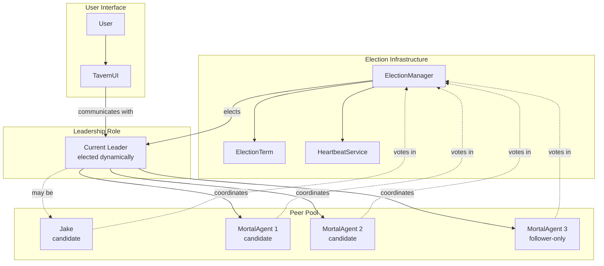
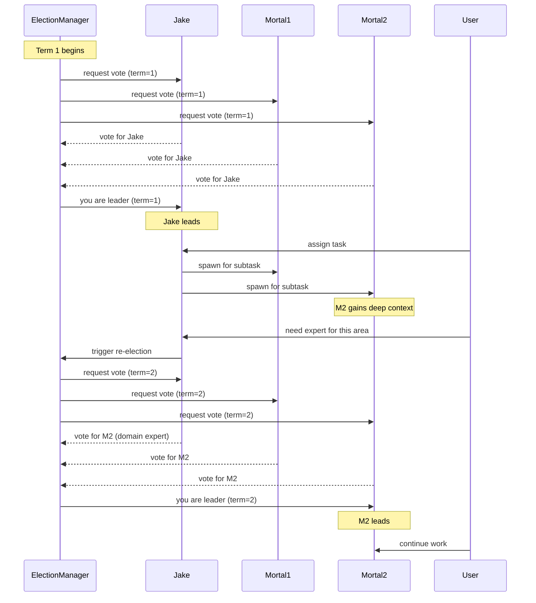

# Architecture Proposal: Leader Election

**One-line summary:** Dynamic coordinator selection among peer agents with leadership transfer capabilities, replacing Jake's fixed role with elected leadership.

## Core Concept

Leader Election applies distributed systems consensus patterns to agent orchestration. Rather than hardcoding Jake as the eternal coordinator, agents participate in an election process to determine who leads. The elected leader coordinates work, spawns children, and communicates with the user. If the leader fails, becomes overloaded, or is better suited for direct work, a new election occurs and leadership transfers.

This fundamentally challenges the Tavern's premise: Jake is not "The Proprietor" by divine right, but by election. He may be the natural choice initially (the only agent at startup), but as mortal agents spawn and gain context, leadership could transfer. A mortal agent deeply embedded in a codebase might coordinate better than Jake, who maintains tavern-wide perspective but lacks local expertise.

The model draws from Raft, Paxos, and Zookeeper's leader election, but adapted for agent orchestration. Elections are not about fault tolerance (though that is a benefit) but about dynamic optimization: the right agent leading at the right time. A code review task might elect a specialized reviewer as coordinator. A debugging session might elect the agent with deepest context. Jake remains available as a candidate, but he is peer to the others.

## Key Components

**Election Flow:**

## Pros

- **Dynamic optimization**: Leadership transfers to the agent best suited for current work, not fixed by design

- **Natural fault tolerance**: If leader fails, election produces new leader without special recovery code

- **Scales expertise**: Deep specialists can coordinate domain-specific work without routing through generalist

- **Reduces Jake bottleneck**: High-load scenarios can distribute coordination across multiple leaders (per-subtree)

- **Matches distributed systems intuition**: Developers familiar with Raft/Paxos understand the model immediately

- **Enables agent autonomy**: Agents are peers, not permanent subordinates; aligns with agent capability growth

- **Supports hierarchical elections**: Each mortal tree could have its own elected leader, not just one global leader

## Cons

- **Destroys Jake's identity**: The Proprietor is central to Tavern's character; making him electable undermines the premise

- **Election overhead**: Consensus protocols require message rounds; adds latency to leadership changes

- **Split-brain risk**: Network partitions or async timing could produce multiple agents thinking they lead

- **User confusion**: "Who is in charge?" becomes dynamic; harder to explain than "Jake coordinates"

- **State transfer complexity**: New leader must acquire predecessor's coordination state (active tasks, pending questions)

- **Over-engineering for v1**: Current scope has one Jake, simple mortal pool; elections are heavyweight machinery

- **Character inconsistency**: How does Jake "sound" when he is not leader? Does he still have carnival barker energy as a follower?

## When to Choose This Architecture

Choose Leader Election when:

1. **Multi-project coordination exists**: Multiple Jakes across projects might need meta-coordination with elected global leader

2. **Agent expertise matters**: Tasks benefit from specialist leadership rather than generalist routing

3. **Fault tolerance is critical**: System must survive coordinator failure without user intervention

4. **Peer-to-peer model is desired**: Agents are conceptually equal, with leadership as temporary role

5. **Load balancing is needed**: Single coordinator is bottleneck; distributing leadership helps

Avoid Leader Election when:

- **Character identity matters**: Jake-as-Proprietor is central to user experience

- **System is simple**: One project, one coordinator, few agents; elections add no value

- **Determinism is valued**: Elections introduce non-determinism in who leads

- **User mental model is "one boss"**: Dynamic leadership confuses rather than empowers
