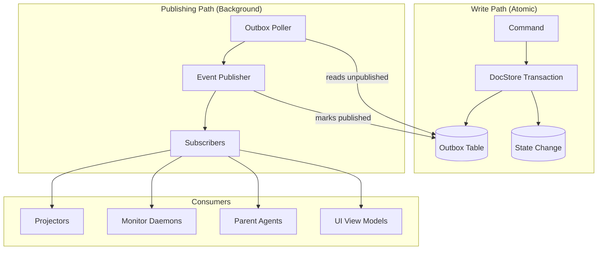

# Outbox Pattern Architecture

**One-line summary:** State changes and events are written to the same transaction, with a background process publishing events from an outbox table for guaranteed at-least-once delivery.

## Core Concept

The Outbox Pattern solves a fundamental problem in distributed systems: how to atomically update state AND publish events. In a naive approach, if you update state then publish an event, a crash between those two operations leaves the system inconsistent (state changed but event lost). The Outbox Pattern sidesteps this by writing both the state change and the event record to the same storage transaction. A separate background process reads unpublished events from the outbox and delivers them to subscribers.

For Tavern, this means the DocStore becomes a dual-purpose system: it stores documents AND acts as an event outbox. When an agent spawns, the DocStore atomically writes the AgentNode document AND an "AgentSpawned" event record. A background publisher (potentially a daemon per PRD Section 4.1) reads new events and notifies subscribers: UI view models, parent agents, the coordination layer. This guarantees no event is ever lost, even if the app crashes mid-operation.

The pattern is particularly relevant for Tavern's commitment verification flow. When a commitment changes status, both the commitment document and the status-change event are written atomically. The verification daemon, parent agents, and UI all receive guaranteed notification. This aligns with PRD Invariant 7: "Failures must be visible" -- the outbox ensures events about failures always propagate.

## Key Components

## Pros

- **Guaranteed delivery** -- Events are never lost; if state changed, the event will eventually be published

- **Atomic consistency** -- State and event are written in one operation; no dual-write problem

- **Natural fit for DocStore** -- Outbox can be another document type or a dedicated file alongside state documents

- **Decoupled publishing** -- Subscribers don't need to be online when the event is created; they receive it when ready

- **Retry semantics** -- Failed deliveries can be retried from the outbox without re-executing the original operation

- **Debugging visibility** -- Outbox provides a log of all pending and published events

- **Works without full Event Sourcing** -- Provides event guarantees without requiring complete ES adoption

## Cons

- **At-least-once, not exactly-once** -- Subscribers may receive duplicate events; must handle idempotently

- **Background process required** -- Need a reliable poller/publisher running continuously

- **Latency between write and publish** -- Events aren't delivered instantly; polling interval determines delay

- **Outbox growth** -- Need cleanup strategy for published events

- **Ordering complexity** -- Cross-aggregate event ordering requires careful design

- **Partial Event Sourcing benefits** -- Gets delivery guarantees but not full rewind/replay capabilities

## When to Choose This Architecture

**Choose the Outbox Pattern when:**

- Event delivery must be guaranteed (PRD Invariant 7: failures must be visible)

- You want reliable eventing without full Event Sourcing complexity

- The system already has file-based storage (DocStore) that can host the outbox

- Background daemons are part of the architecture (PRD Section 4.1: Monitor Daemons)

- Multiple consumers need to react to state changes (UI, parent agents, verification)

- The cost of lost events is high (commitment verification, agent completion signals)

**Avoid the Outbox Pattern when:**

- Events are nice-to-have, not critical (simple UI updates that can poll)

- Real-time event delivery is required (use in-memory pub/sub instead)

- Full Event Sourcing is already adopted (outbox is redundant)

- Single-process application where in-memory events suffice

- Prototype stage where simplicity trumps durability
