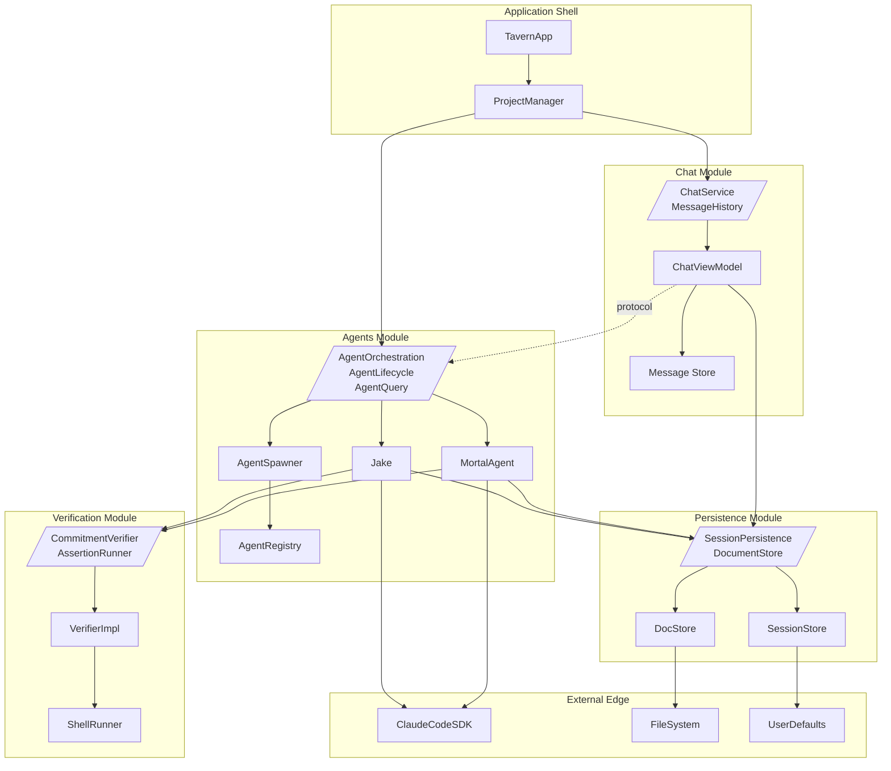

# Modular Monolith Architecture

**One-line summary:** Independent modules with clear boundaries and defined interfaces, deployed as a single application with an escape hatch for future extraction.

## Core Concept

The Modular Monolith is the architectural middle ground: modules that behave like microservices but deploy as one process. Each module owns its domain (Agents, Chat, Verification, Persistence), has explicit public interfaces, and knows nothing about other modules' internals. But unlike distributed systems, modules communicate through direct Swift protocol calls rather than network requests or message queues.

The key discipline is interface segregation. The `AgentsModule` exports protocols like `AgentOrchestration` and types like `AgentData`, but its implementation classes remain internal. When `ChatModule` needs to send a message to an agent, it calls a protocol method, not an implementation. This creates compile-time enforcement of boundaries while avoiding the runtime overhead of true service separation.

This approach delivers the best of both worlds: the simplicity and performance of a monolith with the organizational clarity and future flexibility of services. If Tavern later needs to run agents on remote machines, the module interfaces already exist. Extraction becomes surgery along pre-marked incision lines rather than exploratory archaeology through coupled code.

## Key Components Diagram

## Pros

- **Clear boundaries without distribution costs** - Modules define explicit interfaces but communicate in-process; no serialization, no network latency, no service discovery

- **Gradual extraction path** - If `VerificationModule` needs to run in a container for security, extract it to a service by implementing its protocol via RPC; consuming modules don't change

- **Compile-time boundary enforcement** - Swift's access control (`internal` vs `public`) ensures modules can't accidentally depend on implementation details

- **Testable at multiple granularities** - Unit test within modules, integration test across module interfaces, system test the full monolith

- **Matches current codebase structure** - The existing `Agents/`, `Chat/`, `Commitments/`, `Persistence/` directories already form natural module boundaries

- **Parallel development** - Teams can work on modules independently once interfaces are stable; changes to module internals don't affect others

- **Simple operations** - One binary, one deploy, one process to monitor; no Kubernetes, no service mesh, no distributed tracing required

## Cons

- **Module discipline requires vigilance** - Swift doesn't enforce module isolation at the package level; developers must resist the temptation to import implementation types

- **Refactoring interfaces affects multiple modules** - Changing a module's public protocol requires updating all consumers; can't version independently like true services

- **Shared database coupling** - Modules may share persistence infrastructure (UserDefaults, file system); a poorly designed query in one module affects all

- **No independent scaling** - Can't spin up 10 verification workers while keeping one coordinator; it's all-or-nothing

- **Eventual extraction is still work** - The escape hatch exists but requires implementing RPC/messaging; it's not automatic

## When to Choose This Architecture

**Choose Modular Monolith when:**

- The domain has clear bounded contexts but distribution overhead isn't justified yet

- The team wants organizational clarity without operational complexity

- You expect to extract modules eventually but not for v1/v2

- Performance and latency matter (in-process calls beat network calls)

- The current codebase already shows natural module-shaped clumps

**Avoid Modular Monolith when:**

- You need independent scaling of specific components now

- Security requires true process isolation between modules

- The team lacks discipline to maintain interface boundaries

- Distributed deployment is already planned for initial release

- The application is truly simple enough that a flat monolith suffices
