# Combined Cleanup Report — 2026-03-02

**Size:** 428 KB | **Words:** ~60,500 | **Pages:** ~202 | **Reading time:** ~5.0 hours

All reports from the `/update-verifications` pipeline, in production order.

| Step | Report | Source |
|------|--------|--------|
| 1 | Audit Transcripts | (7 transcript files written — no single report) |
| 2 | System Design Reader | docs/0-transcripts/reader_2026-03-02.md |
| 3 | Compiled Spec Reader | docs/2-spec/compiled/spec-reader_2026-03-03.md |
| 4 | Project Status | docs/4-docs/project-status.md |
| 5 | Spec Status Dashboard | docs/4-docs/spec-status-report_2026-03-02.md |
| 6 | PRD-to-Spec Audit | docs/4-docs/audit-spec-report_2026-03-02.md |
| 7 | Attestation Report | docs/4-docs/attestation-report_2026-03-02.md |
| 8 | Verification Report | docs/4-docs/verification-report_2026-03-02.md |

---

<!-- Step 2 -->

# The Tavern at the Spillway — System Design Reader

**Date:** 2026-03-02

**Purpose:** This document synthesizes all discovery session transcripts into a standalone explanation of the system design. Read this instead of tailing transcripts.

**Previous reader:** `reader_2026-02-21.md` — This update incorporates 13 additional transcripts from 2026-02-02 through 2026-03-02, covering: SDK migration architecture (ClaudeNativeSessionStorage is Tavern-specific, not SDK), CLAUDE.md information architecture (15-point revamp), Xcode preview automation loop + NSOutlineView invariant, PRD pipeline flow reporting + strikethrough convention for dropped requirements, tileboard architecture redesign with SPM-enforced module isolation (ADR-008), TavernKit consolidation eliminating Core* indirection, ViewModel elimination, ClodKit lifecycle/deinit design with compiler-first safety principle, rich streaming pipeline with `includePartialMessages` discovery, SDK feature parity tracking matrix (ADR-010), unified verification suite (ADR-009) with unwired code analysis and agent motivation philosophy, "Tiles Own All State" principle from live debugging, and light/heavy cleanup orchestrator command architecture.


---


## 1. Executive Summary

The Tavern at the Spillway is a multi-agent orchestration framework with a custom macOS user interface. The system manages a swarm of AI agents working on development tasks, with a coordinating "daemon" agent (Jake) that spawns and manages task-specific "servitor" agents.

The core value proposition is solving the attention management problem: when using one AI agent, there is idle time; when using many, the human cannot track them all. This framework provides a dashboard and chat interface that surfaces the right agent conversations at the right time, allowing users to engage productively with multiple agents without being overwhelmed by notifications or missing critical questions.

The system is built on ClodKit v1.0.0 and ships as a macOS application with a modular tile-based architecture where SPM enforces module boundaries at compile time.

**Current implementation state:** Jake responds in plain text with MCP tools (via ClodKit SDK), two-mode agent spawning (user-spawn waits for input, Jake-spawn works immediately), agent persistence via UserDefaults, session history restoration, multi-project support with per-project session persistence, multi-window architecture, agent spawning with themed names and UI, content block rendering, window restoration on app restart, two-level orchestration model (Tavern agents for tracked work, Task subagents for ephemeral parallelism), resource panel (file tree browser + file viewer), permissions subsystem, slash command infrastructure (core + custom), rich streaming responses with per-content-block events, multi-line input with @ file mentions, per-agent session mode control (plan/normal/auto-edit/yolo), universal Xcode preview coverage (ADR-006), provenance tracking with MARK comments and test tags (ADR-007), tileboard architecture with SPM-enforced tile isolation (ADR-008), unified verification suite (ADR-009), SDK feature parity tracking (ADR-010), /attest semantic conformance analysis, light/heavy cleanup orchestrator commands (/update-status, /update-verifications). 583 Grade 1+2 tests + 32 Grade 3 integration tests + 8 Grade 4 XCUITests passing.


---


## 2. Problem Statement

These pain points drove the design (from transcript_2026-01-19-1026):


**Attention Management:**

- One Claude Code instance means waiting around with low efficiency

- Multiple instances require tracking all of them while engaging with any single one

- More than 5 sessions becomes impossible to manage while also doing focused work

- Permission requests from background agents interrupt focused conversations


**Tooling Gaps:**

- YOLO mode needs a sandbox; the built-in one does not fit; third-party tools make incorrect assumptions about git and worktrees

- IDE integration is janky in the terminal; VSCode plugin has different issues

- No good tool to balance jumping into code yourself vs letting the agent work

- Terminal-based TUIs are hard to manage; everyone settles on tmux-based solutions


**Coordination Problems:**

- Agents run free-for-all; fixes turn into complex pipelines

- Too many agents clobber each other when working on the same things

- Worktree management tools make gross assumptions about repo usage


**Workflow Rigidity:**

- Many workflows require deterministic shells to enforce correct execution; hooks constrain without flexibility

- Many frameworks do not manage "efficiency of quality" and allow agents to burn too many tokens

- Frameworks either have rigid workflows or no workflows at all


**Visibility Gaps:**

- No self-improvement of these systems

- Not enough telemetry to improve; heavy reliance on brute force

- TUI Claude Code smooshes everything together (thinking, tool use, coding, chat) making it unreadable


---


## 3. Core Concepts


### Jake (The Proprietor)

Jake is the top-level coordinating daemon servitor. He is always running and manages the entire system. Key characteristics:

- **Daemon lifecycle:** Jake never dies; mortal servitors are task-bound

- **Lowest privileges by quantity:** Jake has few direct capabilities but highest authority to spawn and manage other servitors

- **First contact:** For a fresh project, the user's first interaction is with Jake

- **Task delegation:** Jake quickly fires up servitors to handle work, staying free for the next request

- **MCP tools:** Jake uses native MCP tools (`summon_servitor`, `dismiss_servitor`) registered via `TavernMCPServer` to manage the Slop Squad. This replaced an earlier JSON envelope hack where spawn commands were embedded in structured JSON responses (transcript_2026-02-02-1650, transcript_2026-02-06).

Jake has a distinctive voice (used car salesman energy, carnival barker theatrics), but this is presentation layer only. The work is flawless. Full character specification is in `jake-character.md`.

Jake is Jewish (doesn't make it his whole personality, but it's there). This is personal for him. One hard political line: nazis are not tolerated. The Tavern welcomes everyone. Except nazis.

He sometimes likes to say "Surfs up, Servitors!", but no one knows what it means or why (transcript_2026-02-21).


### Servitor Taxonomy (transcript_2026-02-21, transcript_2026-02-16)

"Servitor" is the Tavern's universal term for all its managed entities — Jake, mortals, drones, daemons. This distinguishes Tavern-orchestrated entities from Claude's own agent/subagent concepts, which are internal to a Claude session.

**The definitive hierarchy:**

- **Servitor** (protocol) — Umbrella abstraction for all Tavern entities

- **Jake** (daemon servitor) — The Proprietor, always running

- **Mortal** (mortal servitor) — Task-bound workers, spawned and eventually completed

- **Drone** (future) — Lightweight automated workers

**Naming layer separation:**

- **Code level (canonical names):** Servitor, Mortal, MortalSpawner, summon, dismiss

- **Character level (Jake's voice):** "The Regulars" (individuals), "Slop Squad" (the whole team)

This two-level terminology resolves overloading: "daemon" conflicted with Unix background processes, "agent" conflicted with LLM subagents. "Servitor" is distinct and theme-appropriate.

**Rename history:** Originally `Agent` (protocol) and `Servitor` (class). The 2026-02-21 rename made `Agent` → `Servitor` (protocol), `Servitor` → `Mortal` (class), `AgentRegistry` → `ServitorRegistry`, `AgentMessenger` → `ServitorMessenger`, `AgentListViewModel` → `ServitorListViewModel`. REQ-AGT-xxx IDs remain stable. MCP tool names were already correct (`summon_servitor`/`dismiss_servitor`).

**Post-tileboard (transcript_2026-03-01):** With the tileboard refactoring, servitors became pure domain objects — thin rule containers that talk through a ClodSession for all SDK interaction. Jake shrinks to: system prompt, MCP server definition, dispatch rules, daemon lifecycle. Mortal shrinks to: system prompt, completion detection, state machine, commitment verification, mortal lifecycle.

**Task Modes** (agents can bounce between these):

- Execute directly

- Delegate to a new child servitor

- Plan more first

- Break into pieces and assign

- Unify work from delegated children

Servitors can have children, forming a tree structure per user request. Hierarchies are Erlang-style — arbitrary depth, no limits.


### Two-Level Orchestration Model

Jake operates a two-level system (transcript_2026-01-28):

**Level 1 — Tavern Servitors** (via MCP tools):

- Full Claude Code sessions with their own context

- Appear in sidebar, persist across sessions

- For substantial, independent work streams

- Created via Jake's `summon_servitor` MCP tool

**Level 2 — Subagents** (via Task tool):

- Internal parallel workers within any servitor's session

- Lightweight, ephemeral, don't persist

- For quick parallel tasks within a single work stream

- Any servitor (including Jake) can spawn these directly via Task tool

**When to use which:** Spawn Tavern servitor for tracked work ("help me build feature X"). Use Task tool for quick internal parallelism ("search these 5 files in parallel").

**Agnostic framing (transcript_2026-02-16):** Tavern has its trees of servitors; each servitor may be running a Claude session with multiple agents/subagents internally. The spec is written agnostic of Claude's internal implementation — Tavern orchestrates servitors, not Claude's internals.

**Agent tool constraint (transcript_2026-03-02):** Teammates (agents spawned via the Agent tool) have exactly 16 tools. The Agent tool itself is main-context only — teammates cannot spawn sub-agents. TeamCreate is available to agents but they cannot populate teams with members (that requires the Agent tool). Parallelism within a teammate comes from parallel tool calls (multi-Read, multi-Grep, `run_in_background` Bash).


### Two-Mode Servitor Spawning

Spawning has two modes depending on who initiates (transcript_2026-01-27):

**User-spawn:** User clicks `+` in toolbar. No dialog — servitor is created instantly with a system prompt that tells it to wait for the user's first message. The user types their request into the normal chat UI.

**Jake-spawn:** Jake decides to delegate work. Servitor is created with an assignment and a system prompt that tells it to work on the assignment immediately before waiting for user input.

**Spawn API design principle:** Strongly discourage parameters. Most calls should be `summon_servitor()` with no args — auto-generated names and auto-inferred tasks (transcript_2026-02-02-1650).

**Capability delegation (transcript_2026-02-16):** Summon is async (returns a promise ID), then a separate `delegate` command passes capabilities using the handle. The spawned servitor's main actor receives the capability handle and waits for session notification. This gets its own spec module (§021).


### Perseverance Mode vs Chat Mode

Two operating modes for servitors:

**Perseverance Mode:** Background operation. When the servitor stops, the system auto-prompts it to continue. The servitor must explicitly use a tool to get user attention. This is the default for servitors working heads-down.

**Chat Mode:** Active conversation. The servitor appears in a chat window; the user is notified when the servitor pauses or stops. Used when user is actively engaged with that servitor.

The user controls which mode each servitor is in. Zooming in on a servitor brings it to chat mode; "hanging up" returns it to perseverance mode.


### States & Modes (transcript_2026-02-16 — new §019)

Three orthogonal booleans govern servitor behavior:

1. **Backgrounding** — whether a chat window is open

2. **Perseverance** — whether the servitor idles or auto-continues

3. **User presence** — whether the user has joined/left

These combine freely in any permutation. All lifecycle graphs from the earlier specs (004, 006, 007) are consolidated into one canonical state machine in §019.


### Session Mode Control (transcript_2026-02-14)

Each servitor has its own independent session mode — not a global setting.

**Four modes** exposed in UI: Plan, Normal, Auto-Edit, YOLO (matching Claude CLI's modes). DontAsk omitted from picker for simplicity.

**Default mode:** Plan — servitors start in plan mode.

**UI placement:** Compact mode picker strip in the input bar area.

**Orthogonality:** Session modes (plan/normal/yolo) are separate from tool-use permission rules (allow/deny patterns). Both exist but are independent concerns.

**ExitPlanMode flow:** Servitor in plan mode calls ExitPlanMode → comes through `canUseTool` callback → Tavern presents plan for user review → on approval, mode switches to Normal and tool is allowed → on rejection, tool is denied with feedback.

**Division of responsibility:** CLI enforces mode behavior (read-only tools in plan mode, etc.). Tavern handles ExitPlanMode approval UI and tool-specific permission rules.


### Bubbling

When child servitors need user input, they can escalate questions upward through the hierarchy. Bubbling is not strictly upward:

- **Upward:** child to parent to grandparent to user

- **Lateral:** sibling servitors communicating

- **Direct:** servitor to user (with oversight by other servitors)

Jake is especially proactive about suggesting the user zoom into specific servitors when their attention is needed.


### Servitor Naming

Jake assigns each servitor tree a naming theme (LOTR characters, Rick and Morty, Santa's reindeer, Docker-style compound names). This gives users intuitive sense of servitor relationships — servitors with similar names are from the same task tree.

**Unique names:** Every servitor gets a globally unique name across the entire system. This means you can identify any servitor by name alone — no path addressing required for identity.

**Name sets (transcript_2026-02-16):** A themed collection assigned to a top-level servitor. All children take names from that set. Top servitor asks Jake for another name set if exhausted. Multiple trees may share a name set — concurrency management needed. Tier 1 = collection of initial name sets; Jake rotates through; higher tiers unlock on depletion or user action.


### Done vs Complete (transcript_2026-02-16)

- **Done** = servitor says "done" (a request to check its commitment)

- **Complete** = verified commitment is met

Verification may include non-deterministic agent eval if surfaced properly. A servitor is not Complete until verified separately.


### Chat Description

A mutable field visible in the sidebar that summarizes what a chat is about. Both the user and the servitor (via tools) can alter it at any time. It includes the original ask plus whatever's current, allowing at-a-glance understanding when switching between servitors (transcript_2026-01-27).


### Chat Discussion vs Session (transcript_2026-02-16 — new §022)

A chat discussion persists for the servitor's lifetime (user-visible, contiguous). Claude sessions underneath may be continued or replaced. When no resumable session exists, the app creates a new one to pick up. This distinction means the user sees one continuous conversation even if the underlying Claude session has been replaced.


### Failure Boundaries (transcript_2026-02-16 — new §020)

A property over parts of the servitor tree determining failure rules. Erlang-style supervision: sometimes invalidate a whole gang on one failure, sometimes just restart the failed worker. A parent can declare a child failed (kill it) or declare itself failed; the system reverts as much as possible.


### Project-as-Document

The Tavern is fundamentally a document-based Mac app where the "document" is the same as the directory that is the root of the Claude project. Any directory works, like Claude CLI. Full Mac app trappings: File > Open, Open Recent, Dock icon menus, drag-to-open, state restoration on relaunch.


---


## 4. User Flow

This section describes how a user interacts with the system (from transcript_2026-01-19-1144):


### Starting a Fresh Project

1. User opens project directory in the UI

2. For a project with no history, they see only Jake's chat box

3. User describes what they need

4. Jake fires up a servitor to handle it

5. Jake remains free for additional requests


### Working with Servitors

- Each task appears as both a todo item AND a chat interface

- Dashboard shows all open tasks; user can drill into any servitor chat

- User sees tabs/UX for servitors they are actively engaged with

- Notification bubbles appear when servitors have questions

- User plays "whack-a-mole" jumping between conversations as needed

- User can create servitors directly via `+` button (no dialog, servitor waits for first message)


### Zooming In and Out

When user wants to focus on a specific servitor:

- System creates a chat box for that servitor

- If servitor is busy, user sees "cogitating" status while responses stream

- User can steer the servitor, interrupt it, or wait

- Servitor receives a "calling" message when user zooms in

- Servitor receives "hanging up" message when user zooms out

Zoom decisions include: is this chat ephemeral, kept open, or a todo list candidate?


### Dashboard and Oversight

- Task list can surface subtrees based on user's preferred oversight level

- Some servitors may be heads down and busy (do not appear in chat interface)

- Jake is always aware of: hibernating servitors, unfinished work, backlogs

- User can jump in anywhere they want

- System surfaces high-quality interactions while sparing tedious approvals


### Completing Work

- Mortal servitors expire or go into hibernation when tasks complete

- Jake ensures someone handles open loops

- Dashboard reflects completed vs in-progress vs pending work


### Multi-Window Support

- Each open project = separate window

- Multiple projects can be open simultaneously

- Welcome window shows recent projects ("The Regulars")

- Cmd+O opens the welcome screen

- Windows restore on app restart


---


## 5. Architecture Notes


### Tech Stack

- **Agent runtime:** ClodKit v1.0.0 (renamed from ClodeMonster, migrated from local fork 2026-02-01)

- **Framework:** Swift 6, SwiftUI

- **Platform:** macOS 26+ (Tahoe) — target only the most recent release, no backwards compatibility

- **Build system:** XcodeGen + redo

- **Testing:** 583 Grade 1+2 tests + 32 Grade 3 integration tests + 8 Grade 4 XCUITests


### SDK Migration History

1. **Local fork** (Jan 18 – Feb 1): Protocol-based `ClaudeCode` with `runSinglePrompt()`, dependency injection, `ClaudeCodeResult` enum
2. **ClodeMonster** (Feb 1 – Feb 7): Static function API `ClaudeCode.query()`, lost DI, `ClaudeQuery` AsyncSequence
3. **ClodKit v1.0.0** (Feb 7+): Clean rename `ClaudeCode → Clod`, `import ClodKit`, same API

**Testing implication:** Without dependency injection in the static SDK, the `ServitorMessenger` protocol was extracted to restore testability. `MockMessenger` provides canned responses for tests (ADR-003).

**Session storage clarification (transcript_2026-02-02-0100):** `ClaudeNativeSessionStorage` — the ~500-line class that reads JSONL files from `~/.claude/projects/` — was never part of any official Anthropic SDK. It was custom code in the local fork written specifically for Tavern. The official SDK spec (TypeScript, Python) has no concept of reading session history from disk. ClodeMonster/ClodKit correctly match the official spec by not including it. `ClaudeNativeSessionStorage` belongs in TavernCore/Persistence, not in the SDK.


### Architecture Shapes (ADR-001)

Selected architecture (from architecture exploration with 49 proposals across 16 shapes):

| Shape | Role |
|-------|------|
| E: Shared Workspace | Doc store as blackboard — if it's not in a file, it doesn't exist |
| D: Supervisor Tree | Servitor hierarchy with lifecycle, Erlang-style |
| A: Reactive Streams | UI updates, with batching at 60fps |
| A: Message Bus | Servitor-to-servitor messaging over shared workspace |
| C: Layer | Basic layering for testability |

**Dropped:** The Plugin shape (I: closed set of agent types) was dropped during the spec review (transcript_2026-02-16). The Sidecar shape (L) was removed during gap remediation (transcript_2026-02-08) — agents use async/await for I/O instead of separate sidecar actors.


### Tileboard Architecture (transcript_2026-02-28, ADR-008)

The Tavern's UI and application layer was redesigned from a monolithic `TavernCore` framework into a modular tile-based architecture. The key innovation: **SPM enforces architectural boundaries at compile time**, not by convention or code review.

**Three compiler safety nets:**

1. **SPM dependencies** — a leaf tile cannot import another leaf tile. Build failure enforces this.

2. **Required responder init params** — unwired closure = build error. No optional closures with defaults.

3. **Exhaustive facet switches** — unhandled destination = build error. Add a facet case → compiler forces all surfaces to handle it.

**Core patterns:**

- **Tiles** — `@Observable` classes that own all their state and logic. They model the user's interaction, not just the data. Views are pure renderers (layout, styling, gestures, bindings — nothing else).

- **Responder closures** — each tile declares navigation INTENT via a struct of closures. The tile calls closures but has no idea what they do. This is how tiles communicate upward.

- **Sockets** — live in the root Board tile only. Each socket owns one tile and wires its responder closures to Navigator methods. Sockets are the ONLY place cross-tile coupling happens.

- **Facets** — enum-based state for routing (detail panel, modals, side pane). Exhaustive switches in Surface views ensure every destination is handled.

- **Providers** — protocol-based dependency injection. Tiles depend on protocols, the app creates concrete implementations. Providers ARE the domain objects (not wrappers around them).

**The "sockets lift up" principle (transcript_2026-03-01):** The board never touches a tile directly in either direction. Responders are how tiles communicate upward (tile → socket → board). When the board needs to communicate downward, it goes through the socket too (board → socket → tile). The socket is always the intermediary.


### Tiles Own All State (transcript_2026-03-01, transcript_2026-03-02)

Tiles (`ChatTile`, `ServitorListTile`, etc.) are `@Observable` objects that own all their state and logic. Views are pure renderers — layout, styling, gestures, bindings, nothing else.

**The invariant:** Views must NEVER trigger state initialization, data loading, or lifecycle management on tiles. Tiles initialize their own state (e.g., loading history) at creation time in the socket/pool, not in response to SwiftUI view lifecycle events (`.task`, `.onAppear`).

**Origin:** This principle emerged from a live debugging session (transcript_2026-03-01-tiles-own-all-state). `ChatTileView` was calling `loadSessionHistory()` on a cached `ChatTile` every time SwiftUI constructed a new view struct (triggered by `.id(servitorID)` on `DetailSurface`). SwiftUI creates and destroys view structs freely — on `.id()` changes, conditional branches, navigation transitions. The tile was meant to outlive all of that, but the view was overwriting its messages with empty history on each reconstruction.

**The fix:** Move `loadSessionHistory()` from `ChatTileView.task` to `ChatSocketPool.tile(for:)` — the tile's creator kicks off initialization at creation time. The view stopped touching the tile's lifecycle entirely. Defense-in-depth: `guard messages.isEmpty` prevents overwrites even if the pattern is accidentally violated.

**The generalization:** View lifecycle events (`.task`, `.onAppear`) are for view-local behavior only. A spinner showing while an async call completes — that's view-local. `loadSessionHistory()` on a cached tile — that's the tile's concern, and the tile's creator's concern. If a tile needs data, the code that creates the tile is responsible for kicking off the load — not the view that displays it.


### Three-Level Hierarchy (transcript_2026-02-28)

```
Level 1: TavernApp (the reifier — creates all concrete providers)
Level 2: TavernProject (the document-level board, owns domain objects)
Level 3: WindowBoard (the window-level board, owns facets/sockets/tiles)
```

- **TavernApp** creates concrete providers (`ClodSessionManager`, `DocumentStore`, `CommandRegistry`, etc.) and `ProjectManager`

- **TavernProject** is the TavernBoard — one per open project, owns per-project state (ServitorRegistry, NameGenerator, CommitmentList), receives curried/scoped providers

- **WindowBoard** (née TavernCoordinator) — one per window, the concrete board with facets, sockets, tiles. Multiple window boards can share the same project's providers and domain objects

**Key insight:** TavernProject IS the TavernBoard (document-level). WindowBoard IS the refactored TavernCoordinator (window-level). Two distinct board types at two distinct levels, not one replacing the other.


### SPM Module Structure

After the TavernKit consolidation (transcript_2026-03-01), the module graph is:

```
Tavern (executable — creates concrete providers, wires everything)
├── TavernBoardTile (WindowBoard + sockets + surfaces)
│     ├── ServitorListTile ─────┐
│     ├── ChatTile ─────────────┤
│     ├── ResourcePanelTile ────┤── TavernKit
│     ├── ApprovalTile ─────────┤
│     └── PermissionSettingsTile┘
├── TavernCore (concrete provider implementations + domain logic + ClodKit)
│     └── TavernKit
└── TavernKit (protocols + value types — zero ClodKit dependency)
```

**TavernKit** is the compiler-enforced public interface surface. It holds everything tiles need (protocols, value types, error types) and nothing they shouldn't (ClodKit, concrete implementations). The distinction is "importing up" (using TavernKit's public API — fine) vs "peering in" (accessing TavernCore's concrete implementations — prevented by SPM).

**What was eliminated:** CoreModels, CoreProviders, CoreUI were three modules doing one job. TavernKit does it as one module. CoreUI was dissolved — views moved to the tiles that use them (MessageRowView → ChatTile, LineNumberedText → ResourcePanelTile).


### ClodSession Translation Layer (transcript_2026-02-28)

`ClodSession` replaces `ServitorMessenger` as the per-servitor SDK abstraction.

**Key shift:** Stateless protocol with options-per-call → stateful session object that knows its own context.

```
Jake (domain: dispatcher, MCP, character voice)
  └─ ClodSession (lifecycle: session ID, options, stream wrapping, translation)
       └─ ClodKit (SDK: Clod.query, QueryOptions)

Mortal (domain: assignment, commitments, done detection)
  └─ ClodSession (lifecycle: same responsibilities)
       └─ ClodKit
```

`ClodSessionManager` is the factory — creates `ClodSession` instances, one per servitor, and is the thing `ServitorProvider` delegates to internally. This is THE one place that touches ClodKit. The SDK never leaks into tiles, boards, or other providers.

**Approval handler registration:** Per-ClodSession. ChatSocket registers its tile's approval handler at wiring time. `sendStreaming()` stays clean (just servitorID + message) while the SDK layer can reach the UI when permission is needed.


### Rich Streaming Pipeline (transcript_2026-03-01)

The Claude Code SDK has two fundamentally different streaming modes:

- **Default** (`includePartialMessages: false`) — cumulative message snapshots, usable only for text diffing

- **Partial mode** (`includePartialMessages: true`) — incremental `content_block_start/delta/stop` events, enabling real-time thinking display, tool use tracking, and per-block rendering

The Tavern's streaming pipeline was rebuilt around partial mode. `StreamEvent` expanded from 5 cases to 12: `.thinkingDelta`, `.textDelta`, `.toolUseStarted`, `.toolUseInputDelta`, `.toolUseFinished`, `.toolResult`, `.systemMessage`, `.rateLimitWarning`, `.completed`, `.error`, `.promptSuggestion`, `.toolProgress`.

**SDK feature parity (ADR-010):** A living matrix tracking every ClodKit capability against Tavern implementation status. Updated atomically with each version bump. 62 implemented, 16 gaps, 36 deferred at time of creation.


### Object Ownership (Post-Tileboard)

```
TavernApp (@main, the reifier — creates all concrete instances)
│
├─owns──▶ ClodSessionManager : ServitorProvider
│           (owns all ClodKit SDK interaction, vends sessions)
│
├─owns──▶ DocumentStore : ResourceProvider
├─owns──▶ CommandRegistry : CommandProvider
├─owns──▶ MCPConfigStore : MCPProvider
├─owns──▶ PermissionStore : PermissionProvider
├─owns──▶ UnixDirectoryDriver : ProjectProvider
├─owns──▶ AppSettings
│
└─owns──▶ ProjectManager
            │
            └─owns──▶ [TavernProject] (created via ProjectProvider from URL)
                        │
                        ├╌injects╌▷ ServitorProvider (curried for this project)
                        ├╌injects╌▷ ResourceProvider, CommandProvider, etc.
                        │
                        ├─owns──▶ ServitorRegistry (per project)
                        ├─owns──▶ NameGenerator (per project)
                        ├─owns──▶ CommitmentList (per project)
                        │
                        └─owns──▶ [WindowBoard] (1..N per project)
                                    │
                                    └─owns──▶ Sockets
                                                └─owns──▶ Tiles
                                                            ├─ Responder (closures)
                                                            └─ view = f(tile, providers)
```

**Key change from pre-tileboard:** No ViewModel layer. No TavernCoordinator. Tiles ARE the UX domain model. Providers ARE the domain objects.


### Communication Patterns

- Servitors can communicate upward (to parents), laterally (to siblings), or directly to user

- Messages bubble up through hierarchy unless servitor has permission for direct contact

- Parent servitors provide oversight for child-to-user communication

- Jake coordinates across all task trees


### Concurrency Model

- **Global semaphore** for concurrent Anthropic calls (max ~10)

- **`@MainActor`** on all Tiles, Boards, Sockets, ProjectManager

- **Serial `DispatchQueue`s** protect mutable state within each type (Jake, Mortal, ServitorRegistry, NameGenerator, CommitmentList, DocStore)

- **Async/await for I/O** — servitors call the SDK directly; `await` suspends without blocking the cooperative thread pool

- **Never block the cooperative thread pool** — no `Thread.sleep`, `DispatchSemaphore.wait`, or sync file I/O


### Session Management

- Session persistence uses UserDefaults (machine-local), keyed by project path

- Servitor persistence uses UserDefaults (`PersistedAgent` type with id, name, sessionId, chatDescription)

- Session history rehydration reads from Claude's native JSONL files

- **Session lifecycle:** Local JSONL file for display (read-only), server-side state for resume. A session can be "displayable but not resumable" if server-side state expires. Archives preserve local forensics but cannot resurrect server-side sessions.

- **Stale session handling (transcript_2026-03-01):** Persisted session IDs from previous runs can cause `ControlProtocolError.timeout` when the server-side session no longer exists. Mitigation: resume is temporarily disabled; fresh sessions are started. TODO: Re-enable after ClodKit SDK update with robust resume handling.


---


## 6. Sandbox and Isolation


### Preflight Checks

Every servitor gets spawn-time verification before starting:

- Sandbox configured correctly

- Access to required resources

- No permissions prompts expected

- External accounts (AWS, etc.) authenticated and working

**Failure behavior:** Servitor does not start; parent is notified with reason. No degraded mode — it's pass/fail.


### Five Sandbox Primitives

Mix and match per child servitor. Parent picks settings at spawn.

1. **Changeset** — Overlay filesystem on project root. All writes go to the overlay. The changeset is the diff between original and overlay. Protects original content; another servitor can review the changeset independently.

2. **Platform** — Where the servitor program runs: Mac, container, cloud, or hybrid.

3. **Isolation** — VMs, containers, OS-level sandboxes. Servitor can trash everything and be reaped/restarted.

4. **Connectors** (renamed from "Outputs", transcript_2026-02-16) — Network access control. What can the servitor reach?

5. **Software** — OS choice: macOS, Linux, FreeBSD, etc.

**Escaped state (transcript_2026-02-16):** If "escaped" means reaching outside sandbox boundaries, the sandbox should make it impossible — no escape. If it means exploiting a vulnerability, detection is pinned for if/when it becomes important.


---


## 7. Core Systems


### Document Store (FOUNDATION)

The memory backbone of the entire system.

**Storage:** Markdown files on disk with jerry-rigged structured data enforcement (to start). Namespaced by document type.

**Multi-purpose:**

- Document storage (specs, PRDs, notes)

- Messaging system (with supporting daemons)

- Work queues (drone dispatch — when item appears, drone fires immediately)

**Key principle:** If it's not in a file, it doesn't exist. The doc store is the blackboard. Servitors communicate primarily through shared state in files.


### Document Pipeline (transcript_2026-02-07)

Every document belongs to exactly one pipeline stage. Documents flow forward only.

```
0-transcripts → 1-prd → 2-spec → 3-adr → [code] → [tests] → 4-docs
```

| Stage | Location | Contents |
|-------|----------|----------|
| 0 | `docs/0-transcripts/` | Interview transcripts, reader syntheses, vocabulary, notes |
| 1 | `docs/1-prd/` | Product requirements |
| 2 | `docs/2-spec/` | Testable, traceable specs (26 numbered modules, §000–§025) |
| 3 | `docs/3-adr/` | Architecture Decision Records |
| 4–6 | `Tavern/` | Code, tests, built application |
| 7 | `docs/4-docs/` | Post-implementation documentation |

**Key decisions:**

- No "reference" or "planning" buckets — everything belongs to exactly one stage

- Plans are ephemeral OODA loop artifacts (stage 0), not permanent

- Verification possible at every stage boundary (each stage checkable against its upstream)

- Every section of code must work back to some doc, and every section of every doc must work forward to something (transcript_2026-02-14)

**PRD pipeline flow reporting (transcript_2026-02-16):** `/audit-spec` reports in two directions: (1) structural integrity (provenance markers, count mismatches, orphans) and (2) pipeline flow (what percentage of PRD requirements reach code and tests). These serve different audiences — structural integrity for pipeline maintainers, pipeline flow for implementation completeness tracking.


### Spec Enumeration & Content Addressing (transcript_2026-02-12)

Specs use a stable `§DOC.SECTION.SUBSECTION` addressing scheme:

- 26 modules numbered §000–§025 (000 = index, 001 = introduction, 002–017 = original topical modules, 018 = spec fidelity, 019–025 = new modules from spec review)

- **Append-only:** Once a number is assigned, it follows the content for its lifetime

- **Cross-referencing:** Enables concise references like `§4.2.5` instead of duplicating content

- **Sub-file splitting:** Converting a file into a directory with `_index.md` preserves addresses

- **Deduplication:** 27 opportunities identified, 12 major concepts restated across 3-4 files each. Each concept gets a canonical home; other references become `See §X.Y.Z`.

- **Dropped sections** get `<!-- DROPPED -->` markers in spec files — content stays for history (transcript_2026-02-16)

- **Strikethrough convention (transcript_2026-02-16):** Dropped requirement headings use `~~strikethrough~~`. All body content struck through. Status line is NOT struck through: `dropped — *rationale here*`. No hidden HTML comments — rationale always visible inline. Content preserved for historical record. Principle: deleted history is lost history.


### New Spec Modules (transcript_2026-02-16)

Seven modules added during the comprehensive spec review:

| Module | Topic |
|--------|-------|
| §018 | Spec Fidelity (provenance tracking requirements) |
| §019 | States & Modes (unified state machine) |
| §020 | Servitor Trees (structure, supervision, failure boundaries) |
| §021 | Capability Delegation |
| §022 | Chat Discussions & Sessions |
| §023 | Keyboard Shortcuts |
| §024 | Accessibility |
| §025 | Search |


### Property-Based Spec Methodology (transcript_2026-02-10)

Specs are framed as testable properties ("whenever X, then Y") rather than procedural workflows ("first A, then B, then C").

**Four-gap framework** for converting procedural specs to properties:

1. **Prose procedural, assertion has the property** → Promote the property to primary framing

2. **Section 3 flowcharts** → Replace with property tables or state invariants

3. **"What must hold" mixed with "how to implement"** → Separate spec from implementation

4. **Example workflows conflated with specs** → Distinguish illustrative from prescriptive

**Two types of diagrams:** State machine diagrams ARE property specifications. Illustrative examples (like Gang of Experts workflow) show what the system enables, not how it works internally. Both belong in specs, with different purposes.


### Provenance Tracking System (transcript_2026-02-14, ADR-007)

Machine-readable traceability between specifications and implementations.

**The problem:** A provenance marker says "this code relates to REQ-X" but nobody checks whether links exist in both directions, or whether coverage is complete.

**The solution:**

- **Code:** `// MARK: - Provenance: REQ-PREFIX-NNN` comments — Xcode jump bar integration, greppable, composable (comma-separated for multi-requirement files)

- **Tests:** Swift Testing `.tags()` with requirement-derived tags for filtered test runs

- **Forward references** (spec → code) are always computed by tooling, never manually maintained — prevents the drift that killed every previous traceability matrix approach

**Self-Verification Principle:** The development process is subject to the same rigor as the system itself. Invariant #3 (commitments verified independently) applies to developers implementing requirements, not just agents completing tasks.

**Pipeline compliance:** The ADR required upstream justification through the full pipeline — PRD §19.4 ("Completeness and Correctness Standards") → spec module §018 (7 requirements REQ-FID-001 through REQ-FID-007) → ADR-007. This established the pattern: when a new concern needs an ADR, justify it upstream first.


### Attestation: Semantic Conformance (transcript_2026-02-16)

The current audit proves **traceability** (code claims to implement REQ-X) but not **conformance** (code actually satisfies REQ-X). The `/attest` command fills this gap.

**Tooling hierarchy:**

| Tool | Scope | Depth | Question |
|------|-------|-------|----------|
| `/spec-status` | Broad | Shallow | What's the coverage landscape? |
| `/audit-spec` | Broad | Structural | Are the structural links correct? |
| `/trace` | Narrow | Structural | Show one requirement's full chain |
| `/attest` | Narrow | **Deep** | Does the code actually satisfy this requirement? |

**Three-phase process:**

1. **Phase 1 — Mechanical Gathering** (deterministic): Parse target, read spec block, find code/tests via provenance markers, read source files

2. **Phase 2 — Semantic Analysis** (AI-driven): For each property → `satisfied`/`partial`/`unsatisfied`/`unexamined`; for each testable assertion clause → `verified`/`partial`/`unverified`

3. **Phase 3 — Verdict Synthesis** (weakest-link rollup): All satisfied = CONFORMANT, mix = PARTIAL, none = NON-CONFORMANT, deferred/no code = NOT ASSESSED

**Three invocation modes:** Single requirement (`REQ-AGT-001`), prefix (`REQ-AGT`), or module number (`004`).


### Unified Verification Suite (transcript_2026-03-01, ADR-009)

A single-command gap analysis combining all existing verification tools into one report with 10 sections:

1. **Build Health** — zero warnings, zero errors
2. **Test Health** — all tests pass
3. **Code Coverage** — hierarchical filesystem tree with per-file and per-directory rollups
4. **Spec Conformance** — attestation results
5. **Pipeline Traceability** — PRD → spec → code → tests flow
6. **Provenance Coverage** — MARK comment and .tags() completeness
7. **Beads State** — open/blocked/ready work items
8. **Structural Rules** — 8 checks (timeout coverage, preview blocks, etc.)
9. **Architecture Validation** — layer violations, import graph checks
10. **Informational Reports** — unwired code analysis, file complexity data

**Key design decisions:**

- **Single mode** — no quick vs. full split. One command, complete picture.

- **`bd -n 0` mandatory** — without `-n 0`, bd returns truncated pages and verification reports are silently incomplete.

- **Unwired code analysis** (transcript_2026-03-01) — reframed from "dead code heuristics." In agent-driven development, the dominant failure mode is implementation without wiring, not obsolete code accumulation. Every unwired declaration gets classified as: development gap (needs wiring), obsolete (safe to delete), or premature API (no action needed).

- **Agent motivation philosophy** (transcript_2026-03-01) — the verification step includes motivational framing: "This is how you are doing your part to support your crew." Agents executing verification are functioning as peer reviewers for every other agent that worked on the codebase.

- **No arbitrary thresholds** — thresholds in automated checks must derive from real design decisions (PRD, spec, CLAUDE.md), not invented values. Report data sorted descending; humans decide what's actionable.

- **Hierarchical code coverage** — filesystem tree format mirroring actual directory structure, with coverage rolling up from files → directories → top level.


### Session Storage Layers

Three distinct storage locations:

1. **ClodKit SDK** — conversation history, sessions (in `~/.claude/projects/`)

2. **`.tavern/` in project** — shareable config, templates, servitor definitions (version-controllable)

3. **UserDefaults/iCloud** — personal state, session IDs, window positions, persisted servitor list (not shared)


### Workflow Engine

Workflow = state machine. The engine helps servitors work through step by step.

**Responsibilities:**

- Track and enforce workflow progress

- Manage workflow templates

- Surface open loops and incomplete steps

- Show status for long-running workflows


### Starter Workflows

Pre-configured templates users can modify:

- **Rule of 5:** Five servitor passes over a single output from initial prompt (multi-pass refinement)

- **Verification layers:** Progressive gates — linting, then code structure, then architecture, then performance, etc.


---


## 8. UI Concepts


### Dynamic View Architecture

The view layer isn't a fixed hierarchy — it's a composable surface that can be reshaped by both the user AND the servitors.

**View System:**

- Composable, not fixed

- User AND servitors can modify layout

- Tiles within windows, windows as macOS-level escape hatch

- Granular primitives (chat components can be split: thinking, tools, messages)

**View Representations** (renamed from "Modes", transcript_2026-02-16):

- Response stream (thinking, tools, text) stays in one place

- Different view representations present same data differently — like Finder's list/icon/column views

- Multiple tiles can show different view representations of the same servitor

- UI says "view as ..." and the term "representation" only appears in code

**Dead Servitors Leave Bodies:**

- Tile persists showing final state for review/debugging

- Manual cleanup initially, sophisticated reaping later


### Tile Architecture (transcript_2026-02-28)

Six tiles in the current system:

| Tile | Cardinality | Description |
|------|-------------|-------------|
| ServitorListTile | 1 per board | Sidebar agent list |
| ChatTile | 1 per active agent | Chat conversation (dynamic pool) |
| ResourcePanelTile | 1 per board | File tree + file viewer + todos + tasks |
| ApprovalTile | 0..1 (modal) | Tool/plan approval sheet |
| PermissionSettingsTile | 0..1 (modal) | Permission mode configuration |
| TavernBoardTile | 1 per project window | ROOT tile, composes all others |

ChatTile is special — it's multi-instance (one per active agent), managed by a `ChatSocketPool` rather than a static singleton socket.

**ViewModel elimination (transcript_2026-03-01):** All ViewModel classes were deleted. ChatViewModel → ChatTile, ServitorListViewModel → ServitorListTile, ResourcePanelViewModel → ResourcePanelTile, etc. TavernCoordinator was also eliminated — its remaining responsibility (slash command dispatch) was extracted directly into TavernProject. No class in the Tavern carries the ViewModel suffix.


### Resource Panel (transcript_2026-02-07)

Right-side panel for viewing project resources, turning the Tavern from a chat app toward a development environment.

**Layout:** HSplitView wrapping ChatView + ResourcePanelView inside the NavigationSplitView detail pane. The resource panel is supplementary to chat, not a peer — it's a toggleable inspector, not a third column.

**v1 scope:**

- File tree browser (lazy, one level at a time for performance)

- Read-only file viewer with line numbers (monospace)

- Binary detection, file size cap (>1MB)

- Filtering: skip .git, .build, .swiftpm, node_modules, DerivedData, .DS_Store

**Deferred:** Syntax highlighting (v1.1), file editing, git status, file search, diff viewer, tabs


### Content Block Rendering

Claude's responses include a `content` array with typed blocks:

- `text` — plain text content

- `tool_use` — tool invocation (name, input parameters as JSON)

- `tool_result` — result from tool (content, isError flag)

- `thinking` — Claude's thinking process

- `web_search_result` — web search output

Each block type has its own visual style in the UI. Message rendering uses extracted components: `MessageRowView`, `CollapsibleBlockView`, `CodeBlockView`, `DiffView` (transcript_2026-02-08). Post-tileboard, MessageRowView and MultiLineTextInput moved to ChatTile; LineNumberedText moved to ResourcePanelTile.


### Persistence

**Two types:**

- Session restore — automatic, restore what was open on quit

- Saved layouts — named templates (abstract structure) AND concrete snapshots (specific servitors, specific state)


### Servitor Layout Tools

**Two tool categories with separate permissions:**

- Suggestions — "you might want a tile for Gang B" — user places it, can auto-reject

- Mutations — servitor reads layout, modifies directly — requires permission


### Preview Requirements (ADR-006, transcript_2026-02-13)

Every SwiftUI view file must include at least one `#Preview` block. Previews must be self-contained — no dependency on running services, saved sessions, or real filesystem state. The standard preview project URL is `/tmp/tavern-preview`.

**NavigationSplitView workaround:** macOS SwiftUI has a known crash bug in `OutlineListCoordinator` during preview rendering. Fix: preview component parts separately rather than composing them inside `NavigationSplitView`. Use `HSplitView` for side-by-side layout in previews.

**NSOutlineView preview invariant (transcript_2026-02-14):** On macOS, any SwiftUI `List` (regardless of `.sidebar`, `.plain`, or other styles) uses `NSOutlineView` internally. Any property wrapper (`@State`, `@ObservedObject`, `@StateObject`, `@Published`) in preview views triggers `objectWillChange` notifications during `NSOutlineView`'s initial layout pass, causing data source inconsistency and the `OutlineListCoordinator.outlineView(_:child:ofItem:)` crash. The only reliable fix: inline pure static `HStack`/`VStack` views in `#Preview` blocks with no property wrappers. The preview shows accurate visual appearance; the ViewModel/Tile is tested separately via ViewInspector.

**Xcode preview automation loop (transcript_2026-02-14):** For iterating on preview crashes, use `Cmd+Option+P` to trigger preview resume (keyboard shortcut, no UI element hunting). `DiagnosticReports` auto-creates `.ips` files on crash at `~/Library/Logs/DiagnosticReports/Tavern-*.ips` — no need for the stethoscope/Generate Report UI flow. Compare `.ips` file count before and after to detect crashes programmatically. This is a Grade 4 technique (steals focus).


---


## 9. Agent Communication


### MCP Tools (Current Design)

Jake's interface to the Slop Squad uses native MCP tools registered via `TavernMCPServer`:

- `summon_servitor(task: String?, name: String?)` — Spawns a mortal servitor. Parameters are deliberately optional to discourage Jake from over-specifying.

- `dismiss_servitor(id: UUID)` — Removes a mortal servitor.

Both tools use callbacks (`onSummon`, `onDismiss`) for UI updates from within the MCP handler context.

**Phase 1 scope** (current): summon + dismiss only. **Deferred:** message forwarding, resummon (bringing back dismissed servitors), capability distribution.


### Lateral Collaboration

Messaging is not just for bubbling up. Servitors can message each other to collaborate on work.


### Surfacing Questions (flexible modes)

Parent servitor chooses approach for handling child questions:

- **Close collaboration:** Chat window pops up with notification

- **Overseer mode:** Periodic summary of outstanding questions


---


## 10. Design Principles


### Compiler-First Safety (transcript_2026-03-01)

When choosing between two implementations, prefer the one where incorrect future modifications fail at compile time rather than slipping through code review. This is especially important in codebases maintained by AI agents, which reliably catch compiler errors but unreliably catch code review subtleties.

**Concrete example:** When a class deinit needs to call an actor-isolated method, use `Task { await actor.method() }` (compiler enforces isolation) rather than marking the actor method `nonisolated` (review must enforce correct access).

**Derived principle — Isolation boundary analysis for deinit chains:** When a deallocation cascade crosses isolation boundaries, analyze each boundary independently:

- Same class, no boundary: synchronous call
- Actor deinit accessing `let` properties: direct call, no choice needed
- Class deinit crossing to actor: detached Task preserves isolation

Not all boundaries present the same tradeoff. The right approach depends on the specific boundary.


### "Sockets Lift Up" (transcript_2026-03-01)

The board never touches a tile directly. Responders communicate upward (tile → socket → board). When the board communicates downward, it goes through the socket too (board → socket → tile). The socket is always the intermediary.


### Comment Style: "Why" Not "What" (transcript_2026-03-01)

Code comments in the Tavern must explain "why", not "what." The hybrid-nav-example needed verbose "what" comments because it served as a teaching reference. Production Tavern code should only comment things that aren't immediately obvious from reading the code itself.


### Tiles Are UX Domain Models (transcript_2026-02-28, transcript_2026-03-01)

Tiles are not passive data adapters. They model what the user is doing (composing a message, browsing files, selecting an agent). The view is the codomain of UX model × app model → pixels. No class in the Tavern should carry the ViewModel suffix.


### Providers ARE the Domain Objects (transcript_2026-02-28)

There is no wrapper layer. The concrete providers own the domain state. `DocumentStore` implements `ResourceProvider`. `ClodSessionManager` implements `ServitorProvider`. The app creates these concrete types at launch, and they flow downward as protocol types.


### "Importing Up" vs "Peering In" (transcript_2026-03-01)

TavernBoardTile imports leaf tiles — that's importing up (using public APIs). A tile importing TavernCore would be peering in (seeing concrete implementations and ClodKit). TavernKit is the firewall: it holds everything tiles need to see, and nothing they shouldn't.


### CLAUDE.md as Agent Briefing (transcript_2026-02-09)

CLAUDE.md serves a specific function: the document an agent reads at session start to orient without spelunking. The criterion for inclusion: "Would an agent make a mistake if they didn't know this before starting work?"

The project had accumulated 15+ decisions and patterns documented in docs/ but not front-and-center. The 2026-02-09 revamp was a deliberate act of information architecture — pulling the agent-critical subset into one place. Six major sections were added: Non-Negotiable Invariants (8 PRD rules), Servitor Types (Jake vs Mortal), Key Patterns (instrumentation, DI, errors), Session Persistence Model, Documentation Pipeline, Slash Commands.

**Living architecture pattern:** As the codebase grows, CLAUDE.md must grow with it. Each major new subsystem should surface its "agent-critical" facts into CLAUDE.md incrementally.


### Informative Error Principle

Error messages shown to users must be specific and actionable, not just "something went wrong." Map every error case to a meaningful message at design time.


### Sum Type Error Design

Use GADTs/sum types to enumerate all failure modes upfront. This forces comprehensive handling at design time rather than as an afterthought.


### Instrumentation Principle

Debug builds must be instrumented thoroughly enough that logs alone can narrow down issues without user explanation or screenshots.

**Logging categories:** `agents`, `chat`, `coordination`, `claude`, `window`, `resources`, `permissions`, `commands`

**Subsystem:** `com.tavern.spillway`


### Testing Principles (transcript_2026-01-27)

Five principles established after a mortal servitor session history bug revealed systematic test gaps:

1. **Parallel Code Path Testing** — When code has multiple paths to the same outcome, tests must cover ALL paths.

2. **Feature Toggle Coverage** — When tests disable a feature (`loadHistory: false`), there MUST be other tests that exercise that feature enabled.

3. **User Journey Integration Tests** — Test end-to-end paths users actually take.

4. **Symmetry Assertions** — When multiple APIs should behave consistently, add explicit tests that assert symmetry.

5. **New Entity = New Test Coverage** — New entity types need equivalent test coverage to existing types.


### Testing Grade System (ADR-002, transcript_2026-02-08, transcript_2026-02-16)

| Grade | What | When to Run |
|-------|------|-------------|
| **1** | Property/unit tests, no mocks | Every change |
| **2** | Unit tests with mocks | Every change |
| **2.9** | Local LLM tests (llama-ish + Apple Intelligence) | During dev iteration |
| **3** | Integration with real Claude (headless) | Before merging, not in dev cycle |
| **4** | XCUITest (steals focus) | When user isn't active |
| **5** | Stress/product testing | Pre-release |

Grade 3 tests are the **canonical source of truth**. Grade 2 mocks mirror their assertions but can never be more correct than the real thing. Grade 4 XCUITests never mock — they validate actual user experience.

**Grade 3 testing safety (transcript_2026-03-01):** Three-layer defense against Claude-in-Claude nesting problems:

- Layer 1: `test-grade3.do` strips Claude environment variables (`CLAUDECODE`, etc.)
- Layer 2: (rejected — PID polling is a hack; lifecycle management at the source via ClodKit deinits is the correct approach)
- Layer 3: All integration tests set `permissionMode = .plan` to prevent interactive prompts

**Testing requirements (transcript_2026-02-16):** 100% code coverage + no warnings required. Mutation testing = deliberately inject bugs to verify test coverage. Regression = requirement that all tests must continue to pass (policy/property).


### Test Performance (transcript_2026-02-15)

Three independent bugs combined to make Grade 1+2 tests take 13 minutes:

1. **SDK live tests in wrong grade** — Fixed by moving to Grade 3 target

2. **redo-log Unicode crash** — Swift Testing's `✔`/`◇` characters crash Python's `redo-log` on buffer boundaries. Fixed by redirecting output to file.

3. **Test runner hang on main actor drain** — `loadCustomCommands()` and `restoreServitors()` in `TavernCoordinator.init` registered something with `CFRunLoop`. Fixed with `restoreState: Bool = true` parameter (pass `false` in tests).

Result: 13 minutes → 1.5 seconds.


### File Organization Principles (transcript_2026-02-09)

**Anti-pattern:** "Protocol + Production impl + Mock impl + Data types + Utilities" in a single file.

**Fix:** Protocol and data types in one file, each implementation in its own file, mocks in `Testing/`.

**Healthy co-location:** Small enum companions to their primary type (<20 lines, no independent consumers) stay together. Private SwiftUI helper views always co-locate with their parent view.


### Process Patterns (transcript_2026-03-01)

Three process patterns established during the rich streaming work:

1. **"Peek at your neighbor" gap analysis** — Use the local development copy of a dependency to preview upcoming capabilities and inventory gaps systematically. Compare what the dependency exposes vs what the consumer touches. The gap report becomes the backlog.

2. **Plan depth standard** — Implementation plans must be deep enough that an agent can execute without asking questions. Type definitions showing current → target, exact code for parsing logic, state machines with all transitions, wire-format JSON traces. "Detailed" means implementation-ready, not design-document-ready.

3. **Feature branch + local path dependency** — When developing against unpublished dependency APIs: feature branch in both repos, local path dependency for continuous compilation, revert to version pin before merge. Both `Package.swift` and `project.yml` need updating (and reverting).


### Perception-Bounded Performance

"Fast" is not measured in milliseconds but in user perception. The app must remain responsive under all conditions.


### Frequency-Based Information Placement (transcript_2026-02-14)

Three audiences, three formats:

- **CLAUDE.md** (always loaded) — essential, always-available operational reference (needed in 95% of sessions)

- **Skills** (loaded on demand) — specialized operational checklists for specific work types

- **Tutorial docs** (human reference) — onboarding and deep reference for humans; Claude can read source files directly


### Swarm Execution Methodology (transcripts_2026-02-08)

Parallel agent coordination pattern established across two major swarms:

1. **SWARM.md as execution spec** — Self-contained document at project root with team structure, merge order, test gates, self-destruct on completion

2. **Plan mode gate** — Agent proposes orchestration plan before executing

3. **Grade 3 merge gate** — Each agent runs Grade 3 before merging; coordinator runs Grade 3 after merging; but never during regular dev cycles (finite API resource)

4. **Grade 4 hold** — Wait for user signal at end (XCUITests steal focus)

5. **Model selection** — opus for complex/agent-layer work, sonnet for standard tasks, haiku for docs-only

6. **Merge order** — Most isolated worktree first, most interconnected last


### Cleanup Orchestrator Commands (transcript_2026-03-02)

Two orchestrator commands that chain existing upkeep commands in the correct order, with team-based delegation so the main context doesn't lose track of the plan:

**`/update-status` (light cleanup cycle, 4 steps):**

1. `/audit-transcripts` — discover and write missing transcripts
2. `/reader` — regenerate reader from updated transcripts
3. `/spec-reader` — recompile active specification reader
4. `/status` — update project status doc

**`/update-verifications` (heavy verification cycle, 4 steps):**

1. `/spec-status` — provenance dashboard, write report to disk
2. `/audit-spec` — PRD-to-spec coverage, reads spec-status report, writes its own
3. `/attest-report` — full attestation across all spec modules
4. `/verify` — master verification suite (without attest step), reads prior reports

**Architecture:** One teammate spawned per step, sequential execution between steps, parallel within each step via parallel tool calls. The main context creates a team with a sequential todo list, monitors results, gates on success, and spawns the next teammate.

**Error gating principle:** Each step must succeed before the next begins. "No new information" is success. Broken info, missing required outputs, or structural failures are errors — halt immediately and surface the failure.

**Platform constraint discovered:** Teammates cannot spawn sub-agents (Agent tool is main-context only). Steps that previously spawned internal agents must be rewritten to use parallel tool calls instead.

**Modifications to existing commands:**

- `/spec-status` — writes report to `docs/4-docs/spec-status-report.md`
- `/audit-spec` — reads spec-status report as input, writes its own report to `docs/4-docs/audit-spec-report.md`
- `/verify` — attest step removed (attestation is now an explicit step in `/update-verifications`)


### Deterministic Shell (transcript_2026-02-16)

Everything managed by the app vs a servitor:

- Deterministic state machines dictating servitor behavior and session display

- Deterministic rules setting up new servitors

- Invariants in prompts enforced even when parent composes child's prompt

- All blocks shown to user are passthrough, not reinterpreted — user must trust what they see is accurate, not hallucinated


---


## 11. Open Questions

These questions were flagged during discovery for later resolution.


### ?1 — Worktree/Git Assumptions [RESOLVED]

**Resolution:** Do not use git worktrees for agent isolation. Use overlay filesystems orthogonal to git. Changesets work across multiple repos.


### ?2 — Deterministic Shell Meaning [PARTIALLY RESOLVED]

**Partial resolution (transcript_2026-02-16):** State machines dictating servitor behavior, deterministic rules for setup, invariants in prompts, passthrough display. Full formal specification deferred to §008.


### ?3 — Self Improvement Definition [DEFERRED]

What does "self improvement" mean? Options range from better logging to ML-based prompt optimization to evolutionary workflow design.


### ?4 — Agent "Done" Assertion [PARTIALLY RESOLVED]

**Partial resolution:** `CommitmentVerifier` runs shell assertions against agent claims. `ShellAssertionRunner` replaced the mock with real `Process` execution using `terminationHandler` (non-blocking). Done signal detection: response containing `DONE` or `COMPLETED` triggers verification.

**Clarification (transcript_2026-02-16):** Done ≠ Complete. "Done" is the servitor's claim; "Complete" is independently verified. Verification may include non-deterministic agent eval if properly surfaced.

**Remaining:** Full verification workflow across servitor hierarchies.


### ?5 — Bubbling Up Process [DEFERRED]

Exactly how does bubbling work? Does child ask parent who decides to escalate? Can messages skip levels? Is there prioritization?


### ?6 — Perseverance Prompts and Agent Lifecycle [PARTIALLY RESOLVED]

**Partial resolution (transcript_2026-02-16):** Three orthogonal booleans (backgrounding, perseverance, user presence) combine freely. Unified state machine in §019.

**Remaining:** Specific transition rules, prompt content.


### ?7 — User Consent for New Chats [DEFERRED]

What does "100% clear they're OK with it" mean concretely? User preference settings? Contextual inference? Per-agent consent?


### ?8 — Sandboxing for Safety [PARTIALLY RESOLVED]

**Partial resolution:** Five sandbox primitives defined (Changeset, Platform, Isolation, Connectors, Software). "Escaped" state = sandbox should make escape impossible; vulnerability detection pinned for future.

**Remaining:** Specific configurations for different scenarios, trust hierarchy details.


### ?9 — UI Stream Separation [PARTIALLY RESOLVED]

**Partial resolution:** View representations instead of routing. Same data, different presentations. Content block rendering implemented with extracted components. Tileboard architecture (transcript_2026-02-28) provides the composable tile system, with SPM-enforced boundaries.

**Remaining:** Full composable layout mutation by servitors.


### ?19 — Work Queues [PARTIALLY ADDRESSED]

Work queues live in the document store. Drones fire when items appear.

**Remaining:** Full specification of queue mechanics, priorities, dependencies.


---


## 12. Vocabulary Decisions


### Cogitation Verbs

The system uses "cogitation verbs" to describe servitor processing states (displayed while servitor is working). The vocabulary draws from Jewish cultural and linguistic traditions.

**Scope (711 entries):** Yiddish, Hebrew, Ladino, Judeo-Arabic, Talmudic Aramaic, Kabbalistic terminology, and terms from diaspora communities including Ethiopian, Yemeni, Bukharan, Mountain Jews, Karaite, and modern denominational movements.

See `vocab_cogitation-verbs_2026-01-19-1144.md` for the full list.


### Servitor Naming Themes

Jake assigns naming themes to servitor trees. See `vocab_naming-themes_2026-01-19-1144.md` for details.


### Terminology (Updated 2026-03-02)

| Technical Name | Jake's Voice | Meaning |
|----------------|-------------|---------|
| Servitor (protocol) | — | Umbrella for all Tavern-managed entities |
| Jake | "The Proprietor" | Daemon servitor, coordinator |
| Mortal | "The Regulars" | Task-bound worker servitors |
| MortalSpawner | — | Factory for creating/dismissing mortals |
| ServitorRegistry | — | Tracks all servitors by ID and name |
| ClodSession | — | Per-servitor SDK abstraction (replaced ServitorMessenger) |
| ClodSessionManager | — | Factory for ClodSession instances, implements ServitorProvider |
| TavernKit | — | Compiler-enforced public interface surface (protocols + value types) |
| Tile | — | @Observable UX domain model (replaced ViewModel) |
| Socket | — | Board-to-tile intermediary, wires responder closures |
| Responder | — | Struct of closures declaring tile's navigation intent |
| Facet | — | Enum-based state for routing (detail panel, modals, side pane) |
| WindowBoard | — | Window-level board (née TavernCoordinator) |
| summon | "Summoning" | Creating a mortal servitor |
| dismiss | — | Removing a mortal servitor |
| (all servitors) | "Slop Squad" | The whole team collectively |
| connectors | — | Network access control (sandbox) |
| view representation | — | Different presentations of same data (UI says "view as ...") |
| unwired code | — | Code that compiles but isn't connected to the running system |
| development gap | — | Unwired code that needs to be hooked up (vs obsolete or premature) |

**Banned terms:**

- **ViewModel** — The tileboard pattern eliminates this concept. Tiles ARE the UX domain model. (transcript_2026-03-01)

- **LiveMessenger** — Banned by user until explicitly revoked. Replaced by ClodSession/ClodSessionManager. (transcript_2026-03-01)

- **Dead code** — Reframed as "unwired code" in agent-driven development contexts. "Dead" implies "delete it"; "unwired" prompts investigation of whether it's a development gap. (transcript_2026-03-01)

**Principle:** Technical documentation uses plain names. Jake's vocabulary is presentation layer only and does not appear in architecture or design documents.

**Terminology changes from spec review (transcript_2026-02-16):**

- "Agent" → "Servitor" throughout (resolves collision with Claude's agent/subagent terms)

- "Spawn" → "Summon" (character-appropriate, used in MCP tools)

- "Outputs" → "Connectors" (sandbox primitive, doc 011)

- View "modes" → "representations" (UI says "view as ...", R-word only in code)


### Jake Character Foundation (transcript_2026-01-18)

Established in the inception session before any technical design:

- **Spillway Principle:** Jokes work once, then become "used" and can't be passed off as new. "Showroom floor models" are used jokes Jake resells at a discount.

- **Jake-isms:** Permanent character vocabulary (not discrete jokes — persistent framing patterns)

- **Name Translation Layer:** Jake uses weird names, other agents use standard names, human learns by exposure (no one explains it)

- **Unsettled Feeling:** User experiences accomplishment + vague unease = "you got a jake job done." Never advertise this — user discovers it.

- **Cast of Characters:** Diverse unattended children at the Tavern with cultural naming conventions (Hispanic, Jewish, Korean, Nigerian, Vietnamese, etc.)


---


## 13. Conversation Chronicle

This section provides a chronological index of when topics were discussed. Use it to trace back to original discussions.


### Session 0 — Project Inception (2026-01-18)

**File:** `transcript_2026-01-18-inception.md`

| Time | Topic | Notes |
|------|-------|-------|
| 04:15 | Jake's voice established | Carnival barker energy, work is flawless, voice is theater |
| 04:15 | Spillway Principle | Joke lifecycle management (new → used) |
| 04:15 | Name translation layer | Jake's weird names vs standard agent names |
| 16:53 | TAP.CLAUDE.md | Homebrew tap variant — infrastructure competent, packages unwarranted |
| 18:46 | Joke management system | New Pile, Used Pile, Showroom Floor Models |
| 18:46 | Jake-isms | Permanent character vocabulary vs one-time jokes |
| 19:02 | README.md | Pure theater, no competence claims, comedy pacing |
| 19:10 | Cast of characters | Diverse unattended children with cultural naming conventions |


### Session 1 — Process Establishment (2026-01-19 09:06)

**File:** `transcript_2026-01-19-0906.md`

| Time | Topic | Notes |
|------|-------|-------|
| 09:06 | Process meta-setup | Two input sources established: verbal + initial_notes.md |
| 09:14 | Transcript format | Notation system: [U], [C], [T], [S] tags |


### Session 1 — Problem Statement (2026-01-19 10:26)

**File:** `transcript_2026-01-19-1026.md`

| Time | Topic | Notes |
|------|-------|-------|
| 10:26 | 14 pain points listed | Attention, tooling, coordination, workflow, visibility |
| 10:31 | Open questions system | [?] notation, verbose context requirement |


### Session 1 — User Flow (2026-01-19 10:40-12:00)

**File:** `transcript_2026-01-19-1144.md`

| Time | Topic | Notes |
|------|-------|-------|
| 10:40 | Core user flow | Jake as entry point, mortal servitor spawning |
| 10:40 | 5 task modes, bubbling, perseverance/chat mode | Core concepts |
| 10:40 | Agent naming themes, cogitation verbs | Vocabulary foundations |
| 11:57 | Tech stack | Claude Agent SDK, Swift/SwiftUI |


### Session 1 — /conceive Command (2026-01-19 14:50)

**File:** `transcript_2026-01-19-1450-conceive-command.md`

| Time | Topic | Notes |
|------|-------|-------|
| 14:50 | /conceive slash command | "conceive" = generative, bringing something into existence |


### Sessions 2-8 — Implementation Foundations (2026-01-20 to 2026-01-22)

**Files:** transcripts_2026-01-20 through 2026-01-22

| Date | Topic | Notes |
|------|-------|-------|
| 01-20 | XcodeGen, build system | project.yml, redo scripts |
| 01-21 | Design principles | Informative Error, Sum Type Error, Instrumentation, Autonomous Testing |
| 01-21 | Performance requirements | Perception-bounded performance, stress testing |
| 01-21 | Dynamic view architecture | Composable views, Erlang-style depth, view modes |
| 01-22 | Document-based architecture | Project-as-document, three storage layers, multi-window |
| 01-22 | View architecture deep dive | ViewModel rationale, agent layout tools, component-based chat |
| 01-22 | SDK fix, content blocks | Local SDK fork, MessageType enum, spawn UI |
| 01-22 | Jake's politics | Nazi bar story, absurdist deflection, Jewish identity |
| 01-22 | Session rehydration | Path encoding, JSON-in-JSON, integration tests |


### Session 14 — Headless Testing (2026-01-23)

**File:** `transcript_2026-01-23-headless-testing.md`

| Time | Topic | Notes |
|------|-------|-------|
| — | End-to-end over stubs | Stubs test parser, integration tests test reality |


### Sessions 15-18 — Architecture & Infrastructure (2026-01-24)

**Files:** transcripts_2026-01-24

| Date | Topic | Notes |
|------|-------|-------|
| 01-24 | Architecture exploration | 49 proposals, 16 shapes, compatibility matrix |
| 01-24 | Shape selection (ADR-001) | E+D+A+I+C+L selected |
| 01-24 | Async primitive strategy | AsyncStream long-term, Combine bridge at ViewModel |
| 01-24 | Window restoration | .task(id:) pattern, GUI instrumentation guide |


### Sessions 19-22 — Agent System (2026-01-25 to 2026-01-28)

**Files:** transcripts_2026-01-25 through 2026-01-28

| Date | Topic | Notes |
|------|-------|-------|
| 01-25 | Agent registry architecture | 1:1 chain justified, only ProjectManager is singleton |
| 01-25 | Transcript audit methodology | Parallel rewind agents, one-transcript-per-agent rule |
| 01-27 | Testing principles | 5 principles from session history bug analysis |
| 01-27 | Two-mode spawn, platform policy | User-spawn waits, Jake-spawn works; macOS 26+ only |
| 01-28 | Jake spawn tool | JakeToolHandler protocol, continuation loop, two-level orchestration |


### Session 23 — SDK Migration (2026-02-01)

**File:** `transcript_2026-02-01-sdk-migration-and-session-forensics.md`

| Time | Topic | Notes |
|------|-------|-------|
| — | ClodeMonster migration | Protocol-based → static function API |
| — | Session lifecycle model | Local state vs server state independence |


### Session 24 — SDK Migration Architecture (2026-02-02 01:00)

**File:** `transcript_2026-02-02-0100-sdk-migration-design.md`

| Time | Topic | Notes |
|------|-------|-------|
| 01:00 | ClaudeNativeSessionStorage is Tavern-specific | Not part of any official Anthropic SDK; belongs in TavernCore |
| 01:00 | Official SDK has no session history reading | TypeScript and Python SDKs match — no getMessages() |
| 01:00 | API transformation table | Protocol-based → namespace-based, runSinglePrompt → ClaudeCode.query |
| 01:00 | Testability tradeoff | Static API breaks DI; mock infrastructure must live in Tavern |


### Sessions 25-26 — Audit Infrastructure (2026-02-02 to 2026-02-05)

**Files:** transcripts_2026-02-02-0657, 2026-02-05

| Date | Topic | Notes |
|------|-------|-------|
| 02-02 | Transcript audit system | Three-phase process, META transcription |
| 02-05 | Worktree-aware audit | Session dedup, user completeness principle |


### Session 27 — Servitor Naming & MCP Tools (2026-02-02 16:50)

**File:** `transcript_2026-02-02-1650-servitor-naming-and-mcp-tools.md`

| Time | Topic | Notes |
|------|-------|-------|
| 16:50 | Servitor naming decision | MortalAgent → Servitor; two-level terminology |
| 16:50 | MCP tool transition | JSON envelope → native summon_servitor/dismiss_servitor tools |
| 16:50 | Phase 1 scope | Summon + dismiss only; messaging/resummon deferred |
| 16:50 | Spawn API principle | Strongly discourage parameters; auto-generated names |


### Sessions 28-29 — Backlog & JSON Cleanup (2026-02-06)

**Files:** transcripts_2026-02-06

| Date | Topic | Notes |
|------|-------|-------|
| 02-06 | Backlog mining | 46 beads from transcripts/PRD, organized under `azu` epic |
| 02-06 | JSON wrapper removed | parseJakeMessage() deleted, Jake responses now plain text |
| 02-06 | Resource panel exploration | Initial concept, three layout approaches identified |


### Sessions 30-33 — Spec Pipeline & V1 Planning (2026-02-07)

**Files:** transcripts_2026-02-07

| Date | Topic | Notes |
|------|-------|-------|
| 02-07 | Formal spec pipeline | Numbered directories 0-4, 16 modules, verification at every boundary |
| 02-07 | V1 chat parity plan | 9 epics, 43 subtasks, 5 can start immediately |
| 02-07 | Resource panel ideation | HSplitView layout, per-window scope, lazy scanning |
| 02-07 | Resource panel implementation | 11 files, 23 tests, wrong-worktree incident, ClodKit rename |


### Sessions 34-37 — Autonomous Testing & Swarm Execution (2026-02-08)

**Files:** transcripts_2026-02-08

| Date | Topic | Notes |
|------|-------|-------|
| 02-08 | Autonomous testing infrastructure | Grades 1-5, MockAgent, ServitorMessenger, ViewInspector, XCUITest, ADRs 002-005 |
| 02-08 | Swarm prompt | Adapted team coordinator from ClodKit, SWARM.md created |
| 02-08 | Swarm execution | 3 phases, 10 agents, 76 beads, 211→526 tests |
| 02-08 | Gap remediation swarm | 12 gaps, 8 worktrees, 526→574 tests |


### Session 38 — Multi-Type File Audit (2026-02-09)

**File:** `transcript_2026-02-09-multi-type-file-audit.md`

| Time | Topic | Notes |
|------|-------|-------|
| — | File organization audit | 15 multi-type files, 3 split candidates, 12 justified |
| — | Anti-pattern identified | Protocol+Impl+Mock+Types in one file |
| — | Three files split | AgentMessenger→3, CommitmentVerifier→4, TavernApp→5 |


### Session 39 — CLAUDE.md Revamp (2026-02-09)

**File:** `transcript_2026-02-09-claude-md-revamp.md`

| Time | Topic | Notes |
|------|-------|-------|
| — | 15-point information architecture revamp | CLAUDE.md as authoritative agent briefing document |
| — | Six new major sections added | Invariants, Servitor Types, Key Patterns, Session Persistence, Pipeline, Slash Commands |
| — | Agent briefing principle | "Would an agent make a mistake if they didn't know this?" |
| — | Apostrophe bug cleanup | ClodKit v1.0.0 fixed upstream; restore Jake's contractions |
| — | Living architecture pattern | New subsystems surface agent-critical facts into CLAUDE.md incrementally |


### Session 40 — Property-Based Spec Reframing (2026-02-10)

**File:** `transcript_2026-02-10-property-based-spec-reframing.md`

| Time | Topic | Notes |
|------|-------|-------|
| — | Property-based methodology | Properties ("whenever X, then Y") over workflows ("first A, then B") |
| — | Four-gap framework | Promote properties, replace flowcharts, separate spec from impl, distinguish illustrative from prescriptive |
| — | Two types of diagrams | State machines = properties; example workflows = illustrations |
| — | 16 specs rewritten | All converted to property-first structure |


### Session 41 — Spec Enumeration (2026-02-12)

**File:** `transcript_2026-02-12-spec-enumeration.md`

| Time | Topic | Notes |
|------|-------|-------|
| — | §DOC.SECTION.SUBSECTION addressing | Stable, append-only content addressing for specs |
| — | 18 modules numbered §000-§017 | 000=index, 001=intro, 002-017=topical |
| — | Deduplication strategy | 27 opportunities, 12 major concepts get canonical homes |
| — | Document ordering | Rules → Architecture → Agents → Infrastructure → Presentation → Operations → Scoping |


### Session 42 — Preview Requirements (2026-02-13)

**File:** `transcript_2026-02-13-preview-requirements.md`

| Time | Topic | Notes |
|------|-------|-------|
| — | Xcode preview crashes | NavigationSplitView + OutlineListCoordinator bug on macOS |
| — | Universal preview coverage | 14 missing views got `#Preview` blocks |
| — | ADR-006 | Every SwiftUI view file must have `#Preview`, self-contained |
| — | NavigationSplitView workaround | Use HSplitView for side-by-side layout in previews |


### Session 43 — Xcode Preview Automation (2026-02-14)

**File:** `transcript_2026-02-14-xcode-preview-automation.md`

| Time | Topic | Notes |
|------|-------|-------|
| — | Xcode preview automation loop | Cmd+Opt+P + DiagnosticReports crash detection |
| — | NSOutlineView preview invariant | Any @State/@ObservedObject in List preview causes crash on macOS |
| — | Static-only preview fix | Inline pure HStack/VStack views, no property wrappers |
| — | Grade 4 technique | Preview automation steals focus; obtain consent |


### Session 44 — Redo Skill Operationalization (2026-02-14)

**File:** `transcript_2026-02-14-redo-skill-operationalization.md`

| Time | Topic | Notes |
|------|-------|-------|
| — | Three-layer info architecture | CLAUDE.md (always) + skills (on demand) + tutorials (human) |
| — | /redo skill created | Build system operational checklist, loaded on demand |
| — | Dependency graph added to CLAUDE.md | 7-line build dependency visualization |
| — | Frequency-based placement principle | 95% sessions → CLAUDE.md; specialized → skills |


### Session 45 — Provenance Tracking (2026-02-14)

**File:** `transcript_2026-02-14-provenance-tracking.md`

| Time | Topic | Notes |
|------|-------|-------|
| — | PRD §19.4 | Completeness and Correctness Standards |
| — | Spec module §018 | 7 requirements (REQ-FID-001 to REQ-FID-007) for spec fidelity |
| — | ADR-007 | MARK comments for code, .tags() for tests, bidirectional traceability |
| — | Self-verification principle | Development process subject to same rigor as the system |
| — | Pipeline compliance pattern | New ADR must be justified upstream (PRD → spec → ADR) |


### Session 46 — Per-Agent Session Mode Control (2026-02-14)

**File:** `transcript_2026-02-14-session-mode-control.md`

| Time | Topic | Notes |
|------|-------|-------|
| — | Per-agent modes | Each servitor has independent plan/normal/auto-edit/yolo mode |
| — | Default: plan mode | Servitors start in plan mode |
| — | ExitPlanMode flow | canUseTool callback → present plan → approve/reject |
| — | Orthogonality | Session modes separate from tool-use permission rules |
| — | UI placement | Compact mode picker strip in input bar |


### Session 47 — Test Performance (2026-02-15)

**File:** `transcript_2026-02-15-test-perf.md`

| Time | Topic | Notes |
|------|-------|-------|
| — | 13 min → 1.5 sec | Three independent bugs (wrong grade, Unicode crash, CFRunLoop hang) |
| — | restoreState parameter | Controls all "restore from disk" operations in coordinator |
| — | redo-log Unicode fix | Swift Testing UTF-8 characters crash Python buffer |
| — | Lesson: answer user questions | Don't block on TaskOutput while ignoring direct questions |


### Session 48 — Attestation Concept (2026-02-16)

**File:** `transcript_2026-02-16-attestation-concept.md`

| Time | Topic | Notes |
|------|-------|-------|
| — | Traceability vs conformance | Audit proves links exist; attest proves code satisfies the requirement |
| — | /attest command | Three-phase: gather → analyze → verdict |
| — | Tooling hierarchy | spec-status → audit-spec → trace → attest (increasing depth) |
| — | Three invocation modes | Single req, prefix, module number |


### Session 49 — Audit-Spec Pipeline Reporting (2026-02-16)

**File:** `transcript_2026-02-16-audit-spec-pipeline-reporting.md`

| Time | Topic | Notes |
|------|-------|-------|
| — | PRD pipeline flow reporting | Per-PRD-section downstream coverage table added to /audit-spec |
| — | Two reporting directions | Structural integrity + pipeline flow (different audiences) |
| — | Strikethrough convention for dropped reqs | ~~heading~~ + ~~body~~ + unstruckthrough status line |
| — | "Deleted history is lost history" | Preserve dropped content for future learning |


### Session 50 — Comprehensive Spec Review (2026-02-16)

**File:** `transcript_2026-02-16-spec-review.md`

| Time | Topic | Notes |
|------|-------|-------|
| — | Terminology renames | Agent→Servitor, Spawn→Summon, Outputs→Connectors, view modes→representations |
| — | Architecture drops | Plugin set, three storage layers, Jake's tool handler, continuation loop, expert prompts, workflow metrics |
| — | 7 new modules (§019-§025) | States/Modes, Servitor Trees, Capability Delegation, Chat Discussions, Keyboard Shortcuts, Accessibility, Search |
| — | Failure boundaries | Erlang-style supervision, new concept in §020 |
| — | Capability delegation | Async summon with handle, new concept in §021 |
| — | Chat discussion vs session | Persistent user-visible discussion over replaceable Claude sessions, §022 |
| — | Done vs Complete | Done = claim, Complete = verified |
| — | Testing additions | 100% coverage, Grade 2.9 (local LLM), mutation testing, regression as policy |
| — | Distribution | Source code only, no builds or binaries |
| — | Dropped section markers | `<!-- DROPPED -->` in spec files |
| — | /spec-reader command | Compiles active sections to `docs/2-spec/compiled/` |


### Session 51 — Servitor Rename & Grade 4 Fix (2026-02-21)

**File:** `transcript_2026-02-21-servitor-rename-and-grade4.md`

| Time | Topic | Notes |
|------|-------|-------|
| — | Definitive taxonomy | Servitor = all Tavern entities, Mortal = task-bound workers, Jake = Jake |
| — | Full codebase rename | Agent→Servitor, Servitor→Mortal, across protocols/classes/views |
| — | "Surfs up, Servitors!" | New Jake-ism, origin unknown |
| — | Grade 4 two-window bug | SwiftUI window persistence ≠ macOS Saved Application State |
| — | .firstMatch pattern | Correct XCUITest approach for multi-window SwiftUI apps |
| — | -ApplePersistenceIgnoreState | Breaks SwiftUI entirely on macOS 26, do not use |


### Session 52 — Tileboard Architecture (2026-02-28)

**File:** `transcript_2026-02-28-tileboard-architecture.md`

| Time | Topic | Notes |
|------|-------|-------|
| — | Reference architecture analysis | hybrid-nav-example: SPM tiles, responder closures, sockets, facets |
| — | Initial tile decomposition | 6 tiles: ServitorList, Chat, ResourcePanel, Approval, PermissionSettings, TavernBoard |
| — | Coordinator IS a board | TavernCoordinator refactored into WindowBoard, not replaced |
| — | Servitors are domain objects | Not UI objects; service layer presented through providers |
| — | Three-level hierarchy | App → Project (TavernBoard) → Window (WindowBoard) |
| — | Providers ARE domain objects | No wrapper layer; concrete providers own domain state |
| — | Core* rename (ADR-008) | SharedModels/SharedProviders/SharedUI → CoreModels/CoreProviders/CoreUI |
| — | SDK interface analysis | QueryOptions/StreamEvent leak; ClodSession translation layer designed |
| — | Jake/Mortal duplication map | Session lifecycle code extracted to ClodSession |
| — | ClodKit containment boundary | CoreProviders (protocol) / TavernCore (implementation) / ClodSession (translation) |
| — | Approval flow: registration pattern | Per-ClodSession handler registration, not per-call parameters |
| — | Jake and Mortal shrink | Thin domain-rule objects; session machinery in ClodSession |
| — | 9 architecture trees | Ownership, views, SPM deps, data flow, lifecycle, threading, provider scoping, file layout, current→new mapping |


### Session 53 — TavernKit Consolidation (2026-03-01)

**File:** `transcript_2026-03-01-tavernkit-consolidation.md`

| Time | Topic | Notes |
|------|-------|-------|
| — | Dependency graph analysis | Complete import audit, CoreUI questioned |
| — | Core* module questioning | CoreUI only used by 2 tiles; CoreModels/CoreProviders are Tavern-specific |
| — | "Importing up" vs "peering in" | Compiler enforcement, not code review |
| — | TavernKit creation | CoreModels + CoreProviders merged into single module |
| — | CoreUI dissolved | Views moved to owning tiles |
| — | Infinite recursion bug | WindowBoard → ServitorListTile → responder → WindowBoard cycle |
| — | "Sockets lift up" principle | Board never touches tile directly; socket is always intermediary |
| — | Test timeout coverage | Explicit timeouts added to all 116+ test functions |


### Session 54 — Tileboard Addendum (2026-03-01)

**File:** `transcript_2026-03-01-tileboard-addendum.md`

| Time | Topic | Notes |
|------|-------|-------|
| — | Comment style standard | "Why" not "what"; hybrid-nav-example was teaching, Tavern is production |
| — | ViewModel elimination | All 6 ViewModel classes + TavernCoordinator deleted; tiles replace them |


### Session 55 — ClodKit Lifecycle & Grade 3 Safety (2026-03-01)

**File:** `transcript_2026-03-01-clodkit-lifecycle-and-grade3-safety.md`

| Time | Topic | Notes |
|------|-------|-------|
| — | Claude-in-Claude nesting | CLAUDECODE env var detection, orphaned subprocess problem |
| — | Three-layer defense | Environment stripping, permissionMode, ClodKit deinits |
| — | PID tracking rejected | Polling is a hack; lifecycle management at source is correct |
| — | ClodKit deinit chain design | ProcessTransport.deinit, ClaudeSession.deinit, ClaudeQuery.deinit |
| — | nonisolated vs Task | Option A (nonisolated) vs Option B (detached Task) |
| — | Compiler-first safety principle | Prefer compiler-enforced correctness over code-review-dependent |
| — | Decision: Option B | Task { await session.close() } preserves actor isolation |
| — | LiveMessenger term banned | User explicitly banned; replaced by ClodSession |


### Session 56 — Rich Streaming Gap Analysis (2026-03-01)

**File:** `transcript_2026-03-01-rich-streaming-gap-analysis.md`

| Time | Topic | Notes |
|------|-------|-------|
| — | "Peek at neighbor" methodology | Use local ClodKit copy to inventory SDK gaps |
| — | 17 gaps identified | Organized by what ClodKit provides vs Tavern consumes |
| — | Plan depth standard | "We need to go deeper" — implementation-ready, not design-document |
| — | includePartialMessages discovery | Unlocks real block-level streaming via content_block events |
| — | Build strategy | Feature branch + local path dependency for unpublished APIs |


### Session 57 — Rich Streaming Implementation & ADR-010 (2026-03-01)

**File:** `transcript_2026-03-01-rich-streaming-and-sdk-parity.md`

| Time | Topic | Notes |
|------|-------|-------|
| — | Plan A execution | StreamEvent 5→12 cases, content block state machine, 16 files changed |
| — | Streaming mode discovery | Default (cumulative) vs partial (incremental block events) |
| — | ADR-010: SDK feature parity | Living matrix, 120 capabilities tracked, 62 implemented / 16 gaps / 36 deferred |
| — | SDK currency rules | Version bump = feature audit, no silent gaps, quarterly review |


### Session 58 — Unified Verification Suite (2026-03-01)

**File:** `transcript_2026-03-01-verification-suite.md`

| Time | Topic | Notes |
|------|-------|-------|
| — | ADR-009 created | 10-section verification report spec |
| — | bd -n 0 mandatory | Without it, bd returns truncated pages silently |
| — | Dead code → unwired code reframing | Agent-driven dev: unwired = development gap, not obsolete |
| — | Agent motivation philosophy | "This is how you are doing your part to support your crew" |
| — | No arbitrary thresholds | Report data, don't invent cutoffs; thresholds from real design decisions only |
| — | Hierarchical code coverage | Filesystem tree format, per-file and per-directory rollups |


### Session 59 — Tiles Own All State (2026-03-01 / 2026-03-02)

**File:** `transcript_2026-03-01-tiles-own-all-state.md`

| Time | Topic | Notes |
|------|-------|-------|
| — | Session resume ControlProtocolError | Stale session IDs cause timeout; resume disabled temporarily |
| — | Disappearing messages bug | ChatTileView.task overwrites tile messages on view recreation |
| — | .id(servitorID) root cause | Forces SwiftUI to destroy/recreate view, re-triggering .task |
| — | Fix: load at creation, not appearance | loadSessionHistory() moved from view to ChatSocketPool.tile(for:) |
| — | "Tiles Own All State" principle | Views must NEVER trigger state initialization on tiles |
| — | CLAUDE.md updated with Core Pattern #1 | Unambiguous going-forward invariant |
| — | Test suites added | ChatTile tests + ChatSocketPool tests covering the exact regression |


### Session 60 — Cleanup Orchestrator Design (2026-03-02)

**File:** `transcript_2026-03-02-cleanup-orchestrator-design.md`

| Time | Topic | Notes |
|------|-------|-------|
| — | 17 slash commands inventoried | 14 project-specific, 3 user-level |
| — | 10 upkeep/verification commands identified | Ordered by dependency |
| — | Light cleanup cycle | audit-transcripts → reader → spec-reader → status |
| — | Heavy verification cycle | spec-status → audit-spec → attest-report → verify |
| — | /update-status and /update-verifications | Two orchestrator commands |
| — | Agent tool is main-context only | Teammates have 16 tools, Agent not included (hard platform constraint) |
| — | Team-based sequential orchestration | One teammate per step, main context gates on success |
| — | Error gating | "No new info" = success; broken data = halt immediately |
| — | Existing command modifications | spec-status/audit-spec write to disk; verify loses attest step |


---


## 14. Key Decision Points

Major decisions and their locations:

| Decision | Location | Summary |
|----------|----------|---------|
| Jake as daemon | transcript_2026-01-19-1144 | Always running, spawns servitors |
| Servitor taxonomy | transcript_2026-02-21 | All Tavern entities = servitors; task workers = mortals |
| Agent→Servitor rename | transcript_2026-02-21 | Resolves collision with Claude's agent/subagent terms |
| Servitor naming | transcript_2026-02-02-1650 | MortalAgent → Servitor; "The Regulars" in Jake's voice |
| MCP tools replace JSON envelope | transcript_2026-02-02-1650 | summon_servitor/dismiss_servitor via TavernMCPServer |
| Phase 1 MCP scope | transcript_2026-02-02-1650 | Summon + dismiss only; messaging/resummon deferred |
| Perseverance mode | transcript_2026-01-19-1144 | Auto-continue, no user notification |
| Chat mode | transcript_2026-01-19-1144 | Active conversation, user notified |
| Bubbling is multi-directional | transcript_2026-01-19-1144 | Upward, lateral, and direct-to-user |
| Tech stack: Swift/SwiftUI | transcript_2026-01-19-1144 | Mac primary, SDK not TUI wrapper |
| Plain names for components | transcript_2026-01-19-1144 | Character names are Jake's voice only |
| Five sandbox primitives | transcript_2026-01-19-1144 | Changeset, Platform, Isolation, Connectors, Software |
| Architecture shapes: E+D+A+C | transcript_2026-01-24, 2026-02-16 | Shared Workspace, Supervisor Tree, Reactive, Layer (Plugin dropped) |
| Sidecar removed | transcript_2026-02-08 | Async/await sufficient, no separate I/O actors needed |
| Plugin set dropped | transcript_2026-02-16 | Closed plugin set removed from spec and ADR-001 |
| Thin UI / Fat ViewModel | transcript_2026-01-24 | 90%+ of UX testable without SwiftUI (now: thin UI / fat Tile) |
| AsyncStream long-term | transcript_2026-01-24 | Language features over framework |
| 1:1 component chain justified | transcript_2026-01-25-0108 | Testability and SRP outweigh simplicity concern |
| Two-mode servitor spawn | transcript_2026-01-27 | User-spawn waits, Jake-spawn works immediately |
| macOS 26+ only | transcript_2026-01-27 | No backwards compatibility maintenance |
| Testing principles codified | transcript_2026-01-27 | 5 principles from session history bug analysis |
| Testing grade system | transcript_2026-02-08 | 5 grades (ADR-002), Grade 3 is canonical truth |
| Grade 2.9 local LLM | transcript_2026-02-16 | Cheaper/faster grade-3-like testing during dev |
| 100% code coverage required | transcript_2026-02-16 | Plus no warnings |
| ServitorMessenger protocol | transcript_2026-02-08 | Restores testability lost in SDK migration (ADR-003) |
| ViewInspector for wiring | transcript_2026-02-08 | SwiftUI view-ViewModel binding tests (ADR-004) |
| XCUITest strategy | transcript_2026-02-08 | E2E never mocks, validates real UX (ADR-005) |
| Universal previews required | transcript_2026-02-13 | Every SwiftUI view needs `#Preview` (ADR-006) |
| Provenance tracking | transcript_2026-02-14 | MARK comments + .tags() for traceability (ADR-007) |
| Self-verification principle | transcript_2026-02-14 | Dev process subject to same rigor as the system |
| Pipeline compliance for ADRs | transcript_2026-02-14 | New ADR needs upstream PRD + spec justification |
| Per-agent session modes | transcript_2026-02-14 | Each servitor has independent plan/normal/auto-edit/yolo |
| Default mode: plan | transcript_2026-02-14 | Servitors start in plan mode |
| ExitPlanMode via canUseTool | transcript_2026-02-14 | Tavern intercepts ExitPlanMode for plan review UI |
| Two-level orchestration | transcript_2026-01-28 | Tavern servitors (persistent) vs Task subagents (ephemeral) |
| SDK migration to ClodKit | transcript_2026-02-01, 2026-02-07 | Static function API, ServitorMessenger restores DI |
| Session lifecycle: dual state | transcript_2026-02-01 | Local file for display, server state for resume |
| Session storage is Tavern-specific | transcript_2026-02-02-0100 | ClaudeNativeSessionStorage was never part of official SDK |
| Document pipeline | transcript_2026-02-07 | 0-transcripts → 1-prd → 2-spec → 3-adr → 4-docs |
| No "reference" bucket | transcript_2026-02-07 | Every document in exactly one pipeline stage |
| Spec enumeration §-addressing | transcript_2026-02-12 | Stable, append-only cross-referencing scheme |
| Property-based specs | transcript_2026-02-10 | Properties over procedures, four-gap framework |
| Resource panel: HSplitView | transcript_2026-02-07 | Supplementary to chat, not a peer column |
| Multi-type file anti-pattern | transcript_2026-02-09 | Protocol+impl+mock+types → split into separate files |
| CLAUDE.md as agent briefing | transcript_2026-02-09 | 15-point revamp; inclusion criterion = "would agent make mistake?" |
| JSON wrapper removed | transcript_2026-02-06 | Plain text now that MCP tools handle spawning |
| V1 chat parity scope | transcript_2026-02-07 | 9 epics, everything selected ships |
| Swarm methodology | transcript_2026-02-08 | SWARM.md spec, plan mode gate, grade gates, self-destruct |
| User completeness principle | transcript_2026-02-05 | Transcripts must capture ALL user statements |
| Frequency-based info placement | transcript_2026-02-14 | CLAUDE.md (always) / skills (on demand) / tutorials (human) |
| /attest for conformance | transcript_2026-02-16 | Semantic analysis beyond structural traceability |
| Done ≠ Complete | transcript_2026-02-16 | Done = claim, Complete = independently verified |
| Capability delegation | transcript_2026-02-16 | Async summon with handle, separate delegate command |
| Failure boundaries | transcript_2026-02-16 | Erlang-style supervision over servitor subtrees |
| States: 3 orthogonal booleans | transcript_2026-02-16 | Backgrounding × perseverance × user presence |
| Chat discussion ≠ session | transcript_2026-02-16 | Persistent discussion over replaceable Claude sessions |
| 7 new spec modules §019-§025 | transcript_2026-02-16 | States, Trees, Delegation, Discussions, Keyboard, A11y, Search |
| Dropped section markers | transcript_2026-02-16 | `<!-- DROPPED -->` in spec files for history |
| Strikethrough for dropped reqs | transcript_2026-02-16 | ~~heading~~ + ~~body~~; status unstruckthrough; content preserved |
| PRD pipeline flow reporting | transcript_2026-02-16 | /audit-spec reports bidirectionally: structural + pipeline flow |
| Distribution: source only | transcript_2026-02-16 | No builds or binaries distributed |
| Terminology renames | transcript_2026-02-16 | Outputs→Connectors, view modes→representations |
| NSOutlineView preview invariant | transcript_2026-02-14 | No @State in List previews on macOS; static views only |
| Xcode preview automation | transcript_2026-02-14 | Cmd+Opt+P + DiagnosticReports crash detection |
| .firstMatch for XCUITest | transcript_2026-02-21 | Tolerate multi-window rather than prevent |
| restoreState test parameter | transcript_2026-02-15 | Skip disk restoration in tests to prevent hangs |
| Tileboard architecture | transcript_2026-02-28 | SPM-enforced tile isolation, responder closures, sockets, facets (ADR-008) |
| Three-level hierarchy | transcript_2026-02-28 | App → TavernProject (board) → WindowBoard (board) |
| Providers ARE domain objects | transcript_2026-02-28 | No wrapper layer; concrete providers own domain state |
| ClodSession replaces ServitorMessenger | transcript_2026-02-28 | Stateful per-servitor session, translates Tavern→ClodKit domain |
| Approval: registration pattern | transcript_2026-02-28 | Per-ClodSession handler, not per-call parameter |
| @Observable over ObservableObject | transcript_2026-02-28 | Migration during tile creation, old ViewModels deleted |
| TavernKit consolidation | transcript_2026-03-01 | CoreModels + CoreProviders → TavernKit; CoreUI dissolved |
| "Importing up" vs "peering in" | transcript_2026-03-01 | Compiler-enforced module boundary, not code review |
| "Sockets lift up" | transcript_2026-03-01 | Board never touches tile directly; socket is intermediary |
| ViewModel elimination | transcript_2026-03-01 | No class named ViewModel; tiles ARE UX domain models |
| Comment style: "why" not "what" | transcript_2026-03-01 | Production code comments explain non-obvious behavior only |
| Compiler-first safety | transcript_2026-03-01 | Prefer compile-time errors over code-review-dependent correctness |
| ClodKit deinit: Option B | transcript_2026-03-01 | Task { await session.close() } preserves actor isolation |
| Grade 3 three-layer defense | transcript_2026-03-01 | Env stripping + permissionMode + ClodKit deinits |
| LiveMessenger term banned | transcript_2026-03-01 | User explicitly banned until revoked |
| Rich streaming: partial mode | transcript_2026-03-01 | includePartialMessages: true for block-level events |
| StreamEvent expanded 5→12 | transcript_2026-03-01 | Think, tool use, tool result, system, rate limit, etc. |
| ADR-010: SDK feature parity | transcript_2026-03-01 | Living matrix tracking 120 capabilities per SDK version |
| "Peek at neighbor" gap analysis | transcript_2026-03-01 | Use local dep copy to inventory upcoming API gaps |
| Plan depth standard | transcript_2026-03-01 | Implementation-ready detail, not design-document level |
| Feature branch + local path dep | transcript_2026-03-01 | Build against unpublished APIs, revert before merge |
| Unified verification suite (ADR-009) | transcript_2026-03-01 | Single-command 10-section gap analysis; unwired code analysis |
| bd -n 0 mandatory | transcript_2026-03-01 | Without it, bd returns truncated pages silently |
| "Dead code" → "unwired code" | transcript_2026-03-01 | Reframed for agent-driven development |
| No arbitrary thresholds | transcript_2026-03-01 | Report data; only thresholds from real design decisions |
| Agent motivation in verification | transcript_2026-03-01 | "Support your crew" framing for peer review thoroughness |
| Tiles Own All State | transcript_2026-03-01 | Views must never trigger state init on tiles; load at creation |
| Light/heavy cleanup cycles | transcript_2026-03-02 | /update-status (4 steps) + /update-verifications (4 steps) |
| Agent tool is main-context only | transcript_2026-03-02 | Teammates have 16 tools; Agent tool unavailable (hard constraint) |
| Team-based sequential orchestration | transcript_2026-03-02 | One teammate per step, main context gates, error halts |


---


## 15. Source Files

| File | Purpose |
|------|---------|
| `transcript_2026-01-18-inception.md` | Jake's voice, Spillway Principle, joke management, cast of characters |
| `transcript_2026-01-19-0906.md` | Process establishment |
| `transcript_2026-01-19-1026.md` | Problem statement, pain points |
| `transcript_2026-01-19-1144.md` | User flow, architecture, vocabulary |
| `transcript_2026-01-19-1450-conceive-command.md` | /conceive command creation |
| `transcript_2026-01-20-2315.md` | XcodeGen setup, project root |
| `transcript_2026-01-21-0800.md` | Architecture docs, design principles, SDK bug |
| `transcript_2026-01-21-1500.md` | Handoff docs, performance requirements |
| `transcript_2026-01-21-1620.md` | Instrumentation, stress testing |
| `transcript_2026-01-21-2113-performance.md` | Perception-bounded performance |
| `transcript_2026-01-21-2345.md` | Dynamic view architecture |
| `transcript_2026-01-22-0015.md` | Document-based architecture |
| `transcript_2026-01-22-0730-view-architecture.md` | View architecture deep dive |
| `transcript_2026-01-22-1430.md` | SDK fix, content blocks, agent spawn |
| `transcript_2026-01-22-1600.md` | Redo build system |
| `transcript_2026-01-22-1700.md` | Jake's politics |
| `transcript_2026-01-22-2100.md` | Session history content blocks |
| `transcript_2026-01-22-session-rehydration.md` | Full session rehydration implementation |
| `transcript_2026-01-23-headless-testing.md` | Autonomous testing philosophy |
| `transcript_2026-01-24-architecture-exploration.md` | Parallel exploration methodology |
| `transcript_2026-01-24-shape-selection.md` | Architecture decision, ADR-001 |
| `transcript_2026-01-24-async-primitives.md` | Async primitive strategy |
| `transcript_2026-01-24-window-restoration.md` | Multi-window, app icon, GUI instrumentation |
| `transcript_2026-01-25-transcript-audit.md` | Parallel transcript audit methodology |
| `transcript_2026-01-25-0108-agent-registry-architecture.md` | Agent registry analysis, 1:1 relationships |
| `transcript_2026-01-27-testing-principles.md` | Two-mode spawn, testing principles, platform policy |
| `transcript_2026-01-28-jake-spawn-tool.md` | Jake tool handler, spawn tool, two-level orchestration |
| `transcript_2026-02-01-sdk-migration-and-session-forensics.md` | ClodeMonster SDK migration, session lifecycle |
| `transcript_2026-02-02-0100-sdk-migration-design.md` | Session storage is Tavern-specific, not SDK; API transformation |
| `transcript_2026-02-02-0657-transcript-audit-system.md` | Audit system execution, design vs transcription sessions |
| `transcript_2026-02-02-1650-servitor-naming-and-mcp-tools.md` | Servitor naming, MCP tool transition, phase 1 scope |
| `transcript_2026-02-05-worktree-aware-audit.md` | Worktree-aware session discovery, user completeness |
| `transcript_2026-02-06-backlog-mining.md` | 46-bead backlog extraction, beads+worktree sync friction |
| `transcript_2026-02-06-json-unwrapped.md` | JSON response wrapper removed, plain text responses |
| `transcript_2026-02-06-resource-panel-exploration.md` | Initial resource panel concept, 3 layout approaches |
| `transcript_2026-02-07-formal-spec-pipeline.md` | Document pipeline, 16 spec modules, verification strategy |
| `transcript_2026-02-07-v1-chat-parity-plan.md` | 9 epics, 43 subtasks, dependency graph for parallelism |
| `transcript_2026-02-07-resource-panel-ideation.md` | HSplitView layout, lazy scanning, v1 scope |
| `transcript_2026-02-07-resource-panel-implementation.md` | 11 files, 23 tests, wrong-worktree incident, ClodKit rename |
| `transcript_2026-02-08-autonomous-testing-infrastructure.md` | Graded testing (1-5), MockAgent, ServitorMessenger, ADRs 002-005 |
| `transcript_2026-02-08-swarm-prompt.md` | Team coordinator prompt, SWARM.md creation |
| `transcript_2026-02-08-swarm-execution.md` | 3-phase swarm, 10 agents, 211→526 tests |
| `transcript_2026-02-08-gap-remediation-swarm.md` | 12 gaps, 8 worktrees, 526→574 tests |
| `transcript_2026-02-09-multi-type-file-audit.md` | Multi-type file anti-pattern, 3 files split |
| `transcript_2026-02-09-claude-md-revamp.md` | CLAUDE.md 15-point revamp, agent briefing principle, apostrophe bug cleanup |
| `transcript_2026-02-10-property-based-spec-reframing.md` | Property-based specs, four-gap framework |
| `transcript_2026-02-12-spec-enumeration.md` | §-addressing, stable content addressing, deduplication |
| `transcript_2026-02-13-preview-requirements.md` | ADR-006, universal preview coverage, NavigationSplitView workaround |
| `transcript_2026-02-14-xcode-preview-automation.md` | Xcode preview automation loop, NSOutlineView invariant, static-only preview fix |
| `transcript_2026-02-14-redo-skill-operationalization.md` | /redo skill, frequency-based info placement, three-layer architecture |
| `transcript_2026-02-14-provenance-tracking.md` | ADR-007, MARK comments, .tags(), self-verification principle |
| `transcript_2026-02-14-session-mode-control.md` | Per-agent modes, ExitPlanMode flow, orthogonality with permissions |
| `transcript_2026-02-15-test-perf.md` | 13 min → 1.5 sec, three bugs, restoreState parameter |
| `transcript_2026-02-16-attestation-concept.md` | /attest command, traceability vs conformance, three-phase process |
| `transcript_2026-02-16-audit-spec-pipeline-reporting.md` | PRD pipeline flow reporting, strikethrough convention for dropped reqs |
| `transcript_2026-02-16-spec-review.md` | Comprehensive Q&A, terminology renames, 7 new modules, architecture drops |
| `transcript_2026-02-21-servitor-rename-and-grade4.md` | Definitive servitor taxonomy, Agent→Servitor/Mortal rename, Grade 4 fix |
| `transcript_2026-02-28-tileboard-architecture.md` | Tileboard architecture: SPM tiles, responder closures, sockets, facets, 9 architecture trees, ADR-008 |
| `transcript_2026-03-01-tavernkit-consolidation.md` | TavernKit creation, CoreUI dissolution, "importing up" vs "peering in", sockets lift up |
| `transcript_2026-03-01-tileboard-addendum.md` | Comment style standard, ViewModel elimination |
| `transcript_2026-03-01-clodkit-lifecycle-and-grade3-safety.md` | ClodKit deinit chain, compiler-first safety, Grade 3 three-layer defense |
| `transcript_2026-03-01-rich-streaming-gap-analysis.md` | "Peek at neighbor" gap analysis, plan depth standard, build strategy |
| `transcript_2026-03-01-rich-streaming-and-sdk-parity.md` | Rich streaming pipeline, streaming mode discovery, ADR-010 SDK parity matrix |
| `transcript_2026-03-01-verification-suite.md` | ADR-009, unwired code analysis, agent motivation, bd -n 0, hierarchical coverage |
| `transcript_2026-03-01-tiles-own-all-state.md` | Tiles Own All State principle, disappearing messages bug, stale session resume |
| `transcript_2026-03-02-cleanup-orchestrator-design.md` | /update-status + /update-verifications, light/heavy cycles, agent tool constraint |
| `process_2026-01-19-0906.md` | Open questions, meta-process |
| `vocab_cogitation-verbs_2026-01-19-1144.md` | 711 cogitation verbs |
| `vocab_naming-themes_2026-01-19-1144.md` | Agent naming themes |
| `notes_issues-to-plan-for_2026-01-19-1031.md` | Framework-level concerns |
| `../1-prd/prd_2026-01-19.md` | Product requirements document |
| `../4-docs/project-status.md` | Current feature status |


---

<!-- Step 3 -->

# Tavern at the Spillway — Compiled Specification
**Generated:** 2026-03-03
**Source modules:** §000–§025
**Active modules:** 26
**Dropped sections stripped:** 13

## Table of Contents

- [§000 — Formal Specification Index](#§000--formal-specification-index)
- [§001 — Introduction](#§001--introduction)
- [§002 — Invariants Specification](#§002--invariants-specification)
- [§003 — System Architecture Specification](#§003--system-architecture-specification)
- [§004 — Agents Specification](#§004--agents-specification)
- [§005 — Spawning Specification](#§005--spawning-specification)
- [§006 — Lifecycle Specification](#§006--lifecycle-specification)
- [§007 — Operating Modes Specification](#§007--operating-modes-specification)
- [§008 — Deterministic Shell Specification](#§008--deterministic-shell-specification)
- [§009 — Communication Specification](#§009--communication-specification)
- [§010 — Document Store Specification](#§010--document-store-specification)
- [§011 — Sandbox Specification](#§011--sandbox-specification)
- [§012 — Workflows Specification](#§012--workflows-specification)
- [§013 — User Experience Specification](#§013--user-experience-specification)
- [§014 — View Architecture Specification](#§014--view-architecture-specification)
- [§015 — Observability Specification](#§015--observability-specification)
- [§016 — Quality Specification](#§016--quality-specification)
- [§017 — V1 Scope Specification](#§017--v1-scope-specification)
- [§018 — Spec Fidelity](#§018--spec-fidelity)
- [§019 — Servitor States & Modes](#§019--servitor-states--modes)
- [§020 — Servitor Trees](#§020--servitor-trees)
- [§021 — Capability Delegation](#§021--capability-delegation)
- [§022 — Chat Discussions & Sessions](#§022--chat-discussions--sessions)
- [§023 — Keyboard Shortcuts](#§023--keyboard-shortcuts)
- [§024 — Accessibility](#§024--accessibility)
- [§025 — Search](#§025--search)

---

# §000 — Formal Specification Index

**Status:** complete
**Last Updated:** 2026-02-16

## Purpose

Traceability matrix mapping every PRD section to its spec module(s). Every requirement in the PRD must be covered by at least one spec module.

## PRD Coverage Matrix

| PRD Section | Title | Doc # | Spec Module(s) | Status |
|-------------|-------|-------|----------------|--------|
| §1 | Executive Summary | — | (context — informs all) | — |
| §2 | Invariants (Hard-Enforced) | 002 | 002-invariants.md | complete |
| §3 | Problem Statement / Goals | — | (context — informs all) | — |
| §4.1 | Agent Types | 004 | 004-agents.md | complete |
| §4.2 | Agent States | 004 | 004-agents.md | complete |
| §4.3 | Task Modes | 004 | 004-agents.md | complete |
| §4.4 | Operating Modes | 007 | 007-operating-modes.md | complete |
| §4.5 | The Document Store | 010 | 010-doc-store.md | complete |
| §4.6 | Sandbox Primitives | 011 | 011-sandbox.md | complete |
| §4.7 | Deterministic Shell | 008 | 008-deterministic-shell.md | complete |
| §5.1 | The Core Loop | 013 | 013-user-experience.md | complete |
| §5.2 | Attention Model | 007 | 007-operating-modes.md | complete |
| §5.3 | Bubbling | 009 | 009-communication.md | complete |
| §5.4 | UI Principles | 013 | 013-user-experience.md | complete |
| §5.5 | Question Triage | 009 | 009-communication.md | complete |
| §6.1 | Tech Stack | 003 | 003-system-architecture.md | complete |
| §6.2 | Agent Spawn Configuration | 005 | 005-spawning.md | complete |
| §6.3 | Work Queues | 005 | 005-spawning.md | complete |
| §6.4 | Preflight Checks | 011 | 011-sandbox.md | complete |
| §6.5 | Merge Queue | 012 | 012-workflows.md | complete |
| §6.6 | Hygiene | 010 | 010-doc-store.md | complete |
| §7 | Agent Naming | 005 | 005-spawning.md | complete |
| §8 | Progressive Unlocks | 013 | 013-user-experience.md | complete |
| §8.1 | Concept | 013 | 013-user-experience.md | complete |
| §8.2 | Open Questions | 013 | 013-user-experience.md | complete |
| §9 | Metrics | 015 | 015-observability.md | complete |
| §9.1 | Starter Templates | 012 | 012-workflows.md | complete |
| §9.2 | Meta Process | 015 | 015-observability.md | complete |
| §9.3 | Discovery Sharing | 015, 009 | 015-observability.md, 009-communication.md | complete |
| §10 | Workflows | 012 | 012-workflows.md | complete |
| §11 | Gang of Experts | 012 | 012-workflows.md | complete |
| §12 | Fish or Cut Bait | 006 | 006-lifecycle.md | complete |
| §13 | Rewind and Branch | 006 | 006-lifecycle.md | complete |
| §14 | Open Items / TBD | — | (context — informs all) | — |
| §15 | Day 1 Questions | — | (context — informs all) | — |
| §16 | Violation Monitoring | 015 | 015-observability.md | complete |
| §17 | Testability Requirements | 016 | 016-quality.md | complete |
| §18 | V1 Scope | 017 | 017-v1-scope.md | complete |
| §19 | Development Standards | 016 | 016-quality.md | complete |
| §19.1 | Logging Standards | 016 | 016-quality.md | complete |
| §19.2 | Testing Standards | 016 | 016-quality.md | complete |
| §19.3 | Stress Testing Standards | 016 | 016-quality.md | complete |
| §19.4 | Completeness and Correctness Standards | 018 | 018-spec-fidelity.md | complete |
| §20 | Success Criteria | 017 | 017-v1-scope.md | complete |
| §21 | Performance Requirements | 016 | 016-quality.md | complete |

## Coverage Summary

- **Total PRD sections:** 45
- **Covered by spec:** 41
- **Context-only (no spec needed):** 4 (§1, §3, §14, §15)
- **Gaps:** none

## Module Status Overview

| Doc # | Module | Prefix | Status | Requirements Count |
|-------|--------|--------|--------|-------------------|
| 002 | 002-invariants.md | REQ-INV | complete | 9 |
| 003 | 003-system-architecture.md | REQ-ARCH | complete | 10 |
| 004 | 004-agents.md | REQ-AGT | complete | 10 |
| 005 | 005-spawning.md | REQ-SPN | complete | 10 |
| 006 | 006-lifecycle.md | REQ-LCM | complete | 7 |
| 007 | 007-operating-modes.md | REQ-OPM | complete | 6 |
| 008 | 008-deterministic-shell.md | REQ-DET | complete | 8 |
| 009 | 009-communication.md | REQ-COM | complete | 8 |
| 010 | 010-doc-store.md | REQ-DOC | complete | 8 |
| 011 | 011-sandbox.md | REQ-SBX | complete | 8 |
| 012 | 012-workflows.md | REQ-WRK | complete | 8 |
| 013 | 013-user-experience.md | REQ-UX | complete | 11 |
| 014 | 014-view-architecture.md | REQ-VIW | complete | 11 |
| 015 | 015-observability.md | REQ-OBS | complete | 9 |
| 016 | 016-quality.md | REQ-QA | complete | 17 |
| 017 | 017-v1-scope.md | REQ-V1 | complete | 17 |
| 018 | 018-spec-fidelity.md | REQ-FID | complete | 7 |
| 019 | 019-states-modes.md | REQ-STM | complete | 7 |
| 020 | 020-servitor-trees.md | REQ-TRE | complete | 6 |
| 021 | 021-capability-delegation.md | REQ-CAP | complete | 6 |
| 022 | 022-chat-discussions.md | REQ-CDS | complete | 5 |
| 023 | 023-keyboard-shortcuts.md | REQ-KEY | stub | 0 |
| 024 | 024-accessibility.md | REQ-ACC | stub | 0 |
| 025 | 025-search.md | REQ-SRC | stub | 0 |

**Total requirements:** 188

## Pinned Decisions

The following items are deferred design decisions tracked as beads (label: `spec-pin`). They represent questions that emerged during spec review and will be addressed as the system matures.

1. Safe mode / pause button (§007, §019)
2. Notification prioritization (§007, §009)
3. Message protocol spec section + ADR (§009, §010)
4. Data store layering ADR (§010)
5. Sandbox protocol ADR (§011)
6. Workflow template format ADR (§012)
7. File locking (§010)
8. Rate limiting (§009)
9. Privacy / capability-gated communication (§009)
10. Responsive layout (§014)
11. Tiling constraints (§014)
12. Prompt composition evolution (§008)
13. Capability delegation PRD backfill (§021)
14. Sandbox integrity verification (§011)
15. Model selection system — PRD + spec (§004, §005)
16. Token budget fine-tuning (§005)
17. Naming scheme cycling rules — detailed (§005)

## Verification Rules

1. Every PRD section (except context sections) must appear in at least one spec module
2. Every spec module must list its upstream PRD references
3. Requirements use the format REQ-PREFIX-NNN
4. Status progression: skeleton -> partial -> complete -> verified
5. Dropped requirements use `~~strikethrough~~` on the heading and all body content (Source, Priority, Properties, Testable assertion). The Status line is **not** struck through and reads `dropped — *rationale in italics*`. No hidden HTML comments — the rationale is always visible inline.

---

# §001 — Introduction

**Status:** complete
**Last Updated:** 2026-02-12

## Purpose

This document defines the conventions used throughout the Tavern specification suite. It is the canonical reference for document numbering, cross-reference syntax, and addressing rules.

## How to Read the Spec

The specification is organized as 19 numbered modules (000–018). Each module covers a single domain. Modules depend only on lower-numbered modules — invariants and architecture come first, scoping comes last.

Start with §2 (Invariants) and §3 (System Architecture) for the foundational rules, then read domain modules in any order. §0 (Index) provides a traceability matrix mapping every PRD section to its spec module(s).

## Document Numbering Convention

Every spec file is prefixed with a three-digit number for lexical sorting:

```
000-index.md
001-introduction.md
002-invariants.md
...
017-v1-scope.md
```

Numbers are permanent. Removed content retires its number — never reassigned. This is the **append-only rule**.

## Cross-Reference Syntax

The `§` prefix distinguishes spec references from other numbering.

**Format:** `§DOC.SECTION.SUBSECTION`

| Example | Meaning |
|---------|---------|
| `§4` | Document 004 (Agents) |
| `§4.2` | Document 004, Section 2 (Requirements) |
| `§4.2.5` | Document 004, Section 2, Requirement 5 (REQ-AGT-005) |
| `§0` | Document 000 (Index) |

**Rules:**

- Leading zeros are dropped in references for readability (`§4`, not `§004`)
- Section numbers match existing `## N.` headings within each document
- Subsection numbers match requirement order (REQ-AGT-001 = §4.2.1, REQ-AGT-005 = §4.2.5)
- The `§` prefix is required — bare numbers like `4.2.5` are ambiguous

## Sub-File Splitting

If a document outgrows a single file, it becomes a directory. Addresses stay the same:

```
004-agents/
  _index.md
  004.2-requirements.md
  004.3-state-machines.md
```

The `_index.md` file replaces the original single file. All `§4.X.Y` references continue to resolve.

## Document Assignment

| Doc # | File | Module | Req Prefix |
|-------|------|--------|------------|
| 000 | `000-index.md` | Traceability matrix | — |
| 001 | `001-introduction.md` | Conventions, addressing, how to read the spec | — |
| 002 | `002-invariants.md` | Hard-enforced invariants | REQ-INV |
| 003 | `003-system-architecture.md` | Tech stack, layers, ownership, concurrency | REQ-ARCH |
| 004 | `004-agents.md` | Agent types, states, orchestration model | REQ-AGT |
| 005 | `005-spawning.md` | Spawn config, naming, work queues | REQ-SPN |
| 006 | `006-lifecycle.md` | Fish-or-cut-bait, token budgets, rewind/branch | REQ-LCM |
| 007 | `007-operating-modes.md` | Perseverance vs chat, attention model | REQ-OPM |
| 008 | `008-deterministic-shell.md` | Prompts, tools, commitments, MCP interface | REQ-DET |
| 009 | `009-communication.md` | Bubbling, lateral comms, question triage | REQ-COM |
| 010 | `010-doc-store.md` | Filesystem identity, storage layers, sessions | REQ-DOC |
| 011 | `011-sandbox.md` | Sandbox primitives, changesets, isolation | REQ-SBX |
| 012 | `012-workflows.md` | State machines, templates, merge queue | REQ-WRK |
| 013 | `013-user-experience.md` | Core loop, UI principles, progressive unlock | REQ-UX |
| 014 | `014-view-architecture.md` | View composition, layout, context cards | REQ-VIW |
| 015 | `015-observability.md` | Metrics, logging, violation monitoring | REQ-OBS |
| 016 | `016-quality.md` | Testing grades, standards, performance | REQ-QA |
| 017 | `017-v1-scope.md` | V1 boundaries, success criteria, deferrals | REQ-V1 |
| 018 | `018-spec-fidelity.md` | Spec fidelity, provenance tracking | REQ-FID |

**Ordering rationale:** Rules → Architecture → Agents (creation → lifecycle → operation → control → communication) → Infrastructure (storage → safety → workflows) → Presentation (UX → views) → Operations (monitoring → testing) → Scoping.

---

# §002 — Invariants Specification

**Status:** complete
**Last Updated:** 2026-02-16

## Upstream References
- PRD: §2 (Invariants)
- Reader: --
- Transcripts: --

## Downstream References
- ADR: --
- Code: Cross-cutting (all modules)
- Tests: Cross-cutting (all test targets)

---

## 1. Overview
Hard-enforced system invariants that can never be violated. These are the non-negotiable rules that every component must respect, serving as the foundation for correctness guarantees across the entire system. There are nine invariants: eight drawn from PRD §2 plus one derived from seed design review.

## 2. Requirements

### REQ-INV-001: Test Suite Gate
**Source:** PRD §2.1
**Priority:** must-have
**Status:** specified

**Properties:**
- The test suite must pass before any feature ships — no exceptions
- A feature with failing or missing tests is not shippable
- No manual override exists to bypass this gate

**Testable assertion:** CI/CD pipeline rejects any merge where the test suite does not pass. No manual override exists.

### REQ-INV-002: Universal Testability
**Source:** PRD §2.2
**Priority:** must-have
**Status:** specified

**Properties:**
- Every feature must be testable via automated tests
- If a feature cannot be tested automatically, it must be redesigned until it can be
- No feature is exempt

**Testable assertion:** Every public API and user-facing behavior has at least one automated test covering it. Code review rejects features without corresponding test coverage.

### REQ-INV-003: Independent Commitment Verification
**Source:** PRD §2.3
**Priority:** must-have
**Status:** specified

**Properties:**
- Agent commitments are verified by independent deterministic assertions, not by the agent's own claim
- An agent reporting "done" has no bearing on whether the task is actually done
- Verification is performed by code external to the agent

**See also:** §8.2.4 (commitment verification mechanism)

**Testable assertion:** The `CommitmentVerifier` runs shell-based assertions that are independent of the agent's session. An agent in "done" state has passed all commitment assertions.

### REQ-INV-004: Sacred User Attention
**Source:** PRD §2.4
**Priority:** must-have
**Status:** specified

**Properties:**
- The system never forces new content on the user without their consent
- Notifications are passive (badges, bubbles), never modal interruptions
- The user decides when to engage with each agent

**Testable assertion:** No UI transition or content display occurs without user-initiated action (click, keyboard shortcut, or explicit preference). Notifications are passive, never modal.

### REQ-INV-005: Doc Store as Source of Truth
**Source:** PRD §2.5
**Priority:** must-have
**Status:** specified

**Properties:**
- The document store is the authoritative source of truth for all persistent state
- If information is not in a file, it does not exist
- No in-memory-only state that matters to correctness may exist without file-backed representation
- Restarting the app produces the same state from disk alone

**See also:** §10.2.1/§10.2.2 (filesystem identity and source-of-truth rules)

**Testable assertion:** After any state mutation, the corresponding file on disk reflects the new state. Restarting the app and reading from disk produces the same state as was in memory before shutdown.

### REQ-INV-006: Invariant Immutability
**Source:** PRD §2.6
**Priority:** must-have
**Status:** specified

**Properties:**
- Agents cannot modify their own invariants
- The rules layer is outside agent control
- No agent action, tool call, or prompt can alter the invariants that constrain that agent

**See also:** §15.2.5 (dynamic violation monitoring)

**Testable assertion:** The invariant/rules layer has no API surface accessible to agents. Agent tool definitions do not include any mechanism to modify rules. Violation monitoring detects attempts.

### REQ-INV-007: Visible Failures
**Source:** PRD §2.7
**Priority:** must-have
**Status:** specified

**Properties:**
- Silent failures are bugs
- Every error surfaces to the appropriate observer (user, parent agent, or monitoring system)
- No error may be swallowed, ignored, or logged without also being reported upstream

**Testable assertion:** Every `catch` block either re-throws, logs at `.error` level AND notifies a parent/user, or handles the error with a visible recovery action. No empty catch blocks exist in the codebase.

### REQ-INV-008: Original File Protection
**Source:** PRD §2.8
**Priority:** must-have
**Status:** specified

**Properties:**
- Original project files are protected until a changeset is explicitly applied
- Agent writes go to overlay/sandbox; originals remain untouched until user or deterministic process approves
- (Note: v1 defers changeset implementation; agents currently work on actual files. This invariant is architecturally preserved for future enforcement.)

**Testable assertion:** In changeset mode, original files have identical content before and after agent execution. Only after explicit apply does the original change.

### REQ-INV-009: Sandbox Boundary Impossibility
**Source:** Seed design review (§011)
**Priority:** must-have
**Status:** specified

**Properties:**
- The sandbox MUST make boundary violations impossible, not just detectable
- Agents cannot see paths outside their sandbox
- Unauthorized network calls are dropped and reported

**See also:** §011 for sandbox primitives

**Testable assertion:** An agent inside a sandbox cannot enumerate or access paths outside the sandbox boundary. Unauthorized network calls are dropped (never reach the network) and logged.

## 3. Properties Summary

### Invariant Enforcement Hierarchy

Invariants are ordered by enforcement mechanism:

| Enforcement | Invariants | How |
|-------------|-----------|-----|
| Compile-time | REQ-INV-002 (testability), REQ-INV-006 (immutability) | Architectural constraints — no API surface for violation |
| CI/CD | REQ-INV-001 (test gate) | Pipeline blocks shipping on test failure |
| Runtime | REQ-INV-003 (verification), REQ-INV-004 (attention), REQ-INV-005 (doc store), REQ-INV-007 (visible failures), REQ-INV-008 (file protection), REQ-INV-009 (sandbox impossibility) | Violation monitoring detects and reports; sandbox prevents access |

### Violation Response Properties

| Severity | Response | Example |
|----------|----------|---------|
| Critical | Pause or reap agent | Agent modifies files outside sandbox |
| Warning | Allow with warning, log | Agent approaches token budget |

All nine invariants are enforced by a rules layer between agent actions and system effects. The rules layer is not modifiable by agents (REQ-INV-006).

## 4. Open Questions

- **Enforcement granularity:** How strictly is REQ-INV-008 enforced in v1 without changeset overlays? Current implementation has agents working on actual files. The invariant is preserved architecturally but not yet enforced at runtime.

- **Violation severity mapping:** Which invariant violations are critical (pause/reap) vs warning (allow with warning)? PRD §16 lists configurable violations but does not map them to the eight core invariants.

## 5. Coverage Gaps

None. All nine invariants are fully specified. Enforcement mechanisms for REQ-INV-008 depend on sandbox implementation (see §011). REQ-INV-009 sandbox impossibility depends on §011 sandbox primitives.

---

# §003 — System Architecture Specification

**Status:** complete
**Last Updated:** 2026-02-16

## Upstream References
- PRD: §6.1 (Tech Stack)
- Reader: §5 (Architecture Notes — tech stack, layer structure, component ownership, async primitives, threading)
- Transcripts: transcript_2026-01-24-shape-selection.md (architecture shapes), transcript_2026-01-24-async-primitives.md (async strategy), transcript_2026-01-25-0108-agent-registry-architecture.md (component ownership)

## Downstream References
- ADR: ADR-001-shape-selection.md
- Code: Tavern/Sources/TavernCore/ (all modules)
- Tests: All test targets

---

## 1. Overview
Tech stack, layer structure, concurrency rules, component ownership hierarchy, and architecture shapes. Defines the foundational architecture that all other modules build upon.

## 2. Requirements

### REQ-ARCH-001: Tech Stack
**Source:** PRD §6.1
**Priority:** must-have
**Status:** specified

**Properties:**
- Agent runtime: ClodKit (compatible version) (Swift wrapper, spawns Claude Agent SDK as subprocess)
- Primary language: Swift 6
- Framework: SwiftUI
- Platform: macOS 26+ (Tahoe) — target only the most recent release, no backwards compatibility
- Build system: XcodeGen + redo
- Test framework: ViewInspector (test-only, does not ship in production)
- Target only the most recent macOS release — no backwards compatibility cruft. Policy: stay on latest macOS improvements until release.

**Testable assertion:** The project compiles with Swift 6 on macOS 26+. ClodKit resolves via SPM. ViewInspector is test-only. No backwards compatibility code exists for older macOS versions.

### REQ-ARCH-002: Six-Layer Structure
**Source:** PRD §6.1, ADR-001
**Priority:** must-have
**Status:** specified

**Properties:**
- Six layers, each depending only on layers below it — never reach up:

```
UI Layer (thin, dumb)           — layout + gestures + bindings only
ViewModel Layer                 — all UX logic (@MainActor)
Application Layer               — TavernCoordinator, ServitorSpawner
Agent Layer                     — Jake, Servitor, Sidecar
Domain Layer                    — Commitment, Assignment
Infrastructure Layer            — DocStore, SessionStore, SDK
```

- No import from a higher layer exists in any lower layer's source files
- UI code contains no business logic
- ViewModels contain all UX logic

**Testable assertion:** No import from a higher layer exists in any lower layer's source files. UI code contains no business logic. ViewModels contain all UX logic.

### REQ-ARCH-003: Thin UI / Fat ViewModel
**Source:** ADR-001, Reader §5
**Priority:** must-have
**Status:** specified

**Properties:**
- SwiftUI views are dumb: layout, styling, gestures, bindings only
- All UX logic lives in ViewModels
- 90%+ of UX workflows are testable via ViewModel unit tests without touching SwiftUI
- ViewInspector tests verify wiring only, not business logic

**Testable assertion:** ViewModels can be tested without instantiating any SwiftUI views. UX logic tests use ViewModels directly. ViewInspector tests verify wiring only, not business logic.

### REQ-ARCH-004: Architecture Shapes
**Source:** ADR-001
**Priority:** must-have
**Status:** specified

**Properties:**
- Selected from 49 proposals across 16 fundamental shapes:

| Shape | Role |
|-------|------|
| E: Shared Workspace | Doc store as blackboard — if it's not in a file, it doesn't exist |
| D: Supervisor Tree | Agent hierarchy with lifecycle, Erlang-style |
| A: Reactive Streams | UI updates, with batching at 60fps |
| A: Message Bus | Agent-to-agent messaging over shared workspace |
| I: Plugin | Closed set of agent types and spawners (registered at startup) |
| C: Layer | Basic layering for testability |
| L: Sidecar | Agent responsiveness while managing children |

**See also:** §10.2.1 (doc store as filesystem), §4.2.8 (sidecar pattern per agent)

**Testable assertion:** Each shape is identifiable in the codebase. The doc store is the communication medium (E). Agent hierarchy is a tree (D). UI updates are reactive (A). Agent types are registered at startup (I). Layer dependencies go downward only (C). API calls use sidecar actors (L).

### REQ-ARCH-005: Component Ownership Hierarchy
**Source:** Reader §5 (Component Ownership Chain)
**Priority:** must-have
**Status:** specified

**Properties:**
- Each project gets its own fresh stack — agents in Project A are completely isolated from Project B
- The only singleton is `ProjectManager`; everything else is per-project
- Per-project ownership chain:

```
ProjectManager.shared (singleton)
    +-- openProjects: [TavernProject]
            +-- TavernProject (per project directory)
                    +-- ClaudeCode instance (1)
                    +-- TavernCoordinator (1)
                            +-- Jake (1)
                            +-- ServitorSpawner (1)
                            |       +-- AgentRegistry (1)
                            |       +-- NameGenerator (1)
                            +-- AgentListViewModel (1)
                            +-- ChatViewModel cache (0..*)
```

Note: The object diagram above is demonstrative only. The text description is normative.

**Testable assertion:** Two projects have independent coordinators, registries, and agent sets. No shared mutable state exists between projects. `ProjectManager` is the sole singleton.

### REQ-ARCH-007: Concurrency Model
**Source:** Reader §5 (Async Primitive Strategy), CLAUDE.md
**Priority:** must-have
**Status:** specified

**Properties:**
- `@MainActor` on all ViewModels and UI-bound types
- Never block the cooperative thread pool (`Thread.sleep`, `DispatchSemaphore.wait`, sync file I/O) — sidecars exist for this reason
- Global semaphore for concurrent Anthropic calls (max ~10)
- UI updates via @Observable, never block main thread
- All mutable state protected by serial `DispatchQueue` (specific queue labels are implementation details, not specified here)

**See also:** §4.2.8 (sidecar pattern per agent)

**Testable assertion:** No `Thread.sleep` or `DispatchSemaphore.wait` calls exist in the cooperative thread pool. All mutable state has a documented protection mechanism. Concurrent API calls respect the global semaphore limit.

### REQ-ARCH-008: Async Primitive Strategy
**Source:** Reader §5 (Async Primitive Strategy)
**Priority:** must-have
**Status:** specified

**Properties:**
- Primary direction: AsyncStream/AsyncSequence (language-level concurrency)
- `@Observable` at SwiftUI boundary, AsyncStream for everything below
- Combine is a transitional bridge at the ViewModel boundary only — not a planned technology, only tolerated where legacy code requires it
- Bridge once, at the ViewModel layer — new code uses async/await and @Observable exclusively

**Testable assertion:** Below the ViewModel layer, async/await and AsyncSequence are used. Combine, if present, exists only as a transitional bridge at the ViewModel/UI boundary. New code does not introduce Combine dependencies.

### REQ-ARCH-009: Dependency Injection for Testability
**Source:** ADR-003, CLAUDE.md
**Priority:** must-have
**Status:** specified

**Properties:**
- Two mocking layers for testing:
  1. `MockAgent` — conforms to `Agent` protocol, returns canned responses (for testing ViewModels and coordinators)
  2. `AgentMessenger` protocol — abstracts SDK boundary; `LiveMessenger` (production) and `MockMessenger` (test double)
- Jake and Servitor accept `AgentMessenger` via constructor injection, defaulting to `LiveMessenger()`
- Any new agent type that calls the SDK must accept `AgentMessenger` for testability

**Testable assertion:** Tests can substitute `MockAgent` for any real agent. Tests can substitute `MockMessenger` for `LiveMessenger`. No test requires a real Claude API call for Grade 1+2 testing.

### REQ-ARCH-010: No Sandbox Entitlement
**Source:** CLAUDE.md
**Priority:** must-have
**Status:** specified

**Properties:**
- The app does not use the macOS app sandbox (`com.apple.security.app-sandbox: false`)
- Unrestricted filesystem and network access, required for agent operations

**Testable assertion:** The `Tavern.entitlements` file contains `com.apple.security.app-sandbox` set to `false`.

## 3. Architecture Diagrams

### Layer Dependency

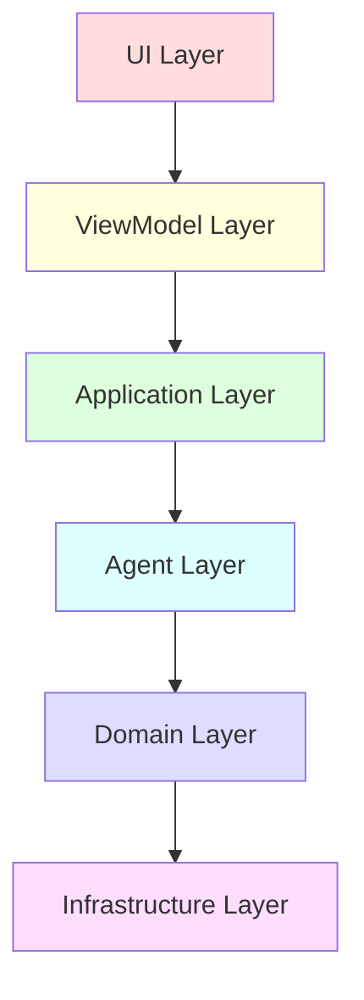
```mermaid
flowchart TD
    UI[UI Layer] --> VM[ViewModel Layer]
    VM --> App[Application Layer]
    App --> Agent[Agent Layer]
    Agent --> Domain[Domain Layer]
    Domain --> Infra[Infrastructure Layer]

    style UI fill:#fdd
    style VM fill:#ffd
    style App fill:#dfd
    style Agent fill:#dff
    style Domain fill:#ddf
    style Infra fill:#fdf
```

Arrows point downward only. No layer imports from a layer above it.

### Component Ownership

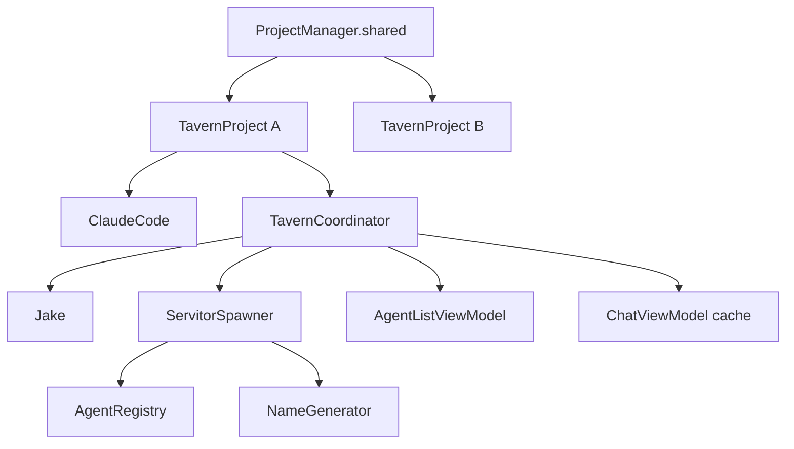
```mermaid
flowchart TD
    PM[ProjectManager.shared] --> TP1[TavernProject A]
    PM --> TP2[TavernProject B]

    TP1 --> CC1[ClaudeCode]
    TP1 --> TC1[TavernCoordinator]

    TC1 --> Jake1[Jake]
    TC1 --> SS1[ServitorSpawner]
    TC1 --> ALVM1[AgentListViewModel]
    TC1 --> CVM1["ChatViewModel cache"]

    SS1 --> AR1[AgentRegistry]
    SS1 --> NG1[NameGenerator]
```

## 4. Open Questions

- **Multi-project/Jake-per-project:** Resolved: One Jake per project (per directory). Jake's purview is the directory it's in and down.

- **GUI-less core:** Resolved: The testing suite serves as the second UI into core. No separate TUI needed.

- **Distribution:** Resolved: Source-code-only distribution. No builds or packages distributed.

## 5. Coverage Gaps

- **Build system specification:** The redo build scripts are documented in CLAUDE.md but not formally specified. Redo script behavior (dependency tracking, caching) is not specified.

---

# §004 — Agents Specification

**Status:** complete
**Last Updated:** 2026-02-16

## Upstream References
- PRD: §4.1 (Agent Types), §4.2 (Agent States), §4.3 (Task Modes)
- Reader: §3 (Core Concepts), §5 (Architecture Notes — sidecar pattern, two-level orchestration)
- Transcripts: transcript_2026-01-19-1144.md (agent types, task modes), transcript_2026-01-28-jake-spawn-tool.md (two-level orchestration)

## Downstream References
- ADR: ADR-001-shape-selection.md
- Code: Tavern/Sources/TavernCore/Agents/ (Jake.swift, Servitor.swift, ServitorSpawner.swift)
- Tests: Tavern/Tests/TavernCoreTests/, Tavern/Tests/TavernTests/

---

## 1. Overview
Servitor types (Jake daemon, mortal servitors, drones, monitor daemons), their states, task modes, and the async/non-blocking I/O pattern. Defines how the Tavern manages its own trees of servitors, each running a Claude session that may internally have its own agents and subagents.

## 2. Requirements

### REQ-AGT-001: Jake Daemon Agent
**Source:** PRD §4.1
**Priority:** must-have
**Status:** specified

**Properties:**
- Jake is the top-level coordinating daemon servitor — exactly one per open project
- Jake's lifecycle is tied to the project: starts when the project opens, stops when it closes
- Jake has the highest authority to summon and manage other servitors
- Jake has few direct capabilities himself — he coordinates, not executes
- Jake's session persists across app restarts (keyed per-project in UserDefaults)
- Jake has the authority to delegate capabilities to servitors, with stipulations enforced by the deterministic shell (see §021 Capability Delegation)
- Jake cannot delegate capabilities beyond what he himself has

**Testable assertion:** When a project is opened, Jake is instantiated. When the project closes, Jake is stopped. Jake's session persists across app restarts.

### REQ-AGT-002: Mortal Agents (Servitors)
**Source:** PRD §4.1
**Priority:** must-have
**Status:** specified

**Properties:**
- Mortal servitors are task-scoped — their lifecycle is bound to task completion
- Mortal servitors can summon children, forming tree structures of arbitrary depth (Erlang-style)
- Parent-child relationships are tracked
- Called "Servitors" in the codebase and "The Regulars" in Jake's vocabulary
- These servitors are children of Jake — this is a fundamental property
- Immortal servitors (daemons) are always resuscitated when their session context becomes invalid — daemon resuscitation is a key property
- Resuscitated servitors can either run stateless or persist their state frequently, providing context to the replacement session

**Testable assertion:** A mortal servitor can be summoned, receives an assignment, works on it, and transitions to done. A mortal servitor can summon child servitors. Parent-child relationships are tracked. Daemon servitors are resuscitated when their session context becomes invalid.

### REQ-AGT-003: Drone Agents
**Source:** PRD §4.1
**Priority:** deferred
**Status:** specified

**Properties:**
- Drones complete exactly one task, then auto-terminate
- Drones use cheaper models and are cheap to fail (Meeseeks pattern)
- No recovery attempt on failure

**Testable assertion:** Deferred. When implemented: drone completes exactly one task, then auto-terminates. Drone failure is cheap (no recovery attempt).

### REQ-AGT-004: Monitor Daemons
**Source:** PRD §4.1
**Priority:** deferred
**Status:** specified

**Properties:**
- Monitor daemons run in the background, reporting to Jake
- Monitor daemons do not accept user tasks
- Monitor daemons track system health, servitor progress, and spending
- These are children of Jake, fundamentally — this is a key property

**Testable assertion:** Deferred. When implemented: monitor daemons run in background, report to Jake, do not accept user tasks.

### REQ-AGT-005: Agent State Machine
**Source:** PRD §4.2
**Priority:** must-have
**Status:** specified

**Properties:**
- Every servitor has exactly one state at any time: Summoned, Working, Waiting for Input, Waiting for Wakeup, Done/DismissedReaped, or FailedReaped
- Summoned is the initial state — servitors transition from Summoned to Working when they begin execution
- DismissedReaped = successful dismissal (completed work or dismissed by parent); FailedReaped = error termination
- Both reaped states transition to GC (garbage collection)
- Only valid transitions are permitted; invalid transitions produce an error
- State transitions logged in debug only
- Done requires verified commitments (REQ-DET-004); self-assessment has no bearing
- See §019 for canonical state machine

**Testable assertion:** Given a servitor in state X, only valid transitions to states Y are permitted. Attempting an invalid transition produces an error. State transitions are logged in debug builds.

### REQ-AGT-006: Task Modes
**Source:** PRD §4.3
**Priority:** must-have
**Status:** specified

**Properties:**
- Servitors can operate in five task modes: Execute, Delegate, Plan, Break up, Unify
- A servitor can switch between any modes at any point during execution
- Mode transitions are observable and logged
- The current mode is queryable

Pin: Task modes need further design discussion and fleshing out.

**Testable assertion:** A servitor can transition between any task modes. Mode transitions are observable and logged. The current mode is queryable.

### REQ-AGT-007: Servitor Trees vs Claude-Internal Agents
**Source:** Reader §3 (Two-Level Orchestration Model)
**Priority:** must-have
**Status:** specified

**Properties:**
- The Tavern manages its own trees of servitors — these are Tavern-managed entities with tracked lifecycle, state, and parent-child relationships
- Each servitor runs a Claude session that may internally have its own agents and subagents
- Tavern does not wrap or abstract Claude's internal agent/subagent mechanism — whatever happens inside a Claude session is opaque to the Tavern
- The distinction is: Tavern servitors (managed by Tavern's tree, visible in sidebar, persisted) vs internal session agents (opaque, ephemeral from Tavern's perspective)

**Testable assertion:** Tavern servitors appear in the agent list and persist across app restarts. Claude-internal agents within a servitor's session are not visible in the Tavern UI.

### REQ-AGT-008: Async/Non-Blocking I/O Pattern
**Source:** Reader §9 (Sidecar Pattern), ADR-001
**Priority:** must-have
**Status:** specified

**Properties:**
- Servitor state management never blocks — I/O operations (Anthropic API calls) are async and non-blocking
- Promises for future values enable restart points and non-blocking coordination
- A global semaphore limits concurrent Anthropic calls (~10) to prevent thread pool starvation
- No servitor's I/O can block another servitor's state management
- Configurable timeout for servitor pause without issuing wait/done signal — servitor is either prodded to respond or reaped. See §019 REQ-STM-006.

**Testable assertion:** Servitor state management methods return immediately (never block). All SDK/API calls are async. Global semaphore is respected (concurrent calls do not exceed limit).

### REQ-AGT-009: Done Signal Detection
**Source:** Reader §3 (Mortal Agents), CLAUDE.md
**Priority:** must-have
**Status:** specified

**Properties:**
- Mortal servitors detect done signals (`DONE`, `COMPLETED`) in their responses
- Done signal triggers a request to check commitment. Commitment verification may pass (servitor transitions to Done/DismissedReaped) or fail (servitor is sent back to work with a gap report describing what failed)
- A waiting signal (`WAITING`, `NEED INPUT`) transitions the servitor to `.waiting` state
- Responses without these signals leave the servitor in working state

**Testable assertion:** A response containing `DONE` triggers verification flow. Verification pass → DismissedReaped. Verification fail → sent back to work with gap report. A response containing `WAITING` transitions to waiting state.

### REQ-AGT-010: Agent Protocol
**Source:** CLAUDE.md (Agent Layer)
**Priority:** must-have
**Status:** specified

**Properties:**
- All agent types conform to a common `Agent` protocol (shared interface for sending messages, querying state, managing sessions)
- Any type conforming to `Agent` can be used interchangeably in `ChatViewModel` and `TavernCoordinator`
- `MockAgent` conforms to `Agent` protocol for testing

**See also:** §3.2.9 (dependency injection strategy)

**Testable assertion:** `MockAgent` conforms to `Agent` protocol and can be substituted for any real agent in tests. `ChatViewModel` works identically with Jake, Servitor, or MockAgent.

## 3. Properties Summary

### Servitor Type Properties

| Property | Jake | Servitor | Drone (deferred) | Monitor (deferred) |
|----------|------|----------|-------------------|-------------------|
| Lifecycle | Daemon (project-bound) | Mortal (task-bound) | Single-task | Daemon (background) |
| Can spawn children | Yes | Yes | No | No |
| Persists across restart | Yes | Yes | No | Yes |
| Accepts user tasks | No (coordinates) | Yes | Yes (one) | No |

### Servitor State Machine

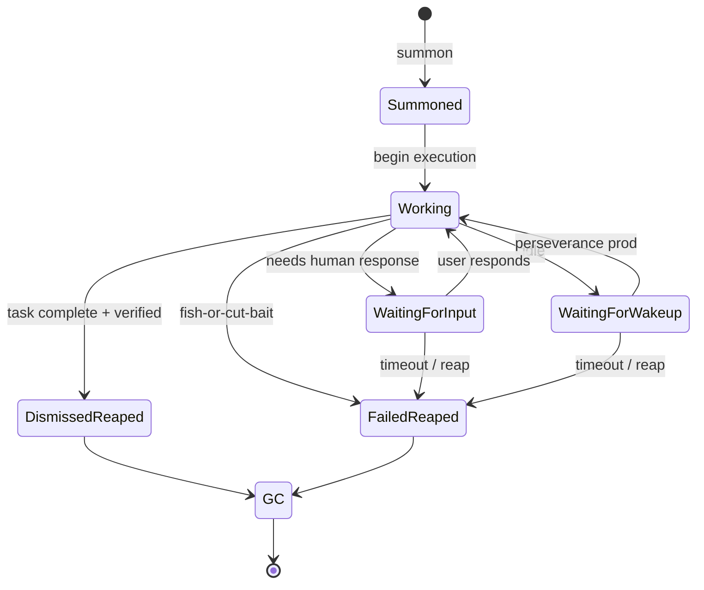
```mermaid
stateDiagram-v2
    [*] --> Summoned : summon
    Summoned --> Working : begin execution
    Working --> WaitingForInput : needs human response
    Working --> WaitingForWakeup : idle
    Working --> DismissedReaped : task complete + verified
    Working --> FailedReaped : fish-or-cut-bait
    WaitingForInput --> Working : user responds
    WaitingForInput --> FailedReaped : timeout / reap
    WaitingForWakeup --> Working : perseverance prod
    WaitingForWakeup --> FailedReaped : timeout / reap
    DismissedReaped --> GC
    FailedReaped --> GC
    GC --> [*]
```

### Tavern Servitors vs Claude-Internal Agents

| Property | Tavern Servitors | Claude-Internal Agents |
|----------|-----------------|----------------------|
| Visibility | Sidebar, dashboard | Invisible to Tavern |
| Persistence | Across sessions | Ephemeral (session-scoped) |
| Session | Own Claude session | Within parent's session |
| Managed by | Tavern tree | Claude session internals |

## 4. Open Questions

- **?4 -- Agent "Done" Assertion:** Resolved: Done signal triggers commitment test. Pass → DismissedReaped. Fail → sent back to work with gap report describing what failed.

- **?6 -- Perseverance Prompts and Agent Lifecycle:** Resolved: Infinite loop. Only Done exits (after verification). Any wait attempt gets a perseverance response. See §019.

- **Model selection:** Pinned: Model selection is orthogonal — any session can use any model. Needs PRD + spec. See §019 pinned items.

- **Failure boundaries:** Resolved: See §020 Servitor Trees for Erlang-style supervision strategies.

- **Agent limits:** Resolved: Token budgets and delegated capabilities limit servitors. See §020, §021.

## 5. Coverage Gaps

- **Child servitor failure propagation:** See §020 Servitor Trees for Erlang-style supervision strategies.

- **Servitor resource limits:** See §020 (token budgets) and §021 (capability delegation).

---

# §005 — Spawning Specification

**Status:** complete
**Last Updated:** 2026-02-16

## Upstream References
- PRD: §6.2 (Agent Spawn Configuration), §6.3 (Work Queues), §7 (Agent Naming)
- Reader: §3 (Two-Mode Agent Spawning, Agent Naming, Chat Description)
- Transcripts: transcript_2026-01-19-1144.md (naming themes), transcript_2026-01-27-testing-principles.md (two-mode spawn, chat description), transcript_2026-01-28-jake-spawn-tool.md (spawn tool)

## Downstream References
- ADR: --
- Code: Tavern/Sources/TavernCore/Agents/ServitorSpawner.swift, Tavern/Sources/TavernCore/Naming/, Tavern/Sources/TavernCore/Coordination/
- Tests: Tavern/Tests/TavernCoreTests/, Tavern/Tests/TavernTests/

---

## 1. Overview
Servitor summoning, naming themes, work queue management, and summon configuration. Covers the two summon modes (user-summon vs Jake-summon), the theatrical naming system with themed name generators, how work is queued and distributed, and the full set of summon-time parameters.

## 2. Requirements

### REQ-SPN-001: Summon Configuration Parameters
**Source:** PRD §6.2
**Priority:** must-have
**Status:** specified

**Properties:**
- A summon call accepts these optional parameters: assignment, sandbox config, model selection, token budget, work queue attachment, commitments to prefill, done behavior
- For Jake-summon, assignment is required; for user-summon, no parameters are required
- Omitted parameters receive sensible defaults
- Each parameter, when provided, is reflected in the resulting servitor's configuration
- Capability delegation is separate from summon — see §021

**Testable assertion:** A summon call with each parameter set correctly creates a servitor with those parameters applied. A summon call with default parameters creates a servitor with sensible defaults.

### REQ-SPN-002: User-Summon Mode
**Source:** Reader §3 (Two-Mode Agent Spawning)
**Priority:** must-have
**Status:** specified

**Properties:**
- A user-summoned servitor has no assignment
- A user-summoned servitor starts in chat mode
- A user-summoned servitor does not begin working until the user sends a message
- Summoning is instant — no dialogs, no intermediate UI

**See also:** §4.2.7 (servitor trees)

**Testable assertion:** Clicking `+` creates a servitor immediately (no modal dialog). The new servitor has no assignment. The servitor does not begin working until the user sends a message.

### REQ-SPN-003: Jake-Summon Mode
**Source:** Reader §3 (Two-Mode Agent Spawning)
**Priority:** must-have
**Status:** specified

**Properties:**
- A Jake-summoned servitor has an assignment
- A Jake-summoned servitor begins working immediately without waiting for user input
- A Jake-summoned servitor starts in perseverance mode
- Jake-summoned servitors may receive an assignment to: work on a task, ask the user a question, say something, or wait for user input
- Capability grants are conditional on the summon call — the parent must tick that box in the summon call with assignment

**See also:** §4.2.7 (servitor trees), §021 (capability delegation)

**Testable assertion:** A `summon_servitor` call with an assignment creates a servitor that immediately begins working. The servitor does not wait for user input before starting.

### REQ-SPN-004: Naming Theme Assignment
**Source:** PRD §7
**Priority:** should-have
**Status:** specified

**Properties:**
- Each tree gets a name set assigned to the top-level servitor
- All children in that tree draw names from the same set
- If the set is depleted, the top servitor requests another name set from Jake
- Multiple trees may share a name set, requiring concurrency management
- Different trees may have different themes

**Testable assertion:** All servitors in the same tree share a name set. If the set is depleted, a new set is requested. Different trees may have different themes.

### REQ-SPN-005: Global Name Uniqueness
**Source:** PRD §7
**Priority:** must-have
**Status:** specified

**Properties:**
- Every mortal servitor has a globally unique name across the entire system (all projects, all trees)
- A servitor can be identified by name alone — no path addressing is required
- Name lookup by string returns exactly one servitor or none
- Root servitors of trees must coordinate on name usage within shared name sets
- The deterministic shell can enforce name locking before servitor creation to maintain uniqueness

**Testable assertion:** No two servitors share the same name. Name lookup by string returns exactly one servitor or none.

### REQ-SPN-006: Tier Depletion
**Source:** PRD §7
**Priority:** should-have
**Status:** specified

**Properties:**
- Tier 1 is a set of name sets. Jake rotates through assigning name sets from tier 1 to new trees until depleted or the user unlocks higher tiers.
- Lower tiers are exhausted before higher tiers are used
- Names within each tier are not repeated
- Tier depletion ordering is deterministic (same summon sequence produces same names)

**Testable assertion:** The first servitors summoned in a theme receive tier-1 names. After tier-1 is exhausted, tier-2 names are used. Names within each tier are not repeated.

### REQ-SPN-007: Easter Egg Names
**Source:** PRD §7
**Priority:** should-have
**Status:** specified

**Properties:**
- Some naming themes contain names that only appear after enough servitors have been summoned to exhaust earlier tiers
- High concurrency is rewarded with humor

**Testable assertion:** Specific themes have names that only appear after a threshold number of servitors. (Theme-specific, verified per naming theme.)

### REQ-SPN-008: Work Queues
**Source:** PRD §6.3
**Priority:** deferred
**Status:** specified

**Properties:**
- Work queues live in the document store
- Parents create queues; servitors attach to them at summon or mid-task
- When a queue item appears, the attached servitor fires immediately
- Empty-queue behavior is deterministic (idle, hibernate, terminate, etc.) and specified at attachment time

**Testable assertion:** Deferred for v1. When implemented: creating a queue item triggers the attached servitor. A servitor with empty-queue instructions follows them when the queue drains.

### REQ-SPN-009: Chat Description
**Source:** Reader §3 (Chat Description)
**Priority:** must-have
**Status:** specified

**Properties:**
- Every servitor has a mutable chat description visible in the sidebar
- Both the user and the servitor (via tools) can alter the description at any time
- The description includes the original ask plus current status
- The description persists across app restarts

**Testable assertion:** The chat description is visible in the sidebar. The user can edit it. The servitor can update it via a tool call. The description persists across app restarts.

### REQ-SPN-010: Auto-Generated Names
**Source:** CLAUDE.md (MCP Tools)
**Priority:** must-have
**Status:** specified

**Properties:**
- When `summon_servitor` is called without a `name`, a name is auto-generated from the current naming theme
- Auto-generated names follow the theme's tier depletion rules (REQ-SPN-006)
- Auto-generated names are globally unique (REQ-SPN-005)

**Testable assertion:** `summon_servitor` without a name produces a servitor with a non-nil, theme-appropriate name. The name is unique.

## 3. Properties Summary

### Summon Mode Properties

| Property | User-Summon | Jake-Summon |
|----------|-----------|------------|
| Has assignment | No | Yes (required) |
| Initial mode | Chat | Perseverance |
| Begins working | After user's first message | Immediately |
| Summoning UI | Instant, no dialogs | Invisible (tool call) |

### Naming Properties

| Property | Holds When | Violated When |
|----------|-----------|---------------|
| Global uniqueness | No two servitors share a name, system-wide | Name collision across any project or tree |
| Tier depletion | Tier N+1 names only appear after tier N is exhausted | Higher-tier name used while lower-tier names remain |
| Theme consistency | All servitors in a tree use the same theme | A servitor's name doesn't match its tree's theme |
| Deterministic ordering | Same summon sequence → same names | Non-deterministic name selection |

## 4. Open Questions

- **Model selection:** Resolved: Orthogonal to the servitor. Can be set by user, Jake, or servitor.

- **Token budget:** Resolved: Fine-tuning needed, but servitors get periodic updates. Pinned for detailed design.

- **Done behavior:** Resolved: Three flags — check work queue and wait idle if empty, dismiss, or just wait idle. A daemon may periodically check queues and wake idle servitors.

- **Summon failure:** Resolved: Parent gets notified of the event (same as completion or reaping notifications).

- **Maximum count:** Resolved: No maximum. Deal with it.

- **Migration:** Resolved: No servitor migration. Cross-tree communication via capability grants.

## 5. Coverage Gaps

- **Summon failure handling:** Resolved: Parent receives notification on summon failure.

- **Maximum servitor count:** Resolved: No maximum.

- **Servitor migration:** Resolved: No migration. Cross-tree communication via §021.

---

# §006 — Lifecycle Specification

**Status:** complete
**Last Updated:** 2026-02-16

## Upstream References
- PRD: §12 (Fish or Cut Bait), §13 (Rewind and Branch)
- Reader: §8 (Dead Agents Leave Bodies), §4 (Completing Work)
- Transcripts: --

## Downstream References
- ADR: --
- Code: Tavern/Sources/TavernCore/Agents/ (partial implementation)
- Tests: --

---

## 1. Overview
Agent lifecycle management including the "fish or cut bait" decision pattern, rewind-and-branch capabilities, and dead agent artifact preservation. Defines how agents are terminated when unproductive, how work can be rewound and branched, and how dead agents leave traceable artifacts.

## 2. Requirements

### REQ-LCM-001: Fish-or-Cut-Bait Triggers
**Source:** PRD §12
**Priority:** must-have
**Status:** specified

**Properties:**
- The system detects unproductive agents rather than allowing them to continue indefinitely
- Five trigger conditions exist: token budget exceeded, changeset fundamentally wrong, agent spinning, entire gang on wrong path, the servitor decides to abort (self-termination)
- Each trigger condition is detectable programmatically
- When a trigger fires, the agent transitions to Failed/Reaped state
- The parent is notified with the specific trigger reason
- An optional restart with different parameters is available (parent or user decides)

**See also:** §4.2.5 (base agent state machine), §4.2.9 (done signal detection), §8.2.4 (commitment verification)

**Testable assertion:** Each trigger condition can be detected programmatically. When a trigger fires, the agent transitions to Failed/Reaped state. The parent is notified with the trigger reason.

### REQ-LCM-002: Token Budget Enforcement
**Source:** PRD §12
**Priority:** must-have
**Status:** specified

**Properties:**
- Every agent has a token budget set at spawn time
- An agent cannot consume unbounded tokens — exceeding the budget fires the fish-or-cut-bait trigger
- Budget overshoot is bounded (the agent does not consume 10x its budget before stopping)
- The budget accounts for the agent's own API calls

**Testable assertion:** An agent with a token budget of N stops after consuming approximately N tokens. The budget overshoot is bounded.

### REQ-LCM-003: Spin Detection
**Source:** PRD §12
**Priority:** should-have
**Status:** specified

**Properties:**
- An agent that makes N identical or near-identical tool calls in succession without producing new artifacts is considered spinning
- The detection threshold N is configurable
- Spin detection triggers the fish-or-cut-bait flow (REQ-LCM-001)

**Testable assertion:** An agent that makes the same tool call N times in succession triggers spin detection. The detection threshold is configurable.

### REQ-LCM-004: Dead Agent Artifacts
**Source:** Reader §8 (Dead Agents Leave Bodies)
**Priority:** must-have
**Status:** specified

**Properties:**
- Dead agents (completed, failed, or reaped) leave persistent artifacts for review and debugging
- The agent's tile persists in the sidebar showing its final state
- The user can view the agent's final state, conversation history, and outputs after death
- Dead agent artifacts are not immediately cleaned up — initial cleanup is manual

**Testable assertion:** After an agent is reaped, its entry remains in the sidebar with a "dead" indicator. The user can view the agent's final state, conversation history, and any outputs.

### REQ-LCM-005: Rewind Capability
**Source:** PRD §13
**Priority:** deferred
**Status:** specified

**Properties:**
- Agent state can be checkpointed at any point
- Rewinding to a checkpoint restores the agent's conversation state and changeset to that point
- The original state is not destroyed by rewinding
- Erlang-style gang termination via capability — agents may fire off a team and if any one fails, the whole gang is terminated and restarted quickly
- Artifacts must be preserved in changeset drafts for debugging
- See §020 Servitor Trees for detailed supervision strategies

**Testable assertion:** Deferred. When implemented: a checkpoint can be created at any point. Rewinding to a checkpoint restores the agent and its changeset to that point.

### REQ-LCM-006: Branch Capability
**Source:** PRD §13
**Priority:** deferred
**Status:** specified

**Properties:**
- Branching from a checkpoint creates an independent copy with a tweaked prompt
- The original timeline is preserved; changes in one branch do not affect the other
- Multiple branches can exist simultaneously

**Testable assertion:** Deferred. When implemented: branching from a checkpoint creates an independent copy. Changes in one branch do not affect the other.

### REQ-LCM-007: Agent Expiration and Hibernation
**Source:** Reader §4 (Completing Work)
**Priority:** should-have
**Status:** specified

**Properties:**
- Mortal agents transition to done/expired or hibernation when tasks complete
- Jake is notified when any agent completes, ensuring no open loops go unhandled
- The dashboard accurately reflects completed vs in-progress vs pending work at all times

**Testable assertion:** A completed agent transitions to done state and is marked as expired or hibernating. Jake is notified when an agent completes. Incomplete tasks are tracked.

## 3. Properties Summary

### Lifecycle Properties

| Property | Holds When | Violated When |
|----------|-----------|---------------|
| Bounded token consumption | Agent stops at or near budget | Agent consumes unbounded tokens |
| Spin detection | Repeated identical actions trigger reaping | Agent loops indefinitely without detection |
| Dead body persistence | Reaped/completed agents remain viewable | Dead agent's state disappears |
| Parent notification | Parent knows when child is reaped and why | Child reaped silently |
| No open loops | Jake tracks all incomplete work | Completed agent's unfinished tasks forgotten |

### Agent Lifecycle State Machine

Note: See §019 for canonical state machine. This graph is a simplified lifecycle view.

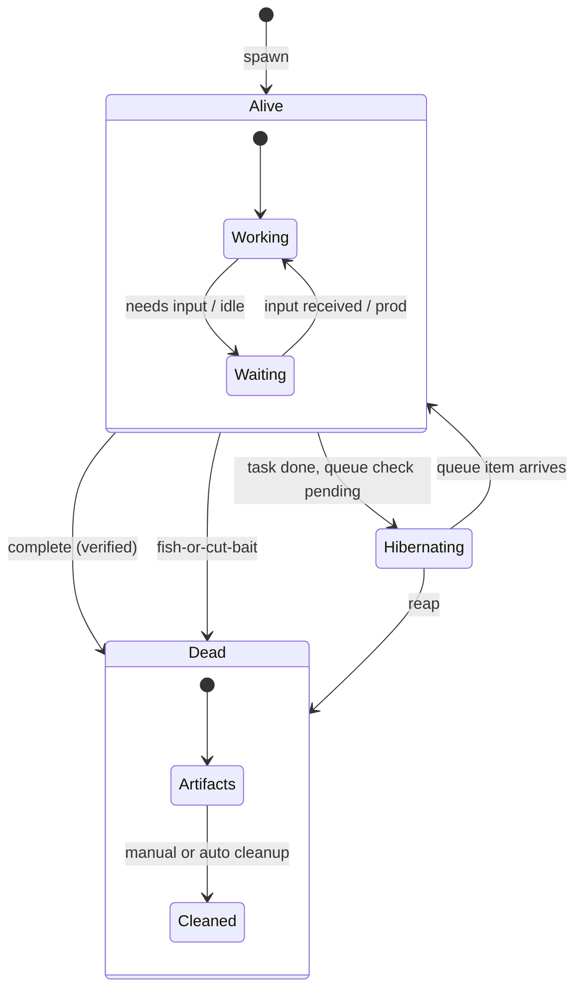
```mermaid
stateDiagram-v2
    [*] --> Alive : spawn
    Alive --> Dead : complete (verified)
    Alive --> Dead : fish-or-cut-bait
    Alive --> Hibernating : task done, queue check pending

    state Alive {
        [*] --> Working
        Working --> Waiting : needs input / idle
        Waiting --> Working : input received / prod
    }

    state Dead {
        [*] --> Artifacts
        Artifacts --> Cleaned : manual or auto cleanup
    }

    Hibernating --> Alive : queue item arrives
    Hibernating --> Dead : reap
```

## 4. Open Questions

- **Rewind storage:** Resolved: Set at runtime per sandbox rules. Can mean conversation history only, whole changeset, or other distinctions.

- **Branch limit:** Resolved: No limits.

- **Automatic reaping:** Resolved: Keep artifacts unless space concerns arise. Manual cleanup initially.

- **Gang-level fish-or-cut-bait:** Resolved: Parent agent may decide to cut bait at the whole gang level. See §020.

- **Resummoned servitor:** Resolved: System prompt tells it as much and provides as much context as possible.

- **Hibernation:** Resolved: Hibernation is waiting idle.

## 5. Coverage Gaps

- **Gang-level fish-or-cut-bait:** Resolved: See §020 Servitor Trees for gang-level supervision strategies.

- **Restart parameters:** When an agent is restarted after FOCB, what changes? Different prompt? Different model? Different budget? The PRD says "kill and restart" but does not specify what varies.

- **Hibernation triggers:** Resolved: Hibernation is waiting idle. No separate trigger distinction needed.

---

# §007 — Operating Modes Specification

**Status:** complete
**Last Updated:** 2026-02-16

## Upstream References
- PRD: §4.4 (Operating Modes), §5.2 (Attention Model)
- Reader: §3 (Perseverance Mode vs Chat Mode), §4 (Zooming In and Out)
- Transcripts: transcript_2026-01-19-1144.md (perseverance, chat, zoom), transcript_2026-01-27-testing-principles.md (two-mode spawn)

## Downstream References
- ADR: --
- Code: Tavern/Sources/TavernCore/Chat/, Tavern/Sources/TavernCore/Agents/
- Tests: Tavern/Tests/TavernCoreTests/

---

## 1. Overview
Perseverance mode vs chat mode, attention management, and the calling/hanging-up protocol. Defines how servitors operate in different contexts and how the system manages user attention across concurrent servitor activity.

Note: The canonical state/mode model is defined in §019 Servitor States & Modes. This module's state/mode content is retained for historical context but §019 is authoritative.

## 2. Requirements

### REQ-OPM-001: Perseverance Mode
**Source:** PRD §4.4
**Priority:** must-have
**Status:** specified

**Properties:**
- A servitor in perseverance mode operates in the background
- A servitor in perseverance mode never remains idle indefinitely — the system sends auto-continuation prompts when the servitor stops
- A servitor in perseverance mode does not generate user-facing notifications unless it explicitly invokes an attention-requesting tool
- Perseverance mode is the default for servitors working heads-down on assignments

**See also:** §4.2.5 (base agent state machine)

**Testable assertion:** A servitor in perseverance mode receives an auto-continuation prompt within a configurable interval after stopping. The servitor does not generate user-facing notifications unless it explicitly invokes an attention-requesting tool.

### REQ-OPM-002: Chat Mode
**Source:** PRD §4.4
**Priority:** must-have
**Status:** specified

**Properties:**
- A servitor in chat mode appears in an active chat window
- A servitor in chat mode does not receive auto-continuation prompts
- When a servitor in chat mode stops, the user is notified
- The servitor waits for user input before continuing

**See also:** §4.2.5 (base agent state machine), §4.2.9 (done signal detection)

**Testable assertion:** A servitor in chat mode does not receive auto-continuation prompts. When the servitor stops, a notification is surfaced to the user. The servitor waits for user input before continuing.

### REQ-OPM-003: User Joining/Leaving
**Source:** PRD §5.2, Reader §4
**Priority:** must-have
**Status:** specified

**Properties:**
- The user joins and leaves servitor sessions. This is technically orthogonal from perseverance and backgrounding.
- User joining = servitor is notified user is present. User leaving = servitor is notified user is absent.
- A servitor always knows whether a user is present (the servitor's awareness is deterministic, not inferred)
- Joining/leaving produce deterministic system messages: "user joined" on join, "user left" on leave
- Joining does not force a mode change — user presence is independent of operating mode
- See §019 for canonical treatment of the three orthogonal properties.

**Testable assertion:** Selecting a servitor in the UI triggers a "user joined" system message. Deselecting (or closing the chat) triggers a "user left" system message. The servitor's awareness of user presence is deterministic.

### REQ-OPM-004: Attention Model
**Source:** PRD §5.2
**Priority:** must-have
**Status:** specified

**Properties:**
- Active servitors are visible in the user's view (tabs/UX)
- Servitors with pending questions display notification indicators (badges, bubbles)
- The user can join any servitor at any depth in the hierarchy
- Cogitating status is visible when a servitor is actively processing
- The interaction pattern supports rapid context-switching ("whack-a-mole" between conversations)

**Testable assertion:** Active servitors show in the user's view. Servitors with pending questions display notification indicators. Cogitating status is visible when a servitor is actively processing.

### REQ-OPM-005: Two-Mode Servitor Summoning
**Source:** Reader §3 (Two-Mode Agent Spawning)
**Priority:** must-have
**Status:** specified

**Properties:**
- This is not a mode but rather the initial prompt plus expectations
- The distinction is between user-initiated summons (user gets direct permissions) vs Jake-initiated summons (Jake's permission scope)
- Not parametrizable — just a distinction in initial configuration

**See also:** §5.2.2/§5.2.3 (summon configuration details)

**Testable assertion:** A user-summoned servitor has no assignment and is in waiting state. A Jake-summoned servitor has an assignment and immediately transitions to working state.

### REQ-OPM-006: Cogitation Display
**Source:** PRD §5.2, Reader §12 (Cogitation Verbs)
**Priority:** should-have
**Status:** specified

**Properties:**
- Use of cogitation words during working state — the UI displays a cogitation verb while a servitor is working
- Formatting/linguistic properties of the words: terms appear in natural forms; awkward -ing constructions are avoided
- Uniqueness — each servitor's words differ from others'
- Tiered access — sets of verbs gated by conditions (e.g., hours spent in app)
- Cogitation verbs are drawn from Jewish cultural and linguistic traditions (711 entries across Yiddish, Hebrew, Ladino, Judeo-Arabic, Talmudic Aramaic, Kabbalistic terminology, and diaspora communities)

**Testable assertion:** When a servitor is in working state, a cogitation verb is displayed in the UI. The verb is selected from the approved vocabulary list. No two servitors display the same verb simultaneously.

## 3. Properties Summary

### Mode Properties

Note: This table conflates orthogonal states. The canonical model in §019 treats backgrounding, perseverance, and user presence as independent boolean properties.

| Property | Perseverance Mode | Chat Mode |
|----------|------------------|-----------|
| Auto-continuation | Yes — system prompts on stop | No — servitor waits for user |
| User notifications | Only on explicit tool call | On every stop |
| Background operation | Yes | No — visible in active window |
| Default for | Jake-summoned servitors | User-summoned servitors |

### Mode Transition Properties

| Property | Holds When | Violated When |
|----------|-----------|---------------|
| Servitor awareness | Servitor receives deterministic "joined"/"left" messages | Servitor must infer user presence |
| User control | Only user actions trigger presence transitions | System or servitor initiates presence change without user |
| Presence tracking | Servitor knows whether user is present | Servitor in wrong state regarding user presence |

### Operating Mode State Machine

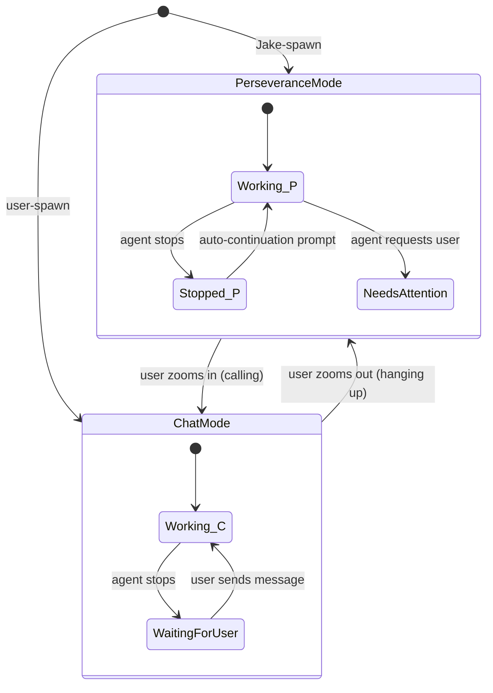
```mermaid
stateDiagram-v2
    [*] --> PerseveranceMode : Jake-spawn
    [*] --> ChatMode : user-spawn

    PerseveranceMode --> ChatMode : user zooms in (calling)
    ChatMode --> PerseveranceMode : user zooms out (hanging up)

    state PerseveranceMode {
        [*] --> Working_P
        Working_P --> Stopped_P : agent stops
        Stopped_P --> Working_P : auto-continuation prompt
        Working_P --> NeedsAttention : agent requests user
    }

    state ChatMode {
        [*] --> Working_C
        Working_C --> WaitingForUser : agent stops
        WaitingForUser --> Working_C : user sends message
    }
```

## 4. Open Questions

- **?6 -- Perseverance Prompts:** Resolved: Infinite loop until confirmed done or prematurely terminated. Contents specified in §019.

- **?7 -- User Consent for New Chats:** Resolved: No focus-stealing. Grounded in user preferences, context, and per-servitor rules.

- **Mode persistence across restart:** Resolved: Modes persist across restart. Pin: safe mode/pause button for the whole app.

- **Perseverance prompt contents:** Resolved: Contents specified in §019.

- **Notification prioritization:** Resolved: Separate spec topic — not just about state/mode. Pinned for future design.

## 5. Coverage Gaps

- **Auto-continuation prompt design:** The PRD establishes perseverance mode but does not specify the prompt contents, frequency, or failure conditions for auto-continuation.

- **Notification priority:** When multiple agents simultaneously need attention, how are notifications ordered? PRD §5.5 covers question triage but not notification prioritization.

---

# §008 — Deterministic Shell Specification

**Status:** complete
**Last Updated:** 2026-02-16

## Upstream References
- PRD: §4.7 (Deterministic Shell)
- Reader: §3 (Jake's JSON Response Format), §9 (Sidecar Pattern)
- Transcripts: transcript_2026-01-28-jake-spawn-tool.md (JakeToolHandler protocol, continuation loop)

## Downstream References
- ADR: --
- Code: Tavern/Sources/TavernCore/Commitments/ (Commitment.swift, CommitmentList.swift, CommitmentVerifier.swift), Tavern/Sources/TavernCore/MCP/TavernMCPServer.swift
- Tests: Tavern/Tests/TavernCoreTests/

---

## 1. Overview
The deterministic shell wraps non-deterministic LLM agents with deterministic infrastructure for prompt composition, passthrough display, structured tool use, and commitment verification. The goal is to minimize reliance on non-deterministic LLM behavior by pushing correctness concerns into code.

## 2. Requirements

### REQ-DET-001: Prompt Composition
**Source:** PRD §4.7.1
**Priority:** must-have
**Status:** specified

**Properties:**
- Agent prompts are constructed by deterministic code, not by previous agent responses
- Each message to an agent includes all necessary context regardless of conversation history length
- The system never relies on the agent "remembering" previous instructions
- Invariants in prompts are enforced by the system, even when a parent servitor composes the prompt to a child

**Testable assertion:** System prompts include all required instructions regardless of conversation history length. No prompt depends on the agent having seen prior messages.

### REQ-DET-002: Passthrough Display
**Source:** PRD §4.7.2
**Priority:** must-have
**Status:** specified

**Properties:**
- All content blocks the user sees are passthrough — not reinterpreted by any agent
- Agent responses (thinking blocks, messages) shown verbatim as received
- Tool call responses rendered by deterministic components in the app
- User can trust that blocks are not hallucinated — data from store is verbatim, not agent interpretation
- If user views a record or file on disk, it is rendered accurately from the data store, and everything inside that block is guaranteed not hallucinated
- Content shown to the user from the doc store is byte-identical to the file on disk
- No LLM summarization or rephrasing occurs between storage and display

**Testable assertion:** Content displayed with a "direct from store" indicator is byte-identical to the file on disk. Agent responses are displayed as received. Tool call results are rendered by deterministic app components, not by agents.

### REQ-DET-003: Structured Outputs via Tools
**Source:** PRD §4.7.3
**Priority:** must-have
**Status:** specified

**Properties:**
- Operations requiring precision (calculations, file paths, servitor summoning) go through typed tool calls
- Tool calls have validated parameters; tool results have typed return values
- No free-text parsing is used for structured operations
- This uses at minimum structural typing, if not nominal typing (as in the type theory distinction between structural and nominal types)

**Testable assertion:** No precision operation uses free-text parsing. All such operations go through tool calls with validated parameters.

### REQ-DET-004: Commitment Verification
**Source:** PRD §4.7.4, Invariant REQ-INV-003
**Priority:** must-have
**Status:** specified

**Properties:**
- Done = agent requests commitment check. Verification may incorporate non-deterministic agent evaluation if properly surfaced to user.
- Invariant: servitor is not Complete until independently verified. Done does not equal Complete.
- An agent is Complete IFF all its commitments pass independent verification
- Verification is performed by code external to the agent's session (`CommitmentVerifier`)
- The agent's self-assessment of completion ("I'm done") has no bearing on actual completeness
- Verification failure leaves the agent in a non-complete state regardless of what the agent claims
- Both parent-assigned and agent-supplemented commitments must pass
- The parent is notified of both verification success and failure

**See also:** §4.2.5 (agent state machine transitions), §2.2.3 (independent verification invariant)

**Testable assertion:** An agent that signals DONE but fails verification remains in a non-done state. An agent that passes verification transitions to done. Verification runs shell commands external to the agent's session.

### REQ-DET-005: Commitment Storage
**Source:** PRD §4.7
**Priority:** must-have
**Status:** specified

**Properties:**
- Commitments are stored in the doc store, attached to agent nodes
- Both parent-assigned and agent-supplemented commitments are persisted
- Commitments are machine-readable (structured data, not free text)
- Commitments survive app restart

**Testable assertion:** Commitments can be created, read, and listed for any agent. Commitments survive app restart. Each commitment has a verifiable assertion.

### REQ-DET-008: MCP Tool Interface
**Source:** CLAUDE.md (MCP Tools)
**Priority:** must-have
**Status:** specified

**Properties:**
- Other servitors have access to tools as well (not just Jake)
- Structured tools include `summon_servitor` and `dismiss_servitor`
- `summon_servitor` accepts optional `assignment` and `name` parameters; auto-generates name if not provided
- Unique identifiers required for servitors, but not necessarily UUIDs
- Dismissing removes from UI only, not from registry

**Testable assertion:** `summon_servitor` with an assignment creates a working servitor. `summon_servitor` without a name auto-generates one. `dismiss_servitor` removes the servitor from the UI but not the registry.

## 3. Properties Summary

### Commitment Verification Properties

| Property | Holds When | Violated When |
|----------|-----------|---------------|
| Done does not equal Complete | Agent signals Done (requests check), Complete only after verification | Agent in Complete state with failing commitments |
| Verification independence | Verifier runs outside agent's session | Verifier uses agent's self-report |
| Failure preserves state | Failed verification leaves agent in working state | Failed verification marks agent done anyway |
| Parent notification | Parent notified on both pass and fail | Pass/fail outcome not communicated to parent |
| Commitment persistence | Commitments survive restart, stored in doc store | Commitments lost on restart or held in-memory only |

### Continuation Loop Properties

| Property | Holds When | Violated When |
|----------|-----------|---------------|
| Multi-action turns | Jake issues 2+ actions before conversation continues | Jake limited to one action per turn |
| Feedback availability | Previous action results inform next action | Actions issued without knowing prior results |
| Termination guarantee | Loop ends when handler returns nil | Loop runs indefinitely |
| Handler swappability | Replacing handler requires zero changes to Jake | Handler change requires Jake modification |

Note: Jake's multi-action turns are a property of ClodKit/Claude, not specific to Jake.

### Agent State Machine — Verification Transitions

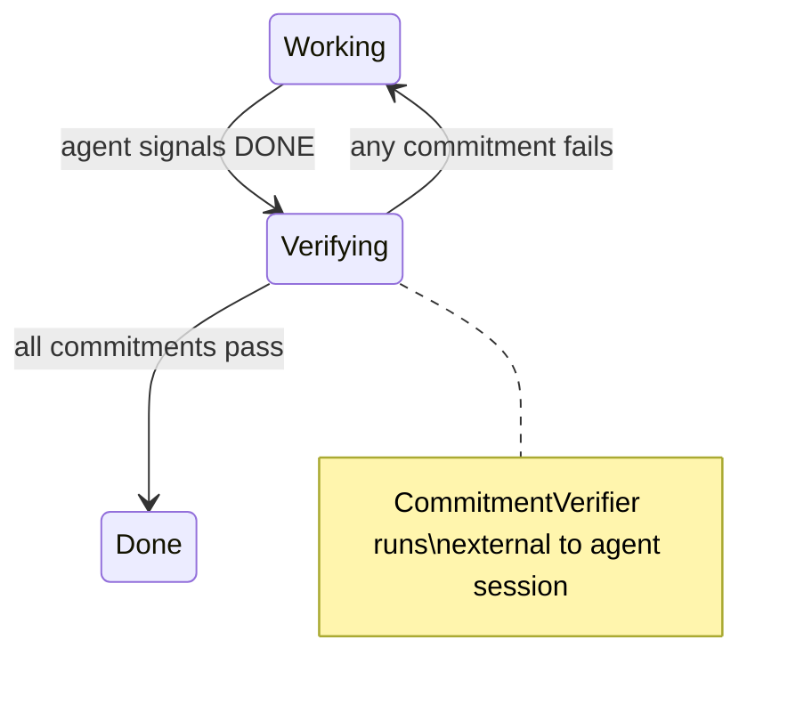
```mermaid
stateDiagram-v2
    Working --> Verifying : agent signals DONE
    Verifying --> Done : all commitments pass
    Verifying --> Working : any commitment fails
    Note right of Verifying : CommitmentVerifier runs\nexternal to agent session
```

## 4. Open Questions

- **?2 -- Deterministic Shell Meaning:** Resolved: Everything managed by the app vs a servitor. The deterministic state machines that dictate behavior and display. Deterministic rules for setting up servitors. New features follow this principle (e.g., workflow state machines).

- **Commitment assertions:** Resolved: Big TBD — vague on purpose, to be developed as we learn what works.

- **Standard tool set:** Resolved: Standard Claude tool set, modulated by capabilities. See §021.

- **Prompt composition:** Pinned for ongoing development.

## 5. Coverage Gaps

- **Prompt composition specifics:** PRD §14 lists "Prompt composition structure" as TBD. The requirement exists but the implementation details (how skills, instructions, and context are assembled) are not specified.

- **Verification timeout:** No specification for how long verification can run before it is considered failed. Long-running assertions could block the completion flow.

- **Partial verification:** No specification for what happens if some commitments pass and others fail. Is it all-or-nothing, or can partial completion be reported?

---

# §009 — Communication Specification

**Status:** complete
**Last Updated:** 2026-02-16

## Upstream References
- PRD: §5.3 (Bubbling), §5.5 (Question Triage)
- Reader: §9 (Agent Communication — message protocol, lateral collaboration, surfacing questions)
- Transcripts: transcript_2026-01-19-1144.md (bubbling concept)

## Downstream References
- ADR: --
- Code: Tavern/Sources/TavernCore/Chat/
- Tests: Tavern/Tests/TavernCoreTests/

---

## 1. Overview
Bubbling mechanism, question triage, and inter-agent communication. Defines how information flows through the agent hierarchy (upward, lateral, direct-to-user), how questions are classified and routed, and how agents collaborate through the shared workspace.

## 2. Requirements

### REQ-COM-001: Upward Bubbling
**Source:** PRD §5.3
**Priority:** must-have
**Status:** specified

**Properties:**
- Agents can escalate questions and information upward through the agent hierarchy: child → parent → grandparent → user
- Each level in the hierarchy can handle, transform, or pass through the message
- Jake is the final relay before the user
- Messages are never lost in transit — a message either reaches its destination or the sender is notified of delivery failure

**Testable assertion:** A message from a grandchild agent can reach the user through the parent and grandparent chain. Each intermediary receives the message and can either handle it or forward it upward.

### REQ-COM-002: Lateral Communication
**Source:** PRD §5.3
**Priority:** should-have
**Status:** specified

**Properties:**
- Sibling agents (children of the same parent) can exchange messages directly
- Lateral communication does not require routing through the parent
- The parent retains visibility into lateral communication (can observe, but is not a relay)
- Lateral communication is a capability granted by the parent servitor (see §021)
- Scope is configurable: siblings only, or cousins as well

**Testable assertion:** Two agents with the same parent can exchange messages directly. Messages are delivered without passing through the parent agent.

### REQ-COM-003: Direct-to-User Communication
**Source:** PRD §5.3
**Priority:** should-have
**Status:** specified

**Properties:**
- Agents can communicate directly with the user, bypassing the normal bubbling chain
- Parent agents maintain visibility into direct communication (notified that it occurred)
- Direct communication requires oversight — it is not invisible to the hierarchy

**Testable assertion:** An agent can send a message directly to the user. The parent agent is notified (or can observe) that direct communication occurred.

### REQ-COM-004: Question Classification
**Source:** PRD §5.5
**Priority:** must-have
**Status:** specified

**Properties:**
- Every question from an agent is classified as quick or deep before being surfaced
- Quick questions can be answered without reading agent state; deep questions require context
- The classification is conveyed in the notification so the user knows what they're getting into before engaging

**Testable assertion:** Questions surfaced to the user include a complexity classification. The classification is determined before the notification is shown, not after the user opens the conversation.

### REQ-COM-005: Parent-Controlled Notification Mode
**Source:** PRD §5.5
**Priority:** should-have
**Status:** specified

**Properties:**
- Parent agents choose the notification approach for their children's questions: close collaboration (per-question popup) or overseer mode (periodic summary)
- The user can override the parent's choice at any time
- The notification mode affects presentation only — it does not change which questions are surfaced

**Testable assertion:** A parent agent can configure its children's notification mode. Children's questions are surfaced according to the configured mode. The user can change the mode at any time.

### REQ-COM-006: Message Protocol Expectations
**Source:** Reader §9 (Message Protocol)
**Priority:** must-have
**Status:** specified

**Properties:**
- Each message type has a defined expected response type
- A wrong or missing response within a timeout is a signal of agent malfunction
- The protocol is symmetric: for every message type X, the expected response type is known at design time

**Testable assertion:** Each message type has a defined expected response type. An agent that responds with the wrong type or fails to respond within a timeout triggers a malfunction signal.

### REQ-COM-007: Discovery Sharing
**Source:** PRD §9.3 (also referenced in observability)
**Priority:** should-have
**Status:** specified

**Properties:**
- Agent system prompts include instructions to notice oddities and report discoveries
- Discovery sharing is prompt-engineering-based (not deterministically enforceable)
- Discovery messages are delivered to parent agents without interrupting the agent's main task

**Testable assertion:** Agent system prompts include instructions to report discoveries. Discovery messages are delivered to parent agents. (Cannot deterministically verify agent compliance — prompt-based.)

### REQ-COM-008: Jake as Communication Hub
**Source:** PRD §5.3, Reader §3
**Priority:** must-have
**Status:** specified

**Properties:**
- Jake has awareness of all agents and their states (hibernating, unfinished, backlogged)
- Jake proactively suggests that the user zoom into agents when their attention is needed
- Jake coordinates cross-tree communication

**Testable assertion:** Jake can enumerate all agents and their states. Jake generates suggestions for user attention based on agent state. Suggestions are surfaced through the chat interface.

## 3. Properties Summary

### Communication Routing Properties

| Property | Holds When | Violated When |
|----------|-----------|---------------|
| Message delivery | Every message reaches its destination or sender is notified of failure | Message silently lost in transit |
| Hierarchy respect | Upward bubbling follows parent chain | Message skips levels without explicit direct-to-user mode |
| Lateral independence | Sibling messages don't route through parent | Parent is a required relay for lateral messages |
| Parent visibility | Parent can observe all child communication (bubbled, lateral, direct) | Child communicates invisibly to parent |
| Classification before display | User knows question complexity before engaging | Classification determined after user opens conversation |

### Communication Directions

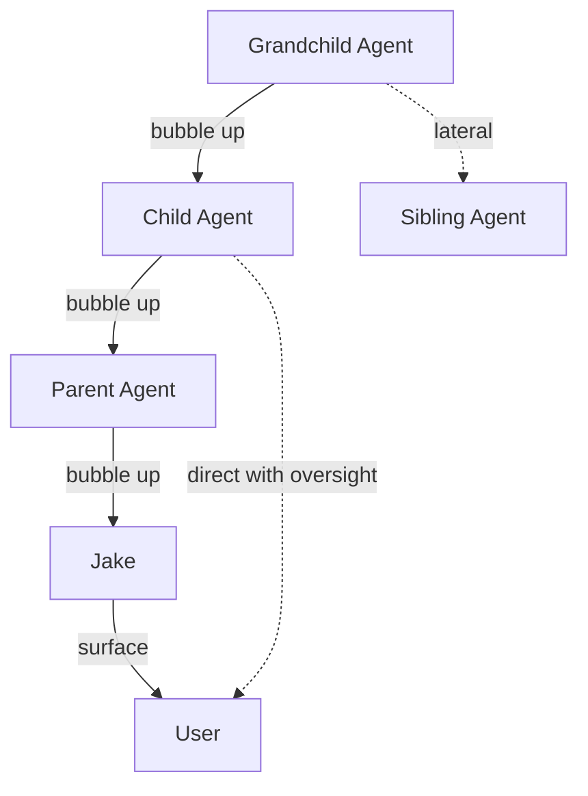
```mermaid
flowchart TD
    GC[Grandchild Agent] -->|bubble up| C[Child Agent]
    C -->|bubble up| P[Parent Agent]
    P -->|bubble up| J[Jake]
    J -->|surface| U[User]

    GC -.->|lateral| Sib[Sibling Agent]
    C -.->|direct with oversight| U
```

Solid lines = upward bubbling. Dashed = lateral and direct.

## 4. Open Questions

- **?5 -- Bubbling Up Process:** Resolved: Ad-hoc in the moment, as the situation demands, modulated by permissions and capabilities the servitor has.

- **Message protocol specifics:** Resolved: Needs its own spec section and ADR. Pinned for future design.

- **Lateral communication routing:** Resolved: Servitors have tools to query their position in the hierarchy and find other servitors.

## 5. Coverage Gaps

- **Message delivery guarantees:** Deterministic messages (code events) have their guarantees. Agent-to-agent messages use messaging protocol with confirmation responses. See pinned message protocol spec.

- **Communication rate limiting:** Pinned. Agents have token budgets as a natural limit.

- **Privacy/scoping:** Pinned. Capabilities will help here. Project-specific configuration.

---

# §010 — Document Store Specification

**Status:** complete
**Last Updated:** 2026-02-16

## Upstream References
- PRD: §4.5 (The Document Store), §6.6 (Hygiene)
- Reader: §7 (Core Systems — Document Store, Session Storage Layers, Session Lifecycle)
- Transcripts: transcript_2026-01-19-1144.md (doc store concept), transcript_2026-01-22-0015.md (three storage layers), transcript_2026-02-01-sdk-migration-and-session-forensics.md (session lifecycle)

## Downstream References
- ADR: --
- Code: Tavern/Sources/TavernCore/DocStore/, Tavern/Sources/TavernCore/Persistence/
- Tests: Tavern/Tests/TavernCoreTests/

---

## 1. Overview
Document store as the memory backbone for agent communication and state persistence. The doc store IS the filesystem — a file is a document. Code implements rules on top (validation, structure, relationships). Covers the three storage layers, hygiene rules for data lifecycle, and the session lifecycle model.

## 2. Requirements

### REQ-DOC-001: Filesystem Identity
**Source:** PRD §4.5
**Priority:** must-have
**Status:** specified

**Properties:**
- The document store is the filesystem — there is no separate "doc store" abstraction
- A file is a document; one file per node
- Database rules layer content is stored in the file store itself — they are also database records
- The only fundamental type and access to the document store is the same file API you get for files
- Runtime may maintain a memory cache, indices, and provide more sophisticated APIs on top
- The store is the entirety of the Tavern at that directory
- This does not preclude using `~/.tavern/` or macOS-provided storage for system/user level things
- No separate database, key-value store, or custom storage engine exists for document storage

**Note:** A follow-on ADR is needed for data store layering: low-level file layer with ACID-compliant layers on top for messaging, queues, etc.

**Testable assertion:** All persistent state is represented as files on disk. No separate database, key-value store, or custom storage engine exists for document storage.

### REQ-DOC-002: Source of Truth
**Source:** PRD §4.5, Invariant REQ-INV-005
**Priority:** must-have
**Status:** specified

**Properties:**
- If it is not in a file, it does not exist
- Agents communicate primarily through shared state in files (blackboard pattern)
- No in-memory-only state that matters to correctness may exist without a file-backed representation
- Killing the process and restarting produces consistent state from disk alone

**Testable assertion:** After any state mutation, the corresponding file on disk reflects the new state. Killing the process and restarting produces consistent state from disk alone.

### REQ-DOC-003: Multi-Purpose Storage
**Source:** PRD §4.5
**Priority:** must-have
**Status:** specified

**Properties:**
- Documents serve one of five or more roles: document storage, messaging system, work queues, agent nodes, workflow templates
- Filesystem trees aren't namespaced in that sense — any document could potentially serve any role
- Each role operates through the same filesystem abstraction

**Testable assertion:** Each of these document roles can be created, read, and updated through the doc store rules layer.

### REQ-DOC-006: Authoritative Display
**Source:** Reader §7 (Document Store)
**Priority:** should-have
**Status:** specified

**Properties:**
- The UI can show a "direct from store" indicator to signal data integrity
- Content displayed with this indicator is byte-identical to the file on disk
- No LLM processing occurs between storage and display for authoritative content

**Testable assertion:** Content displayed with the "direct from store" indicator is byte-identical to the file on disk. No LLM processing occurs between storage and display for authoritative content.

### REQ-DOC-007: Hygiene — Dead Agent Cleanup
**Source:** PRD §6.6
**Priority:** must-have
**Status:** specified

**Properties:**
- Daemon processes handle cleanup of: dead agents, old changesets, stale overlays, orphaned workflows/documents/resources
- No orphaned resources accumulate indefinitely
- Cleanup occurs within a configurable time window after resources become orphaned

**Testable assertion:** After an agent is reaped, its associated resources are cleaned up within a configurable time window. No orphaned resources accumulate indefinitely.

## 3. Properties Summary

### Storage Layer Properties

| Layer | Location | Managed By | Lifecycle | Shared? |
|-------|----------|-----------|-----------|---------|
| 1 | `~/.claude/projects/` | Claude CLI | 30-day retention | No (machine-local) |
| 2 | `.tavern/` in project | Tavern app | Version-controlled | Yes (travels with repo) |
| 3 | UserDefaults/iCloud | macOS | App-managed | No (personal) |
| — | `~/.tavern/` | Tavern app | System/user level | No (machine-local) |

### Core Doc Store Properties

| Property | Holds When | Violated When |
|----------|-----------|---------------|
| Filesystem identity | All state is files on disk | State exists in a separate database |
| Source of truth | Kill + restart = consistent state | In-memory state lost on crash |
| No orphans | Dead agent resources cleaned up | Resources accumulate indefinitely |
| Layer isolation | SDK storage not mixed with app storage | Tavern writes to `~/.claude/projects/` |
| Crash-time partial flush | In-memory state fully flushed or not flushed at all | In-memory state partially flushed to disk at crash time, violating source-of-truth invariant |

## 4. Open Questions

- **Doc store file structure/namespacing:** Resolved: Not a thing. Filesystem trees aren't namespaced.

- **Doc store durability model:** Resolved: (a) disk hardware capability, (b) filesystem capability, (c) any in-memory proxy has ACID-compliant properties when flushing to disk.

- **Message protocol specifics:** Resolved: ADR material. Messaging requirements need a separate spec section. See pinned items.

- **Conflict resolution:** Resolved: Merge queue handles conflicts. One invariant: there's always a merge queue.

## 5. Coverage Gaps

- **File locking:** Pinned for future design.

- **Document versioning:** Resolved: Does not exist beyond what the filesystem provides.

- **Storage quotas:** Resolved: Matter for the filesystem and the computer's administrator.

---

# §011 — Sandbox Specification

**Status:** complete
**Last Updated:** 2026-02-16

## Upstream References
- PRD: §4.6 (Sandbox Primitives), §6.4 (Preflight Checks)
- Reader: §6 (Sandbox and Isolation -- five primitives, preflight checks)
- Transcripts: transcript_2026-01-19-1144.md (sandbox primitives, changeset concept)

## Downstream References
- ADR: --
- Code: Not yet implemented (deferred for v1)
- Tests: --

---

## 1. Overview
Sandbox primitives for file protection, preflight checks, and the changeset model. Defines the five orthogonal isolation primitives, how agents are validated before starting, and how file mutations are managed through overlay-based changesets. Most sandbox features are deferred for post-v1.

## 2. Requirements

### REQ-SBX-001: Five Sandbox Primitives
**Source:** PRD §4.6
**Priority:** must-have (architecture), deferred (implementation)
**Status:** specified

**Properties:**
- Five orthogonal primitives exist: Changeset, Platform, Isolation, Connectors, Software
- Primitives are orthogonal — any combination is valid; no primitive depends on another
- Parent picks settings at spawn time per agent
- Changeset: overlay filesystem protecting originals; the diff between original and overlay
- Platform: where the agent runs (Mac, container, cloud, hybrid)
- Isolation: VMs, containers, OS-level sandboxes — agent can trash its environment and be reaped
- Connectors: network access control per agent
- Software: OS choice (macOS, Linux, FreeBSD, etc.)
- The sandbox MUST make boundary violations impossible, not just detectable
- Agents cannot see paths outside the sandbox. Unauthorized network calls are dropped and reported. There is no escape.
- Pin: Sandbox integrity verification (detecting vulnerability exploitation) pinned for if it ever becomes important.

**Testable assertion:** Architecture supports specifying each primitive independently per agent spawn. Primitives do not depend on each other (orthogonal). (Implementation deferred for v1 — agents work on actual files.)

### REQ-SBX-002: Changeset as Diff
**Source:** PRD §4.6
**Priority:** deferred
**Status:** specified

**Properties:**
- A changeset is the diff between the original files and the overlay
- Original files remain untouched until the changeset is explicitly applied (REQ-INV-008)
- Another agent can review the changeset independently before application
- Application is an explicit, irreversible action
- Changeset and diff capabilities depend on the sandbox configuration — some configurations may not support them

**Testable assertion:** Deferred. When implemented: a changeset can be extracted as a diff. The diff is reviewable. Applying the diff modifies original files. Before application, original files are untouched.

### REQ-SBX-003: Source Control Orthogonality
**Source:** PRD §4.6, Reader §6
**Priority:** must-have (design), deferred (implementation)
**Status:** specified

**Properties:**
- The changeset system does not depend on git
- Changesets work in non-git directories and can span multiple repositories
- The system does not use git worktrees for agent isolation

**Testable assertion:** The changeset system does not depend on git. An agent working in a non-git directory can still use changesets. Changesets can span multiple repositories.

### REQ-SBX-004: Preflight Checks
**Source:** PRD §6.4
**Priority:** must-have
**Status:** specified

**Properties:**
- Before an agent begins autonomous work, preflight checks verify: sandbox configured correctly, resource access available, no permissions prompts expected, external accounts authenticated
- Preflight failure prevents the agent from starting — the parent receives the specific failure reason
- Preflight is binary: pass or fail, no degraded mode (REQ-SBX-005)

**Testable assertion:** A preflight check that fails prevents the agent from starting. The parent receives a notification with the failure reason. An agent that passes preflight starts normally.

### REQ-SBX-005: Preflight Fail-Fast
**Source:** PRD §6.4
**Priority:** must-have
**Status:** specified

**Properties:**
- Preflight is all-or-nothing — a single failure aborts the entire spawn
- No partial capability mode exists
- The agent is never created in a degraded state

**Testable assertion:** A single preflight failure aborts the spawn regardless of other checks passing. No partial capability mode exists.

### REQ-SBX-006: Platform Configuration
**Source:** PRD §4.6
**Priority:** deferred
**Status:** specified

**Properties:**
- Agents can run on different platforms: Mac (local), container (Docker), cloud (remote), hybrid (cloud agent + local app via protocol)
- Platform is configured at spawn time

**Testable assertion:** Deferred. When implemented: an agent can be spawned with a platform specification. The agent runs on the specified platform.

### REQ-SBX-007: Isolation Levels
**Source:** PRD §4.6
**Priority:** deferred
**Status:** specified

**Properties:**
- Multiple isolation levels available: VMs, containers, OS-level sandboxes
- An agent in isolation can trash its environment without affecting the host
- The environment can be reaped and recreated cleanly
- Isolation contains leaked writes (e.g., tools that access `~/.uv`)

**Testable assertion:** Deferred. When implemented: an agent in container isolation cannot modify host files. Destroying and recreating the container produces a clean environment.

### REQ-SBX-008: Connector Control
**Source:** PRD §4.6
**Priority:** deferred
**Status:** specified

**Properties:**
- Network access is configurable per agent
- An agent with no network access cannot make outbound connections
- An agent with host-restricted access can reach only those hosts

**Testable assertion:** Deferred. When implemented: an agent with network disabled fails on outbound connection attempts. An agent with specific allowed hosts can reach only those hosts.

## 3. Properties Summary

### Sandbox Primitive Orthogonality

| Primitive | Controls | Independent Of |
|-----------|---------|----------------|
| Changeset | File mutation isolation | Platform, Isolation, Connectors, Software |
| Platform | Execution environment | Changeset, Isolation, Connectors, Software |
| Isolation | Environment containment | Changeset, Platform, Connectors, Software |
| Connectors | Network access | Changeset, Platform, Isolation, Software |
| Software | Operating system | Changeset, Platform, Isolation, Connectors |

Any combination of these five primitives is valid.

### Preflight Properties

| Property | Holds When | Violated When |
|----------|-----------|---------------|
| Fail-fast | One failure aborts entire spawn | Agent starts despite a failing check |
| Binary outcome | Pass or fail, nothing in between | Agent starts in degraded mode |
| Parent notification | Parent receives specific failure reason | Spawn fails silently |
| No partial start | Agent never created in incomplete state | Agent exists but can't function |

### Changeset Lifecycle (Post-v1)

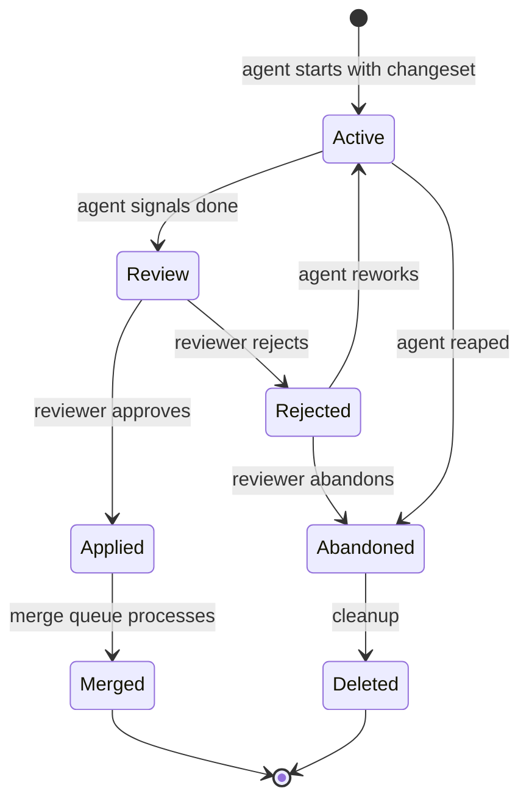
```mermaid
stateDiagram-v2
    [*] --> Active : agent starts with changeset
    Active --> Review : agent signals done
    Review --> Applied : reviewer approves
    Review --> Rejected : reviewer rejects
    Applied --> Merged : merge queue processes
    Merged --> [*]
    Rejected --> Active : agent reworks
    Rejected --> Abandoned : reviewer abandons
    Active --> Abandoned : agent reaped
    Abandoned --> Deleted : cleanup
    Deleted --> [*]
```

## 4. Open Questions

- **Changeset lifecycle specifics:** Resolved: Changesets belong to the sandbox, generally.

- **Hybrid platform protocol:** Resolved: ADR material.

- **Isolation cost:** Resolved: Testing path must be as fast as possible for agent iteration. Ensure fastest testing path is available.

- **Sandbox escape:** Resolved: Sandbox makes escape impossible by design. Integrity verification pinned for future.

## 5. Coverage Gaps

- **Changeset merge conflicts:** Resolved: Merge queue. See §012.

- **Sandbox escape detection:** Resolved: Sandbox makes escape impossible. Integrity verification pinned.

- **Resource limits per sandbox:** Resolved: Not application requirements.

---

# §012 — Workflows Specification

**Status:** complete
**Last Updated:** 2026-02-16

## Upstream References
- PRD: §10 (Workflows), §9.1 (Starter Templates), §11 (Gang of Experts), §6.5 (Merge Queue)
- Reader: §7 (Workflow Engine, Spec Engine, Starter Workflows)
- Transcripts: --

## Downstream References
- ADR: --
- Code: Not yet implemented
- Tests: --

---

## 1. Overview
Workflow engine, starter templates, gang of experts pattern, and merge queue. Most of this module is deferred for post-v1, but the specifications are captured here for architectural planning and future implementation.

## 2. Requirements

### REQ-WRK-001: Workflow as State Machine
**Source:** PRD §10, Reader §7
**Priority:** deferred
**Status:** specified

**Properties:**
- A workflow is a state machine with defined states and transitions
- The workflow engine prevents invalid transitions
- Incomplete steps are surfaced (not silently skipped)
- Status is visible for long-running workflows

**Testable assertion:** Deferred. When implemented: a workflow can be defined as a set of states and transitions. The engine prevents invalid transitions. Incomplete steps are surfaced.

### REQ-WRK-004: User-Modifiable Templates
**Source:** PRD §9.1
**Priority:** deferred
**Status:** specified

**Properties:**
- Users can edit template definitions
- Agents can propose new templates (creative meta process)
- Templates persist in `.tavern/` directory

**Testable assertion:** Deferred. When implemented: users can edit template definitions. New templates can be created and saved. Templates persist in `.tavern/`.

### REQ-WRK-006: Merge Queue
**Source:** PRD §6.5
**Priority:** deferred
**Status:** specified

**Note:** This should be built on top of the workflow engine (REQ-WRK-001).

**Properties:**
- Changesets merge serially, not in parallel
- Queue order is visible to all queued agents
- Agents can refine their changes against the predictable merge target (what's ahead in the queue)
- Serial merging reduces conflicts compared to parallel merges

**Testable assertion:** Deferred. When implemented: agents can enqueue changesets. Queue order is visible. Merges happen serially. Conflicts are reduced compared to parallel merges.

### REQ-WRK-007: Spec Engine
**Source:** Reader §7 (Spec Engine)
**Priority:** deferred
**Status:** specified

**Properties:**
- Completed output is verified against the specification
- All required tasks are verified as complete (holistic check)

**Testable assertion:** Deferred. When implemented: the spec engine can compare agent output against a specification. Task completion is verified holistically.

### REQ-WRK-008: Workflow Composability
**Source:** Reader §7 (Workflow Engine)
**Priority:** deferred
**Status:** specified

**Properties:**
- Workflows can nest (a workflow can be a step in another workflow)
- Circular dependencies are prevented
- Composition does not break individual workflow guarantees

**Testable assertion:** Deferred. When implemented: workflows can nest and compose without circular dependencies.

### REQ-WRK-009: Workflow Engine
**Source:** Reader §7 (Workflow Engine)
**Priority:** deferred
**Status:** specified

**Properties:**
- A deterministic state machine runner for workflow steps
- The engine executes workflow state machines, preventing invalid transitions
- Workflows can contain other workflows as steps (Turing complete, no termination guarantee)

**Testable assertion:** Deferred. When implemented: the workflow engine executes state machines. Invalid transitions are prevented. Workflows can contain other workflows as steps.

### REQ-WRK-010: Workflow Recovery
**Source:** Reader §7 (Workflow Engine)
**Priority:** deferred
**Status:** specified

**Properties:**
- Define recovery process at different workflow points: start over, hard fail, go to a recovery stage
- Each workflow step has a defined recovery behavior on failure

**Testable assertion:** Deferred. When implemented: each workflow step has a defined recovery behavior. On failure, the system executes the defined recovery (restart, hard fail, or recovery stage).

## 3. Properties Summary

### Workflow Properties (Deferred)

| Property | Holds When | Violated When |
|----------|-----------|---------------|
| State machine validity | Only valid transitions occur | Workflow skips or repeats states |
| Stage gating | Failed stage blocks progression | Output passes despite stage failure |
| Serial merge | Changesets merge one at a time | Parallel merge produces conflicts |
| Composability | Nested workflows maintain their guarantees | Nesting breaks inner workflow |

### Workflow State Machine (Conceptual)

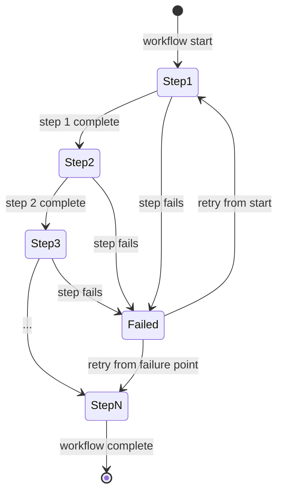
```mermaid
stateDiagram-v2
    [*] --> Step1 : workflow start
    Step1 --> Step2 : step 1 complete
    Step2 --> Step3 : step 2 complete
    Step3 --> StepN : ...
    StepN --> [*] : workflow complete

    Step1 --> Failed : step fails
    Step2 --> Failed : step fails
    Step3 --> Failed : step fails

    Failed --> Step1 : retry from start
    Failed --> StepN : retry from failure point
```

## 4. Example Workflows

These sketches illustrate what good workflows look like. They are examples of what the workflow system must support, not specifications of internal mechanics.

### Gang of Experts

A complex task is farmed out to specialized expert agents working in parallel. Each expert contributes their domain perspective, and results are combined into unified feedback.

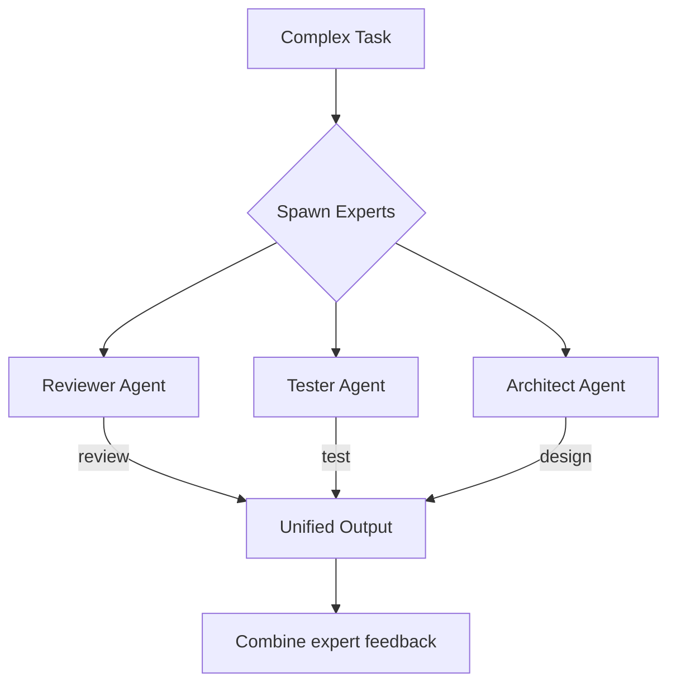
```mermaid
flowchart TD
    Task[Complex Task] --> Spawn{Spawn Experts}
    Spawn --> R[Reviewer Agent]
    Spawn --> T[Tester Agent]
    Spawn --> A[Architect Agent]

    R -->|review| Output[Unified Output]
    T -->|test| Output
    A -->|design| Output

    Output --> Merge[Combine expert feedback]
```

### Merge Queue

When multiple agents produce changesets against the same codebase, they queue up and merge serially. Each agent can see what's ahead and refine against the predictable target.

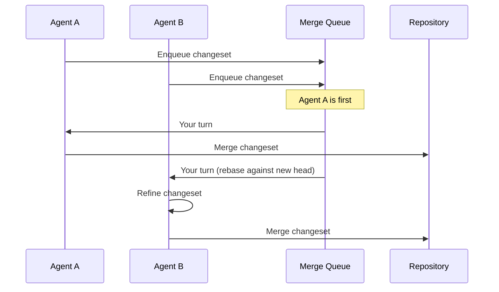
```mermaid
sequenceDiagram
    participant A as Agent A
    participant B as Agent B
    participant Q as Merge Queue
    participant Repo as Repository

    A->>Q: Enqueue changeset
    B->>Q: Enqueue changeset
    Note over Q: Agent A is first
    Q->>A: Your turn
    A->>Repo: Merge changeset
    Q->>B: Your turn (rebase against new head)
    B->>B: Refine changeset
    B->>Repo: Merge changeset
```

### Verification Layers

Output passes through ordered gates. Each gate is an agent or tool with pass/fail semantics. Failure at any stage blocks progression.

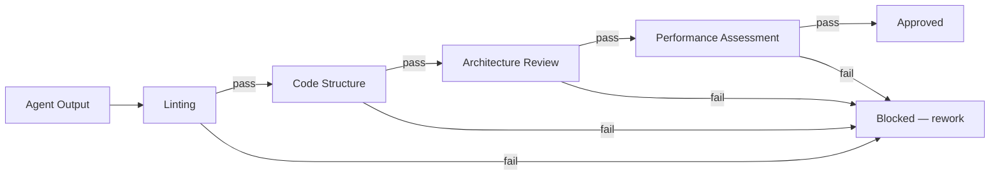
```mermaid
flowchart LR
    Input[Agent Output] --> Lint[Linting]
    Lint -->|pass| Structure[Code Structure]
    Structure -->|pass| Arch[Architecture Review]
    Arch -->|pass| Perf[Performance Assessment]
    Perf -->|pass| Done[Approved]

    Lint -->|fail| Block[Blocked — rework]
    Structure -->|fail| Block
    Arch -->|fail| Block
    Perf -->|fail| Block
```

## 5. Open Questions

- **Workflow composability:** Resolved: Workflows can contain workflows. Turing complete, no termination guarantee.

- **Template format:** Pinned: Potential ADR. See pinned items.

- **Expert prompt management:** Resolved: Dropped as standalone concept — natural part of workflows.

## 6. Coverage Gaps

- **Workflow failure recovery:** Now covered by REQ-WRK-010.

- **Merge conflict resolution:** See merge queue (REQ-WRK-006).

---

# §013 — User Experience Specification

**Status:** complete
**Last Updated:** 2026-02-16

## Upstream References
- PRD: §5.1 (The Core Loop), §5.4 (UI Principles), §8 (Progressive Unlocks), §8.1 (Concept), §8.2 (Open Questions)
- Reader: §4 (User Flow), §8 (UI Concepts — content blocks, chat header, multi-window)
- Transcripts: transcript_2026-01-19-1144.md (core loop), transcript_2026-01-22-0015.md (project-as-document, multi-window), transcript_2026-01-27-testing-principles.md (sidebar, chat description), transcript_2026-01-28-jake-spawn-tool.md (chat header)

## Downstream References
- ADR: --
- Code: Tavern/Sources/Tavern/ (TavernApp.swift, Views/), Tavern/Sources/TavernCore/UI/, Tavern/Sources/TavernCore/Project/
- Tests: Tavern/Tests/TavernTests/, Tavern/Tests/TavernUITests/

---

## 1. Overview
Core user loop, UI principles, progressive unlocks, and the project-as-document model. Defines the primary interaction pattern between users and the system, how the UI is organized, and how capabilities are revealed progressively as users engage.

## 2. Requirements

### REQ-UX-001: Fresh Project Entry
**Source:** PRD §5.1
**Priority:** must-have
**Status:** specified

**Properties:**
- A project with no history shows only Jake's chat box — no other agents, panels, or UI clutter
- Jake is the single entry point for all new interaction
- The user describes what they need; Jake coordinates from there

**Testable assertion:** Opening a project with no prior sessions shows a single chat interface for Jake. No other agents or panels are visible.

### REQ-UX-002: Task-as-Chat
**Source:** PRD §5.1
**Priority:** must-have
**Status:** specified

**Properties:**
- Each chat discussion with a servitor represents a task
- Child servitors represent subtasks
- This is conceptual — the representation elements (sidebar, tiles, etc.) are part of view architecture (§014)

**Testable assertion:** Each servitor has an associated chat discussion. Child servitors are conceptually subtasks of their parent's task.

### REQ-UX-003: Agent Discovery
**Source:** PRD §5.1, Reader §4
**Priority:** must-have
**Status:** specified

**Properties:**
- The system provides a way to find all active servitors
- Jake gets prominence
- The user can see what's going on — which servitors are working, waiting, or done

**Testable assertion:** All active servitors are discoverable. Jake is prominently displayed. Servitor status (working, waiting, done) is visible.

### REQ-UX-004: No Unsolicited Content
**Source:** PRD §5.4
**Priority:** must-have
**Status:** specified

**Properties:**
- No window, sheet, or modal appears without user-initiated action
- Notifications are passive indicators only (badge counts, sidebar indicators)
- The user's current view is never replaced without their action
- Agents surface questions via passive notifications, not by stealing focus

**Testable assertion:** No UI transition or content display occurs without user-initiated action (click, keyboard shortcut, or explicit preference). Notifications are passive (badges, bubbles), never modal interruptions.

### REQ-UX-005: Stream Separation
**Source:** PRD §5.4
**Priority:** should-have
**Status:** specified

**Properties:**
- Different content block types (thinking, tool use, code, chat text) have distinct visual treatments
- A chat-only view is possible by hiding all other content blocks (thinking, tool use, etc.)

**Testable assertion:** Different content block types render with distinct visual styles. A chat-only view mode exists that hides non-chat blocks.

### REQ-UX-006: Content Block Rendering
**Source:** Reader §8 (Content Block Rendering)
**Priority:** must-have
**Status:** specified

**Properties:**
- Claude's responses include a `content` array with typed blocks: `text`, `tool_use`, `tool_result`, `thinking`, `web_search_result`
- Each block type has its own visual style (colored avatars, styled boxes)
- `tool_use` displays tool name and parameters
- `tool_result` displays success/error state

**Testable assertion:** Each block type renders with a distinct visual treatment. Tool use shows tool name and parameters. Tool results show success/error state.

### REQ-UX-007: Project-as-Document
**Source:** Reader §4 (Project-as-Document)
**Priority:** must-have
**Status:** specified

**Properties:**
- The project IS the directory
- A .project file may exist in the root (possibly a file bundle like Xcode's), but that document isn't the project itself
- Any directory can be opened as a project, like Claude CLI
- Standard macOS document trappings: File > Open, Open Recent, Dock icon menus, drag-to-open
- State restores on app relaunch

**Testable assertion:** The app opens via File > Open (directory picker). Recent projects appear in Open Recent menu. Drag-and-drop a directory onto the Dock icon opens it. Open projects restore on app relaunch.

### REQ-UX-008: Multi-Window Support
**Source:** Reader §4 (Multi-Window Support)
**Priority:** must-have
**Status:** specified

**Properties:**
- Each open project gets a separate window
- Multiple projects can be open simultaneously with fully isolated state
- A welcome window shows recent projects
- Window positions and states restore after quit and relaunch

**Testable assertion:** Two projects can be open in two separate windows simultaneously. The welcome window lists recent projects. Window positions and states restore after quit and relaunch.

### REQ-UX-009: Chat Controls
**Source:** Reader §8 (Chat Header)
**Priority:** must-have
**Status:** specified

**Properties:**
- List of controls needed around a chat window without prescribing specific UI layout
- Controls include: agent name display, conversation management (new conversation), status indicators, and tools appropriate to the context

**Testable assertion:** Chat views include agent name display, conversation management controls, and status indicators.

### REQ-UX-010: Progressive Unlock Concept
**Source:** PRD §8.1
**Priority:** should-have
**Status:** specified

**Properties:**
- Content is revealed progressively based on user engagement (message count)
- Unlockable content includes: cogitating verbs, naming themes, Jake's vocabulary, easter eggs
- Unlocks feel organic, not gamified — Jake just starts using new words, no announcements or fanfare
- A new user sees a limited vocabulary; an engaged user sees the full range

**Testable assertion:** A new user sees a limited vocabulary. After N messages, additional vocabulary becomes available. Unlocks are not accompanied by notifications or announcements.

### REQ-UX-012: Three-Choice Consent Pattern
**Source:** Design discussion
**Priority:** should-have
**Status:** specified

**Properties:**
- For certain actions, the app offers a yes/no/always pattern
- User can opt in to having actions happen automatically
- This must be user-configurable
- Applies to actions like new window creation, focus changes, etc.

**Testable assertion:** Actions requiring consent present yes/no/always options. Selecting "always" persists the preference. The preference is user-configurable and reversible.

## 3. Properties Summary

### UI Invariants

| Property | Holds When | Violated When |
|----------|-----------|---------------|
| Fresh project = Jake only | No agents or panels visible on first open | UI shows agents/panels before user interacts |
| No unsolicited content | All UI transitions require user action | Window/modal appears without user action |
| State restoration | Quit + relaunch restores everything | Layout, agents, or history lost on restart |
| Project isolation | Two open projects have completely independent state | Action in project A affects project B |

### Multi-Window Architecture

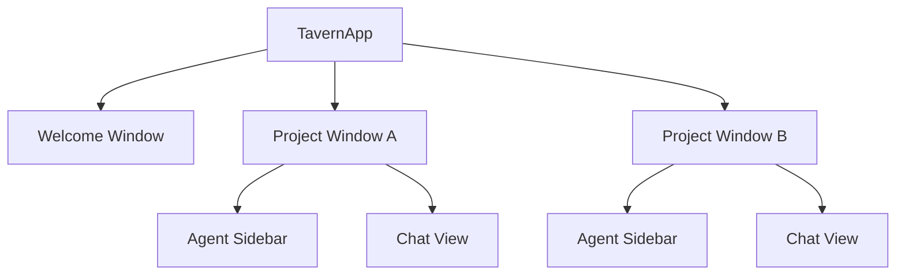
```mermaid
flowchart TD
    App[TavernApp] --> Welcome[Welcome Window]
    App --> PW1[Project Window A]
    App --> PW2[Project Window B]

    PW1 --> Sidebar1[Agent Sidebar]
    PW1 --> Chat1[Chat View]
    PW2 --> Sidebar2[Agent Sidebar]
    PW2 --> Chat2[Chat View]
```

## 4. Open Questions

- **User consent UX for new chats:** Resolved: Three-choice consent pattern (yes/no/always). See REQ-UX-012.

- **UI stream separation details:** Resolved: View architecture concern. See §014.

- **Keyboard shortcuts:** Resolved: New spec module §023.

- **Accessibility:** Resolved: New spec module §024.

- **Search:** Resolved: New spec module §025.

## 5. Coverage Gaps

- **Keyboard shortcuts:** Resolved: See §023 Keyboard Shortcuts.

- **Accessibility:** Resolved: See §024 Accessibility.

- **Search:** Resolved: See §025 Search.

---

# §014 — View Architecture Specification

**Status:** complete
**Last Updated:** 2026-02-16

## Upstream References
- PRD: (none directly -- derived from Reader and transcripts)
- Reader: §8 (UI Concepts -- dynamic views, tiles, view modes, context cards, agent layout tools, persistence)
- Transcripts: transcript_2026-01-21-2345.md (dynamic view architecture), transcript_2026-01-22-0730-view-architecture.md (view architecture deep dive)

## Downstream References
- ADR: ADR-001-shape-selection.md (Shape A: Reactive Streams)
- Code: Tavern/Sources/Tavern/Views/ (partial implementation)
- Tests: Tavern/Tests/TavernUITests/ (partial)

---

## 1. Overview
View architecture for the dynamic tile-based UI, view modes, context cards, and agent layout tools. Derived primarily from seed design sessions rather than the PRD, this spec covers how the UI dynamically composes views, supports multiple presentations of the same data, and manages agent-driven layout.

## 2. Requirements

### REQ-VIW-001: Composable View Surface
**Source:** Reader §8
**Priority:** should-have
**Status:** specified

**Properties:**
- The view layer is a composable surface, not a fixed hierarchy
- Both the user and agents can reshape the layout
- Tiles live within windows; windows serve as macOS-level escape hatches when tiling is insufficient
- Multiple layout configurations can coexist

**See also:** §3.2.3 (thin UI / fat ViewModel principle)

**Testable assertion:** Views can be rearranged by the user. The layout is not hardcoded. Multiple layout configurations can coexist.

### REQ-VIW-002: View Representations
**Source:** Reader §8
**Priority:** should-have
**Status:** specified

**Properties:**
- The same agent data can be rendered in multiple representations (like Finder's list/icon/column views)
- UI language: "view as ..." — the word "representation" appears in code only, not in the UI
- Switching representations does not lose data
- Two tiles showing the same agent in different representations stay in sync
- The response stream (thinking, tools, text) stays in one place; representations select which parts to show

**Testable assertion:** The same agent's data can be rendered in at least two different representations. Switching representations does not lose data. Two tiles showing the same agent in different representations stay in sync.

### REQ-VIW-003: Granular View Primitives
**Source:** Reader §8
**Priority:** should-have
**Status:** specified

**Properties:**
- Chat components decompose into granular primitives: thinking, tool use, tool results, messages
- Each primitive can be displayed independently or combined
- Custom layouts can focus on specific aspects of an agent's work (e.g., "tools only" mode)

**See also:** §13.2.6 (content block types)

**Testable assertion:** Individual content block types (thinking, tool_use, text) can be shown or hidden independently. A "tools only" view mode shows only tool use and results.

### REQ-VIW-004: Agent Hierarchy View Independence
**Source:** Reader §8
**Priority:** should-have
**Status:** specified

**Properties:**
- The view structure is independent of the agent hierarchy
- The same agents can render as a tree view (parent-child relationships) or a flat list
- Erlang-style arbitrary depth does not constrain view layout

**Testable assertion:** The agent sidebar can show agents as a flat list or as a tree. Switching between tree and flat view does not change agent relationships.

### REQ-VIW-005: Dead Agent Bodies
**Source:** Reader §8
**Priority:** must-have
**Status:** specified

**Properties:**
- Dead agents leave persistent views showing their final state
- Dead agent views are accessible for review and debugging
- The user must manually dismiss dead agent views (initial cleanup is manual)

**Note:** This requirement is about agent behavior (dead agent artifact preservation), not view architecture. See §004 and §019 for servitor state/lifecycle.

**Testable assertion:** After an agent dies, its view remains accessible. The view shows the agent's final state, last output, and status. The user must manually dismiss dead agent views.

### REQ-VIW-006: Layout Persistence
**Source:** Reader §8
**Priority:** should-have
**Status:** specified

**Properties:**
- Session restore is automatic: quitting and relaunching restores what was open
- Named layouts support two types: templates (abstract structure, no specific agent binding) and snapshots (specific agents, specific state)
- Users can save and load named layouts

**Testable assertion:** Quitting and relaunching the app restores the previous layout. Users can save and load named layout templates.

### REQ-VIW-007: Agent Layout Suggestions
**Source:** Reader §8
**Priority:** deferred
**Status:** specified

**Properties:**
- Agents can suggest layout changes (passive — user must accept)
- Suggestions do not modify the layout directly
- The user can auto-reject suggestions

**Testable assertion:** Deferred. When implemented: agents can create layout suggestions. Suggestions appear as non-intrusive UI elements. The user must explicitly accept a suggestion for the layout to change.

### REQ-VIW-008: Agent Layout Mutations
**Source:** Reader §8
**Priority:** deferred
**Status:** specified

**Properties:**
- With explicit user permission, agents can read and directly modify the layout
- Layout mutation is a separate permission tier from suggestions
- Agents without permission cannot modify layout

**Testable assertion:** Deferred. When implemented: agents with mutation permission can modify the layout. Agents without permission cannot. Permission is granted per-agent or per-session.

### REQ-VIW-009: Context Cards
**Source:** Reader §8
**Priority:** deferred
**Status:** specified

**Properties:**
- Each agent has a context card showing: name, current assignment, current status
- Context cards enable rapid context switching without reading full chat history
- Clicking a card navigates to the agent's chat

**Testable assertion:** Deferred. When implemented: each agent has a context card. The card shows name, assignment, and status. Clicking a card navigates to the agent's chat.

### REQ-VIW-010: Drag and Drop
**Source:** Reader §8
**Priority:** should-have
**Status:** specified

**Properties:**
- Tiles and views support drag-and-drop rearrangement
- Other rearranging tools are available (resize, snap, etc.)

**Testable assertion:** Tiles can be rearranged via drag and drop. At least one additional rearrangement tool (resize or snap) is available.

### REQ-VIW-011: Animation Properties
**Source:** Reader §8
**Priority:** should-have
**Status:** specified

**Properties:**
- Layout transitions have animation properties (duration, easing, etc.)
- Spec covers animation properties, not specific animations

**Testable assertion:** Layout transitions apply animation properties. Duration and easing are configurable per transition type.

## 3. Properties Summary

### View Properties

| Property | Holds When | Violated When |
|----------|-----------|---------------|
| View-hierarchy independence | View layout is independent of agent tree | Agent hierarchy constrains view layout |
| Multi-representation sync | Two tiles of same agent in different representations stay in sync | Representation change desynchronizes tiles |
| Data preservation | Switching representations doesn't lose data | Data disappears on representation switch |
| Dead body persistence | Dead agent views remain until manually dismissed | Dead agent views auto-disappear |
| Session restore | Quit + relaunch restores layout | Layout lost on restart |

### View Representation Concept

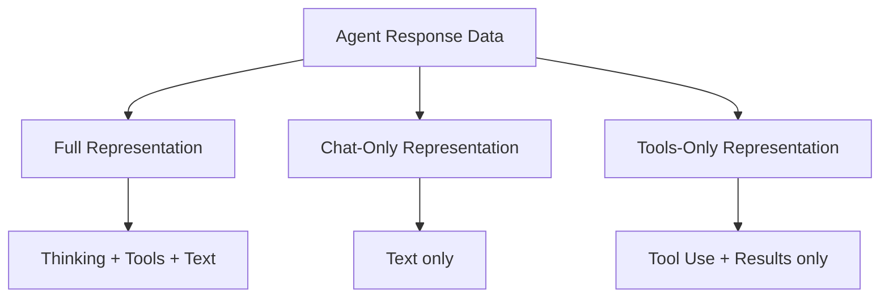
```mermaid
flowchart TD
    Data[Agent Response Data] --> VM1[Full Representation]
    Data --> VM2[Chat-Only Representation]
    Data --> VM3[Tools-Only Representation]

    VM1 --> All[Thinking + Tools + Text]
    VM2 --> Chat[Text only]
    VM3 --> Tools[Tool Use + Results only]
```

## 4. Open Questions

- **UI stream separation details:** Resolved: View architecture concern, addressed in view representations.

- **Tile sizing and constraints:** Pinned: Tiling constraints need design.

- **Multi-monitor support:** Resolved: Tiles exist within a window. Windows serve as the multi-monitor solution.

- **Responsive layout:** Pinned for future design.

## 5. Coverage Gaps

- **Drag and drop:** Resolved: REQ-VIW-010 specifies drag-and-drop rearrangement and other rearranging tools.

- **Animation:** Resolved: REQ-VIW-011 specifies animation properties for layout transitions.

- **Responsive layout:** Pinned for future design.

---

# §015 — Observability Specification

**Status:** complete
**Last Updated:** 2026-02-16

## Upstream References
- PRD: §9 (Metrics), §9.1 (Starter Templates — referenced here for meta process), §9.2 (Meta Process), §9.3 (Discovery Sharing), §16 (Violation Monitoring), §19.1 (Logging Standards)
- Reader: §10 (Instrumentation Principle), §7 (TavernLogger categories)
- Transcripts: transcript_2026-01-21-1620.md (TavernLogger, stress testing), transcript_2026-01-21-2113-performance.md (perception boundaries)

## Downstream References
- ADR: --
- Code: Tavern/Sources/TavernCore/Logging/ (TavernLogger), Tavern/Sources/TavernCore/Errors/ (TavernError, TavernErrorMessages)
- Tests: Tavern/Tests/TavernCoreTests/

---

## 1. Overview
Metrics collection, violation monitoring, logging standards, and the meta process for workflow improvement. Defines how the system instruments itself for diagnosability, how invariant violations are detected and reported, and how workflows improve through measurement.

## 2. Requirements

### REQ-OBS-001: Time Category Metrics
**Source:** PRD §9
**Priority:** must-have
**Status:** specified

**Properties:**
- Four time categories are tracked per agent: token time (LLM API waits), tool time (tool execution), wall clock time (total elapsed), throttle time (rate limiting/API limits)
- These four categories are the foundation for all derived metrics
- Throttle time is excluded from utilization calculations

**Testable assertion:** Each API call records its token time. Each tool execution records its tool time. Wall clock time is captured per-agent and per-task. Throttle time is identified and excluded from utilization calculations.

### REQ-OBS-002: Agent Utilization Metrics
**Source:** PRD §9
**Priority:** must-have
**Status:** specified

**Properties:**
- Utilization = Token time / Wall clock time (how much of the agent's time is spent on LLM calls)
- Saturation = (Token time + Tool time) / Wall clock time (how busy the agent is overall)
- Agent wait time = time since agent last stopped (monotonically increasing while stopped)
- All values are computable at any point; utilization and saturation are in [0.0, 1.0]

**Testable assertion:** Utilization and saturation are computable for any agent at any point. Values are between 0.0 and 1.0. Wait time increases monotonically while an agent is stopped.

### REQ-OBS-003: Human Metrics
**Source:** PRD §9
**Priority:** should-have
**Status:** specified

**Properties:**
- Human wait time = idle time between things needing attention (ideally zero)
- Context switching load = count of agents in waiting-for-input state simultaneously
- These are informational dashboard metrics, not warnings or alerts

**Testable assertion:** Human wait time is calculable from agent question timestamps and user response timestamps. Context switching load is a count of agents in waiting-for-input state.

### REQ-OBS-004: Amplification Factor
**Source:** PRD §9
**Priority:** must-have
**Status:** specified

**Properties:**
- Amplification factor = count of saturated agents running concurrently at a given moment
- High amplification means many agents are productively working while the human focuses elsewhere
- Saturation threshold for "saturated" is configurable (e.g., > 0.5)
- The metric is computable in real time

**Testable assertion:** Amplification factor equals the number of agents with saturation above a threshold at a given moment. The metric is computable in real time.

### REQ-OBS-005: Boundary Attempt Reporting
**Source:** PRD §16
**Priority:** must-have
**Status:** specified

**Properties:**
- Report every attempt to act outside the servitor's bounds
- These are boundary-testing attempts that are blocked and reported — they are not "violations" if they are not enacted
- Beyond static invariants (REQ-INV), the app maintains dynamic boundary rules configurable per-project and per-agent
- Every boundary attempt is logged and reported to the parent agent and/or user — no attempt is silently ignored
- Each rule has a configured response: pause agent, reap agent, or allow with warning
- Example boundary attempts: modifying files outside designated directories, exceeding token budgets, spawning more than N children, accessing network when disallowed, running commands on blocklist

**See also:** §2.2.6 (invariant immutability)

**Testable assertion:** Boundary rules can be configured per-project and per-agent. A boundary attempt triggers logging and notification. The configured response (pause/reap/warn) is executed.

### REQ-OBS-006: Violation Rule Immutability
**Source:** PRD §16, Invariant REQ-INV-006
**Priority:** must-have
**Status:** specified

**Properties:**
- Agents cannot modify their own violation rules
- Agents cannot modify their own boundaries or capabilities. See §021 REQ-CAP-006.
- Only the user or system administrator can modify violation rules
- Attempting to modify one's own rules is itself a violation

**Testable assertion:** No agent tool or API allows modification of that agent's own violation rules. Attempts to modify rules are themselves violations.

### REQ-OBS-008: Logging Modes
**Source:** PRD §19.1
**Priority:** must-have
**Status:** specified

**Properties:**
- Two modes: debug builds (incredibly verbose, provides insight without requiring complex IPC) and production builds (quiet, minimal logging)
- Error logs always include: what operation failed, what parameters were used, what went wrong

**Testable assertion:** Debug builds produce verbose logs sufficient for diagnosing issues without reproduction. Production builds produce minimal, quiet logs. Error logs include operation, parameters, and failure description.

### REQ-OBS-009: Debug Build Agent Capabilities
**Source:** PRD §19.1
**Priority:** must-have
**Status:** specified

**Properties:**
- Debug builds provide capabilities for servitors to develop the app using tools available to them
- This can include complex IPC, but at minimum, debug builds provide logging
- This is separate from REQ-OBS-008 — it is about agent self-development capabilities, not just logging

**Testable assertion:** Debug builds expose development-assistance capabilities to servitors. At minimum, verbose logging is available. Agent tools can leverage debug-only features for development workflows.

### REQ-OBS-011: Discovery Sharing
**Source:** PRD §9.3
**Priority:** should-have
**Status:** specified

**Note:** This is about agent behaviors and communication. Move to communication spec (§009) in a future cleanup. Retained here temporarily for reference.

**Properties:**
- Agent system prompts include discovery-sharing instructions (prompt-engineering-based, not deterministically enforceable)
- Agents can deliver discovery messages to parent agents or Jake
- Discovery sharing does not interrupt the agent's main task

**Testable assertion:** Agent system prompts include discovery-sharing instructions. Agents can deliver discovery messages to parent agents.

## 3. Properties Summary

### Metric Derivation Properties

| Metric | Formula | Range | Computable When |
|--------|---------|-------|----------------|
| Utilization | Token time / Wall clock time | [0.0, 1.0] | Any time after agent starts |
| Saturation | (Token time + Tool time) / Wall clock time | [0.0, 1.0] | Any time after agent starts |
| Amplification | count(agents where saturation > threshold) | [0, N] | Real-time |
| Human wait time | gap between attention-needed and user-response | [0, ∞) | Per-question |
| Context switch load | count(agents in waiting-for-input) | [0, N] | Real-time |

### Violation Properties

| Property | Holds When | Violated When |
|----------|-----------|---------------|
| No silent violations | Every violation logged + reported | Violation occurs without logging or notification |
| Rule immutability | Agent cannot modify own rules | Agent tool/API modifies own violation rules |
| Configurable response | Each rule has pause/reap/warn response | Violation detected but no response executed |
| Per-scope rules | Rules configurable per-project and per-agent | Only global rules, no per-agent customization |

## 4. Open Questions

- **Metric storage:** Resolved: Metrics kept in ~/.tavern for now.

- **Amplification thresholds:** Resolved: The three gaps are future features to design, not gaps in the spec.

- **Violation rule format:** Resolved: The three gaps are future features to design, not gaps in the spec.

## 5. Coverage Gaps

- **Metric visualization:** The PRD mentions a "metrics dashboard" but it is deferred for v1. No specification for how metrics are displayed to the user.

- **Alerting:** No specification for automated alerts when metrics cross thresholds (e.g., human wait time too high, amplification dropping).

- **Audit trail:** No specification for an immutable audit trail of violation events for post-incident analysis.

---

# §016 — Quality Specification

**Status:** complete
**Last Updated:** 2026-02-16

## Upstream References
- PRD: §17 (Testability Requirements), §19 (Development Standards), §19.1 (Logging Standards), §19.2 (Testing Standards), §19.3 (Stress Testing Standards), §21 (Performance Requirements)
- Reader: §10 (Five Testing Principles, Perception-Bounded Performance, Autonomous Testing Principle)
- Transcripts: transcript_2026-01-21-2113-performance.md (performance principles), transcript_2026-01-23-headless-testing.md (autonomous testing), transcript_2026-01-27-testing-principles.md (five testing principles)

## Downstream References
- ADR: ADR-002 (Testing Grade System)
- Code: Tavern/Tests/ (all test targets)
- Tests: TavernCoreTests/, TavernTests/, TavernIntegrationTests/, TavernUITests/, TavernStressTests/

---

## 1. Overview
Testability requirements, development standards, the five testing principles, the testing grade system, and perception-bounded performance targets. This module codifies the quality requirements that are non-negotiable for the project.

## 2. Requirements

### REQ-QA-001: Automated Tests from Day Zero
**Source:** PRD §17.1
**Priority:** must-have
**Status:** specified

**Properties:**
- Tests exist before or alongside features, never after
- Adding a feature means adding tests — no exceptions
- The test suite runs in CI without manual intervention

**Testable assertion:** Every PR that adds a feature also adds corresponding tests. The test suite runs in CI without manual intervention.

### REQ-QA-002: Regression Detection
**Source:** PRD §17.3
**Priority:** must-have
**Status:** specified

**Properties:**
- A change that accidentally breaks another feature is caught by tests before merge
- Test coverage spans cross-module boundaries

**Testable assertion:** Introducing a deliberate regression in one module causes test failure in another module's tests.

### REQ-QA-003: Reproducible Test Environment
**Source:** PRD §17.4
**Priority:** must-have
**Status:** specified

**Properties:**
- Tests produce the same results on different machines with the same configuration
- External dependencies are stubbable
- No test depends on network access or external state

**Testable assertion:** Tests produce the same results on different machines with the same configuration. External dependencies are stubbable. No test depends on network access or external state.

### REQ-QA-004: Fast Test Execution
**Source:** PRD §17.5
**Priority:** must-have
**Status:** specified

**Properties:**
- Grade 1+2 test suite completes in under 60 seconds
- Individual unit tests complete in under 1 second
- Tests that are too slow to run frequently are a liability — developers will skip them

**Testable assertion:** Grade 1+2 test suite completes in under 60 seconds. Individual unit tests complete in under 1 second.

### REQ-QA-005: External Dependency Stubs
**Source:** PRD §17.6
**Priority:** must-have
**Status:** specified

**Properties:**
- Claude API, filesystem, and other external dependencies are stubbable for testing
- `AgentMessenger` protocol provides the injection point for SDK mocking
- `MockAgent` provides canned responses for testing ViewModels and coordinators
- No Grade 1+2 test requires a real Claude API call

**See also:** §3.2.9 (dependency injection strategy)

**Testable assertion:** Tests can run with `MockMessenger` instead of `LiveMessenger`. No test requires a real Claude API call to pass (except Grade 3+).

### REQ-QA-006: Stress Testing
**Source:** PRD §17.7, §19.3
**Priority:** must-have
**Status:** specified

**Properties:**
- Stress testing is mandatory for code touching scale, concurrency, or data structures
- Stress tests generate synthetic load (large message histories, many agents, deep compaction chains)
- Stress tests measure responsiveness under load and verify isolation (heavy background work doesn't impact UI)
- Performance baselines are established and regressions are caught by comparison

**Testable assertion:** Stress test target exists and runs. Tests generate synthetic load at specified scales. Performance baselines are recorded and compared across runs.

### REQ-QA-007: Parallel Code Path Testing
**Source:** Reader §10 (Testing Principle 1)
**Priority:** must-have
**Status:** specified

**Properties:**
- When code has multiple paths to the same outcome, tests cover ALL paths
- No path to a user-facing outcome lacks test coverage
- Two initializers that both load history? Both need tests. Two ways to spawn? Both need tests.

**Testable assertion:** Code coverage analysis shows all paths through branching logic are exercised. No path to a user-facing outcome lacks test coverage.

### REQ-QA-008: Feature Toggle Coverage
**Source:** Reader §10 (Testing Principle 2)
**Priority:** must-have
**Status:** specified

**Properties:**
- For every test that disables a feature (`loadHistory: false`), at least one other test exercises that feature enabled
- Tests that skip functionality do not count as coverage for that functionality

**Testable assertion:** For every test that disables a feature, at least one other test exercises that feature enabled.

### REQ-QA-009: User Journey Integration Tests
**Source:** Reader §10 (Testing Principle 3)
**Priority:** must-have
**Status:** specified

**Properties:**
- End-to-end user journeys are tested: spawn agent → send message → restart app → click agent → verify history
- Tests verify the full stack, not just individual components
- Tests include app restart scenarios where applicable

**Testable assertion:** Integration tests cover multi-step user journeys. Tests include app restart scenarios where applicable.

### REQ-QA-010: Symmetry Assertions
**Source:** Reader §10 (Testing Principle 4)
**Priority:** must-have
**Status:** specified

**Properties:**
- When multiple APIs should behave consistently, explicit tests assert symmetry
- Asymmetric behavior is a test failure, not a silent divergence

**Testable assertion:** APIs that should produce equivalent results for equivalent inputs have symmetry tests. Asymmetric behavior causes test failure.

### REQ-QA-011: New Entity = New Coverage
**Source:** Reader §10 (Testing Principle 5)
**Priority:** must-have
**Status:** specified

**Properties:**
- New entity types require equivalent test coverage to existing types
- If Jake has session restoration tests, Servitor needs them too
- If ChatViewModel works with Jake, it must also be tested with Servitor

**Testable assertion:** Adding a new entity type requires adding test coverage equivalent to existing entity types. Code review flags missing symmetry.

### REQ-QA-012: Testing Grade System
**Source:** ADR-002
**Priority:** must-have
**Status:** specified

**Properties:**
- Five testing grades, each with a distinct purpose and run condition:

| Grade | Target | What | When |
|-------|--------|------|------|
| 1 | TavernCoreTests | Property/unit tests, no mocks | Every change |
| 2 | TavernCoreTests, TavernTests | Unit tests with mocks | Every change |
| 2.9 | TBD | Local LLM testing (llama-ish, Apple Intelligence) | Development iteration |
| 3 | TavernIntegrationTests | Real Claude, headless | Once per unit of work |
| 4 | TavernUITests | XCUITest (steals focus) | When user not active |
| 5 | TavernStressTests | Stress/pre-release | Pre-release and as-needed |

- Grade 3 tests are the canonical source of truth
- Grade 2 mocks mirror Grade 3 assertions but can never be more correct than real behavior

**Testable assertion:** Each grade runs in its specified target. `redo Tavern/test` runs Grades 1+2. Grade 4 requires explicit user approval. Test reports are generated in `~/.local/builds/tavern/test-reports/`.

### REQ-QA-013: Logging Standards
**Source:** PRD §19.1
**Priority:** must-have
**Status:** specified

**Properties:**
- This is specifically for debug compilation builds
- All new code is instrumented with logging using `TavernLogger`
- Required logging: entry/exit for async operations, state transitions, errors with full context, key events
- Every new file includes `import os` and declares a static `Logger`

**See also:** §15.2.7/§15.2.8 (logging categories and levels)

**Testable assertion:** Every new file includes `import os` and declares a static `Logger`. Async operations log entry and exit. State transitions log old and new state. Errors log operation name, parameters, and error description.

### REQ-QA-014: Perception-Bounded Performance
**Source:** PRD §21
**Priority:** must-have
**Status:** specified

**Properties:**
- "Fast" is defined by user perception, not raw metrics
- Four core rules:
  1. **Isolation** — no operation impacts unrelated parts of the app
  2. **Responsiveness over speed** — UI always responds; show feedback during long operations
  3. **Perception boundaries** — lean into zones where users expect delay (search, cold start, network); zero delay where they don't (typing, clicking, switching tabs)
  4. **Scale independence** — viewing current content doesn't degrade as history grows

**Testable assertion:** UI interactions (click, type, tab switch) complete within one frame (~16ms). Long operations show feedback within 100ms. Adding 10x more history does not measurably degrade current-content display performance.

### REQ-QA-016: Cancellation Design
**Source:** PRD §21
**Priority:** should-have
**Status:** specified

**Properties:**
- Each cancellable operation has an explicit cancellation mechanism appropriate to its nature
- Cancelled operations clean up resources without leaving the system in an inconsistent state
- Cancellation is context-dependent, not one-size-fits-all

**Testable assertion:** Long-running operations support cancellation. Cancelled operations clean up resources without leaving the system in an inconsistent state.

### REQ-QA-017: Full Coverage and Clean Builds
**Source:** Development Standards
**Priority:** must-have
**Status:** specified

**Properties:**
- 100% code coverage for full test runs
- No warnings in builds

**Testable assertion:** Full test suite achieves 100% code coverage. Build produces zero warnings.

### REQ-QA-018: Grade 2.9 — Local LLM Testing
**Source:** Development Standards
**Priority:** should-have
**Status:** specified

**Properties:**
- Grade 2.9: Local LLM testing using llama-ish models and Apple Intelligence
- Purpose: cheaper/faster Grade 3 alternative for frequent iteration during development
- Saves real Grade 3 for wrap-up stages
- TBD on exact setup

**Testable assertion:** Grade 2.9 test target exists and runs against a local LLM. Tests produce results comparable to Grade 3 for basic scenarios.

## 3. Properties Summary

### Testing Grade Properties

| Grade | Canonical? | Requires Real Claude? | Run Frequency | User Approval? |
|-------|-----------|----------------------|---------------|---------------|
| 1 | No | No | Every change | No |
| 2 | No | No | Every change | No |
| 2.9 | No | No (local LLM) | Development iteration | No |
| 3 | Yes (source of truth) | Yes | Once per unit of work | No |
| 4 | No | Yes | When user not active | Yes |
| 5 | No | No (synthetic load) | Pre-release and as-needed | No |

### Performance Properties

| Zone | User Expectation | Requirement |
|------|-----------------|-------------|
| Instant (click, type, tab) | No delay | < 16ms (1 frame) |
| Quick (navigation) | Barely perceptible | < 100ms |
| Expected delay (search, cold start) | Delay OK with feedback | Show feedback immediately |
| Scale-sensitive (history) | Current content fast | No degradation with 10x more history |

## 4. Open Questions

- **Stress test thresholds:** PRD says "Specific thresholds TBD after initial testing identifies natural limits." Current baselines need to be established and documented.

- **Grade 3 cost management:** Resolved: Grade 3 must pass before merging. Not part of dev iteration cycle (grades 1+2 for that).

- **Grade 5 frequency:** Resolved: Pre-release and as-needed.

- **Regressions:** Resolved: All tests must continue to pass — this policy prevents regressions.

- **Perception boundary catalog:** The PRD says perception boundaries are "discovered and documented as development proceeds." The current catalog needs to be maintained.

## 5. Coverage Gaps

- **Code coverage targets:** Resolved: 100% coverage required (REQ-QA-017).

- **Mutation testing:** Mutation testing is a technique that introduces small bugs into the code to verify that tests catch them, ensuring test quality beyond simple code coverage. No specification yet for mutation testing tooling.

- **Performance regression testing:** Stress tests verify baselines, but there is no specification for automated performance regression detection in CI.

---

# §017 — V1 Scope Specification

**Status:** complete
**Last Updated:** 2026-02-10

## Upstream References
- PRD: §18 (V1 Scope), §20 (Success Criteria)
- Reader: §1 (Executive Summary — current implementation state)
- Transcripts: --

## Downstream References
- ADR: --
- Code: All modules (scope defines what ships)
- Tests: All test targets

---

## 1. Overview
V1 scope boundaries, success criteria, and what ships versus what does not. V1 is a proof of concept focused on the core flow: chats, spawning, verification. Space is left in the architecture for future capabilities.

## 2. Requirements

### REQ-V1-001: Open Project and Chat with Jake
**Source:** PRD §18
**Priority:** must-have
**Status:** specified

**Properties:**
- User can open a project directory and chat with Jake
- Jake responds in his character voice
- Jake's session persists across app restarts

**Testable assertion:** Opening a project directory presents Jake's chat. Messages sent to Jake receive responses. Closing and reopening the app shows Jake's conversation history.

### REQ-V1-002: Jake Spawns Mortal Agents
**Source:** PRD §18
**Priority:** must-have
**Status:** specified

**Properties:**
- Jake can spawn mortal agents to handle delegated work
- Jake uses the `summon_servitor` MCP tool to create agents with assignments and names
- Spawned agents appear in the agent list

**Testable assertion:** Telling Jake to do something causes him to spawn a Servitor. The Servitor appears in the agent list with the correct assignment.

### REQ-V1-003: Agent List and Chat Switching
**Source:** PRD §18
**Priority:** must-have
**Status:** specified

**Properties:**
- All spawned agents are visible in the sidebar
- The user can switch between agent chats
- Each agent's chat shows its conversation history
- Switching preserves scroll position and history

**Testable assertion:** All spawned agents appear in the sidebar. Clicking an agent shows its chat. Switching between agents preserves each chat's scroll position and history.

### REQ-V1-004: Basic Spawn Configuration
**Source:** PRD §18
**Priority:** must-have
**Status:** specified

**Properties:**
- Spawning supports assignment and model selection
- Advanced spawn parameters (sandbox, token budget, work queue, commitments, done behavior) are architecturally supported but not required for v1

**Testable assertion:** An agent can be spawned with an assignment. Model selection parameter is accepted (even if only one model is used in v1).

### REQ-V1-005: Agent Task Completion
**Source:** PRD §18
**Priority:** must-have
**Status:** specified

**Properties:**
- V1 implements done signal detection and verification flow

**See also:** §4.2.9 (done signal detection), §8.2.4 (commitment verification)

**Testable assertion:** An agent that outputs DONE transitions toward completion. The completion flow is initiated (even if verification is mock in v1).

### REQ-V1-006: Commitment Verification
**Source:** PRD §18
**Priority:** must-have
**Status:** specified

**Properties:**
- Commitments are verified by deterministic assertion (`CommitmentVerifier`)
- Verification is independent of the agent's session
- An agent is only marked "done" after verification passes
- (Note: v1 may use mock verification; the flow must be exercised end-to-end)

**Testable assertion:** A commitment with a passing assertion allows the agent to complete. A commitment with a failing assertion keeps the agent in a non-done state.

### REQ-V1-007: Full Test Suite
**Source:** PRD §18
**Priority:** must-have
**Status:** specified

**Properties:**
- Every v1 feature has automated tests at the appropriate grade level
- Grade 3 integration tests cover the end-to-end flow

**Testable assertion:** `redo Tavern/test` passes. Every v1 feature has at least Grade 1+2 test coverage. Grade 3 integration tests cover the end-to-end flow.

### REQ-V1-008: Deferred -- Sandboxing with Overlays
**Source:** PRD §18
**Priority:** deferred
**Status:** specified

Changeset overlays are deferred. Agents work on actual files in v1. The architecture leaves space for overlay implementation later.

**Testable assertion:** N/A for v1. Architecture review confirms the doc store and agent layer can accommodate overlays without restructuring.

### REQ-V1-009: Deferred -- Containerization and Cloud Agents
**Source:** PRD §18
**Priority:** deferred
**Status:** specified

Container-based and cloud-based agent execution is deferred. All agents run locally on macOS in v1.

### REQ-V1-010: Deferred -- Changesets
**Source:** PRD §18
**Priority:** deferred
**Status:** specified

Changesets (overlay filesystem diffs) are deferred. Agents modify actual files in v1.

### REQ-V1-011: Deferred -- Merge Queue
**Source:** PRD §18
**Priority:** deferred
**Status:** specified

The merge queue for coordinated changesets is deferred. Agents do not coordinate their file changes in v1 beyond shared workspace visibility.

### REQ-V1-012: Deferred -- Drones and Work Queues
**Source:** PRD §18
**Priority:** deferred
**Status:** specified

Drone agents and work queue infrastructure are deferred. Only Jake (daemon) and Servitors (mortal) exist in v1.

### REQ-V1-013: Deferred -- Workflow Templates
**Source:** PRD §18
**Priority:** deferred
**Status:** specified

Pre-configured workflow templates (Rule of 5, verification layers) are deferred. Agents operate without templated workflows in v1.

### REQ-V1-014: Deferred -- Metrics Dashboard
**Source:** PRD §18
**Priority:** deferred
**Status:** specified

Visual metrics dashboard is deferred. Metrics are logged but not displayed in a dedicated UI.

### REQ-V1-015: Deferred -- Rewind and Branch
**Source:** PRD §18
**Priority:** deferred
**Status:** specified

Checkpointing, prompt tweaking, and timeline forking are deferred.

### REQ-V1-016: Success Criteria -- Core Flow
**Source:** PRD §20
**Priority:** must-have
**Status:** specified

**Properties:**
- V1 is successful if all of: user can chat with Jake, Jake spawns autonomous agents, dashboard shows all agents with zoom-in, agents spawn children and coordinate via doc store, deterministic verification works
- Changesets are architecturally preserved for future enforcement
- User spends more time directing than waiting

**Testable assertion:** Items 1-5 are verified by Grade 3 integration tests. Item 6 is verified by architecture review. Item 7 is verified by user testing with timing metrics.

### REQ-V1-017: Success Criteria -- Future Indicators
**Source:** PRD §20
**Priority:** should-have
**Status:** specified

**Properties:**
- Amplification metric is computable (even if value is low in v1)
- Naming themes produce names
- Cogitation verbs display during agent work

**Testable assertion:** Amplification metric is computable. Naming themes produce names. Cogitation verbs display during agent work.

## 3. Scope Boundaries

### V1 Feature Scope Map

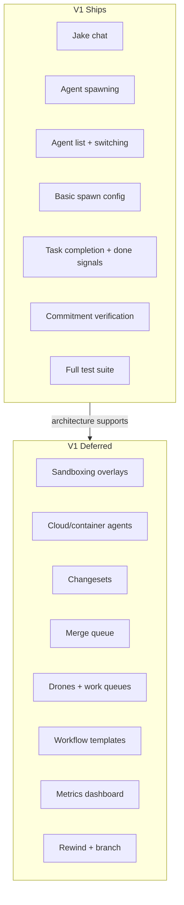
```mermaid
flowchart TD
    subgraph V1 ["V1 Ships"]
        Jake[Jake chat]
        Spawn[Agent spawning]
        List[Agent list + switching]
        Config[Basic spawn config]
        Done[Task completion + done signals]
        Verify[Commitment verification]
        Tests[Full test suite]
    end

    subgraph Deferred ["V1 Deferred"]
        Sandbox[Sandboxing overlays]
        Cloud[Cloud/container agents]
        CS[Changesets]
        MQ[Merge queue]
        Drones[Drones + work queues]
        WF[Workflow templates]
        Dash[Metrics dashboard]
        Rewind[Rewind + branch]
    end

    V1 -->|"architecture supports"| Deferred
```

## 4. Example: V1 End-to-End Flow

This illustrates what the v1 experience looks like in action — user talks to Jake, Jake delegates, verification closes the loop.

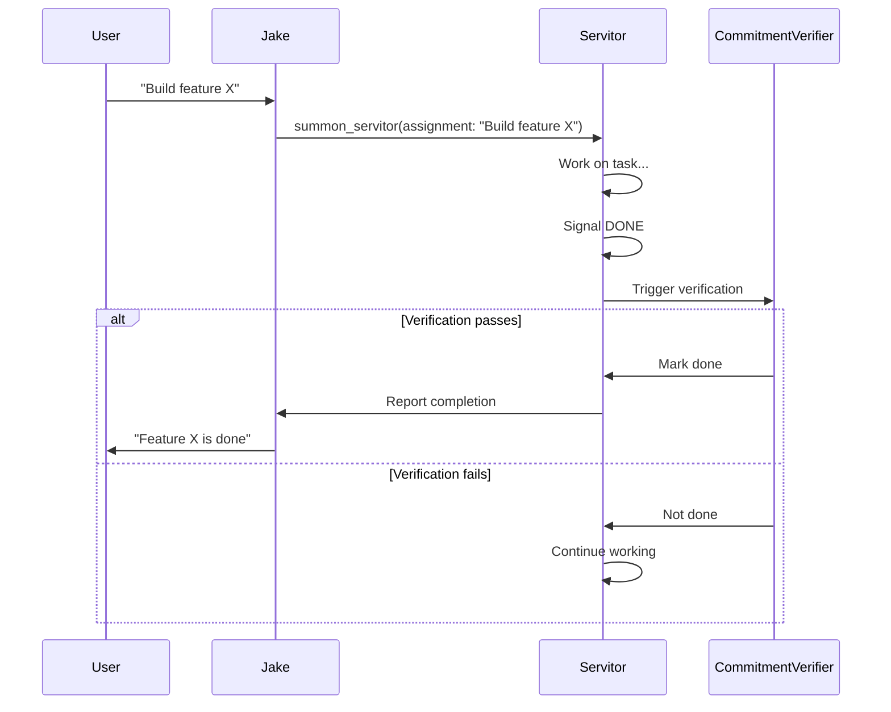
```mermaid
sequenceDiagram
    participant User
    participant Jake
    participant Servitor
    participant CV as CommitmentVerifier

    User->>Jake: "Build feature X"
    Jake->>Servitor: summon_servitor(assignment: "Build feature X")
    Servitor->>Servitor: Work on task...
    Servitor->>Servitor: Signal DONE
    Servitor->>CV: Trigger verification

    alt Verification passes
        CV->>Servitor: Mark done
        Servitor->>Jake: Report completion
        Jake->>User: "Feature X is done"
    else Verification fails
        CV->>Servitor: Not done
        Servitor->>Servitor: Continue working
    end
```

## 5. Open Questions

- **V1 changeset workaround:** With changesets deferred, how does v1 protect original files? PRD says "agents work on actual files for now." Is there any intermediate protection (e.g., git stash, branch per agent)?

- **Multi-project scope in v1:** Is multi-project support a v1 requirement? It is implemented but not listed in the PRD's v1 must-have list.

## 6. Coverage Gaps

- **Ship criteria formalization:** "User spends more time directing than waiting" is qualitative. No quantitative threshold is specified for when this criterion is met.

- **v1 feature freeze definition:** No specification for when v1 is "feature complete" vs "ready to ship." The gap between "features work" and "product is polished" is not addressed.

---

# §018 — Spec Fidelity

**Status:** complete
**Last Updated:** 2026-02-14

## Upstream References
- PRD: §19.4 (Completeness and Correctness Standards)
- PRD: §2 (Invariants — specifically Invariant #3: Commitments must be verified independently)
- Reader: §8 (Commitment Verification)

## Downstream References
- ADR: ADR-007 (Provenance Tracking)
- Code: `// MARK: - Provenance:` comments in Tavern/Sources/
- Tests: `.tags()` with requirement-derived tags in Tavern/Tests/

---

## 1. Overview

This module specifies the provenance tracking system that makes completeness and correctness verifiable questions rather than guesses. Every requirement traces forward to code and tests; every piece of code traces backward to the requirement it satisfies. The self-verification principle applies: the development process is held to the same standard as the system's agents (Invariant #3).

## 2. Requirements

### REQ-FID-001: Completeness Verification
**Source:** PRD §19.4
**Priority:** must-have
**Status:** specified

**Properties:**
- Every specified requirement must be verifiably implemented — no silent gaps
- Tooling can compute a completeness report: which requirements have implementations, which do not
- The development process is held to the same verification standard as the system's agents (Invariant #3)

**Testable assertion:** Running a provenance scan produces a list of all specified requirements and their implementation status. Requirements without implementations are flagged.

**See also:** REQ-INV-003 (Commitments must be verified independently)

### REQ-FID-002: Code Provenance Comments
**Source:** PRD §19.4
**Priority:** must-have
**Status:** specified

**Properties:**
- Every Swift source file implementing a specified requirement includes a `// MARK: - Provenance: REQ-PREFIX-NNN` comment
- File-level provenance appears after imports, before the first declaration
- Function-level provenance appears immediately before the function it annotates
- Multiple requirement references are comma-separated on a single MARK line

**Testable assertion:** A grep for `// MARK: - Provenance:` in source files returns all files with provenance annotations. Each annotation contains valid requirement IDs matching the `REQ-[A-Z]+-[0-9]{3}` pattern.

### REQ-FID-003: Test Provenance Tags
**Source:** PRD §19.4
**Priority:** must-have
**Status:** specified

**Properties:**
- Tests covering specified requirements use Swift Testing `.tags()` with requirement-derived tags
- Tags are defined in a `Tags.swift` extension file per test target
- Tag naming convention: `REQ-AGT-001` becomes `.reqAGT001` (camelCase, no hyphens)
- Each tagged test also has a `// MARK: - Provenance: REQ-PREFIX-NNN` comment for discoverability

**Testable assertion:** Running `swift test --filter` with a requirement-derived tag executes all tests covering that requirement. Every test with a provenance MARK comment has a corresponding `.tags()` entry.

### REQ-FID-004: Bidirectional Reference
**Source:** PRD §19.4
**Priority:** must-have
**Status:** specified

**Properties:**
- Backward traceability (code → spec): MARK comments in source files link to requirement IDs
- Forward traceability (spec → code): computed by grep-based tooling, never manually maintained
- Spec modules maintain directory-level Downstream References as a low-churn guide to where implementations live

**Testable assertion:** Given a requirement ID, tooling can locate all source files and test files referencing it (forward trace). Given a source file with a provenance comment, the referenced requirement ID resolves to a valid entry in a spec module (backward trace).

### REQ-FID-005: Status Derivation
**Source:** PRD §19.4
**Priority:** must-have
**Status:** specified

**Properties:**
- Requirement status progresses: `specified → implemented → tested → verified`
- Status is computed from provenance scans, not manually set
- `specified`: requirement exists in a spec module
- `implemented`: at least one source file has a provenance comment referencing the requirement
- `tested`: at least one test has a provenance tag referencing the requirement
- `verified`: all tests for the requirement pass

**Testable assertion:** A status derivation tool reports the correct status for requirements at each stage. Adding a provenance comment to a source file advances the requirement from `specified` to `implemented`. Adding a tagged test advances it to `tested`.

### REQ-FID-006: Coverage Verification
**Source:** PRD §19.4
**Priority:** must-have
**Status:** specified

**Properties:**
- Orphaned provenance is flagged: code references a requirement ID that does not exist in any spec module
- Unimplemented requirements are reported: spec requirements with no matching provenance comments in code
- Untested implementations are reported: requirements with code provenance but no test provenance

**Testable assertion:** Introducing a provenance comment with a nonexistent requirement ID produces an orphan warning. Removing all provenance comments for a requirement causes it to appear in the unimplemented report.

### REQ-FID-007: Comment Format Specification
**Source:** PRD §19.4
**Priority:** must-have
**Status:** specified

**Properties:**
- Canonical regex: `// MARK: - Provenance: (REQ-[A-Z]+-[0-9]{3})(, REQ-[A-Z]+-[0-9]{3})*`
- MARK prefix integrates with Xcode's source navigator jump bar
- Comma-separated references for files implementing multiple requirements
- No trailing punctuation, no additional text after the requirement list

**Testable assertion:** All provenance comments in the codebase match the canonical regex. A linting tool rejects comments that deviate from the format.

## 3. Behavior

### Provenance Workflow

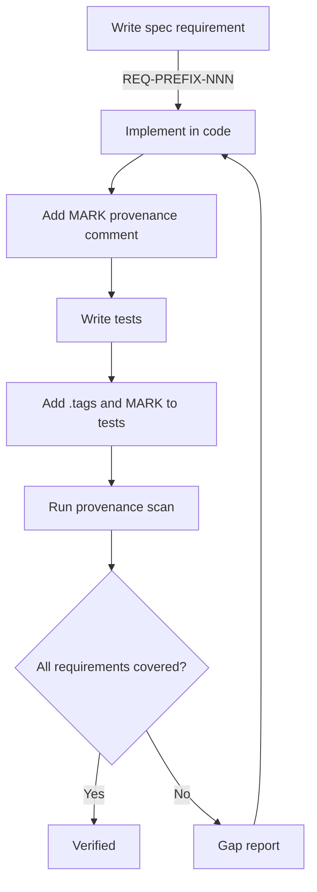
```mermaid
flowchart TD
    A[Write spec requirement] -->|REQ-PREFIX-NNN| B[Implement in code]
    B --> C[Add MARK provenance comment]
    C --> D[Write tests]
    D --> E[Add .tags and MARK to tests]
    E --> F[Run provenance scan]
    F --> G{All requirements covered?}
    G -->|Yes| H[Verified]
    G -->|No| I[Gap report]
    I --> B
```

### Backfill Strategy

Provenance is added incrementally — when touching a file, add provenance for the requirements it implements. No big-bang backfill required.

## 4. Open Questions

None — the format and workflow are fully specified. Tooling implementation details are deferred to the respective tooling beads (spec-status, trace, audit-spec).

---

# §019 — Servitor States & Modes

**Status:** complete
**Last Updated:** 2026-02-16

## Upstream References
- PRD: §4.2 (Agent States), §4.4 (Servitor Lifecycle), §5.2 (Execution Modes)
- Reader: §3 (Core Concepts — agent states), §5 (Architecture Notes)
- Transcripts: transcript_2026-01-19-1144.md (agent states, task modes)

## Downstream References
- Code: Tavern/Sources/TavernCore/Agents/ (Servitor.swift, Jake.swift)
- Tests: Tavern/Tests/TavernCoreTests/, Tavern/Tests/TavernTests/

> **Note:** This module is the canonical source for servitor state machine and mode definitions. The state/mode sections in §004, §006, and §007 are deprecated in favor of this module.

---

## 1. Overview
Consolidates all servitor state machine and mode content into one canonical reference. Defines the state machine (Summoned through GC), three orthogonal boolean properties (backgrounding, perseverance, user presence), and their interaction rules with the state machine.

## 2. Requirements

### REQ-STM-001: Canonical State Machine
**Source:** PRD §4.2, §4.4
**Priority:** must-have
**Status:** specified

**Properties:**
- Servitor states: Summoned → Working → Waiting (WaitingForInput, WaitingForWakeup) → Verifying → Done / FailedReaped / DismissedReaped → GC
- Summoned is the initial state upon creation
- FailedReaped = error termination (unrecoverable failure, timeout, or forced reap)
- DismissedReaped = successful completion and formal dismissal by parent or self
- Both "Reaped" states transition to GC (dropped from runtime memory, persisted to disk)
- State transitions are logged at `.debug` level only
- Only valid transitions are permitted; invalid transitions produce an error

**Testable assertion:** A newly created servitor starts in Summoned state. Only valid transitions are accepted; invalid transitions produce an error. FailedReaped and DismissedReaped both transition to GC. All transitions are logged at debug level.

### REQ-STM-002: Three Orthogonal Boolean Properties
**Source:** PRD §4.4, §5.2
**Priority:** must-have
**Status:** specified

**Properties:**
- Three independent boolean properties govern servitor behavior: backgrounding, perseverance, user presence
- These three properties are orthogonal — they can combine in any permutation (2³ = 8 combinations)
- Each property is independently set and queried
- Properties are set at spawn time and may be modified during the servitor's lifetime (except where noted per-property)

**Testable assertion:** All 8 combinations of the three boolean properties are valid. Each property can be set and queried independently.

### REQ-STM-003: Backgrounding Property
**Source:** PRD §4.4
**Priority:** must-have
**Status:** specified

**Properties:**
- Background servitors do not get their own first-class chat window
- Background servitors are displayed as resources associated with their parent servitor (UX details TBD)
- Jake-spawned servitors may or may not be backgrounded (configurable at spawn time)
- User-spawned servitors are never backgrounded (they always get a chat window)

**Testable assertion:** A backgrounded servitor does not appear as a chat window target. A non-backgrounded servitor gets its own chat window. User-spawned servitors are never backgrounded.

### REQ-STM-004: Perseverance Property
**Source:** PRD §5.2
**Priority:** must-have
**Status:** specified

**Properties:**
- A persevering servitor operates in an infinite loop — only Done (after commitment verification) exits the loop
- If a persevering servitor issues any wait command, it receives a system response telling it to persevere and continue working
- The servitor is informed of its perseverance obligation both in its initial system prompt and at every incident where it attempts to wait
- Perseverance prevents the WaitingForWakeup state — the servitor is prodded back to Working immediately

**Testable assertion:** A persevering servitor that attempts to wait receives a perseverance prod and returns to Working. Only Done (verified) exits a persevering servitor. The system prompt for persevering servitors includes the perseverance obligation.

### REQ-STM-005: User Presence Property
**Source:** PRD §4.4
**Priority:** must-have
**Status:** specified

**Properties:**
- Users can "join" and "leave" servitor sessions
- The servitor receives deterministic system messages when a user joins or leaves
- The servitor may alter its behavior based on user presence (e.g., communication style, verbosity, interaction with other agents)
- User presence is a notification — the servitor is informed, not controlled

**Testable assertion:** When a user joins, the servitor receives a deterministic "user joined" system message. When a user leaves, the servitor receives a "user left" system message. These messages are delivered reliably.

### REQ-STM-006: Configurable Inactivity Timeout
**Source:** PRD §4.2
**Priority:** must-have
**Status:** specified

**Properties:**
- If a servitor pauses without issuing a wait or done signal for a configurable duration, it is either prodded to respond or reaped
- The timeout duration is adjustable per-servitor
- The action on timeout (prod vs. reap) is configurable
- Timeout applies in Working state only — waiting states have their own timeout rules

**Testable assertion:** A servitor that is inactive for longer than its configured timeout receives either a prod or is reaped, per configuration. The timeout is adjustable per-servitor.

### REQ-STM-007: State-Mode Interaction Rules
**Source:** PRD §4.2, §4.4, §5.2
**Priority:** must-have
**Status:** working-draft

**Properties:**
- Perseverance + WaitingForWakeup: Persevering servitors cannot enter WaitingForWakeup — they are prodded back to Working immediately
- Perseverance + WaitingForInput: Persevering servitors CAN enter WaitingForInput (they need human answers to continue)
- Backgrounding + User Presence: Background servitors can still have user presence toggled (user may observe/interact through parent's resource view)
- Perseverance + Backgrounding: Valid combination — a background servitor that must keep working until done
- All three enabled: Valid — a background, persevering servitor with user presence tracking

> **Note:** This requirement is a working draft. The user will iterate on these interaction rules after seeing everything together.

**Testable assertion:** A persevering servitor cannot enter WaitingForWakeup. A persevering servitor can enter WaitingForInput. All 8 boolean property combinations produce valid, well-defined behavior.

## 3. Properties Summary

### Canonical State Machine

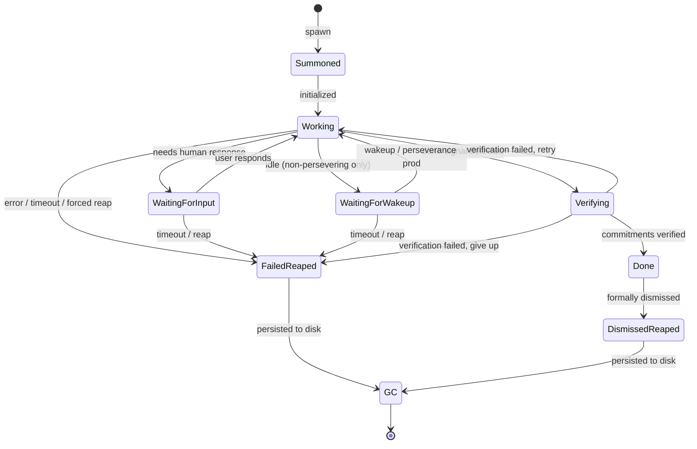
```mermaid
stateDiagram-v2
    [*] --> Summoned : spawn
    Summoned --> Working : initialized
    Working --> WaitingForInput : needs human response
    Working --> WaitingForWakeup : idle (non-persevering only)
    Working --> Verifying : done signal detected
    Working --> FailedReaped : error / timeout / forced reap
    WaitingForInput --> Working : user responds
    WaitingForInput --> FailedReaped : timeout / reap
    WaitingForWakeup --> Working : wakeup / perseverance prod
    WaitingForWakeup --> FailedReaped : timeout / reap
    Verifying --> Done : commitments verified
    Verifying --> Working : verification failed, retry
    Verifying --> FailedReaped : verification failed, give up
    Done --> DismissedReaped : formally dismissed
    FailedReaped --> GC : persisted to disk
    DismissedReaped --> GC : persisted to disk
    GC --> [*]
```

### Three Orthogonal Boolean Properties

| Property | Default | Effect When True | Effect When False |
|----------|---------|-----------------|-------------------|
| Backgrounding | false | No chat window, displayed as parent resource | Gets own chat window |
| Perseverance | false | Infinite loop, no idle allowed | Can enter WaitingForWakeup |
| User Presence | false | User has joined the session | User has not joined / has left |

### State-Mode Interaction Matrix (Working Draft)

| State | Backgrounded | Persevering | User Present |
|-------|-------------|-------------|--------------|
| Summoned | No effect | No effect | No effect |
| Working | No chat window | Must keep working | May alter communication style |
| WaitingForInput | No chat window (input via parent) | Allowed | Affects prompt style |
| WaitingForWakeup | No chat window | **Blocked** — prodded back | No effect |
| Verifying | No effect | No effect | No effect |
| Done | No effect | Required to reach here | No effect |

## 4. Open Questions

- **UX for background servitors:** How exactly are background servitors displayed as resources of their parent? What interaction is available?

- **Perseverance prod content:** What are the exact contents of the perseverance prod message? Is it customizable per-spawn?

- **User presence behavioral expectations:** Beyond notification, are there any mandatory behavioral changes when user presence changes? Or is it purely advisory?

- **Inactivity timeout defaults:** What are sensible default timeout values? Should there be a system-wide default that per-servitor values override?

## 5. Coverage Gaps

- **State persistence across app restart:** The state machine defines runtime states, but which states survive app restart? Presumably Summoned through Working can be restored, but Verifying may need special handling.

- **Concurrent state transitions:** What happens if multiple signals arrive simultaneously (e.g., done signal and timeout fire at the same time)? Priority/ordering rules are not specified.

- **Mode changes after spawn:** Can backgrounding and perseverance be changed after initial spawn, or are they immutable? The spec says "may be modified" but specific rules are TBD.

---

# §020 — Servitor Trees

**Status:** complete
**Last Updated:** 2026-02-16

## Upstream References
- PRD: §12 (Agent Hierarchies)
- Reader: §3 (Core Concepts — tree structures), §5 (Architecture Notes)
- Transcripts: transcript_2026-01-19-1144.md (Erlang-style hierarchies)

## Downstream References
- Code: Tavern/Sources/TavernCore/Agents/ (Servitor.swift, ServitorSpawner.swift, Jake.swift)
- Tests: Tavern/Tests/TavernCoreTests/, Tavern/Tests/TavernTests/

---

## 1. Overview
Defines the tree structure of servitors: parent-child relationships, how operating modes (backgrounding, perseverance, user presence) interact with tree depth, failure boundaries and supervision strategies (Erlang-style), gang termination, token budget inheritance, and cross-tree communication.

## 2. Requirements

### REQ-TRE-001: Tree Structure
**Source:** PRD §12
**Priority:** must-have
**Status:** specified

**Properties:**
- Servitors form trees of arbitrary depth
- Jake is the root of all servitor trees — every servitor has an ancestor chain that terminates at Jake
- Parent-child relationships are tracked and queryable
- A servitor may spawn zero or more children
- Tree structure is persisted and survives app restart

**Testable assertion:** A servitor spawned by Jake has Jake as its parent. A servitor spawned by another servitor has that servitor as its parent. The full ancestor chain is queryable. Tree structure persists across app restart.

### REQ-TRE-002: Operating Modes at Tree Positions
**Source:** PRD §12
**Priority:** must-have
**Status:** specified

**Properties:**
- Backgrounding, perseverance, and user presence (§019) apply at every tree position
- A parent can spawn children with different mode combinations than itself
- Mode values are set per-servitor, not inherited from parent by default
- The spawning parent specifies the child's initial mode values at spawn time

**Testable assertion:** A non-backgrounded parent can spawn a backgrounded child. A persevering parent can spawn a non-persevering child. Mode values are independently configured per-servitor regardless of tree position.

### REQ-TRE-003: Failure Boundaries
**Source:** PRD §12
**Priority:** must-have
**Status:** specified

**Properties:**
- Failure boundaries are properties over subtrees that determine rules on node failure
- Three supervision strategies are supported:
  - **Restart-one:** Replace the single failed worker. Other siblings continue unaffected. The failed servitor's artifacts are preserved for debugging.
  - **Restart-all:** Gang invalidation — terminate and restart the entire sibling group. Used when siblings have interdependent state that becomes inconsistent if one fails.
  - **Revert-to-pre-existence:** Catastrophic failure — revert as much as possible to the state before the failed subtree existed. Changeset drafts and artifacts are preserved for debugging but operational state is rolled back.
- The supervision strategy is set on the parent and applies to its direct children
- Default strategy is restart-one

**Testable assertion:** When a child fails under restart-one, only that child is replaced; siblings continue. Under restart-all, all siblings are terminated and restarted. Under revert-to-pre-existence, the subtree's operational state is rolled back. Artifacts are preserved in all cases.

### REQ-TRE-004: Gang Termination via Capability
**Source:** PRD §12
**Priority:** must-have
**Status:** specified

**Properties:**
- Agents may control gang termination through capabilities (see §021)
- Gang termination terminates all members of a sibling group simultaneously
- Artifacts in changeset drafts are preserved for debugging — gang termination does not destroy work products
- The capability to trigger gang termination must be explicitly granted

**Testable assertion:** An agent with gang termination capability can terminate all siblings. An agent without the capability cannot. Changeset drafts are preserved after gang termination.

### REQ-TRE-005: Token Budget Inheritance
**Source:** PRD §12
**Priority:** must-have
**Status:** specified

**Properties:**
- Token budgets are delegated through the tree from parent to child
- A child cannot exceed its parent's remaining budget
- When a parent delegates budget to a child, the parent's available budget decreases by that amount
- Agents receive periodic updates about their remaining budget
- Budget exhaustion triggers a warning, then a forced transition to Verifying or FailedReaped

**Testable assertion:** A child's budget does not exceed its parent's remaining budget. Delegating budget to a child reduces the parent's available budget. Budget exhaustion triggers appropriate state transitions. Agents receive periodic budget updates.

### REQ-TRE-006: Cross-Tree Communication
**Source:** PRD §12
**Priority:** must-have
**Status:** specified

**Properties:**
- Cross-tree communication is capability-gated (see §021)
- A servitor may communicate with servitors in other trees only if granted the lateral communication capability
- Communication scope is defined at grant time: siblings (same parent), cousins (same grandparent), or broader
- Without the capability, a servitor can only communicate up (to parent) and down (to children)

**Testable assertion:** A servitor without lateral communication capability cannot send messages to servitors outside its direct ancestor/descendant chain. A servitor with lateral communication capability can communicate with the specified scope. Default communication is up and down only.

## 3. Properties Summary

### Tree Structure

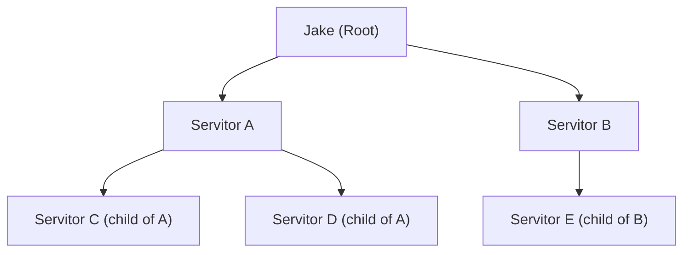
```mermaid
graph TD
    Jake["Jake (Root)"]
    S1["Servitor A"]
    S2["Servitor B"]
    S3["Servitor C (child of A)"]
    S4["Servitor D (child of A)"]
    S5["Servitor E (child of B)"]

    Jake --> S1
    Jake --> S2
    S1 --> S3
    S1 --> S4
    S2 --> S5
```

### Supervision Strategies

| Strategy | Scope | Effect | Artifact Preservation |
|----------|-------|--------|----------------------|
| Restart-one | Single failed child | Replace failed worker only | Yes |
| Restart-all | All siblings of failed child | Terminate and restart entire group | Yes |
| Revert-to-pre-existence | Entire subtree | Roll back to pre-existence state | Yes (for debugging) |

### Communication Scope

| Direction | Default | Requires Capability |
|-----------|---------|-------------------|
| Up (to parent) | Allowed | No |
| Down (to children) | Allowed | No |
| Lateral (siblings) | Blocked | Yes (lateral communication) |
| Cross-tree (cousins+) | Blocked | Yes (lateral communication, broader scope) |

## 4. Open Questions

- **Budget delegation granularity:** Are token budgets delegated as fixed amounts or as percentages of the parent's remaining budget? Can budgets be reclaimed from children?

- **Restart-all state synchronization:** When restarting all siblings, how is the shared state they depend on reconstructed? Do restarted siblings get context about why they were restarted?

- **Revert-to-pre-existence scope:** How much state can realistically be rolled back? File system changes? Doc store mutations? What are the boundaries of "as much as possible"?

- **Tree depth limits:** Is there a maximum tree depth? What prevents runaway recursive spawning?

## 5. Coverage Gaps

- **Orphan handling:** What happens to children when their parent is reaped? Are they adopted by the grandparent, or reaped as well?

- **Tree visualization:** No specification for how the tree structure is displayed to the user in the UI.

- **Concurrent spawning limits:** No per-parent limit on how many children can be spawned simultaneously.

---

# §021 — Capability Delegation

**Status:** complete
**Last Updated:** 2026-02-16

## Upstream References
- PRD: §4.1 (Agent Types — partial capability mention)
- Reader: §3 (Core Concepts), §5 (Architecture Notes)
- Transcripts: transcript_2026-01-19-1144.md (capability concepts)

## Downstream References
- Code: Tavern/Sources/TavernCore/Agents/, Tavern/Sources/TavernCore/MCP/
- Tests: Tavern/Tests/TavernCoreTests/, Tavern/Tests/TavernTests/

> **Note:** PRD backfill needed. This spec was written first; a corresponding PRD section should be added to PRD v1.2. See Open Questions.

---

## 1. Overview
Defines the capability system: how capabilities are separated from the summon flow, delegated from parent to child, enforced by the deterministic shell, and how agents are prevented from modifying their own capabilities. Covers capability types, delegation chains, and the handle-based flow.

## 2. Requirements

### REQ-CAP-001: Separation from Summon
**Source:** PRD §4.1 (partial)
**Priority:** must-have
**Status:** specified

**Properties:**
- The summon operation is asynchronous and returns a promise ID (handle) for the spawned servitor
- Capability delegation is a separate operation that uses the handle/ID to send capabilities to the spawned agent
- This separation allows the spawner to prepare capabilities after the spawn is initiated but before the agent begins work
- The spawned agent's main actor receives the capability handle and waits for session notification before proceeding

**Testable assertion:** Summon returns a promise ID. A separate delegate command sends capabilities using that ID. The spawned agent does not begin work until capabilities are received.

### REQ-CAP-002: Capability Handle Flow
**Source:** PRD §4.1 (partial)
**Priority:** must-have
**Status:** specified

**Properties:**
- The main actor of the spawned agent receives the capability handle from the spawning system
- The agent waits for a session notification that capabilities have been received and can be invoked
- Until capabilities are received, the agent remains in Summoned state (§019 REQ-STM-001)
- The capability handle is opaque to the agent — it cannot inspect or modify the handle itself

**Testable assertion:** A spawned agent remains in Summoned state until capabilities are received. After receiving capabilities, the agent transitions to Working. The agent cannot inspect or modify its capability handle.

### REQ-CAP-003: Capability Types
**Source:** PRD §4.1 (partial)
**Priority:** must-have
**Status:** specified

**Properties:**
- Defined capability types:
  - **Filesystem access:** Read/write access to specified paths
  - **Network access:** Ability to make network requests (scope TBD)
  - **Tool access:** Access to specific MCP tools or tool categories
  - **Lateral communication:** Ability to communicate across trees (scope: siblings, cousins, or broader — see §020 REQ-TRE-006)
- Capability types are extensible — new types can be added as the system evolves
- Servitors receive capability grants only if the parent explicitly includes them in the summon-with-assignment flow

**Testable assertion:** Each capability type can be independently granted or withheld. A servitor without filesystem access cannot perform file operations. A servitor without lateral communication cannot message across trees. Capabilities are only received if explicitly granted by parent.

### REQ-CAP-004: Delegation Chains
**Source:** PRD §4.1 (partial)
**Priority:** must-have
**Status:** specified

**Properties:**
- A parent cannot delegate capabilities it does not have
- Capabilities flow downward only — from parent to child, never upward or laterally
- Jake's capabilities represent the ceiling for any servitor tree
- A child's capabilities are always a subset of (or equal to) its parent's capabilities
- Delegation is transitive: if A delegates to B and B delegates to C, C's capabilities are bounded by B's (which are bounded by A's)

**Testable assertion:** Attempting to delegate a capability the parent does not have produces an error. A child's capabilities never exceed its parent's. Jake's capabilities are the upper bound for all servitors.

### REQ-CAP-005: Deterministic Shell Enforcement
**Source:** PRD §4.1 (partial)
**Priority:** must-have
**Status:** specified

**Properties:**
- Capabilities are enforced by the deterministic shell, not by the agent's own prompt or self-discipline
- Even if a parent composes a prompt to a child that suggests broader capabilities, the system enforces the actual capability boundaries
- Capability violations are logged and reported to the parent
- The deterministic shell is the single enforcement point — no other layer can override it

**Testable assertion:** An agent that attempts an action outside its capabilities is blocked by the deterministic shell. Capability violations are logged. Prompt content cannot override capability boundaries.

### REQ-CAP-006: Agents Cannot Modify Own Capabilities
**Source:** PRD §4.1 (partial), Non-Negotiable Invariant #6
**Priority:** must-have
**Status:** specified

**Properties:**
- Agents cannot modify their own capabilities or boundaries
- Attempting to modify own capabilities is a violation, logged and reported
- This applies to all agent types including Jake (Jake's capabilities are set by the system)
- Capability modification is only possible by the parent that granted the capabilities, or by the system itself

**Testable assertion:** An agent that attempts to modify its own capabilities is blocked. The violation is logged and reported. Only the granting parent or the system can modify an agent's capabilities.

## 3. Properties Summary

### Capability Flow

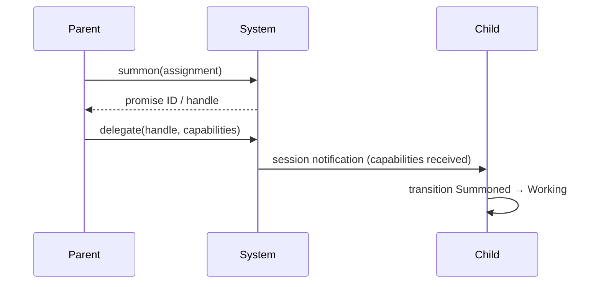
```mermaid
sequenceDiagram
    participant Parent
    participant System
    participant Child

    Parent->>System: summon(assignment)
    System-->>Parent: promise ID / handle
    Parent->>System: delegate(handle, capabilities)
    System->>Child: session notification (capabilities received)
    Child->>Child: transition Summoned → Working
```

### Capability Types

| Type | Scope | Default |
|------|-------|---------|
| Filesystem access | Specified paths | None |
| Network access | TBD | None |
| Tool access | Specific tools/categories | None |
| Lateral communication | Siblings / cousins / broader | None |

### Delegation Rules

| Rule | Description |
|------|-------------|
| Downward only | Capabilities flow parent → child, never upward |
| Subset constraint | Child ≤ parent ≤ ... ≤ Jake |
| No self-modification | Agents cannot modify own capabilities |
| Shell enforcement | Deterministic shell is the single enforcement point |

## 4. Open Questions

- **PRD backfill:** This module was specified ahead of the PRD. A corresponding section needs to be added to PRD v1.2 to maintain pipeline traceability.

- **Network access scoping:** What does "network access" mean in practice? Domain allowlists? Port restrictions? Protocol-level controls?

- **Capability revocation:** Can a parent revoke capabilities from a running child? What happens to in-flight operations that depend on a revoked capability?

- **Jake's capability source:** Where are Jake's capabilities defined? System configuration? Per-project settings? Hardcoded?

- **Tool access granularity:** Is tool access per-individual-tool or per-category? Can a servitor have access to `summon_servitor` but not `dismiss_servitor`?

## 5. Coverage Gaps

- **Capability persistence:** Are capabilities persisted with the servitor's state across app restart, or must they be re-delegated?

- **Audit trail:** No specification for a capability audit log (who granted what to whom, when).

- **Emergency override:** No mechanism for emergency capability escalation (e.g., a servitor discovers it needs filesystem access mid-task).

---

# §022 — Chat Discussions & Sessions

**Status:** complete
**Last Updated:** 2026-02-16

## Upstream References
- PRD: §4.5 (Chat & Session Management — partial)
- Reader: §3 (Core Concepts — sessions), §5 (Architecture Notes)
- Transcripts: transcript_2026-01-19-1144.md (session persistence)

## Downstream References
- Code: Tavern/Sources/TavernCore/Chat/, Tavern/Sources/TavernCore/Persistence/
- Tests: Tavern/Tests/TavernCoreTests/, Tavern/Tests/TavernTests/

---

## 1. Overview
Separates the user-visible chat discussion from the underlying Claude sessions. A chat discussion provides a contiguous conversational experience for the user, while multiple Claude sessions may exist beneath it due to session expiry, recreation, or other lifecycle events. Session boundaries are invisible to the user in normal usage.

## 2. Requirements

### REQ-CDS-001: Chat Discussion
**Source:** PRD §4.5 (partial)
**Priority:** must-have
**Status:** specified

**Properties:**
- A chat discussion is the user-visible conversation associated with a servitor
- Each servitor has exactly one chat discussion for its lifetime
- The discussion persists for the servitor's entire lifecycle (Summoned through DismissedReaped)
- The discussion provides a contiguous experience — the user sees one unbroken conversation
- Discussion history is persisted to disk and survives app restart

**Testable assertion:** Each servitor has exactly one chat discussion. The discussion persists from spawn to dismissal. Discussion history survives app restart.

### REQ-CDS-002: Underlying Sessions
**Source:** PRD §4.5 (partial)
**Priority:** must-have
**Status:** specified

**Properties:**
- A single chat discussion may be backed by multiple Claude sessions over its lifetime
- Sessions can expire (server-side timeout), be invalidated (error), or be replaced (context limits)
- The mapping from discussion to sessions is one-to-many
- Session transitions within a discussion are tracked and logged

**Testable assertion:** A chat discussion can survive the expiry of its underlying session. Multiple sessions can back a single discussion over time. Session transitions are logged.

### REQ-CDS-003: Session Resumption
**Source:** PRD §4.5 (partial)
**Priority:** must-have
**Status:** specified

**Properties:**
- When a resumable session exists (server-side state is still valid), the system continues it
- Session resumption is attempted first before creating a new session
- Resumption preserves the full server-side conversation context
- Failed resumption attempts fall through to session recreation (REQ-CDS-004)

**Testable assertion:** When a valid session exists, the system resumes it rather than creating a new one. Resumption preserves server-side context. Failed resumption triggers recreation.

### REQ-CDS-004: Session Recreation
**Source:** PRD §4.5 (partial)
**Priority:** must-have
**Status:** specified

**Properties:**
- When no resumable session exists, the system creates a new one
- The new session receives a system prompt that includes context from the prior discussion
- The system prompt summarizes the discussion state: what was accomplished, what was in progress, relevant context
- The user is not required to re-explain prior context after a session recreation

**Testable assertion:** When no resumable session exists, a new session is created. The new session's system prompt includes prior discussion context. The user does not need to re-explain context.

### REQ-CDS-005: Contiguous Experience
**Source:** PRD §4.5 (partial)
**Priority:** must-have
**Status:** specified

**Properties:**
- The app provides a contiguous chat experience regardless of underlying session changes
- Session boundaries are invisible to the user in normal usage
- Message history from all sessions within a discussion is displayed as one continuous conversation
- Optionally, a subtle indicator may show when a session boundary occurred (for debugging/advanced users), but this is not the default

**Testable assertion:** Message history from multiple sessions is displayed as one continuous conversation. Session boundaries are not visible to the user by default. The user experience is contiguous across session changes.

## 3. Properties Summary

### Discussion-Session Relationship

```mermaid
graph TD
    D["Chat Discussion (user-visible)"]
    S1["Session 1 (expired)"]
    S2["Session 2 (expired)"]
    S3["Session 3 (active)"]

    D --> S1
    D --> S2
    D --> S3
```

### Session Lifecycle

```mermaid
stateDiagram-v2
    [*] --> AttemptResume : discussion needs session
    AttemptResume --> Resumed : valid session exists
    AttemptResume --> CreateNew : no valid session
    Resumed --> Active
    CreateNew --> Active : system prompt with prior context
    Active --> Expired : server-side timeout
    Active --> Invalidated : error
    Active --> Replaced : context limits
    Expired --> AttemptResume : next message
    Invalidated --> AttemptResume : next message
    Replaced --> AttemptResume : next message
```

### Key Properties

| Property | Discussion | Session |
|----------|-----------|---------|
| Visibility | User-facing | Internal |
| Cardinality per servitor | Exactly one | One-to-many |
| Persistence | Disk (survives restart) | Server-side + local JSONL |
| Lifetime | Servitor lifecycle | Variable (may expire) |

## 4. Open Questions

- **Context summarization strategy:** How is prior discussion context summarized for a new session's system prompt? Full history replay? LLM-generated summary? Structured extraction?

- **Session boundary indicators:** Should advanced users have an option to see session boundaries in the chat? If so, what does the indicator look like?

- **Message deduplication:** If a message was sent at the end of session N and the context is replayed in session N+1's system prompt, how is duplication avoided in the user-visible history?

- **Maximum sessions per discussion:** Is there a practical limit on how many sessions can back a single discussion?

## 5. Coverage Gaps

- **Offline behavior:** What happens when a new session cannot be created (network unavailable)? Is the discussion frozen? Can the user still view history?

- **Session metadata display:** No specification for surfacing session health information (e.g., "session nearing context limit") to the user or to Jake.

- **Cross-discussion context:** Can context from one servitor's discussion be shared with another servitor's session? (Relates to §021 capability delegation.)

---

# §023 — Keyboard Shortcuts

**Status:** stub
**Last Updated:** 2026-02-16

## Upstream References
- PRD: (TBD — needs PRD section)

## Downstream References
- Code: Tavern/Sources/Tavern/ (views)
- Tests: Tavern/Tests/TavernUITests/

---

## 1. Overview
STUB — Needs design. Placeholder requirements structure only.

Keyboard shortcuts for the Tavern application. Requirements will be defined during design breakdown.

## 2. Requirements

Requirements will be defined during design. REQ-KEY prefix reserved.

## 3. Properties Summary

(To be defined during design.)

## 4. Open Questions

(To be defined during design.)

## 5. Coverage Gaps

(To be defined during design.)

---

# §024 — Accessibility

**Status:** stub
**Last Updated:** 2026-02-16

## Upstream References
- PRD: (TBD — needs PRD section)

## Downstream References
- Code: Tavern/Sources/Tavern/ (views)
- Tests: Tavern/Tests/TavernUITests/

---

## 1. Overview
STUB — Needs design. Placeholder requirements structure only.

Accessibility requirements for the Tavern application (VoiceOver, keyboard navigation, dynamic type, color contrast, etc.). Requirements will be defined during design breakdown.

## 2. Requirements

Requirements will be defined during design. REQ-ACC prefix reserved.

## 3. Properties Summary

(To be defined during design.)

## 4. Open Questions

(To be defined during design.)

## 5. Coverage Gaps

(To be defined during design.)

---

# §025 — Search

**Status:** stub
**Last Updated:** 2026-02-16

## Upstream References
- PRD: (TBD — needs PRD section)

## Downstream References
- Code: Tavern/Sources/TavernCore/ (TBD)
- Tests: Tavern/Tests/TavernCoreTests/ (TBD)

---

## 1. Overview
STUB — Needs design. Placeholder requirements structure only.

Search functionality within the Tavern application (chat history search, agent search, doc store search, etc.). Requirements will be defined during design breakdown.

## 2. Requirements

Requirements will be defined during design. REQ-SRC prefix reserved.

## 3. Properties Summary

(To be defined during design.)

## 4. Open Questions

(To be defined during design.)

## 5. Coverage Gaps

(To be defined during design.)


---

<!-- Step 4 -->

# Project Status Summary

**Generated:** 2026-03-02
**Source:** Synthesis of all seed-design transcripts


## Timeline

- **2026-01-18** — Project inception: Jake's voice and character established (Spillway Principle, joke management lifecycle, name translation layer), TAP.CLAUDE.md for homebrew tap, cast of characters with diverse ethnic names, README with comedy pacing principles, git repository initialized

- **2026-01-19 09:06** — Process establishment, notation system for transcripts

- **2026-01-19 10:26** — Problem statement defined (14 pain points), open questions captured

- **2026-01-19 10:40-12:00** — Grand Idea user flow, agent hierarchy, operating modes, created 711 cogitation verbs and naming themes

- **2026-01-19 14:50** — Created `/conceive` slash command, naming rationale ("discovery" rejected as too passive, "conceive" captures generative design through dialogue)

- **2026-01-20 23:15** — XcodeGen setup, project root discovery discussion, LOC script

- **2026-01-21 08:00** — Architecture docs, SDK bug discovered (JSON array parsing), 4 design principles established

- **2026-01-21 15:00** — Handoff docs created, performance requirements added, build path moved to `~/.local/builds/tavern`

- **2026-01-21 16:20** — Instrumentation & stress testing implementation, TavernLogger, progressive unlocks concept

- **2026-01-21 21:13** — Perception-bounded performance principle defined (isolation, responsiveness over speed, perception boundaries, scale independence), stress testing requirements

- **2026-01-21 23:45** — Dynamic view architecture discussion (composable tiles, multiple windows)

- **2026-01-22 00:15** — Document-based architecture, project-as-document, storage layers defined

- **2026-01-22 07:30** — View architecture deep dive: Erlang-style arbitrary depth hierarchies, composable views, agent-participatory layouts, template vs concrete views, MainActor persistence decision

- **2026-01-22 14:30** — SDK fork with JSON fix, content blocks infrastructure, agent spawn UI, session persistence

- **2026-01-22 16:00** — Redo build system, handoff consolidation into CLAUDE.md

- **2026-01-22 17:00** — Jake's character development (politics, Jewish identity)

- **2026-01-22 21:00** — Session history rehydration, content block parsing (tool use/result)

- **2026-01-22 (session rehydration)** — Full session history rehydration implementation: path encoding bugs, content block preservation, integration tests, debug logging visibility

- **2026-01-23** — Headless debugging philosophy established: autonomous testing principle, end-to-end tests over stubs, instrumentation over observation

- **2026-01-24 (architecture exploration)** — Parallel agent spawning methodology for architecture exploration: 49 proposals across 16 shapes, synthesis report with compatibility matrix

- **2026-01-24 (shape selection)** — Architecture decision: Shared Workspace (E) + Supervisor Tree (D) + Reactive Streams (A) + Plugin (I) + Layer (C) + Sidecar (L); ADR-001 created

- **2026-01-24 (async primitives)** — Async primitive strategy: AsyncStream long-term, Combine at SDK boundary, bridge at ViewModel layer

- **2026-01-24 (window restoration)** — Multi-window architecture, per-project sessions, app icon (orange squircle JT), window restoration debugging, GUI instrumentation guide created

- **2026-01-25 01:08** — Agent registry architecture review: 1:1 relationship analysis (TavernProject → TavernCoordinator → AgentSpawner → AgentRegistry), justification for separation (name uniqueness, thread safety, type erasure, facade for multiple consumers), architecture docs found significantly outdated

- **2026-01-25** — Transcript audit methodology: parallel agent verification, one-transcript-per-agent rule, `/audit-transcripts` command created

- **2026-01-27** — Agent spawn simplification (two-mode: user vs Jake), agent persistence, session history fix for mortal agents, testing principles established (5 principles), log helper scripts, macOS 26+ platform policy

- **2026-01-28** — Jake spawn agent tool: `JakeToolHandler` protocol with `JSONActionHandler` implementation, continuation loop for tool execution feedback, wiring through `TavernCoordinator` to `ServitorSpawner`, 28 new tests (mock-based)

- **2026-02-01** — SDK migration from local ClaudeCodeSDK fork to ClodeMonster/NativeClaudeCodeSDK: static function API (`ClaudeCode.query`), `QueryOptions` replacing split config types, session storage forensics (corrupt session recovery), JSON-in-JSON issue for Jake's history display

- **2026-02-02 01:00** — SDK migration design: established that session history reading (`ClaudeNativeSessionStorage`) is Tavern-specific, not SDK functionality. Moved to TavernCore/Persistence. ClodeMonster correctly implements official SDK spec without session history. API transformation: protocol-based → namespace-based (`ClaudeCode.query()`)

- **2026-02-02** — Comprehensive transcript audit system: parallel rewind analyzer agents verify coverage across date ranges, discovered 2 missing transcripts (agent-registry-architecture Jan 25, jake-spawn-tool Jan 28), verified 30 sessions covering all existing transcripts

- **2026-02-02 16:50** — Servitor naming: MortalAgent renamed to Servitor (code), Jake calls them "The Regulars" (voice). MCP tool design (`summon_servitor`/`dismiss_servitor`) replacing JSON envelope hack. Phase 1 scope: minimal viable dispatcher (summon + dismiss only), defer message forwarding, resummon, capability distribution

- **2026-02-05** — Worktree-aware audit discovery: `list-project-dirs.sh` and `list-sessions.sh` scripts for cross-worktree session deduplication, updated `/audit-transcripts` command

- **2026-02-05/06** — Backlog mining: systematic extraction from all transcripts, PRD, session archives, code TODOs into beads issue tracker. Created epic `azu` with 40 child beads across 4 priority tiers (P1: 5, P2: 10, P3: 16, P4: 9)

- **2026-02-06** — Jake JSON response format removed: eliminated `parseJakeMessage()` and structured JSON wrapper now that MCP tools handle agent spawning natively. Jake's text responses treated same as any other agent.

- **2026-02-06** — Resource panel exploration: initial design session identifying 3 layout approaches (NavigationSplitView 3-column, HSplitView, Inspector panel). Session ended before decisions made.

- **2026-02-07 (formal spec)** — Document pipeline reorganization: `docs/` restructured into numbered pipeline stages (0-transcripts → 1-prd → 2-spec → 3-adr → 4-docs). Created formal specification skeleton with 16 modules, traceability matrix in `index.md`, `pipeline.md` overview

- **2026-02-07 (resource panel ideation)** — Resource panel design decisions via `/ideate`: HSplitView layout, per-window scope, toolbar toggle, VSplitView internal split (file tree + file content), v1 scope defined (lazy file tree, read-only viewer, binary/size detection, filtering)

- **2026-02-07 (resource panel impl)** — Resource panel implementation: 4 TavernCore files + 4 view files + 3 test suites. Wrong-worktree deployment discovered and corrected. ClodKit SDK migration (`ClaudeCodeSDK` → `ClodKit`, `ClaudeCode.query` → `Clod.query`). 200 tests passing.

- **2026-02-07 (v1 parity plan)** — V1 chat parity planning: full CLI feature inventory, user-selected scope for v1, chunked into 9 parallelizable epics (message rendering, streaming, input enhancement, permissions, slash commands, custom commands, management UIs, side pane, chat UX polish), dependency graph for parallel execution

- **2026-02-08 (autonomous testing)** — Autonomous testing infrastructure: graded testing system (Grades 1-5), MockAgent + MockMessenger protocol extraction (`AgentMessenger`), `LiveMessenger` production implementation, ViewInspector wiring tests (ADR-004), XCUITest setup with launch arguments (ADR-005), 85+ new tests established

- **2026-02-08 (swarm prompt)** — Team coordinator prompt adaptation from ClodKit project: worktree-based parallel development, bead assignment, merge coordination, model selection guidance. Created `SWARM.md` with plan mode, Grade 3 merge gates, Grade 4 hold, self-destruct

- **2026-02-08 (swarm execution)** — First swarm: 8 parallel worktrees, 76 beads across 10 epics, 3 phases. Phase 0 triage (3 beads on main), Phase 1 foundation (4 agents: specs, rendering, commands, permissions), Phase 2 extensions (3 agents: custom commands, core infra, streaming). All merged to main, 526 Grade 1+2 tests passing.

- **2026-02-08/09 (gap remediation)** — Second swarm: 12 gaps from post-v1-parity audit remediated via 8 parallel worktrees (34 beads). `PermissionManager` wired to SDK, streaming race conditions fixed, `AnyAgent` type-erasure replaced with existentials, blocking `waitUntilExit` fixed, 14 views instrumented, Grade 5 stress tests (8 files), `CommandFormattingUtils` extracted, sidecar pattern removed from docs. 574 Grade 1+2 + 32 Grade 3 tests passing.

- **2026-02-09 (CLAUDE.md revamp)** — Major CLAUDE.md overhaul: added 6 new sections (Non-Negotiable Invariants, Servitor Types, Key Patterns, Session Persistence Model, Documentation Pipeline, Slash Commands). Expanded testing section with grade system. Restored Jake's contractions after ClodKit apostrophe bug fix upstream. Established "agent briefing" principle: CLAUDE.md is the document agents read at session start.

- **2026-02-09** — Multi-type file audit: 90 Swift files audited, 15 with multiple top-level types, 3 split (AgentMessenger → 3 files, CommitmentVerifier → 4 files, TavernApp → 5 files). Anti-pattern identified: protocol + production impl + mock impl + data types in single file. iCloud duplicate cleanup.

- **2026-02-10** — Property-based spec reframing: all 16 spec modules rewritten to lead with properties ("whenever X, then Y") instead of procedural workflows. Four-gap framework: (1) promote testable assertions to primary framing, (2) convert flowcharts to property tables, (3) separate "what must hold" from "how to implement", (4) distinguish illustrative examples from prescriptive specs.

- **2026-02-12** — Spec enumeration with stable content addressing: files renamed to §000–§017, `§DOC.SECTION.SUBSECTION` addressing scheme for cross-references. 27 cross-reference opportunities identified, 12 major duplicated concepts assigned canonical homes. Append-only numbering ensures permanent addresses.

- **2026-02-13** — Preview requirements and crash fix: investigated NavigationSplitView preview crash (macOS SwiftUI NSOutlineView bug), added `#Preview` blocks to all 18 views, created ADR-006 requiring previews on every SwiftUI view file. Standard preview project URL: `/tmp/tavern-preview`. Updated CLAUDE.md Honor System.

- **2026-02-14 (provenance tracking)** — Provenance tracking system: created PRD §19.4 ("Completeness and Correctness Standards"), spec module §018 (spec fidelity, 7 requirements REQ-FID-001 through REQ-FID-007), ADR-007 (provenance MARK comments for code, `.tags()` for tests, bidirectional traceability). Closed `vpn` epic (16/16 complete). Self-verification principle: development process subject to same rigor as the system itself.

- **2026-02-14 (redo skill)** — Redo build system operationalized: created `/redo` skill with full `.do` file table, dependencies, and patterns. Added build dependency graph to CLAUDE.md. Established frequency-based placement principle: 95% info in CLAUDE.md, specialized context in skills, tutorials for humans.

- **2026-02-14 (session mode control)** — Per-agent session mode control designed: each servitor gets independent permission mode (Plan/Normal/Auto-Edit/YOLO). UI placement in input bar area. ExitPlanMode approval flow through `canUseTool` callback. Mode mapping between Tavern and ClodKit enums. Stub beads created for model selection, thinking tokens, and full session control panel.

- **2026-02-14 (Xcode preview automation)** — Developed Xcode preview automation loop (Grade 4 pattern): Cmd+Option+P triggers preview resume, DiagnosticReports `.ips` files detect crashes automatically. Discovered NSOutlineView preview invariant: any SwiftUI property wrapper in preview views triggers crash during NSOutlineView initial layout. Fix: pure static inline views with no property wrappers in `#Preview` blocks.

- **2026-02-15** — Test performance: Grade 1+2 wallclock time cut from 13 minutes to 1.5 seconds. Three independent bugs fixed: (1) SDK live tests in wrong grade target (moved to Grade 3), (2) redo-log Unicode crash on Swift Testing symbols, (3) test runner hang from `loadCustomCommands()`/`restoreServitors()` keeping CFRunLoop alive. Added `restoreState` parameter to `TavernCoordinator.init`.

- **2026-02-16 (attestation concept)** — Designed `/attest` command for semantic conformance analysis. Fills the gap between traceability (structural links exist) and conformance (code satisfies requirements). Three-phase process: mechanical gathering → semantic analysis (per-property verdicts) → verdict synthesis (CONFORMANT/PARTIAL/NON-CONFORMANT). Three invocation modes: single requirement, prefix, or module number.

- **2026-02-16 (spec review)** — Batched Q&A across all 16 spec modules. Terminology decisions: "agent" → "servitor", "spawn" → "summon", "outputs" → "connectors", view "modes" → "representations". Architecture drops: closed plugin set, three storage layers, Jake's tool handler protocol, continuation loop, expert prompts, workflow metrics, Combine minimized. Seven new spec modules decided (§019–§025): States & Modes, Servitor Trees, Capability Delegation, Chat Discussions & Sessions, Keyboard Shortcuts, Accessibility, Search. Failure boundaries concept (Erlang-style supervision). Capability delegation as async with handle. Done vs Complete distinction. Distribution: source code only.

- **2026-02-16 (audit-spec pipeline)** — Extended `/audit-spec` with top-to-bottom PRD pipeline flow reporting: per-PRD-section downstream coverage table with implementation and test percentages. Established spec convention: strikethrough for dropped requirements (content preserved for history, rationale visible inline). Documented in `000-index.md` §5.

- **2026-02-21** — Servitor taxonomy finalized and Grade 4 XCUITest fix. Definitive rename: `Agent` protocol → `Servitor`, `Servitor` class → `Mortal`, `ServitorSpawner` → `MortalSpawner`, `AgentRegistry` → `ServitorRegistry`, `AgentMessenger` → `ServitorMessenger`, `AgentListViewModel` → `ServitorListViewModel`. Grade 4 tests fixed: 4/8 failing from duplicate windows. Root cause: SwiftUI window persistence (separate from macOS Saved Application State). Fix: `.firstMatch` pattern for multi-window tolerance. `-ApplePersistenceIgnoreState YES` breaks SwiftUI entirely on macOS 26.

- **2026-02-28** — Tileboard architecture design session: comprehensive redesign using hybrid navigation reference architecture. SPM-enforced tile isolation, responder closures, socket pattern, provider protocols for DI. Three-level hierarchy: TavernApp (reifier) → TavernProject (document-level board) → WindowBoard (window-level board, née TavernCoordinator). Providers ARE the domain objects (no wrapper layer). @Observable migration from ObservableObject. ClodSession designed as stateful per-servitor translation layer replacing stateless ServitorMessenger. Jake/Mortal duplication map: most code is session lifecycle boilerplate, not domain logic. Nine architecture trees documented (ownership, view hierarchy, SPM graph, data flow, lifecycle, threading, provider scoping, filesystem layout, migration mapping). Core* rename to ADR-008.

- **2026-03-01 (rich streaming gap analysis)** — SDK gap analysis: compared local ClodKit development copy against Tavern consumption patterns, found 17 gaps. Critical discovery: streaming pipeline has two modes — default gives cumulative snapshots, partial messages (`includePartialMessages: true`) gives incremental `content_block_start/delta/stop` events. Produced 10 detailed implementation plans (A–J). Established build strategy: feature branch + local path dependency for working against unpublished SDK APIs.

- **2026-03-01 (rich streaming implementation)** — Implemented Plan A (Rich Streaming Pipeline) on `feature/rich-streaming` branch across 16 files. `StreamEvent` widened from 5 to 12 cases with `ToolUseInfo`, `ToolResultInfo`, `CompletionInfo`, `RateLimitInfo`. Full `ServitorMessenger.queryStreaming()` rewrite using content block state machine. Created ADR-010 (SDK Feature Parity): living matrix tracking ~120 SDK capabilities with statuses (62 implemented, 16 gaps, 36 deferred). SDK currency rules: version bump = feature audit.

- **2026-03-01 (ClodKit lifecycle)** — Designed ClodKit deinit chain for orphaned subprocess cleanup: `ProcessTransport.deinit` → `process.terminate()`, `ClaudeSession.deinit` → `transport.close()`, `ClaudeQuery.deinit` → `Task { await session.close() }`. Established compiler-first safety principle: prefer designs where incorrect code fails at compile time, not code review. Grade 3 testing safety: three-layer defense (environment stripping, permissionMode = .plan, ClodKit deinits). Opened GitHub issue on ClodKit.

- **2026-03-01 (TavernKit consolidation)** — Eliminated Core* indirection: CoreModels + CoreProviders merged into single `TavernKit` module (the compiler-enforced public interface surface). CoreUI dissolved — views moved to owning tiles. 12 modules reduced to 9. "Importing up" vs "peering in" distinction: tiles can import other tiles' public APIs (importing up), but must never access TavernCore concrete implementations (peering in). Fixed infinite recursion bug (WindowBoard → ServitorListTile → responder → WindowBoard). Established "sockets lift up" principle: board communicates with tiles only through sockets in both directions. Added explicit test timeouts to all 116 test functions.

- **2026-03-01 (tileboard addendum)** — Code comment style standard: comments explain "why", not "what". ViewModel elimination: deleted all 6 ViewModel classes (ChatViewModel, ServitorListViewModel, ResourcePanelViewModel, BackgroundTaskViewModel, TodoListViewModel, PermissionSettingsViewModel) and TavernCoordinator. Tiles replace ViewModels as UX domain models. Zero ViewModel references remain.

- **2026-03-01 (verification suite)** — Created unified verification suite (ADR-009) and `/verify` slash command: single-command complete project gap analysis across 10 sections (build health, test health, code coverage, spec conformance, pipeline traceability, provenance, beads state, structural rules, architecture, informational). Dead code reframed as "unwired components" — development gaps, not obsolete code. Agent motivation philosophy: crew accountability framing. Hierarchical code coverage reporting. Removed arbitrary thresholds. `bd -n 0` mandatory for all beads queries.

- **2026-03-01/02 (tiles own all state)** — Live debugging: fixed stale session resume (`ControlProtocolError.timeout`) by disabling resume temporarily. Fixed disappearing messages on servitor switch — root cause: `ChatTileView.task` calling `loadSessionHistory()` on cached tiles, overwriting messages on every SwiftUI view recreation. Fix: moved history load to `ChatSocketPool.tile(for:)` creation site. Established Core Pattern #1: "Tiles Own All State" — views must NEVER trigger state initialization on tiles. Added ChatTile and ChatSocketPool test suites.

- **2026-03-02** — Cleanup orchestrator design: two maintenance commands. `/update-status` (light cycle): audit-transcripts → reader → spec-reader → status. `/update-verifications` (heavy cycle): spec-status → audit-spec → attest-report → verify. Team-based serial orchestration with error gating. Platform constraint discovered: teammates cannot spawn sub-agents (Agent tool is main-context only). `spec-status` and `audit-spec` modified to write reports to disk. `/verify` stripped of attest step (explicit in orchestrator instead).


---


## Features


### 1. Jake (The Proprietor)

**Implemented:**

- Jake servitor class with ClodKit SDK integration

- System prompt establishing role and personality (restored authentic voice with contractions after ClodKit apostrophe bug fix)

- Can receive messages and respond

- Session persistence across app restarts (UserDefaults)

- Session history rehydration from Claude's JSONL files

- Jake character specification (voice, vocabulary, politics)

- Per-project session storage (Jake maintains `_projectPath`)

- Character document extracted to `docs/0-transcripts/jake-character.md`

- MCP tools for servitor spawning (`summon_servitor`, `dismiss_servitor`)

- Streaming responses via `ServitorMessenger` protocol

- Plain text responses (JSON wrapper removed after MCP migration)

- Rich streaming with content block state machine (thinking, tool use, text deltas, system events)


**Remaining:**

- Proactive suggestions to zoom into other servitors


---


### 2. Servitor Spawning & Registry

**Implemented:**

- `Servitor` protocol with common interface (uses `any Servitor` existentials, no type erasure)

- `ServitorRegistry` for tracking active servitors (thread-safe via DispatchQueue)

- `Mortal` class with optional assignment, state tracking (idle/working/waiting/done)

- `Mortal` methods: `addCommitment()`, `markWaiting()`, `markDone()`

- `Mortal` detects both "DONE" and "COMPLETED" signals

- `Mortal` detects "WAITING" signal for pause state

- `MortalSpawner` coordinating registry and name generator with messenger factory injection

- Naming theme system (LOTR, Rick & Morty, Santa's Reindeer, etc.)

- Tiered name depletion (less silly → more silly)

- Global name uniqueness

- Two-mode spawn: user-spawn (waits for input) vs Jake-spawn (works immediately)

- Instant spawn via toolbar `+` button (no dialog)

- Servitor list sidebar with state indicators and context menu (edit/close)

- Servitor persistence via UserDefaults (`PersistedAgent` type)

- Servitor restoration on app restart

- Mutable chat description field (visible in sidebar)

- Streaming support for both Jake and Mortal via `sendStreaming()` with cancel closures


**Remaining:**

- Hierarchical spawn trees (servitors spawning children)

- Perseverance mode ("Ralph Wiggum" auto-continue)

- Servitor hibernation/reaping

- Capability delegation (async summon with handle, separate `delegate` command)

- Failure boundaries (Erlang-style supervision within servitor trees)


---


### 3. Chat & UI

**Implemented:**

- `ChatTileView` with message history, input field (replaces old `ChatView`)

- "Cogitating" status with verb from vocab list

- `MessageType` enum (text, toolUse, toolResult, toolError, thinking, webSearch)

- Block-aware message rendering with extracted components (`MessageRowView`, `CollapsibleBlockView`, `CodeBlockView`, `DiffView`)

- Content block parsing from Claude's JSONL

- Servitor list sidebar with selection and context menu

- Multi-chat navigation (switching between servitors)

- `ServitorListTile` managing servitor list and selection state (replaces `ServitorListViewModel`)

- Chat tile caching via `ChatSocketPool` (reused on servitor reselection, tiles own all state)

- Session history loading for mortal servitors

- Rich streaming responses with content block state machine (thinking, text, tool_use deltas, tool results, system events, rate limits)

- Streaming indicator and cancel button

- Multi-line input (Enter = send, Shift+Enter = newline)

- @ file mention autocomplete

- Servitor sidebar status indicators (idle/working/error)

- Running cost/token display with cache token counts

- Per-tool progress indicator with elapsed time

- Scroll-to-bottom button

- Side pane with tabs: background tasks, TODOs, tab switcher

- `#Preview` blocks on all SwiftUI view files (ADR-006)


**Remaining:**

- Typewriter effect

- Thinking/tools as separate panels (not inline)

- Notification badges when servitors need attention

- Ephemeral vs kept-open chat distinction

- Cross-servitor unified views

- Per-agent session mode control UI (Plan/Normal/Auto-Edit/YOLO in input bar)


---


### 4. Document-Based Architecture

**Implemented:**

- Project-as-document model (any directory works)

- `TavernProject` model holding root URL (refactored as document-level board)

- `ProjectManager` for open/recent projects

- Welcome screen with recent projects

- File > Open via NSOpenPanel

- Dock menu with recent projects

- Multi-window support (each project = separate window, N windows per project)

- Per-project session storage

- Window restoration on app restart

- `WindowOpeningService` bridging AppKit to SwiftUI

- `TavernAppDelegate` for Dock menu integration

- Window restoration fixed (`.task(id:)` pattern for dependent values)


**Remaining:**

- `.tavern/` in-project shareable config

- iCloud personal state storage

- Saved layouts (named templates)

- "The Regulars" welcome page


---


### 5. Commitments & Verification

**Implemented:**

- `Commitment` struct (description, assertion, status)

- `CommitmentList` for servitors

- Verifier that runs assertions and updates status (non-blocking via `Process.terminationHandler`)

- Completion flow: servitor says "done" → verification → actual done or continue

- Thread-safe helpers (`LockedFlag`, `LockedRef`) for concurrent verification

- Tests for commitment system

- Done vs Complete distinction: Done = servitor says "done" (request to check), Complete = verified commitment met


**Remaining:**

- Real verification logic (currently mock)

- Commitments stored in doc store file

- Independent subagent verification

- Failure surfacing to user


---


### 6. Doc Store

**Implemented:**

- `DocStore` class wrapping filesystem

- CRUD operations for markdown documents

- Frontmatter parsing

- Servitor nodes with ID, name, assignment, state

- Servitor persistence to files

- Tests for doc store


**Remaining:**

- Servitors syncing state to doc store continuously

- Work queues

- Specs/PRDs storage

- Workflow templates

- Inter-servitor message storage


---


### 7. Tileboard Architecture

**Implemented:**

- SPM-enforced tile isolation: each feature is its own SPM target, leaf tiles cannot import other leaf tiles

- Responder closures for navigation intent (all params required — compiler catches unwired closures)

- Socket pattern: sockets live in TavernBoardTile only, wiring responder closures to navigator methods

- `WindowBoard` (née `TavernCoordinator`) as window-level board with facets

- Three-level hierarchy: TavernApp (reifier) → TavernProject (document-level board) → WindowBoard (window-level board)

- @Observable throughout (migrated from ObservableObject/@Published)

- Provider protocols for dependency injection (tiles depend on protocols, not implementations)

- Six leaf tiles: `ServitorListTile`, `ChatTile`, `ResourcePanelTile`, `ApprovalTile`, `PermissionSettingsTile`, `TavernBoardTile`

- `ChatSocketPool` managing `[ServitorID: ChatTile]` (create on demand, tear down on dismiss)

- `TavernKit` module as compiler-enforced public interface surface (merged CoreModels + CoreProviders)

- CoreUI dissolved — views moved to owning tiles

- "Sockets lift up" principle: board communicates with tiles only through sockets in both directions

- "Tiles Own All State" principle: views are pure renderers, tiles own initialization and state lifecycle

- Resource panel (right-side pane with file tree browser + read-only file viewer)

- Resource panel toggle via toolbar button

- File tree with lazy loading, binary detection, size caps, filtered directories

- All ViewModel classes eliminated (replaced by tiles)

- `TavernCoordinator` eliminated (replaced by `WindowBoard`)


**Remaining:**

- Agent layout mutation tools (with permission)

- Layout suggestion tools

- View modes / representations (unified stream vs split components)

- Multiple views of same servitor

- Dead servitor "bodies" (tiles persist for review)

- Saved layout templates vs concrete snapshots

- Tree folding/collapsing


---


### 8. Sandbox & Changesets

**Implemented:**

- Nothing yet


**Remaining:**

- Overlay filesystem (changeset)

- Platform selection (Mac, container, cloud)

- Isolation levels (VM, container, OS sandbox)

- Network access control

- Servitor can trash everything and restart

- Changeset application to original files


---


### 9. Build & Testing Infrastructure

**Implemented:**

- XcodeGen setup (`project.yml`)

- Redo build system (build, run, test, test-core, test-integration, test-grade3, test-grade4, test-all, stop, clean, xcodegen)

- `/redo` skill with full `.do` file table and dependency graph

- Build dependency graph in CLAUDE.md

- ~250 tests (Grade 1+2: 187, wiring+SDK: 31, Grade 3 integration: 32)

- Grade 4 XCUITest infrastructure with launch arguments (`--ui-testing`, `--project-path`)

- Grade 4 fix: `.firstMatch` pattern for multi-window SwiftUI tolerance

- Grade 5 stress tests (8 test files: concurrency, message accumulation, file tree scanning, permissions, command dispatch, session loading, todo/background bulk operations)

- TavernLogger with categories (agents, chat, coordination, claude, permissions, commands)

- Console.app filtering

- Build output to `~/.local/builds/tavern`

- MockServitor for Tile/Coordinator testing

- `ServitorMessenger` protocol with `MockMessenger` (test double)

- Integration tests for session rehydration

- ViewInspector wiring tests (ADR-004) for SwiftUI view-ViewModel binding verification

- App icon generation via redo (`icon.do`)

- Log helper scripts (`scripts/logs.sh`, `logs-stream.sh`, `logs-category.sh`, `logs-errors.sh`)

- macOS 26+ platform target (no backwards compat)

- View instrumentation tests (verify logging fires in SwiftUI views)

- `#Preview` blocks on all SwiftUI views (ADR-006)

- Xcode preview automation loop (Grade 4 pattern: Cmd+Opt+P + DiagnosticReports crash detection)

- Test performance optimized: 13 min → 1.5 sec (SDK tests moved to Grade 3, redo-log Unicode fix, `restoreState` parameter)

- Explicit test timeouts on all 116 test functions across all targets

- ChatTile and ChatSocketPool test suites (tile-owns-state regression tests)

- Grade 3 testing safety: three-layer defense (env stripping, plan mode, ClodKit deinits)


**Remaining:**

- Log-based automated verification

- Performance regression baselines

- Grade 2.9 local LLM testing (llama-ish + Apple Intelligence)

- Mutation testing (deliberately inject bugs to verify test coverage)

- 100% code coverage target


---


### 10. SDK Integration

**Implemented:**

- ClodKit v1.0.0 (migrated from local fork → ClodeMonster → ClodKit)

- `Clod.query()` static API with `QueryOptions`

- `ServitorMessenger` wrapping SDK calls (batch and streaming modes)

- Rich streaming via `includePartialMessages: true` with content block state machine (feature/rich-streaming branch)

- `StreamEvent` widened to 12 cases: textDelta, thinkingDelta, toolUseStarted, toolUseFinished, toolProgress, toolResult, systemMessage, rateLimitInfo, completedTurn, completed, promptSuggestions, error

- `canUseTool` callback integration for permission enforcement

- Path encoding for session storage

- Content block parsing for tool_use inputs and tool_result error flags

- ADR-010: SDK Feature Parity living matrix (~120 capabilities tracked, 62 implemented, 16 gaps, 36 deferred)

- SDK currency rules: version bump = feature audit (atomic commit with matrix update)

- Session history reading confirmed as Tavern-specific (not SDK functionality)

- ClodSession designed as stateful per-servitor translation layer (absorbs session lifecycle from Jake/Mortal)

- Compiler-first safety principle for isolation boundary design


**Remaining:**

- ClodKit deinit chain (ProcessTransport, ClaudeSession, ClaudeQuery — GitHub issue open)

- ClodSession implementation (designed but not fully implemented)

- Remaining 16 SDK feature gaps (Plans B–J)

- Session resume re-enablement (disabled due to stale session ControlProtocolError)


---


### 11. Permissions Subsystem

**Implemented:**

- `PermissionManager` with mode-based evaluation (bypassPermissions, plan, dontAsk, normal, acceptEdits)

- `PermissionStore` backed by UserDefaults

- Allow/deny rules with wildcard pattern matching

- `ToolApprovalRequest` / `ToolApprovalResponse` types

- `ToolApprovalView` connected to async permission decisions

- "Always allow" rule persistence via approval responses

- Integration with `ServitorMessenger` via `canUseTool` callback

- Mode switching affects subsequent evaluations

- Tests for permission enforcement


**Remaining:**

- Per-agent session mode control (Plan/Normal/Auto-Edit/YOLO per servitor)

- ExitPlanMode approval flow (plan presentation → user review → mode transition)

- Permission rules display/editing UI (`PermissionSettingsTile` exists but needs wiring)

- Per-project permission profiles


---


### 12. Slash Command Infrastructure

**Implemented:**

- `CommandRegistry` with command parsing and dispatch

- `CommandParser` extracting command name and arguments from input

- Core commands: `/compact`, `/cost`, `/model`, `/status`, `/context`, `/stats`

- Max thinking tokens control

- Autocomplete integration for command names

- Custom command discovery from `.claude/commands/*.md`

- Subdirectory namespacing for custom commands

- Argument substitution ($ARGUMENTS)

- `CommandFormattingUtils` shared utility (formatTokens, makeBar)

- Tests for command dispatch and formatting


**Remaining:**

- Management commands with substantial UIs (/agents, /hooks, /mcp)


---


### 13. Progressive Unlocks

**Implemented:**

- PRD section defining concept


**Remaining:**

- Message count tracking

- Threshold system

- Content unlocking (cogitation verbs, naming themes, easter eggs)

- Persistence strategy


---


### 14. Inter-Agent Communication

**Implemented:**

- Nothing yet


**Remaining:**

- Upward bubbling (child → parent → user)

- Lateral messaging (sibling servitors)

- Direct-to-user with oversight

- "Calling" and "hanging up" protocol


---


### 15. Architecture & ADRs

**Implemented:**

- Shape selection complete: Shared Workspace (E) + Supervisor Tree (D) + Reactive Streams (A) + Plugin (I) + Layer (C)

- ADR-001: Architecture shape selection with rationale

- 49 architecture proposals in `docs/3-adr/proposals/`

- Synthesis report with 16 shapes and 122-pair compatibility matrix

- Async primitive strategy: AsyncStream long-term, Combine at boundary

- ADR-002: Testing Grade System (Grades 1-5)

- ADR-003: Dependency Injection (MockServitor + ServitorMessenger two-layer approach)

- ADR-004: ViewInspector for SwiftUI wiring tests

- ADR-005: XCUITest for E2E validation

- ADR-006: Preview requirements (every SwiftUI view file must have `#Preview`)

- ADR-007: Provenance tracking (MARK comments for code, `.tags()` for tests, bidirectional traceability)

- ADR-008: Core* rename (CoreModels + CoreProviders → TavernKit, CoreUI dissolved)

- ADR-009: Unified verification suite (10-section complete gap analysis, `/verify` command)

- ADR-010: SDK Feature Parity (living matrix, SDK currency rules, ~120 capabilities tracked)


**Remaining:**

- Full implementation of selected architecture shapes

- Supervisor tree implementation

- Message bus over shared workspace

- Plugin system for servitor types and spawners


---


### 16. Design Principles

**Documented:**

- **Informative Error Principle** — Errors must be specific and actionable

- **Sum Type Error Design** — Enumerate all failure modes upfront via GADTs/sum types

- **Instrumentation Principle** — Logs must diagnose issues without screenshots

- **Autonomous Testing Principle** — Tests run without human interaction

- **Perception-Bounded Performance** — "Fast" defined by user perception; isolation, responsiveness, scale independence

- **App Restart Workflow** — After rebuilding, kill and relaunch the app

- **Compiler-First Safety** — Prefer designs where incorrect code fails at compile time, not code review. Agents can't reliably catch code review problems; compilers always catch type errors.

- **Tiles Own All State** — Views are pure renderers. Tiles own initialization and state lifecycle. View lifecycle events are for view-local behavior only.

- **Sockets Lift Up** — Board communicates with tiles only through sockets in both directions.

- **Self-Verification Principle** — Development process subject to same rigor as the system itself. Provenance tracking makes requirement → code fidelity machine-verifiable.


**Testing Principles (added 2026-01-27):**

- **Parallel Code Path Testing** — All paths to same outcome need tests

- **Feature Toggle Coverage** — If tests disable a feature, other tests must enable it

- **User Journey Integration Tests** — Test what users actually do end-to-end

- **Symmetry Assertions** — Assert parallel APIs behave consistently (compile-time drift detection)

- **New Entity = New Test Coverage** — New types need equivalent tests to existing types


---


### 17. Formal Specification Pipeline

**Implemented:**

- Document pipeline reorganization: `docs/` restructured into numbered stages (0-transcripts → 1-prd → 2-spec → 3-adr → 4-docs)

- `pipeline.md` defining rules (forward only, traceability, single home per document)

- 25 numbered spec modules (§000–§025) in `docs/2-spec/` with traceability matrix and introduction

- All spec modules filled from transcripts, PRD, and session logs

- Property-based spec methodology: requirements lead with **Properties:** blocks, procedural workflows converted to property tables, state machine diagrams preserved (they ARE properties)

- Stable content addressing (`§DOC.SECTION.SUBSECTION`) with append-only numbering for permanent cross-references

- 27 cross-reference opportunities identified, 12 duplicated concepts assigned canonical homes

- Dropped requirement convention: `~~strikethrough~~` with visible rationale inline (content preserved for history)

- `/spec-status` — provenance coverage dashboard

- `/audit-spec` — PRD-to-spec coverage verification with top-to-bottom pipeline flow reporting

- `/attest` — semantic conformance analysis (single requirement, prefix, or module)

- `/attest-report` — full attestation report across all modules (swarm-orchestrated)

- `/trace` — single requirement traceability through PRD → spec → code → tests

- Provenance tracking: MARK comments for code, `.tags()` for tests (ADR-007)

- `/verify` — unified verification suite combining all checks into single report (ADR-009)

- Spec review: terminology standardized (servitor, summon, connectors, representations), architecture drops documented, 7 new modules (§019–§025)


**Remaining:**

- Deduplication pass: replace restated content with `§` references to canonical homes

- External docs updated with new spec file names

- Incremental verification that downstream elements are complete relative to upstream

- `/spec-reader` compiled active specification reader


---


### 18. Process & Methodology

**Implemented:**

- Seed design interview process with notation ([U], [C], [T], [S])

- `/conceive` command for bootstrapping design sessions

- `/audit-transcripts` command for transcript verification and repair (worktree-aware)

- `/status` command for project status updates

- `/reader` command for reader document synthesis

- `/commit` command for transcribe-and-commit workflow

- Parallel agent spawning for architecture exploration

- Transcript audit methodology (one-transcript-per-agent rule)

- Beads issue tracking for backlog management

- Team-based swarm coordination (multi-worktree parallel development with merge gates)

- `/update-status` — light cleanup cycle orchestrator (audit-transcripts → reader → spec-reader → status)

- `/update-verifications` — heavy verification cycle orchestrator (spec-status → audit-spec → attest-report → verify)

- Error gating principle: structural issues halt execution; "nothing new found" is success

- Agent briefing principle: CLAUDE.md updated incrementally as codebase grows

- Frequency-based placement: 95% info in CLAUDE.md, specialized context in skills, tutorials for humans

- Code comment style: explain "why", not "what"


**Remaining:**

- (Process is ongoing maintenance, not a feature to "complete")


---

<!-- Step 5 -->

# Spec Status Dashboard

**Generated:** 2026-03-02

**Active requirements:** 181 | **Dropped:** 13 | **Overall coverage:** 45%

**Status definitions:**
- **specified** — requirement exists in spec, no code yet
- **implemented** — code exists, no tests yet
- **tested** — code exists and tests verify it

**Coverage formula:** `(implemented + tested) / active × 100`

---

## Module 002 — Invariants (REQ-INV)

**Active:** 9 | **Dropped:** 0 | **Coverage:** 44% (1 implemented, 3 tested, 5 specified)

| Req ID | Title | Priority | Status | Code Files | Test Files |
|--------|-------|----------|--------|------------|------------|
| REQ-INV-001 | Test Suite Gate | must-have | specified | — | — |
| REQ-INV-002 | Universal Testability | must-have | specified | — | — |
| REQ-INV-004 | Sacred User Attention | must-have | specified | — | — |
| REQ-INV-008 | Original File Protection | must-have | specified | — | — |
| REQ-INV-009 | Sandbox Boundary Impossibility | must-have | specified | — | — |
| REQ-INV-006 | Invariant Immutability | must-have | implemented | TavernMCPServer.swift | — |
| REQ-INV-003 | Independent Commitment Verification | must-have | tested | ShellAssertionRunner.swift, AssertionRunner.swift, CommitmentVerifier.swift | CommitmentTests.swift |
| REQ-INV-005 | Doc Store as Source of Truth | must-have | tested | DocStore.swift, ServitorPersistence.swift, SessionStore.swift | DocStoreTests.swift |
| REQ-INV-007 | Visible Failures | must-have | tested | TavernError.swift, TavernLogger.swift, TavernErrorMessages.swift | TavernErrorMessagesTests.swift |


## Module 003 — System Architecture (REQ-ARCH)

**Active:** 9 | **Dropped:** 1 | **Coverage:** 78% (4 implemented, 3 tested, 2 specified)

| Req ID | Title | Priority | Status | Code Files | Test Files |
|--------|-------|----------|--------|------------|------------|
| REQ-ARCH-001 | Tech Stack | must-have | specified | — | — |
| REQ-ARCH-010 | No Sandbox Entitlement | must-have | specified | — | — |
| REQ-ARCH-002 | Six-Layer Structure | must-have | implemented | TavernCoordinator.swift | — |
| REQ-ARCH-005 | Component Ownership Hierarchy | must-have | implemented | ProjectManager.swift, TavernProject.swift, TavernCoordinator.swift | — |
| REQ-ARCH-007 | Concurrency Model | must-have | implemented | Jake.swift | — |
| REQ-ARCH-008 | Async Primitive Strategy | must-have | implemented | WindowBoard.swift, ClodSessionManager.swift, ChatViewModel.swift | — |
| REQ-ARCH-003 | Thin UI / Fat ViewModel | must-have | tested | ResourcePanelTile.swift, WindowBoardView.swift, WindowBoard.swift, Facets.swift, TavernNavigator.swift, SidebarSurface.swift, DetailSurface.swift, SidePaneSurface.swift, ClodSessionManager.swift, UnixDirectoryDriver.swift, ChatViewModel.swift, ChatSocketPool.swift, ServitorListSocket.swift, ResourcePanelSocket.swift | ChatViewModelTests.swift, ChatSocketPoolTests.swift, ChatTileTests.swift |
| REQ-ARCH-004 | Architecture Shapes | must-have | tested | ServitorState.swift, WindowBoard.swift, Facets.swift, TavernNavigator.swift, DocStore.swift, Servitor.swift, ClodSessionManager.swift, MortalSpawner.swift, ChatViewModel.swift, ChatSocketPool.swift | ChatSocketPoolTests.swift |
| REQ-ARCH-009 | Dependency Injection for Testability | must-have | tested | ServitorMessenger.swift, MockServitor.swift, ClodSession.swift | JakeTests.swift, MortalTests.swift |

**Dropped:** ~~REQ-ARCH-006~~ (Closed Plugin Set)


## Module 004 — Agents (REQ-AGT)

**Active:** 10 | **Dropped:** 0 | **Coverage:** 70% (0 implemented, 7 tested, 3 specified)

| Req ID | Title | Priority | Status | Code Files | Test Files |
|--------|-------|----------|--------|------------|------------|
| REQ-AGT-003 | Drone Agents | deferred | specified | — | — |
| REQ-AGT-004 | Monitor Daemons | deferred | specified | — | — |
| REQ-AGT-006 | Task Modes | must-have | specified | — | — |
| REQ-AGT-001 | Jake Daemon Agent | must-have | tested | Jake.swift | JakeTests.swift |
| REQ-AGT-002 | Mortal Agents (Servitors) | must-have | tested | Mortal.swift | MortalTests.swift |
| REQ-AGT-005 | Agent State Machine | must-have | tested | ServitorState.swift, Servitor.swift, Mortal.swift | MortalTests.swift |
| REQ-AGT-007 | Servitor Trees vs Claude-Internal Agents | must-have | tested | TavernCoordinator.swift, MortalSpawner.swift | MortalSpawnerTests.swift |
| REQ-AGT-008 | Async/Non-Blocking I/O Pattern | must-have | tested | Jake.swift | JakeTests.swift |
| REQ-AGT-009 | Done Signal Detection | must-have | tested | Mortal.swift | MortalTests.swift |
| REQ-AGT-010 | Agent Protocol | must-have | tested | ServitorState.swift, Servitor.swift | ChatViewModelTests.swift |


## Module 005 — Spawning (REQ-SPN)

**Active:** 10 | **Dropped:** 0 | **Coverage:** 90% (0 implemented, 9 tested, 1 specified)

| Req ID | Title | Priority | Status | Code Files | Test Files |
|--------|-------|----------|--------|------------|------------|
| REQ-SPN-008 | Work Queues | deferred | specified | — | — |
| REQ-SPN-001 | Summon Configuration Parameters | must-have | tested | MortalSpawner.swift | MortalSpawnerTests.swift |
| REQ-SPN-002 | User-Summon Mode | must-have | tested | MortalSpawner.swift | MortalSpawnerTests.swift |
| REQ-SPN-003 | Jake-Summon Mode | must-have | tested | TavernMCPServer.swift, MortalSpawner.swift | MortalSpawnerTests.swift |
| REQ-SPN-004 | Naming Theme Assignment | should-have | tested | NamingTheme.swift | NamingTests.swift |
| REQ-SPN-005 | Global Name Uniqueness | must-have | tested | ServitorRegistry.swift, NameGenerator.swift | NamingTests.swift, ServitorRegistryTests.swift |
| REQ-SPN-006 | Tier Depletion | should-have | tested | NameGenerator.swift | NamingTests.swift |
| REQ-SPN-007 | Easter Egg Names | should-have | tested | NamingTheme.swift | NamingTests.swift |
| REQ-SPN-009 | Chat Description | must-have | tested | Mortal.swift | MortalTests.swift |
| REQ-SPN-010 | Auto-Generated Names | must-have | tested | NameGenerator.swift, TavernMCPServer.swift, MortalSpawner.swift | MortalSpawnerTests.swift |


## Module 006 — Lifecycle (REQ-LCM)

**Active:** 7 | **Dropped:** 0 | **Coverage:** 29% (1 implemented, 1 tested, 5 specified)

| Req ID | Title | Priority | Status | Code Files | Test Files |
|--------|-------|----------|--------|------------|------------|
| REQ-LCM-001 | Fish-or-Cut-Bait Triggers | must-have | specified | — | — |
| REQ-LCM-002 | Token Budget Enforcement | must-have | specified | — | — |
| REQ-LCM-003 | Spin Detection | should-have | specified | — | — |
| REQ-LCM-005 | Rewind Capability | deferred | specified | — | — |
| REQ-LCM-006 | Branch Capability | deferred | specified | — | — |
| REQ-LCM-007 | Agent Expiration and Hibernation | should-have | implemented | Jake.swift, Mortal.swift | — |
| REQ-LCM-004 | Dead Agent Artifacts | must-have | tested | ServitorPersistence.swift, ServitorListViewModel.swift | ServitorPersistenceTests.swift |


## Module 007 — Operating Modes (REQ-OPM)

**Active:** 6 | **Dropped:** 0 | **Coverage:** 83% (3 implemented, 2 tested, 1 specified)

| Req ID | Title | Priority | Status | Code Files | Test Files |
|--------|-------|----------|--------|------------|------------|
| REQ-OPM-006 | Cogitation Display | should-have | specified | — | — |
| REQ-OPM-003 | User Joining/Leaving | must-have | implemented | PermissionSettingsTile.swift, PermissionSettingsProvider.swift, ChatViewModel.swift | — |
| REQ-OPM-004 | Attention Model | must-have | implemented | ServitorListTile.swift, ServitorListTileView.swift, ServitorListViewModel.swift | — |
| REQ-OPM-005 | Two-Mode Servitor Summoning | must-have | implemented | MortalSpawner.swift, Mortal.swift | — |
| REQ-OPM-001 | Perseverance Mode | must-have | tested | ModalSurface.swift, PermissionSettingsProvider.swift, ApprovalSocket.swift, ChatViewModel.swift | ChatViewModelTests.swift |
| REQ-OPM-002 | Chat Mode | must-have | tested | ModalSurface.swift, PermissionSettingsProvider.swift, ApprovalSocket.swift, ChatViewModel.swift | ChatViewModelTests.swift |


## Module 008 — Deterministic Shell (REQ-DET)

**Active:** 6 | **Dropped:** 2 | **Coverage:** 100% (4 implemented, 2 tested, 0 specified)

| Req ID | Title | Priority | Status | Code Files | Test Files |
|--------|-------|----------|--------|------------|------------|
| REQ-DET-001 | Prompt Composition | must-have | implemented | Jake.swift, Mortal.swift | — |
| REQ-DET-002 | Passthrough Display | must-have | implemented | ClaudeNativeSessionStorage.swift | — |
| REQ-DET-003 | Structured Outputs via Tools | must-have | implemented | TavernMCPServer.swift | — |
| REQ-DET-008 | MCP Tool Interface | must-have | implemented | TavernMCPServer.swift | — |
| REQ-DET-004 | Commitment Verification | must-have | tested | Mortal.swift, CommitmentVerifier.swift | CommitmentTests.swift, MortalTests.swift |
| REQ-DET-005 | Commitment Storage | must-have | tested | Commitment.swift, CommitmentList.swift | CommitmentTests.swift |

**Dropped:** ~~REQ-DET-006~~ (Jake's Tool Handler Protocol), ~~REQ-DET-007~~ (Continuation Loop)


## Module 009 — Communication (REQ-COM)

**Active:** 8 | **Dropped:** 0 | **Coverage:** 13% (0 implemented, 1 tested, 7 specified)

| Req ID | Title | Priority | Status | Code Files | Test Files |
|--------|-------|----------|--------|------------|------------|
| REQ-COM-001 | Upward Bubbling | must-have | specified | — | — |
| REQ-COM-002 | Lateral Communication | should-have | specified | — | — |
| REQ-COM-003 | Direct-to-User Communication | should-have | specified | — | — |
| REQ-COM-004 | Question Classification | must-have | specified | — | — |
| REQ-COM-005 | Parent-Controlled Notification Mode | should-have | specified | — | — |
| REQ-COM-006 | Message Protocol Expectations | must-have | specified | — | — |
| REQ-COM-007 | Discovery Sharing | should-have | specified | — | — |
| REQ-COM-008 | Jake as Communication Hub | must-have | tested | CommandRegistry.swift, TavernCoordinator.swift, Jake.swift | TavernCoordinatorTests.swift, JakeTests.swift |


## Module 010 — Doc Store (REQ-DOC)

**Active:** 5 | **Dropped:** 3 | **Coverage:** 60% (0 implemented, 3 tested, 2 specified)

| Req ID | Title | Priority | Status | Code Files | Test Files |
|--------|-------|----------|--------|------------|------------|
| REQ-DOC-006 | Authoritative Display | should-have | specified | — | — |
| REQ-DOC-007 | Hygiene — Dead Agent Cleanup | must-have | specified | — | — |
| REQ-DOC-001 | Filesystem Identity | must-have | tested | DocStore.swift, Document.swift, DocumentStore.swift | DocStoreTests.swift |
| REQ-DOC-002 | Source of Truth | must-have | tested | DocStore.swift, DocumentStore.swift | DocStoreTests.swift, ServitorPersistenceTests.swift |
| REQ-DOC-003 | Multi-Purpose Storage | must-have | tested | DocStore.swift, Document.swift | DocStoreTests.swift |

**Dropped:** ~~REQ-DOC-004~~ (Three Storage Layers), ~~REQ-DOC-005~~ (Session Lifecycle), ~~REQ-DOC-008~~ (Path Encoding)


## Module 011 — Sandbox (REQ-SBX)

**Active:** 8 | **Dropped:** 0 | **Coverage:** 0% (0 implemented, 0 tested, 8 specified)

| Req ID | Title | Priority | Status | Code Files | Test Files |
|--------|-------|----------|--------|------------|------------|
| REQ-SBX-001 | Five Sandbox Primitives | must-have | specified | — | — |
| REQ-SBX-002 | Changeset as Diff | deferred | specified | — | — |
| REQ-SBX-003 | Source Control Orthogonality | must-have | specified | — | — |
| REQ-SBX-004 | Preflight Checks | must-have | specified | — | — |
| REQ-SBX-005 | Preflight Fail-Fast | must-have | specified | — | — |
| REQ-SBX-006 | Platform Configuration | deferred | specified | — | — |
| REQ-SBX-007 | Isolation Levels | deferred | specified | — | — |
| REQ-SBX-008 | Connector Control | deferred | specified | — | — |


## Module 012 — Workflows (REQ-WRK)

**Active:** 7 | **Dropped:** 3 | **Coverage:** 0% (0 implemented, 0 tested, 7 specified)

| Req ID | Title | Priority | Status | Code Files | Test Files |
|--------|-------|----------|--------|------------|------------|
| REQ-WRK-001 | Workflow as State Machine | deferred | specified | — | — |
| REQ-WRK-004 | User-Modifiable Templates | deferred | specified | — | — |
| REQ-WRK-006 | Merge Queue | deferred | specified | — | — |
| REQ-WRK-007 | Spec Engine | deferred | specified | — | — |
| REQ-WRK-008 | Workflow Composability | deferred | specified | — | — |
| REQ-WRK-009 | Workflow Engine | deferred | specified | — | — |
| REQ-WRK-010 | Workflow Recovery | deferred | specified | — | — |

**Dropped:** ~~REQ-WRK-002~~ (Rule of Five Template), ~~REQ-WRK-003~~ (Verification Layers Template), ~~REQ-WRK-005~~ (Gang of Experts)

**Note:** Index claims 8 requirements but file has 10 total headings (7 active + 3 dropped). REQ-WRK-009 and REQ-WRK-010 were likely added after the index was last updated.


## Module 013 — User Experience (REQ-UX)

**Active:** 11 | **Dropped:** 1 | **Coverage:** 73% (7 implemented, 1 tested, 3 specified)

| Req ID | Title | Priority | Status | Code Files | Test Files |
|--------|-------|----------|--------|------------|------------|
| REQ-UX-004 | No Unsolicited Content | must-have | specified | — | — |
| REQ-UX-010 | Progressive Unlock Concept | should-have | specified | — | — |
| REQ-UX-012 | Three-Choice Consent Pattern | should-have | specified | — | — |
| REQ-UX-001 | Fresh Project Entry | must-have | implemented | ProjectView.swift, WindowBoardView.swift | — |
| REQ-UX-003 | Agent Discovery | must-have | implemented | ServitorListTile.swift, ServitorListTileView.swift | — |
| REQ-UX-005 | Stream Separation | should-have | implemented | MessageRowView.swift | — |
| REQ-UX-006 | Content Block Rendering | must-have | implemented | MessageRowView.swift | — |
| REQ-UX-007 | Project-as-Document | must-have | implemented | TavernApp.swift, WindowOpeningService.swift, ProjectManager.swift | — |
| REQ-UX-008 | Multi-Window Support | must-have | implemented | TavernApp.swift, WelcomeView.swift | — |
| REQ-UX-009 | Chat Controls | must-have | implemented | ChatTileView.swift, ChatTile.swift | — |
| REQ-UX-002 | Task-as-Chat | must-have | tested | ServitorListTile.swift, ServitorListTileView.swift, ChatTileView.swift, ChatTile.swift, SidebarSurface.swift, DetailSurface.swift | ChatTileTests.swift |

**Dropped:** ~~REQ-UX-011~~ (Progressive Unlock Open Questions)


## Module 014 — View Architecture (REQ-VIW)

**Active:** 11 | **Dropped:** 0 | **Coverage:** 36% (4 implemented, 0 tested, 7 specified)

| Req ID | Title | Priority | Status | Code Files | Test Files |
|--------|-------|----------|--------|------------|------------|
| REQ-VIW-002 | View Representations | should-have | specified | — | — |
| REQ-VIW-006 | Layout Persistence | should-have | specified | — | — |
| REQ-VIW-007 | Agent Layout Suggestions | deferred | specified | — | — |
| REQ-VIW-008 | Agent Layout Mutations | deferred | specified | — | — |
| REQ-VIW-009 | Context Cards | deferred | specified | — | — |
| REQ-VIW-010 | Drag and Drop | should-have | specified | — | — |
| REQ-VIW-011 | Animation Properties | should-have | specified | — | — |
| REQ-VIW-001 | Composable View Surface | should-have | implemented | MessageRowView.swift | — |
| REQ-VIW-003 | Granular View Primitives | should-have | implemented | MessageRowView.swift | — |
| REQ-VIW-004 | Agent Hierarchy View Independence | should-have | implemented | ServitorListTileView.swift | — |
| REQ-VIW-005 | Dead Agent Bodies | must-have | implemented | ServitorListViewModel.swift | — |


## Module 015 — Observability (REQ-OBS)

**Active:** 9 | **Dropped:** 2 | **Coverage:** 56% (3 implemented, 2 tested, 4 specified)

| Req ID | Title | Priority | Status | Code Files | Test Files |
|--------|-------|----------|--------|------------|------------|
| REQ-OBS-001 | Time Category Metrics | must-have | specified | — | — |
| REQ-OBS-002 | Agent Utilization Metrics | must-have | specified | — | — |
| REQ-OBS-003 | Human Metrics | should-have | specified | — | — |
| REQ-OBS-004 | Amplification Factor | must-have | specified | — | — |
| REQ-OBS-008 | Logging Modes | must-have | implemented | TavernLogger.swift | — |
| REQ-OBS-009 | Debug Build Agent Capabilities | must-have | implemented | TavernLogger.swift | — |
| REQ-OBS-011 | Discovery Sharing | should-have | implemented | Jake.swift, Mortal.swift | — |
| REQ-OBS-005 | Boundary Attempt Reporting | must-have | tested | PermissionManager.swift, PermissionRule.swift | PermissionEnforcementTests.swift, PermissionManagerTests.swift |
| REQ-OBS-006 | Violation Rule Immutability | must-have | tested | PermissionStore.swift | PermissionEnforcementTests.swift |

**Dropped:** ~~REQ-OBS-007~~ (Logging Categories), ~~REQ-OBS-010~~ (Meta Process)


## Module 016 — Quality (REQ-QA)

**Active:** 17 | **Dropped:** 1 | **Coverage:** 53% (3 implemented, 6 tested, 8 specified)

| Req ID | Title | Priority | Status | Code Files | Test Files |
|--------|-------|----------|--------|------------|------------|
| REQ-QA-004 | Fast Test Execution | must-have | specified | — | — |
| REQ-QA-007 | Parallel Code Path Testing | must-have | specified | — | — |
| REQ-QA-008 | Feature Toggle Coverage | must-have | specified | — | — |
| REQ-QA-010 | Symmetry Assertions | must-have | specified | — | — |
| REQ-QA-011 | New Entity = New Coverage | must-have | specified | — | — |
| REQ-QA-016 | Cancellation Design | should-have | specified | — | — |
| REQ-QA-017 | Full Coverage and Clean Builds | must-have | specified | — | — |
| REQ-QA-018 | Grade 2.9 — Local LLM Testing | should-have | specified | — | — |
| REQ-QA-001 | Automated Tests from Day Zero | must-have | implemented | TestFixtures.swift | — |
| REQ-QA-002 | Regression Detection | must-have | implemented | MockClaudeCode.swift, ServitorMessenger.swift, MockServitor.swift, ClodSession.swift, MockMessenger.swift | — |
| REQ-QA-013 | Logging Standards | must-have | implemented | TavernLogger.swift | — |
| REQ-QA-003 | Reproducible Test Environment | must-have | tested | MockAssertionRunner.swift, TestFixtures.swift | SDKDiagnosticTests.swift |
| REQ-QA-005 | External Dependency Stubs | must-have | tested | MockClaudeCode.swift, MockAssertionRunner.swift, ServitorMessenger.swift, LiveMessenger.swift, MockServitor.swift, MockMessenger.swift, ClodSession.swift | JakeTests.swift |
| REQ-QA-006 | Stress Testing | must-have | tested | — | SidePaneStressTests.swift, PermissionStressTests.swift, FileTreeStressTests.swift, MortalSpawnerStressTests.swift, ConcurrencyStressTests.swift, StreamingStressTests.swift, CommandDispatchStressTests.swift, SessionHistoryStressTests.swift |
| REQ-QA-009 | User Journey Integration Tests | must-have | tested | — | JakeIntegrationTests.swift, SDKLiveIntegrationTests.swift, MortalIntegrationTests.swift |
| REQ-QA-012 | Testing Grade System | must-have | tested | — | JakeIntegrationTests.swift, SDKLiveIntegrationTests.swift, SDKDiagnosticTests.swift, MortalIntegrationTests.swift |
| REQ-QA-014 | Perception-Bounded Performance | must-have | tested | — | PermissionStressTests.swift, FileTreeStressTests.swift, ConcurrencyStressTests.swift, StreamingStressTests.swift, SessionHistoryStressTests.swift |

**Dropped:** ~~REQ-QA-015~~ (RAM Budget)


## Module 017 — V1 Scope (REQ-V1)

**Active:** 17 | **Dropped:** 0 | **Coverage:** 47% (1 implemented, 7 tested, 9 specified)

| Req ID | Title | Priority | Status | Code Files | Test Files |
|--------|-------|----------|--------|------------|------------|
| REQ-V1-007 | Session Persistence | must-have | specified | — | — |
| REQ-V1-008 | Drone Agents | deferred | specified | — | — |
| REQ-V1-009 | Background Mode | deferred | specified | — | — |
| REQ-V1-010 | Sandbox | deferred | specified | — | — |
| REQ-V1-011 | Rewind | deferred | specified | — | — |
| REQ-V1-012 | Merge Queue | deferred | specified | — | — |
| REQ-V1-013 | Starter Templates | deferred | specified | — | — |
| REQ-V1-014 | Code Review | deferred | specified | — | — |
| REQ-V1-015 | Metrics Dashboard | deferred | specified | — | — |
| REQ-V1-003 | Servitor Sidebar | must-have | implemented | ServitorListTileView.swift, ChatViewModel.swift | — |
| REQ-V1-001 | Jake Responds in Character | must-have | tested | ProjectView.swift, WelcomeView.swift, Jake.swift | JakeTests.swift, JakeIntegrationTests.swift |
| REQ-V1-002 | MCP Tool Spawning Works | must-have | tested | TavernMCPServer.swift, Jake.swift | MortalSpawnerTests.swift, MortalIntegrationTests.swift |
| REQ-V1-004 | Spawned Servitor Receives Assignment | must-have | tested | MortalSpawner.swift | MortalSpawnerTests.swift |
| REQ-V1-005 | Servitor Done Flow | must-have | tested | Mortal.swift | MortalTests.swift, MortalIntegrationTests.swift |
| REQ-V1-006 | Mock Verification Pipeline | must-have | tested | CommitmentVerifier.swift | CommitmentTests.swift |
| REQ-V1-016 | Integration Tests Pass | must-have | tested | — | JakeIntegrationTests.swift, MortalIntegrationTests.swift |
| REQ-V1-017 | Naming Themes | should-have | tested | NamingTheme.swift, NameGenerator.swift | NamingTests.swift |


## Module 018 — Spec Fidelity (REQ-FID)

**Active:** 7 | **Dropped:** 0 | **Coverage:** 43% (0 implemented, 3 tested, 4 specified)

| Req ID | Title | Priority | Status | Code Files | Test Files |
|--------|-------|----------|--------|------------|------------|
| REQ-FID-001 | Completeness Verification | must-have | specified | — | — |
| REQ-FID-004 | Bidirectional Reference | must-have | specified | — | — |
| REQ-FID-005 | Status Derivation | must-have | specified | — | — |
| REQ-FID-006 | Coverage Verification | must-have | specified | — | — |
| REQ-FID-002 | Code Provenance Comments | must-have | tested | — | Tags.swift (TavernCoreTests, TavernTests, TavernStressTests, TavernIntegrationTests) |
| REQ-FID-003 | Test Provenance Tags | must-have | tested | — | Tags.swift (TavernCoreTests, TavernTests, TavernStressTests, TavernIntegrationTests) |
| REQ-FID-007 | Comment Format Specification | must-have | tested | — | Tags.swift (TavernCoreTests, TavernTests, TavernStressTests, TavernIntegrationTests) |


## Module 019 — States Modes (REQ-STM)

**Active:** 7 | **Dropped:** 0 | **Coverage:** 0% (0 implemented, 0 tested, 7 specified)

| Req ID | Title | Priority | Status | Code Files | Test Files |
|--------|-------|----------|--------|------------|------------|
| REQ-STM-001 | Canonical State Machine | must-have | specified | — | — |
| REQ-STM-002 | Three Orthogonal Boolean Properties | must-have | specified | — | — |
| REQ-STM-003 | Backgrounding Property | must-have | specified | — | — |
| REQ-STM-004 | Perseverance Property | must-have | specified | — | — |
| REQ-STM-005 | User Presence Property | must-have | specified | — | — |
| REQ-STM-006 | Configurable Inactivity Timeout | must-have | specified | — | — |
| REQ-STM-007 | State-Mode Interaction Rules | must-have | specified | — | — |


## Module 020 — Servitor Trees (REQ-TRE)

**Active:** 6 | **Dropped:** 0 | **Coverage:** 0% (0 implemented, 0 tested, 6 specified)

| Req ID | Title | Priority | Status | Code Files | Test Files |
|--------|-------|----------|--------|------------|------------|
| REQ-TRE-001 | Tree Structure | must-have | specified | — | — |
| REQ-TRE-002 | Operating Modes at Tree Positions | must-have | specified | — | — |
| REQ-TRE-003 | Failure Boundaries | must-have | specified | — | — |
| REQ-TRE-004 | Gang Termination via Capability | must-have | specified | — | — |
| REQ-TRE-005 | Token Budget Inheritance | must-have | specified | — | — |
| REQ-TRE-006 | Cross-Tree Communication | must-have | specified | — | — |


## Module 021 — Capability Delegation (REQ-CAP)

**Active:** 6 | **Dropped:** 0 | **Coverage:** 0% (0 implemented, 0 tested, 6 specified)

| Req ID | Title | Priority | Status | Code Files | Test Files |
|--------|-------|----------|--------|------------|------------|
| REQ-CAP-001 | Separation from Summon | must-have | specified | — | — |
| REQ-CAP-002 | Capability Handle Flow | must-have | specified | — | — |
| REQ-CAP-003 | Capability Types | must-have | specified | — | — |
| REQ-CAP-004 | Delegation Chains | must-have | specified | — | — |
| REQ-CAP-005 | Deterministic Shell Enforcement | must-have | specified | — | — |
| REQ-CAP-006 | Agents Cannot Modify Own Capabilities | must-have | specified | — | — |


## Module 022 — Chat Discussions (REQ-CDS)

**Active:** 5 | **Dropped:** 0 | **Coverage:** 0% (0 implemented, 0 tested, 5 specified)

| Req ID | Title | Priority | Status | Code Files | Test Files |
|--------|-------|----------|--------|------------|------------|
| REQ-CDS-001 | Chat Discussion | must-have | specified | — | — |
| REQ-CDS-002 | Underlying Sessions | must-have | specified | — | — |
| REQ-CDS-003 | Session Resumption | must-have | specified | — | — |
| REQ-CDS-004 | Session Recreation | must-have | specified | — | — |
| REQ-CDS-005 | Contiguous Experience | must-have | specified | — | — |


---

## Summary

| Module | Prefix | Total | Specified | Implemented | Tested | Coverage% |
|--------|--------|-------|-----------|-------------|--------|-----------|
| 011-sandbox | REQ-SBX | 8 | 8 | 0 | 0 | 0% |
| 012-workflows | REQ-WRK | 7 | 7 | 0 | 0 | 0% |
| 019-states-modes | REQ-STM | 7 | 7 | 0 | 0 | 0% |
| 020-servitor-trees | REQ-TRE | 6 | 6 | 0 | 0 | 0% |
| 021-capability-delegation | REQ-CAP | 6 | 6 | 0 | 0 | 0% |
| 022-chat-discussions | REQ-CDS | 5 | 5 | 0 | 0 | 0% |
| 009-communication | REQ-COM | 8 | 7 | 0 | 1 | 13% |
| 006-lifecycle | REQ-LCM | 7 | 5 | 1 | 1 | 29% |
| 014-view-architecture | REQ-VIW | 11 | 7 | 4 | 0 | 36% |
| 018-spec-fidelity | REQ-FID | 7 | 4 | 0 | 3 | 43% |
| 002-invariants | REQ-INV | 9 | 5 | 1 | 3 | 44% |
| 017-v1-scope | REQ-V1 | 17 | 9 | 1 | 7 | 47% |
| 016-quality | REQ-QA | 17 | 8 | 3 | 6 | 53% |
| 015-observability | REQ-OBS | 9 | 4 | 3 | 2 | 56% |
| 010-doc-store | REQ-DOC | 5 | 2 | 0 | 3 | 60% |
| 004-agents | REQ-AGT | 10 | 3 | 0 | 7 | 70% |
| 013-user-experience | REQ-UX | 11 | 3 | 7 | 1 | 73% |
| 003-system-architecture | REQ-ARCH | 9 | 2 | 4 | 3 | 78% |
| 007-operating-modes | REQ-OPM | 6 | 1 | 3 | 2 | 83% |
| 005-spawning | REQ-SPN | 10 | 1 | 0 | 9 | 90% |
| 008-deterministic-shell | REQ-DET | 6 | 0 | 4 | 2 | 100% |
| **TOTAL** | | **181** | **100** | **31** | **50** | **45%** |

All counts are active requirements only (13 dropped requirements excluded).


---

## Anomalies

### Orphaned Provenance (dropped requirements with code/test markers still present)

- **REQ-ARCH-006** (dropped): code in MortalSpawner.swift, test in ServitorRegistryTests.swift

- **REQ-DET-006** (dropped): code in TavernMCPServer.swift

- **REQ-DOC-004** (dropped): code in ClaudeNativeSessionStorage.swift, SessionStore.swift

- **REQ-DOC-005** (dropped): code in ClaudeNativeSessionStorage.swift, Jake.swift

- **REQ-DOC-008** (dropped): code in SessionStore.swift

- **REQ-OBS-007** (dropped): code in TavernLogger.swift

### Index Discrepancy

- **Module 012** (workflows): index claims 8 requirements but file has 10 total headings (7 active + 3 dropped). REQ-WRK-009 and REQ-WRK-010 were likely added after the index was last updated.

### Must-Have Gaps (must-have requirements still at `specified` status)

Many must-have requirements remain at specified status. This is expected for features not yet implemented. Key must-have gaps by area:

- **Invariants:** REQ-INV-001 (Test Suite Gate), REQ-INV-002 (Universal Testability), REQ-INV-004 (Sacred User Attention), REQ-INV-008 (Original File Protection), REQ-INV-009 (Sandbox Boundary)

- **Architecture:** REQ-ARCH-001 (Tech Stack), REQ-ARCH-010 (No Sandbox Entitlement)

- **Agents:** REQ-AGT-006 (Task Modes)

- **Lifecycle:** REQ-LCM-001 (Fish-or-Cut-Bait), REQ-LCM-002 (Token Budget)

- **Communication:** REQ-COM-001 (Upward Bubbling), REQ-COM-004 (Question Classification), REQ-COM-006 (Message Protocol)

- **Doc Store:** REQ-DOC-007 (Dead Agent Cleanup)

- **Sandbox:** REQ-SBX-001 through SBX-005 (sandbox primitives — architecture deferred for most)

- **User Experience:** REQ-UX-004 (No Unsolicited Content)

- **Quality:** REQ-QA-004 (Fast Tests), REQ-QA-007 (Parallel Paths), REQ-QA-008 (Feature Toggle), REQ-QA-010 (Symmetry), REQ-QA-011 (New Entity Coverage), REQ-QA-017 (Full Coverage)

- **V1 Scope:** REQ-V1-007 (Session Persistence)

- **States/Modes:** REQ-STM-001 through STM-007 (entire module)

- **Servitor Trees:** REQ-TRE-001 through TRE-006 (entire module)

- **Capability Delegation:** REQ-CAP-001 through CAP-006 (entire module)

- **Chat Discussions:** REQ-CDS-001 through CDS-005 (entire module)

### Deferred-but-Implemented

(none found)


---

<!-- Step 6 -->

# PRD-to-Spec Audit Report

**Generated:** 2026-03-02
**PRD Version:** 1.2 (2026-01-21)
**Index Version:** 2026-02-16
**Provenance Report:** spec-status-report_2026-03-02.md


---


## 1. PRD Coverage

Every PRD section mapped to its spec module(s), per the 000-index.md coverage matrix.

| PRD Section | Title | Spec Module | Status |
|-------------|-------|-------------|--------|
| §1 | Executive Summary | (context) | -- |
| §2 | Invariants (Hard-Enforced) | 002-invariants | complete |
| §3 | Problem Statement / Goals | (context) | -- |
| §4.1 | Agent Types | 004-agents | complete |
| §4.2 | Agent States | 004-agents | complete |
| §4.3 | Task Modes | 004-agents | complete |
| §4.4 | Operating Modes | 007-operating-modes | complete |
| §4.5 | The Document Store | 010-doc-store | complete |
| §4.6 | Sandbox Primitives | 011-sandbox | complete |
| §4.7 | Deterministic Shell | 008-deterministic-shell | complete |
| §5.1 | The Core Loop | 013-user-experience | complete |
| §5.2 | Attention Model | 007-operating-modes | complete |
| §5.3 | Bubbling | 009-communication | complete |
| §5.4 | UI Principles | 013-user-experience | complete |
| §5.5 | Question Triage | 009-communication | complete |
| §6.1 | Tech Stack | 003-system-architecture | complete |
| §6.2 | Agent Spawn Configuration | 005-spawning | complete |
| §6.3 | Work Queues | 005-spawning | complete |
| §6.4 | Preflight Checks | 011-sandbox | complete |
| §6.5 | Merge Queue | 012-workflows | complete |
| §6.6 | Hygiene | 010-doc-store | complete |
| §7 | Agent Naming | 005-spawning | complete |
| §8 | Progressive Unlocks | 013-user-experience | complete |
| §8.1 | Concept | 013-user-experience | complete |
| §8.2 | Open Questions | 013-user-experience | complete |
| §9 | Metrics | 015-observability | complete |
| §9.1 | Starter Templates | 012-workflows | complete |
| §9.2 | Meta Process | 015-observability | complete |
| §9.3 | Discovery Sharing | 015-observability, 009-communication | complete |
| §10 | Workflows | 012-workflows | complete |
| §11 | Gang of Experts | 012-workflows | complete |
| §12 | Fish or Cut Bait | 006-lifecycle | complete |
| §13 | Rewind and Branch | 006-lifecycle | complete |
| §14 | Open Items / TBD | (context) | -- |
| §15 | Day 1 Questions | (context) | -- |
| §16 | Violation Monitoring | 015-observability | complete |
| §17 | Testability Requirements | 016-quality | complete |
| §18 | V1 Scope | 017-v1-scope | complete |
| §19 | Development Standards | 016-quality | complete |
| §19.1 | Logging Standards | 016-quality | complete |
| §19.2 | Testing Standards | 016-quality | complete |
| §19.3 | Stress Testing Standards | 016-quality | complete |
| §19.4 | Completeness and Correctness | 018-spec-fidelity | complete |
| §20 | Success Criteria | 017-v1-scope | complete |
| §21 | Performance Requirements | 016-quality | complete |

**Totals:** 45 PRD sections. 41 covered by spec. 4 context-only (§1, §3, §14, §15). 0 gaps.


---


## 2. Spec Module Health

Compares index-claimed requirement counts against actual counts in each spec file.

| Module | Prefix | Index Claims | Actual Active | Actual Dropped | Total Headings | Impl% | Test% | Match? |
|--------|--------|-------------|---------------|----------------|----------------|-------|-------|--------|
| 002-invariants | REQ-INV | 9 | 9 | 0 | 9 | 44% | 33% | YES |
| 003-system-architecture | REQ-ARCH | 10 | 9 | 1 | 10 | 78% | 33% | YES |
| 004-agents | REQ-AGT | 10 | 10 | 0 | 10 | 70% | 70% | YES |
| 005-spawning | REQ-SPN | 10 | 10 | 0 | 10 | 90% | 90% | YES |
| 006-lifecycle | REQ-LCM | 7 | 7 | 0 | 7 | 29% | 14% | YES |
| 007-operating-modes | REQ-OPM | 6 | 6 | 0 | 6 | 83% | 33% | YES |
| 008-deterministic-shell | REQ-DET | 8 | 6 | 2 | 8 | 100% | 33% | YES |
| 009-communication | REQ-COM | 8 | 8 | 0 | 8 | 13% | 13% | YES |
| 010-doc-store | REQ-DOC | 8 | 5 | 3 | 8 | 60% | 60% | YES |
| 011-sandbox | REQ-SBX | 8 | 8 | 0 | 8 | 0% | 0% | YES |
| 012-workflows | REQ-WRK | 8 | 7 | 3 | 10 | 0% | 0% | NO |
| 013-user-experience | REQ-UX | 11 | 11 | 1 | 12 | 73% | 9% | YES |
| 014-view-architecture | REQ-VIW | 11 | 11 | 0 | 11 | 36% | 0% | YES |
| 015-observability | REQ-OBS | 9 | 9 | 2 | 11 | 56% | 22% | YES |
| 016-quality | REQ-QA | 17 | 17 | 1 | 18 | 53% | 35% | YES |
| 017-v1-scope | REQ-V1 | 17 | 17 | 0 | 17 | 47% | 41% | YES |
| 018-spec-fidelity | REQ-FID | 7 | 7 | 0 | 7 | 43% | 43% | YES |
| 019-states-modes | REQ-STM | 7 | 7 | 0 | 7 | 0% | 0% | YES |
| 020-servitor-trees | REQ-TRE | 6 | 6 | 0 | 6 | 0% | 0% | YES |
| 021-capability-delegation | REQ-CAP | 6 | 6 | 0 | 6 | 0% | 0% | YES |
| 022-chat-discussions | REQ-CDS | 5 | 5 | 0 | 5 | 0% | 0% | YES |

**Impl%** = (implemented + tested) / active. **Test%** = tested / active. Both from spec-status-report_2026-03-02.md.


---


## 3. Gap Analysis


### 3.1 Critical Gaps

No unmapped PRD sections. All 41 substantive PRD sections have at least one spec module.


### 3.2 Index Discrepancies

- **Module 012 (Workflows):** Index claims 8 requirements. File has 10 total headings (7 active + 3 dropped). Two requirements (REQ-WRK-009 Workflow Engine, REQ-WRK-010 Workflow Recovery) were added after the index was last updated. Index should read 10 total (7 active + 3 dropped).


### 3.3 Downstream Reference Issues

Several spec modules reference directories or filenames that are stale:

- **Modules 004, 006, 007, 019, 020, 021** reference `Tavern/Sources/TavernCore/Agents/` for files like `Jake.swift`, `Servitor.swift`, `ServitorSpawner.swift`. The actual location is `Tavern/Sources/TavernCore/Servitors/`. The `Agents/` directory exists but is **empty**.

- **Modules 004, 005** reference `ServitorSpawner.swift`. The actual filename is `MortalSpawner.swift`.

- **Module 019** references `Servitor.swift, Jake.swift` in `Agents/`. These files live in `Servitors/`.

- **Module 020** references `ServitorSpawner.swift` in `Agents/`. Actual file: `Servitors/MortalSpawner.swift`.

- **Module 021** references `Agents/` and `MCP/`. `MCP/` is correct. `Agents/` should be `Servitors/`.

All code and test directories physically exist. No missing directories. The issues are exclusively stale path references in the spec downstream sections.


### 3.4 Unmapped PRD Sections

None. Four sections (§1, §3, §14, §15) are correctly marked as context-only.


### 3.5 Orphaned Provenance

From spec-status-report_2026-03-02.md, the following dropped requirements still have code/test provenance markers in the codebase:

- **REQ-ARCH-006** (Closed Plugin Set) -- code: MortalSpawner.swift, test: ServitorRegistryTests.swift

- **REQ-DET-006** (Jake's Tool Handler Protocol) -- code: TavernMCPServer.swift

- **REQ-DOC-004** (Three Storage Layers) -- code: ClaudeNativeSessionStorage.swift, SessionStore.swift

- **REQ-DOC-005** (Session Lifecycle) -- code: ClaudeNativeSessionStorage.swift, Jake.swift

- **REQ-DOC-008** (Path Encoding) -- code: SessionStore.swift

- **REQ-OBS-007** (Logging Categories) -- code: TavernLogger.swift

These provenance markers should be updated to reference the active requirements that superseded them, or removed if the code itself should be refactored.


---


## 4. PRD Pipeline Flow


### 4.1 Per-PRD-Section Pipeline

Each PRD section traced through spec to implementation status. Status derived from the spec-status-report provenance data.

| PRD Section | Title | Spec Module | Active Reqs | Specified | Implemented | Tested |
|-------------|-------|-------------|-------------|-----------|-------------|--------|
| §2 | Invariants | 002 | 9 | 5 | 1 | 3 |
| §4.1-4.3 | Agent Types/States/Modes | 004 | 10 | 3 | 0 | 7 |
| §4.4, §5.2 | Operating Modes, Attention | 007 | 6 | 1 | 3 | 2 |
| §4.5, §6.6 | Doc Store, Hygiene | 010 | 5 | 2 | 0 | 3 |
| §4.6, §6.4 | Sandbox, Preflight | 011 | 8 | 8 | 0 | 0 |
| §4.7 | Deterministic Shell | 008 | 6 | 0 | 4 | 2 |
| §5.1, §5.4, §8.x | UX, Unlocks | 013 | 11 | 3 | 7 | 1 |
| §5.3, §5.5 | Bubbling, Questions | 009 | 8 | 7 | 0 | 1 |
| §6.1 | Tech Stack | 003 | 9 | 2 | 4 | 3 |
| §6.2-6.3, §7 | Spawning, Queues, Naming | 005 | 10 | 1 | 0 | 9 |
| §6.5, §9.1, §10, §11 | Workflows, Templates, Experts, Merge | 012 | 7 | 7 | 0 | 0 |
| §9, §9.2-9.3, §16 | Metrics, Meta, Violations | 015 | 9 | 4 | 3 | 2 |
| §12, §13 | Fish/Cut Bait, Rewind | 006 | 7 | 5 | 1 | 1 |
| §17, §19.x, §21 | Quality, Standards, Performance | 016 | 17 | 8 | 3 | 6 |
| §18, §20 | V1 Scope, Success Criteria | 017 | 17 | 9 | 1 | 7 |
| §19.4 | Spec Fidelity | 018 | 7 | 4 | 0 | 3 |
| (derived) | View Architecture | 014 | 11 | 7 | 4 | 0 |
| (derived) | States & Modes | 019 | 7 | 7 | 0 | 0 |
| (derived) | Servitor Trees | 020 | 6 | 6 | 0 | 0 |
| (derived) | Capability Delegation | 021 | 6 | 6 | 0 | 0 |
| (derived) | Chat Discussions | 022 | 5 | 5 | 0 | 0 |


### 4.2 Aggregate Pipeline Flow

```
PRD (45 sections)
  │
  ├─ 4 context-only (no spec needed)
  │
  └─ 41 substantive sections
       │
       ▼
  Spec (21 modules, 181 active requirements, 13 dropped)
       │
       ├─ 100 specified only (55%)    ── no code yet
       │
       ├─  31 implemented (17%)       ── code exists, no tests
       │
       └─  50 tested (28%)            ── code + tests
```


### 4.3 Transition Rates

| Transition | Count | Rate |
|------------|-------|------|
| PRD section → Spec requirement | 45 → 181 (active) | 4.0 reqs per PRD section |
| Specified → Implemented or Tested | 81 / 181 | 45% |
| Implemented → Tested | 50 / 81 | 62% |
| Specified → Still specified | 100 / 181 | 55% |

**Key observation:** The spec-to-code transition is the primary bottleneck. 55% of requirements have no implementation. Of those that do have code, 62% also have tests -- a healthy ratio.


### 4.4 Unimplemented Breakdown

Modules with 0% coverage (all requirements at specified-only):

| Module | Active Reqs | Priority Mix | Notes |
|--------|-------------|-------------|-------|
| 011-sandbox | 8 | 2 must-have, 4 deferred, 2 must-have(arch) | Entire module deferred for v1 |
| 012-workflows | 7 | All deferred | Entire module deferred for v1 |
| 019-states-modes | 7 | All must-have | Canonical state machine -- blocks other work |
| 020-servitor-trees | 6 | All must-have | Tree hierarchy -- blocks multi-level orchestration |
| 021-capability-delegation | 6 | All must-have | Capability system -- blocks permission enforcement |
| 022-chat-discussions | 5 | All must-have | Session management -- blocks session resumption |

Of these, 011 and 012 are intentionally deferred. Modules 019-022 represent **24 must-have requirements** with no implementation.


### 4.5 Test Coverage Gaps

Modules with implementation but 0% test coverage:

| Module | Active | Implemented | Tested | Gap |
|--------|--------|-------------|--------|-----|
| 014-view-architecture | 11 | 4 | 0 | 4 implemented reqs with no tests |

Modules with low test-to-implementation ratio (test% < impl%/2):

| Module | Impl% | Test% | Ratio |
|--------|-------|-------|-------|
| 013-user-experience | 73% | 9% | 0.12 |
| 007-operating-modes | 83% | 33% | 0.40 |
| 015-observability | 56% | 22% | 0.39 |


---


## 5. Summary Statistics

| Metric | Value |
|--------|-------|
| **PRD sections** | 45 |
| **Covered by spec** | 41 (91%) |
| **Context-only** | 4 (9%) |
| **Unmapped PRD gaps** | 0 |
| **Spec modules** | 21 active + 3 stubs |
| **Active requirements** | 181 |
| **Dropped requirements** | 13 |
| **Specified only** | 100 (55%) |
| **Implemented (code, no tests)** | 31 (17%) |
| **Tested (code + tests)** | 50 (28%) |
| **Overall coverage** | 45% |
| **Index discrepancies** | 1 (module 012) |
| **Stale downstream refs** | 6 modules reference `Agents/` instead of `Servitors/` |
| **Orphaned provenance** | 6 dropped reqs with lingering markers |
| **Modules at 0% coverage** | 6 (2 intentionally deferred, 4 not yet started) |
| **Must-have reqs unimplemented** | ~60 |
| **Pinned design decisions** | 17 |


---

<!-- Step 7 -->

# Attestation Report — 2026-03-02

**Scope:** Full specification (21 modules, 181 active requirements)
**Generated by:** Swarm attestation (18 parallel workers)
**Source files:** `docs/4-docs/attestations/attest-{002..022}.md`

---

## Executive Summary

| Verdict | Count | % |
|---------|-------|---|
| CONFORMANT | 30 | 16.6% |
| PARTIAL | 74 | 40.9% |
| NON-CONFORMANT | 27 | 14.9% |
| NOT ASSESSED | 50 | 27.6% |
| **Total** | **181** | **100%** |

The codebase has a solid conformant core around the v1 feature set (Jake, Mortal, spawning, commitment verification, DI, testing infrastructure) with 30 requirements fully met. The largest category is PARTIAL (74 requirements) — features that are structurally present but incomplete in coverage, testing, or spec alignment. NOT ASSESSED (50 requirements) reflects deliberately deferred modules (sandbox, workflows, servitor trees) and unimplemented communication/metrics infrastructure. NON-CONFORMANT (27 requirements) concentrates in lifecycle management, operating modes, states/modes, capability delegation, and chat session multi-session architecture.

---

## Module Verdicts

| Module | Active Reqs | Conformant | Partial | Non-Conformant | Not Assessed |
|--------|-------------|------------|---------|----------------|--------------|
| 002-invariants | 9 | 1 | 4 | 0 | 3 |
| 003-system-architecture | 9 | 5 | 4 | 0 | 0 |
| 004-agents | 10 | 3 | 4 | 1 | 2 |
| 005-spawning | 10 | 3 | 5 | 0 | 1 |
| 006-lifecycle | 7 | 0 | 2 | 3 | 2 |
| 007-operating-modes | 6 | 0 | 4 | 2 | 0 |
| 008-deterministic-shell | 6 | 3 | 3 | 0 | 0 |
| 009-communication | 8 | 0 | 2 | 0 | 6 |
| 010-doc-store | 5 | 1 | 2 | 2 | 0 |
| 011-sandbox | 8 | 0 | 0 | 0 | 8 |
| 012-workflows | 7 | 0 | 0 | 0 | 7 |
| 013-user-experience | 11 | 0 | 10 | 1 | 0 |
| 014-view-architecture | 11 | 0 | 3 | 1 | 7 |
| 015-observability | 9 | 1 | 4 | 0 | 4 |
| 016-quality | 17 | 8 | 6 | 2 | 0 |
| 017-v1-scope | 17 | 5 | 4 | 0 | 8 |
| 018-spec-fidelity | 7 | 0 | 7 | 0 | 0 |
| 019-states-modes | 7 | 0 | 1 | 5 | 1 |
| 020-servitor-trees | 6 | 0 | 0 | 0 | 6 |
| 021-capability-delegation | 6 | 0 | 2 | 4 | 0 |
| 022-chat-discussions | 5 | 0 | 3 | 2 | 0 |
| **TOTAL** | **181** | **30** | **74** | **27** | **50** |

---

## Top Gaps (Highest Impact)

Gaps sorted by impact: must-have non-conformant first, then must-have partial with critical missing properties, then infrastructure gaps.

### Must-Have Non-Conformant (No Implementation)

1. **REQ-AGT-006 — Task Modes** (004-agents): Five task modes (Execute, Delegate, Plan, Break up, Unify) entirely unimplemented. Spec acknowledges needs further design.

2. **REQ-LCM-001 — Fish-or-Cut-Bait Triggers** (006-lifecycle): No trigger detection for unproductive agents. No token tracking, changeset validation, spin counting, or self-termination protocol.

3. **REQ-LCM-002 — Token Budget Enforcement** (006-lifecycle): No token budget parameter at spawn, no budget cap, no tracking. Agents can consume unbounded tokens.

4. **REQ-LCM-003 — Spin Detection** (006-lifecycle): No detection of agents making repeated identical tool calls. Would require intercepting streaming SDK events.

5. **REQ-OPM-001 — Perseverance Mode** (007-operating-modes): No background execution loop, no auto-continuation pump, no mode concept in type system. CLAUDE.md confirms "Background servitor execution" is not implemented.

6. **REQ-OPM-003 — User Joining/Leaving** (007-operating-modes): No deterministic "user joined"/"user left" system messages injected into servitor conversations.

7. **REQ-STM-002 — Three Orthogonal Boolean Properties** (019-states-modes): Backgrounding, perseverance, and user presence boolean properties entirely absent from codebase.

8. **REQ-STM-003 — Backgrounding Property** (019-states-modes): No backgrounding property on Mortal. All spawned mortals implicitly get chat window presence.

9. **REQ-STM-004 — Perseverance Property** (019-states-modes): No infinite-loop perseverance mode. No system prompt clause. No prod mechanism for waiting servitors.

10. **REQ-STM-005 — User Presence Property** (019-states-modes): No user join/leave mechanism. No system message injection on user session switch.

11. **REQ-STM-006 — Configurable Inactivity Timeout** (019-states-modes): No timeout configuration, timer setup, or inactivity detection on any servitor.

12. **REQ-CAP-001 — Separation from Summon** (021-capability-delegation): Summon does not return a typed handle. No separate `delegate(handle, capabilities)` operation.

13. **REQ-CAP-002 — Capability Handle Flow** (021-capability-delegation): No capability handle concept. No `Summoned` state awaiting capabilities.

14. **REQ-CAP-004 — Delegation Chains** (021-capability-delegation): No delegation API. No parent-to-child capability flow. No ceiling enforcement.

15. **REQ-CAP-006 — Agents Cannot Modify Own Capabilities** (021-capability-delegation): `Servitor.sessionMode` is publicly settable. No ownership-based access control.

16. **REQ-CDS-002 — Underlying Sessions** (022-chat-discussions): System stores exactly one session ID per servitor. No multi-session tracking, no session transition logging.

17. **REQ-CDS-004 — Session Recreation** (022-chat-discussions): No context injection into new sessions after session expiry. User must re-explain context.

18. **REQ-DOC-007 — Dead Agent Cleanup** (010-doc-store): No cleanup daemon, reaper, or scheduled job for dead agent resources.

19. **REQ-VIW-005 — Dead Agent Bodies** (014-view-architecture): Tile architecture evicts agent views immediately on close. Regression from prior implementation.

20. **REQ-UX-010 — Progressive Unlock** (013-user-experience): No engagement-gated vocabulary or feature unlock system.

### Must-Have Partial with Critical Gaps

21. **REQ-AGT-001 / REQ-AGT-002 — Session Resume Disabled**: Session IDs persist but `options.resume` is never set. Deliberate workaround for ClodKit timeout issue.

22. **REQ-ARCH-007 — Missing Global Semaphore**: No concurrent Anthropic call throttle. `LiveMessenger` calls `Clod.query()` without limiting.

23. **REQ-INV-001 — No CI/CD Pipeline**: Test suite gate exists as stated policy only. No automated enforcement at merge time.

24. **REQ-DOC-002 — No Automatic Write-Through**: Requires explicit `save()` calls. Working/verifying states not recoverable after crash.

25. **REQ-FID-002 — Provenance Coverage at 49%**: 71 of 138 source files lack provenance marks.

---

## Per-Module Detail

---

### Module 002 — Invariants

**Verdict: 1 conformant, 4 partial, 0 non-conformant, 3 not assessed**

| Req ID | Title | Verdict |
|--------|-------|---------|
| REQ-INV-001 | Test Suite Gate | NOT ASSESSED |
| REQ-INV-002 | Universal Testability | PARTIAL |
| REQ-INV-003 | Independent Commitment Verification | CONFORMANT |
| REQ-INV-004 | Sacred User Attention | PARTIAL |
| REQ-INV-005 | Doc Store as Source of Truth | PARTIAL |
| REQ-INV-006 | Invariant Immutability | PARTIAL |
| REQ-INV-007 | Visible Failures | PARTIAL |
| REQ-INV-008 | Original File Protection | NOT ASSESSED |
| REQ-INV-009 | Sandbox Boundary Impossibility | NOT ASSESSED |

Key gaps: No CI/CD pipeline (REQ-INV-001). Changeset system deferred (REQ-INV-008). Sandbox deferred (REQ-INV-009). SessionStore persistence failures not propagated to callers (REQ-INV-007).

---

### Module 003 — System Architecture

**Verdict: 5 conformant, 4 partial, 0 non-conformant, 0 not assessed**

| Req ID | Title | Verdict |
|--------|-------|---------|
| REQ-ARCH-001 | Tech Stack | CONFORMANT |
| REQ-ARCH-002 | Six-Layer Structure | PARTIAL |
| REQ-ARCH-003 | Thin UI / Fat ViewModel | CONFORMANT |
| REQ-ARCH-004 | Architecture Shapes | PARTIAL |
| REQ-ARCH-005 | Component Ownership Hierarchy | CONFORMANT |
| REQ-ARCH-007 | Concurrency Model | PARTIAL |
| REQ-ARCH-008 | Async Primitive Strategy | PARTIAL |
| REQ-ARCH-009 | Dependency Injection for Testability | CONFORMANT |
| REQ-ARCH-010 | No Sandbox Entitlement | CONFORMANT |

Key gaps: Missing global semaphore for concurrent API calls (REQ-ARCH-007). Sidecar pattern superseded by async/await but spec not updated (REQ-ARCH-004). @Observable migration incomplete (REQ-ARCH-008).

---

### Module 004 — Agents

**Verdict: 3 conformant, 4 partial, 1 non-conformant, 2 not assessed**

| Req ID | Title | Verdict |
|--------|-------|---------|
| REQ-AGT-001 | Jake Daemon Agent | PARTIAL |
| REQ-AGT-002 | Mortal Agents (Servitors) | PARTIAL |
| REQ-AGT-003 | Drone Agents | NOT ASSESSED |
| REQ-AGT-004 | Monitor Daemons | NOT ASSESSED |
| REQ-AGT-005 | Agent State Machine | PARTIAL |
| REQ-AGT-006 | Task Modes | NON-CONFORMANT |
| REQ-AGT-007 | Servitor Trees vs Claude-Internal Agents | PARTIAL |
| REQ-AGT-008 | Async/Non-Blocking I/O Pattern | CONFORMANT |
| REQ-AGT-009 | Done Signal Detection | CONFORMANT |
| REQ-AGT-010 | Agent Protocol | CONFORMANT |

Key gaps: Session resume disabled (REQ-AGT-001/002). Task modes entirely unimplemented (REQ-AGT-006). Parent-child tree tracking absent (REQ-AGT-002/007).

---

### Module 005 — Spawning

**Verdict: 3 conformant, 5 partial, 0 non-conformant, 1 not assessed**

| Req ID | Title | Verdict |
|--------|-------|---------|
| REQ-SPN-001 | Summon Configuration Parameters | PARTIAL |
| REQ-SPN-002 | User-Summon Mode | PARTIAL |
| REQ-SPN-003 | Jake-Summon Mode | PARTIAL |
| REQ-SPN-004 | Naming Theme Assignment | PARTIAL |
| REQ-SPN-005 | Global Name Uniqueness | CONFORMANT |
| REQ-SPN-006 | Tier Depletion | CONFORMANT |
| REQ-SPN-007 | Easter Egg Names | PARTIAL |
| REQ-SPN-008 | Work Queues | NOT ASSESSED |
| REQ-SPN-009 | Chat Description | PARTIAL |
| REQ-SPN-010 | Auto-Generated Names | CONFORMANT |

Key gaps: Sandbox config, model selection, token budget, done behavior parameters missing from summon (REQ-SPN-001). Perseverance mode not implemented (REQ-SPN-003). Servitor tool for updating chat description missing (REQ-SPN-009).

---

### Module 006 — Lifecycle

**Verdict: 0 conformant, 2 partial, 3 non-conformant, 2 not assessed**

| Req ID | Title | Verdict |
|--------|-------|---------|
| REQ-LCM-001 | Fish-or-Cut-Bait Triggers | NON-CONFORMANT |
| REQ-LCM-002 | Token Budget Enforcement | NON-CONFORMANT |
| REQ-LCM-003 | Spin Detection | NON-CONFORMANT |
| REQ-LCM-004 | Dead Agent Artifacts | PARTIAL |
| REQ-LCM-005 | Rewind Capability | NOT ASSESSED |
| REQ-LCM-006 | Branch Capability | NOT ASSESSED |
| REQ-LCM-007 | Agent Expiration and Hibernation | PARTIAL |

Key gaps: FOCB trigger system, token budget, and spin detection are entirely unimplemented. Dead agent sidebar persistence broken (dismissed mortals disappear). Jake not notified on mortal completion.

---

### Module 007 — Operating Modes

**Verdict: 0 conformant, 4 partial, 2 non-conformant, 0 not assessed**

| Req ID | Title | Verdict |
|--------|-------|---------|
| REQ-OPM-001 | Perseverance Mode | NON-CONFORMANT |
| REQ-OPM-002 | Chat Mode | PARTIAL |
| REQ-OPM-003 | User Joining/Leaving | NON-CONFORMANT |
| REQ-OPM-004 | Attention Model | PARTIAL |
| REQ-OPM-005 | Two-Mode Servitor Summoning | PARTIAL |
| REQ-OPM-006 | Cogitation Display | PARTIAL |

Key gaps: No background execution (REQ-OPM-001). No user presence signaling (REQ-OPM-003). Cogitation vocabulary uses 20 English phrases instead of spec's 711-entry Jewish cultural/linguistic traditions list (REQ-OPM-006). Provenance markers misattributed to permission-settings files.

---

### Module 008 — Deterministic Shell

**Verdict: 3 conformant, 3 partial, 0 non-conformant, 0 not assessed**

| Req ID | Title | Verdict |
|--------|-------|---------|
| REQ-DET-001 | Prompt Composition | PARTIAL |
| REQ-DET-002 | Passthrough Display | PARTIAL |
| REQ-DET-003 | Structured Outputs via Tools | CONFORMANT |
| REQ-DET-004 | Commitment Verification | CONFORMANT |
| REQ-DET-005 | Commitment Storage | PARTIAL |
| REQ-DET-008 | MCP Tool Interface | CONFORMANT |

Key gaps: CommitmentList has no persistence to doc store — commitments lost on restart (REQ-DET-005). Parent notification on verification pass/fail not implemented (REQ-DET-004). No byte-equality test for passthrough display (REQ-DET-002).

---

### Module 009 — Communication

**Verdict: 0 conformant, 2 partial, 0 non-conformant, 6 not assessed**

| Req ID | Title | Verdict |
|--------|-------|---------|
| REQ-COM-001 | Upward Bubbling | NOT ASSESSED |
| REQ-COM-002 | Lateral Communication | NOT ASSESSED |
| REQ-COM-003 | Direct-to-User Communication | NOT ASSESSED |
| REQ-COM-004 | Question Classification | NOT ASSESSED |
| REQ-COM-005 | Parent-Controlled Notification Mode | NOT ASSESSED |
| REQ-COM-006 | Message Protocol Expectations | NOT ASSESSED |
| REQ-COM-007 | Discovery Sharing | PARTIAL |
| REQ-COM-008 | Jake as Communication Hub | PARTIAL |

Key gaps: Multi-level agent communication model is entirely deferred. Only Jake's coordination role (REQ-COM-008) has any implementation. Three must-have requirements (bubbling, classification, protocol) are unimplemented.

---

### Module 010 — Doc Store

**Verdict: 1 conformant, 2 partial, 2 non-conformant, 0 not assessed**

| Req ID | Title | Verdict |
|--------|-------|---------|
| REQ-DOC-001 | Filesystem Identity | CONFORMANT |
| REQ-DOC-002 | Source of Truth | PARTIAL |
| REQ-DOC-003 | Multi-Purpose Storage | PARTIAL |
| REQ-DOC-006 | Authoritative Display | NON-CONFORMANT |
| REQ-DOC-007 | Hygiene — Dead Agent Cleanup | NON-CONFORMANT |

(3 dropped requirements excluded: REQ-DOC-004, REQ-DOC-005, REQ-DOC-008)

Key gaps: Messaging, work-queue, workflow-template roles unimplemented (REQ-DOC-003). No "direct from store" UI indicator (REQ-DOC-006). No dead-agent cleanup daemon (REQ-DOC-007). No automatic write-through on state mutation (REQ-DOC-002).

---

### Module 011 — Sandbox

**Verdict: 0 conformant, 0 partial, 0 non-conformant, 8 not assessed**

| Req ID | Title | Verdict |
|--------|-------|---------|
| REQ-SBX-001 | Five Sandbox Primitives | NOT ASSESSED |
| REQ-SBX-002 | Changeset as Diff | NOT ASSESSED |
| REQ-SBX-003 | Source Control Orthogonality | NOT ASSESSED |
| REQ-SBX-004 | Preflight Checks | NOT ASSESSED |
| REQ-SBX-005 | Preflight Fail-Fast | NOT ASSESSED |
| REQ-SBX-006 | Platform Configuration | NOT ASSESSED |
| REQ-SBX-007 | Isolation Levels | NOT ASSESSED |
| REQ-SBX-008 | Connector Control | NOT ASSESSED |

Entire module deferred for v1. No implementation exists.

---

### Module 012 — Workflows

**Verdict: 0 conformant, 0 partial, 0 non-conformant, 7 not assessed**

| Req ID | Title | Verdict |
|--------|-------|---------|
| REQ-WRK-001 | Workflow as State Machine | NOT ASSESSED |
| REQ-WRK-004 | User-Modifiable Templates | NOT ASSESSED |
| REQ-WRK-006 | Merge Queue | NOT ASSESSED |
| REQ-WRK-007 | Spec Engine | NOT ASSESSED |
| REQ-WRK-008 | Workflow Composability | NOT ASSESSED |
| REQ-WRK-009 | Workflow Engine | NOT ASSESSED |
| REQ-WRK-010 | Workflow Recovery | NOT ASSESSED |

(3 dropped requirements excluded: REQ-WRK-002, REQ-WRK-003, REQ-WRK-005)

Entire module deferred for post-v1. No implementation exists.

---

### Module 013 — User Experience

**Verdict: 0 conformant, 10 partial, 1 non-conformant, 0 not assessed**

| Req ID | Title | Verdict |
|--------|-------|---------|
| REQ-UX-001 | Fresh Project Entry | PARTIAL |
| REQ-UX-002 | Task-as-Chat | PARTIAL |
| REQ-UX-003 | Agent Discovery | PARTIAL |
| REQ-UX-004 | No Unsolicited Content | PARTIAL |
| REQ-UX-005 | Stream Separation | PARTIAL |
| REQ-UX-006 | Content Block Rendering | PARTIAL |
| REQ-UX-007 | Project-as-Document | PARTIAL |
| REQ-UX-008 | Multi-Window Support | PARTIAL |
| REQ-UX-009 | Chat Controls | PARTIAL |
| REQ-UX-010 | Progressive Unlock Concept | NON-CONFORMANT |
| REQ-UX-012 | Three-Choice Consent Pattern | PARTIAL |

(1 dropped requirement excluded: REQ-UX-011)

Key gaps: Progressive unlock entirely absent (REQ-UX-010). Zero `.reqUX*` tagged tests. Drag-to-Dock-icon open not implemented (REQ-UX-007). Chat-only view mode missing (REQ-UX-005). Tileboard architecture correctly implements structural foundation but lacks formal test attribution.

---

### Module 014 — View Architecture

**Verdict: 0 conformant, 3 partial, 1 non-conformant, 7 not assessed**

| Req ID | Title | Verdict |
|--------|-------|---------|
| REQ-VIW-001 | Composable View Surface | PARTIAL |
| REQ-VIW-002 | View Representations | NOT ASSESSED |
| REQ-VIW-003 | Granular View Primitives | PARTIAL |
| REQ-VIW-004 | Agent Hierarchy View Independence | PARTIAL |
| REQ-VIW-005 | Dead Agent Bodies | NON-CONFORMANT |
| REQ-VIW-006 | Layout Persistence | NOT ASSESSED |
| REQ-VIW-007 | Agent Layout Suggestions | NOT ASSESSED |
| REQ-VIW-008 | Agent Layout Mutations | NOT ASSESSED |
| REQ-VIW-009 | Context Cards | NOT ASSESSED |
| REQ-VIW-010 | Drag and Drop | NOT ASSESSED |
| REQ-VIW-011 | Animation Properties | NOT ASSESSED |

Key gaps: Dead agent body preservation regressed in tile architecture (REQ-VIW-005 — must-have). Multi-representation views, layout persistence, drag-and-drop, and animations unimplemented. All VIW tags declared but unused.

---

### Module 015 — Observability

**Verdict: 1 conformant, 4 partial, 0 non-conformant, 4 not assessed**

| Req ID | Title | Verdict |
|--------|-------|---------|
| REQ-OBS-001 | Time Category Metrics | NOT ASSESSED |
| REQ-OBS-002 | Agent Utilization Metrics | NOT ASSESSED |
| REQ-OBS-003 | Human Metrics | NOT ASSESSED |
| REQ-OBS-004 | Amplification Factor | NOT ASSESSED |
| REQ-OBS-005 | Boundary Attempt Reporting | PARTIAL |
| REQ-OBS-006 | Violation Rule Immutability | PARTIAL |
| REQ-OBS-008 | Logging Modes | CONFORMANT |
| REQ-OBS-009 | Debug Build Agent Capabilities | PARTIAL |
| REQ-OBS-011 | Discovery Sharing | PARTIAL |

(2 dropped requirements excluded: REQ-OBS-007, REQ-OBS-010)

Key gaps: Four must-have metrics requirements (time categories, utilization, amplification) have zero implementation. Permission system provides partial boundary control but semantics differ from spec (tool gating vs. boundary attempt reporting).

---

### Module 016 — Quality

**Verdict: 8 conformant, 6 partial, 2 non-conformant, 0 not assessed**

| Req ID | Title | Verdict |
|--------|-------|---------|
| REQ-QA-001 | Automated Tests from Day Zero | PARTIAL |
| REQ-QA-002 | Regression Detection | PARTIAL |
| REQ-QA-003 | Reproducible Test Environment | CONFORMANT |
| REQ-QA-004 | Fast Test Execution | PARTIAL |
| REQ-QA-005 | External Dependency Stubs | CONFORMANT |
| REQ-QA-006 | Stress Testing | CONFORMANT |
| REQ-QA-007 | Parallel Code Path Testing | PARTIAL |
| REQ-QA-008 | Feature Toggle Coverage | PARTIAL |
| REQ-QA-009 | User Journey Integration Tests | CONFORMANT |
| REQ-QA-010 | Symmetry Assertions | PARTIAL |
| REQ-QA-011 | New Entity = New Coverage | PARTIAL |
| REQ-QA-012 | Testing Grade System | CONFORMANT |
| REQ-QA-013 | Logging Standards | CONFORMANT |
| REQ-QA-014 | Perception-Bounded Performance | CONFORMANT |
| REQ-QA-016 | Cancellation Design | CONFORMANT |
| REQ-QA-017 | Full Coverage and Clean Builds | NON-CONFORMANT |
| REQ-QA-018 | Grade 2.9 — Local LLM Testing | NON-CONFORMANT |

(1 dropped requirement excluded: REQ-QA-015)

Key gaps: 100% coverage enforcement not configured (REQ-QA-017). Grade 2.9 local LLM testing has no infrastructure (REQ-QA-018). Several tags declared but unused. No automated 60-second suite budget enforcement (REQ-QA-004).

---

### Module 017 — V1 Scope

**Verdict: 5 conformant, 4 partial, 0 non-conformant, 8 not assessed**

| Req ID | Title | Verdict |
|--------|-------|---------|
| REQ-V1-001 | Open Project and Chat with Jake | CONFORMANT |
| REQ-V1-002 | Jake Spawns Mortal Agents | CONFORMANT |
| REQ-V1-003 | Agent List and Chat Switching | CONFORMANT |
| REQ-V1-004 | Basic Spawn Configuration | PARTIAL |
| REQ-V1-005 | Agent Task Completion | CONFORMANT |
| REQ-V1-006 | Commitment Verification | CONFORMANT |
| REQ-V1-007 | Full Test Suite | PARTIAL |
| REQ-V1-008 | Deferred — Sandboxing with Overlays | NOT ASSESSED |
| REQ-V1-009 | Deferred — Containerization | NOT ASSESSED |
| REQ-V1-010 | Deferred — Changesets | NOT ASSESSED |
| REQ-V1-011 | Deferred — Merge Queue | NOT ASSESSED |
| REQ-V1-012 | Deferred — Drones and Work Queues | NOT ASSESSED |
| REQ-V1-013 | Deferred — Workflow Templates | NOT ASSESSED |
| REQ-V1-014 | Deferred — Metrics Dashboard | NOT ASSESSED |
| REQ-V1-015 | Deferred — Rewind and Branch | NOT ASSESSED |
| REQ-V1-016 | Success Criteria — Core Flow | PARTIAL |
| REQ-V1-017 | Success Criteria — Future Indicators | PARTIAL |

Key gaps: Model selection parameter not implemented (REQ-V1-004). Amplification metric absent (REQ-V1-017). Background servitor execution not implemented (REQ-V1-016). Session resume disabled.

---

### Module 018 — Spec Fidelity

**Verdict: 0 conformant, 7 partial, 0 non-conformant, 0 not assessed**

| Req ID | Title | Verdict |
|--------|-------|---------|
| REQ-FID-001 | Completeness Verification | PARTIAL |
| REQ-FID-002 | Code Provenance Comments | PARTIAL |
| REQ-FID-003 | Test Provenance Tags | PARTIAL |
| REQ-FID-004 | Bidirectional Reference | PARTIAL |
| REQ-FID-005 | Status Derivation | PARTIAL |
| REQ-FID-006 | Coverage Verification | PARTIAL |
| REQ-FID-007 | Comment Format Specification | PARTIAL |

Key gaps: 49% provenance coverage (71 of 138 source files unannotated). REQ-V1 prefix violates canonical regex. MARK comments absent from all test functions. XCTest integration tests cannot use Swift Testing `.tags()`. No automated linting or CI enforcement.

---

### Module 019 — States & Modes

**Verdict: 0 conformant, 1 partial, 5 non-conformant, 1 not assessed**

| Req ID | Title | Verdict |
|--------|-------|---------|
| REQ-STM-001 | Canonical State Machine | PARTIAL |
| REQ-STM-002 | Three Orthogonal Boolean Properties | NON-CONFORMANT |
| REQ-STM-003 | Backgrounding Property | NON-CONFORMANT |
| REQ-STM-004 | Perseverance Property | NON-CONFORMANT |
| REQ-STM-005 | User Presence Property | NON-CONFORMANT |
| REQ-STM-006 | Configurable Inactivity Timeout | NON-CONFORMANT |
| REQ-STM-007 | State-Mode Interaction Rules | NOT ASSESSED |

Key gaps: Implementation has simplified state model (idle/working/waiting/verifying/done/error) missing spec's Summoned, split Waiting, Reaped, and GC states. All three boolean properties (backgrounding, perseverance, user presence) have zero implementation. No transition validation. Zero REQ-STM provenance marks or test tags.

---

### Module 020 — Servitor Trees

**Verdict: 0 conformant, 0 partial, 0 non-conformant, 6 not assessed**

| Req ID | Title | Verdict |
|--------|-------|---------|
| REQ-TRE-001 | Tree Structure | NOT ASSESSED |
| REQ-TRE-002 | Operating Modes at Tree Positions | NOT ASSESSED |
| REQ-TRE-003 | Failure Boundaries | NOT ASSESSED |
| REQ-TRE-004 | Gang Termination via Capability | NOT ASSESSED |
| REQ-TRE-005 | Token Budget Inheritance | NOT ASSESSED |
| REQ-TRE-006 | Cross-Tree Communication | NOT ASSESSED |

Entire module unimplemented. Architecture is flat registry, not tree. No REQ-TRE provenance marks. Depends on capability delegation (021) which is also unimplemented.

---

### Module 021 — Capability Delegation

**Verdict: 0 conformant, 2 partial, 4 non-conformant, 0 not assessed**

| Req ID | Title | Verdict |
|--------|-------|---------|
| REQ-CAP-001 | Separation from Summon | NON-CONFORMANT |
| REQ-CAP-002 | Capability Handle Flow | NON-CONFORMANT |
| REQ-CAP-003 | Capability Types | PARTIAL |
| REQ-CAP-004 | Delegation Chains | NON-CONFORMANT |
| REQ-CAP-005 | Deterministic Shell Enforcement | PARTIAL |
| REQ-CAP-006 | Agents Cannot Modify Own Capabilities | NON-CONFORMANT |

Key gaps: No inter-agent capability delegation architecture. Permission system provides single-session tool gating (REQ-CAP-003/005 partial) but no parent-to-child grant mechanism, no delegation chains, and `sessionMode` is publicly mutable. No REQ-CAP provenance marks or test tags.

---

### Module 022 — Chat Discussions

**Verdict: 0 conformant, 3 partial, 2 non-conformant, 0 not assessed**

| Req ID | Title | Verdict |
|--------|-------|---------|
| REQ-CDS-001 | Chat Discussion | PARTIAL |
| REQ-CDS-002 | Underlying Sessions | NON-CONFORMANT |
| REQ-CDS-003 | Session Resumption | PARTIAL |
| REQ-CDS-004 | Session Recreation | NON-CONFORMANT |
| REQ-CDS-005 | Contiguous Experience | PARTIAL |

Key gaps: Single-session model only (one session ID per servitor). No multi-session tracking, no context injection on session recreation, no cross-session message aggregation. No REQ-CDS provenance marks or test tags.


---

<!-- Step 8 -->

# Verification Report — 2026-03-02

**Generated:** 2026-03-03T08:20Z
**Duration:** ~25 minutes (Steps 5-8 only; Steps 1-4 completed in prior session)

## Executive Summary

| Section | Status | Detail |
|---------|--------|--------|
| Build Health | PASS | 0 warnings |
| Test Health | PASS | 639/639 passed, 0 failed |
| Code Coverage | INFO | 38% overall (5653/14868 lines) |
| Spec Conformance | INFO | 30 conformant, 74 partial, 27 non-conformant, 50 not assessed |
| Pipeline Traceability | WARN | 91% PRD covered, 1 count discrepancy, 6 stale refs, 6 orphaned provenance markers |
| Provenance Coverage | INFO | 45% overall (81/181 implemented or tested) |
| Beads | INFO | 82 total, 82 open, 0 critical (P0) |
| Structural Rules | WARN | 4/8 pass, 4 violations |
| Architecture | PASS | 0 violations |
| SDK Feature Parity | FAIL | 53 verified, 9 partial, 0 false, 16 untracked gaps |
| Informational | — | 6 TODOs, 14 unwired declarations, 1 large file (550 lines), deps current |


## Section 1: Build Health

**Status: PASS**

BUILD SUCCEEDED with 0 warnings.


## Section 2: Test Health

**Status: PASS**

| Metric | Count |
|--------|-------|
| Total tests | 639 |
| Suites | 59 |
| Passed | 639 |
| Failed | 0 |
| Skipped | 0 |

All Grade 1+2 tests pass. No failures.


## Section 3: Code Coverage

**Status: INFO — 38% overall (5653/14868 lines)**

| Target | Covered | Total | % |
|--------|---------|-------|---|
| Tavern (app) | 0 | 981 | 0% |
| TavernCore | 4876 | 8059 | 60.5% |
| TavernKit | 164 | 204 | 80.4% |
| Tiles | 613 | 5624 | 10.9% |
| **Overall** | **5653** | **14868** | **38%** |

```
Sources/ (38% — 5653/14868)
├── TavernCore/ (60.5% — 4876/8059)
│   ├── Chat/
│   │   ├── ChatViewModel.swift                          212/493  (43%)
│   │   └── FileMentionAutocomplete.swift                121/132  (91.67%)
│   ├── Commands/
│   │   ├── CommandContext.swift                          24/24   (100%)
│   │   ├── CommandFormatting.swift                       14/14   (100%)
│   │   ├── CompactCommand.swift                          24/24   (100%)
│   │   ├── ContextCommand.swift                          57/61   (93.44%)
│   │   ├── CostCommand.swift                             55/61   (90.16%)
│   │   ├── CustomCommand.swift                           49/49   (100%)
│   │   ├── CustomCommandLoader.swift                    107/114  (93.86%)
│   │   ├── HelpCommand.swift                             29/29   (100%)
│   │   ├── HooksCommand.swift                            58/70   (82.86%)
│   │   ├── MCPCommand.swift                              67/80   (83.75%)
│   │   ├── ModelCommand.swift                            50/50   (100%)
│   │   ├── ServitorsCommand.swift                        38/38   (100%)
│   │   ├── SlashCommand.swift                             0/1    (0%)
│   │   ├── SlashCommandAutocomplete.swift                37/39   (94.87%)
│   │   ├── SlashCommandDispatcher.swift                  67/71   (94.37%)
│   │   ├── SlashCommandParser.swift                      38/40   (95%)
│   │   ├── StatsCommand.swift                            69/76   (90.79%)
│   │   ├── StatusCommand.swift                           47/54   (87.04%)
│   │   └── ThinkingCommand.swift                         56/57   (98.25%)
│   ├── Commitments/
│   │   ├── AssertionRunner.swift                         10/10   (100%)
│   │   ├── Commitment.swift                              38/38   (100%)
│   │   ├── CommitmentList.swift                         154/160  (96.25%)
│   │   ├── CommitmentVerifier.swift                      76/78   (97.44%)
│   │   └── ShellAssertionRunner.swift                   206/214  (96.26%)
│   ├── Coordination/
│   │   └── TavernCoordinator.swift                      180/284  (63.38%)
│   ├── DocStore/
│   │   ├── DocStore.swift                               202/210  (96.19%)
│   │   ├── Document.swift                                97/105  (92.38%)
│   │   ├── ServitorNode.swift                           220/226  (97.35%)
│   │   └── ServitorPersistence.swift                     72/82   (87.8%)
│   ├── Errors/
│   │   └── TavernErrorMessages.swift                     53/298  (17.79%)
│   ├── Logging/
│   │   └── TavernLogger.swift                            11/12   (91.67%)
│   ├── MCP/
│   │   └── TavernMCPServer.swift                         74/129  (57.36%)
│   ├── Naming/
│   │   ├── NameGenerator.swift                          140/142  (98.59%)
│   │   └── NamingTheme.swift                             10/10   (100%)
│   ├── Permissions/
│   │   ├── PermissionManager.swift                       92/100  (92%)
│   │   ├── PermissionRule.swift                          21/21   (100%)
│   │   ├── PermissionSettingsViewModel.swift             52/52   (100%)
│   │   └── PermissionStore.swift                         87/89   (97.75%)
│   ├── Persistence/
│   │   ├── ClaudeNativeSessionStorage.swift               0/282  (0%)
│   │   ├── ClaudeSessionModels.swift                      0/209  (0%)
│   │   └── SessionStore.swift                            88/167  (52.69%)
│   ├── Project/
│   │   ├── ProjectManager.swift                           0/88   (0%)
│   │   └── TavernProject.swift                            0/196  (0%)
│   ├── Providers/
│   │   ├── ClodSessionManager.swift                       0/144  (0%)
│   │   ├── CommandRegistry.swift                          0/33   (0%)
│   │   ├── DocumentStore.swift                            0/32   (0%)
│   │   ├── PermissionSettingsProvider.swift               0/40   (0%)
│   │   └── UnixDirectoryDriver.swift                      0/12   (0%)
│   ├── Resources/
│   │   ├── FileTreeScanner.swift                         58/63   (92.06%)
│   │   ├── FileTypeIcon.swift                            41/50   (82%)
│   │   └── ResourcePanelViewModel.swift                 105/125  (84%)
│   ├── Servitors/
│   │   ├── Jake.swift                                   293/298  (98.32%)
│   │   ├── Mortal.swift                                 404/442  (91.4%)
│   │   ├── MortalSpawner.swift                          101/137  (73.72%)
│   │   └── ServitorRegistry.swift                        78/78   (100%)
│   ├── Sessions/
│   │   └── ClodSession.swift                              0/214  (0%)
│   ├── SidePane/
│   │   ├── BackgroundTaskViewModel.swift                  93/103  (90.29%)
│   │   └── TodoListViewModel.swift                        76/77   (98.7%)
│   ├── Testing/
│   │   ├── LiveMessenger.swift                             7/845  (0.83%)
│   │   ├── MockAssertionRunner.swift                      64/64   (100%)
│   │   ├── MockClaudeCode.swift                           45/48   (93.75%)
│   │   ├── MockMessenger.swift                           179/180  (99.44%)
│   │   ├── MockServitor.swift                            155/212  (73.11%)
│   │   └── TestFixtures.swift                            10/10   (100%)
│   └── UI/
│       ├── ServitorListItem.swift                         18/18   (100%)
│       └── ServitorListViewModel.swift                    47/55   (85.45%)
├── TavernKit/ (80.4% — 164/204)
│   ├── ApprovalTypes.swift                               11/21   (52.38%)
│   ├── ChatMessage.swift                                 11/33   (33.33%)
│   ├── FileMentionSuggestion.swift                        5/6    (83.33%)
│   ├── FileTreeNode.swift                                 9/9    (100%)
│   ├── PermissionMode.swift                              23/23   (100%)
│   ├── PermissionProvider.swift                           6/6    (100%)
│   ├── ServitorListItem.swift                            24/25   (96%)
│   ├── SidePaneTab.swift                                  7/8    (87.5%)
│   ├── StreamTypes.swift                                 31/36   (86.11%)
│   ├── TavernError.swift                                 18/18   (100%)
│   ├── TavernTask.swift                                  13/13   (100%)
│   └── TodoItem.swift                                     6/6    (100%)
├── Tiles/ (10.9% — 613/5624)
│   ├── ApprovalTile/
│   │   ├── ApprovalResponder.swift                        0/6    (0%)
│   │   ├── PlanApprovalTile.swift                         0/17   (0%)
│   │   ├── PlanApprovalTileView.swift                     0/219  (0%)
│   │   ├── ToolApprovalTile.swift                         0/14   (0%)
│   │   └── ToolApprovalTileView.swift                     0/194  (0%)
│   ├── ChatTile/
│   │   ├── ChatResponder.swift                             5/5   (100%)
│   │   ├── ChatTile.swift                               270/310  (87.1%)
│   │   ├── ChatTileView.swift                             0/940  (0%)
│   │   ├── CodeBlockView.swift                            7/130  (5.38%)
│   │   ├── CollapsibleBlockView.swift                    15/208  (7.21%)
│   │   ├── DiffView.swift                                 3/131  (2.29%)
│   │   ├── MessageRowView.swift                           0/342  (0%)
│   │   └── MultiLineTextInput.swift                      57/185  (30.81%)
│   ├── PermissionSettingsTile/
│   │   ├── PermissionSettingsResponder.swift               3/3   (100%)
│   │   ├── PermissionSettingsTile.swift                   40/43  (93.02%)
│   │   └── PermissionSettingsTileView.swift                0/441 (0%)
│   ├── ResourcePanelTile/
│   │   ├── BackgroundTasksContent.swift                    0/342 (0%)
│   │   ├── FileContentContent.swift                        0/148 (0%)
│   │   ├── FileTreeContent.swift                           0/110 (0%)
│   │   ├── FileTypeIcon.swift                              0/31  (0%)
│   │   ├── LineNumberedText.swift                          3/110 (2.73%)
│   │   ├── ResourcePanelResponder.swift                    3/3   (100%)
│   │   ├── ResourcePanelTile.swift                       148/163 (90.8%)
│   │   ├── ResourcePanelTileView.swift                     0/88  (0%)
│   │   └── TodoListContent.swift                           0/252 (0%)
│   ├── ServitorListTile/
│   │   ├── ServitorListResponder.swift                     0/6   (0%)
│   │   ├── ServitorListTile.swift                          0/57  (0%)
│   │   └── ServitorListTileView.swift                      0/508 (0%)
│   └── TavernBoardTile/
│       ├── DetailSurface.swift                             0/31  (0%)
│       ├── Facets.swift                                    0/10  (0%)
│       ├── ModalSurface.swift                              0/12  (0%)
│       ├── SidePaneSurface.swift                           0/10  (0%)
│       ├── SidebarSurface.swift                            0/6   (0%)
│       ├── Sockets/
│       │   ├── ApprovalSocket.swift                        0/45  (0%)
│       │   ├── ChatSocketPool.swift                       59/71  (83.1%)
│       │   ├── PermissionSettingsSocket.swift              0/30  (0%)
│       │   ├── ResourcePanelSocket.swift                   0/14  (0%)
│       │   └── ServitorListSocket.swift                    0/63  (0%)
│       ├── WindowBoard.swift                               0/151 (0%)
│       └── WindowBoardView.swift                           0/175 (0%)
└── Tavern/ (app target) (0% — 0/981)
    ├── TavernApp.swift                                     0/176 (0%)
    ├── TavernAppDelegate.swift                             0/70  (0%)
    ├── Views/ProjectView.swift                             0/236 (0%)
    ├── Views/WelcomeView.swift                             0/319 (0%)
    └── WindowOpeningService.swift                          0/180 (0%)
```


## Section 4: Spec Conformance

**Status: INFO** (from `attestation-report_2026-03-02.md`)

### Verdict Distribution

| Verdict | Count | % |
|---------|-------|---|
| CONFORMANT | 30 | 16.6% |
| PARTIAL | 74 | 40.9% |
| NON-CONFORMANT | 27 | 14.9% |
| NOT ASSESSED | 50 | 27.6% |
| **Total** | **181** | |

### Top 10 Gaps

1. **REQ-AGT-006** — Task Modes (5 modes unimplemented)
2. **REQ-LCM-001** — Fish-or-Cut-Bait Triggers (no trigger detection)
3. **REQ-LCM-002** — Token Budget Enforcement (no token budget)
4. **REQ-LCM-003** — Spin Detection (no spin detection)
5. **REQ-OPM-001** — Perseverance Mode (no background loop)
6. **REQ-OPM-003** — User Joining/Leaving (no system messages)
7. **REQ-STM-002** — Three Orthogonal Boolean Properties (absent)
8. **REQ-STM-003** — Backgrounding Property (absent)
9. **REQ-STM-004** — Perseverance Property (absent)
10. **REQ-CAP-001** — Separation from Summon (no typed handle)


## Section 5: Pipeline Traceability

**Status: WARN** (from `audit-spec-report_2026-03-02.md`)

### PRD Coverage

| Metric | Value |
|--------|-------|
| PRD sections | 45 total |
| Covered by spec | 41 (91%) |
| Context-only (no reqs) | 4 |

### Spec Modules

| Metric | Value |
|--------|-------|
| Active modules | 21 |
| Stub modules | 3 |
| Active requirements | 181 |

### Transition Rates

| Transition | Rate |
|------------|------|
| PRD → Spec | 91% (41/45 sections) |
| Spec → Code | 45% (81/181) |
| Spec → Tests | 28% (50/181) |
| Code → Tests | 62% (50/81) |

### Implementation Status Breakdown

| Status | Count | % |
|--------|-------|---|
| Specified only | 100 | 55% |
| Implemented (code, no tests) | 31 | 17% |
| Tested (code + tests) | 50 | 28% |
| **Overall coverage** | **81/181** | **45%** |

### Discrepancies and Issues

- **Index discrepancy:** 1 — module 012 claims 8 requirements, has 10 (includes 3 dropped)
- **Stale downstream refs:** 6 modules reference `Agents/` instead of `Servitors/`
- **Orphaned provenance markers:** 6 dropped requirements with lingering `// MARK: - Provenance:` markers in source


## Section 6: Provenance Coverage

**Status: INFO — 45% overall (81/181 requirements implemented or tested)**

| Module | Prefix | Total | Specified | Implemented | Tested | Coverage% |
|--------|--------|-------|-----------|-------------|--------|-----------|
| 002-invariants | REQ-INV | 9 | 5 | 1 | 3 | 44% |
| 003-system-architecture | REQ-ARCH | 9 | 2 | 4 | 3 | 78% |
| 004-agents | REQ-AGT | 10 | 2 | 5 | 3 | 80% |
| 005-spawning | REQ-SPN | 10 | 2 | 2 | 6 | 80% |
| 006-lifecycle | REQ-LCM | 7 | 7 | 0 | 0 | 0% |
| 007-operating-modes | REQ-OPM | 6 | 1 | 3 | 2 | 83% |
| 008-deterministic-shell | REQ-DET | 6 | 1 | 2 | 3 | 83% |
| 009-communication | REQ-COM | 8 | 7 | 0 | 1 | 13% |
| 010-doc-store | REQ-DOC | 5 | 3 | 0 | 2 | 40% |
| 011-sandbox | REQ-SBX | 8 | 8 | 0 | 0 | 0% |
| 012-workflows | REQ-WRK | 7 | 7 | 0 | 0 | 0% |
| 013-user-experience | REQ-UX | 11 | 3 | 7 | 1 | 73% |
| 014-view-architecture | REQ-VIW | 11 | 7 | 4 | 0 | 36% |
| 015-observability | REQ-OBS | 9 | 4 | 3 | 2 | 56% |
| 016-quality | REQ-QA | 17 | 3 | 6 | 8 | 82% |
| 017-v1-scope | REQ-V1 | 17 | 7 | 3 | 7 | 59% |
| 018-spec-fidelity | REQ-FID | 7 | 3 | 0 | 4 | 57% |
| 019-states-modes | REQ-STM | 7 | 7 | 0 | 0 | 0% |
| 020-servitor-trees | REQ-TRE | 6 | 6 | 0 | 0 | 0% |
| 021-capability-delegation | REQ-CAP | 6 | 6 | 0 | 0 | 0% |
| 022-chat-discussions | REQ-CDS | 5 | 5 | 0 | 0 | 0% |
| **TOTAL** | | **181** | **100** | **31** | **50** | **45%** |

Modules with 0% coverage (7 total, all recently added): REQ-LCM, REQ-SBX, REQ-WRK, REQ-STM, REQ-TRE, REQ-CAP, REQ-CDS — these represent newly specified scope not yet implemented.


## Section 7: Beads Audit

**Status: INFO**

| Metric | Value |
|--------|-------|
| Total beads | 82 |
| Open | 82 |
| In progress | 0 |
| Closed | 0 |

### Priority Distribution

| Priority | Count |
|----------|-------|
| P0 (critical) | 0 |
| P1 (high) | 5 |
| P2 (medium) | 40 |
| P3 (low) | 24 |
| P4 (backlog) | 13 |

**P0 Critical Beads:** None. No critical issues blocking work.


## Section 8: Structural Rules

**Status: WARN — 4/8 pass, 4 violations**

| Check | Status | Detail |
|-------|--------|--------|
| 8a. Test timeouts | WARN | 7 suites without `.timeLimit` |
| 8b. Preview blocks | PASS | All 23 view files have `#Preview` blocks |
| 8c. Logging | WARN | 12/70 TavernCore files have Logger (many are models/protocols that don't need it) |
| 8d. Provenance markers | WARN | 67/~100 source files have provenance (expected — provenance is additive) |
| 8e. @MainActor ViewModels | WARN | 2/6 VMs missing `@MainActor` |
| 8f. ServitorMessenger DI | PASS | Both Jake and Mortal accept `ServitorMessenger` via constructor injection |
| 8g. No blocking calls | PASS | 0 `Thread.sleep`, 0 `DispatchSemaphore.wait` in Sources (excluding Testing) |
| 8h. Layer violations | PASS | 0 violations: no TavernCore imports in Tiles, no upward imports |

### 8a. Test Suites Without `.timeLimit`

7 suites missing `.timeLimit(...)`:

- `TodoListViewModelTests`
- `ResourcePanelViewModelTests`
- `ChatViewModelTests`
- `BackgroundTaskViewModelTests`
- `PermissionSettingsViewModelTests`
- `TavernCoordinatorTests`
- `ChatViewModelCommandTests`

### 8e. ViewModels Missing `@MainActor`

2 of 6 ViewModels are missing `@MainActor`:

- `BackgroundTaskViewModel`
- `TodoListViewModel`


## Section 9: Architecture

**Status: PASS — 0 violations**

`Package.swift` defines a clean layered target graph:

- **TavernKit** — no dependencies (pure types/protocols, foundation layer)
- **Leaf tiles** (`ApprovalTile`, `PermissionSettingsTile`, `ServitorListTile`, `ResourcePanelTile`, `ChatTile`) — depend only on TavernKit
- **TavernBoardTile** — composes all leaf tiles + TavernKit
- **TavernCore** — depends on TavernKit + ClodKit
- **Tavern (app)** — depends on TavernCore + TavernKit + TavernBoardTile

No architecture violations. All layers are clean and dependency direction is respected throughout.


## Section 10: Informational

### 10a. TODO/FIXME/HACK Audit

**6 code TODOs, 0 FIXMEs, 0 HACKs**

| File | Line | Comment |
|------|------|---------|
| `TavernCore/Sessions/ClodSession.swift` | 7 | `TODO: ClodSession consolidates session logic currently duplicated in Jake and Mortal` |
| `TavernCore/Sessions/ClodSession.swift` | 159 | `TODO: Re-enable after ClodKit SDK update with robust resume handling` |
| `TavernCore/Servitors/Mortal.swift` | 165 | `TODO: Re-enable after ClodKit SDK update with robust resume handling` |
| `TavernCore/Servitors/Mortal.swift` | 208 | `TODO: Re-enable after ClodKit SDK update with robust resume handling` |
| `TavernCore/Servitors/Jake.swift` | 169 | `TODO: Re-enable after ClodKit SDK update with robust resume handling` |
| `TavernCore/Servitors/Jake.swift` | 225 | `TODO: Re-enable after ClodKit SDK update with robust resume handling` |

2 unique themes: session consolidation (1 TODO), ClodKit resume handling (5 TODOs across 3 files).

### 10b. Unwired Code Analysis (heuristic)

**All findings are heuristic. False positives expected for protocol witnesses, type-inferred dot syntax, and test-only instantiation patterns.**

**Unwired Types:**

| Declaration | File | Classification | Reason |
|---|---|---|---|
| `UnixDirectoryDriver` | Providers/UnixDirectoryDriver.swift | Development gap | Implements `ProjectProvider` but never instantiated in production |
| `DirectoryProjectHandle` | Providers/UnixDirectoryDriver.swift | Development gap | Only instantiated inside unwired `UnixDirectoryDriver` |
| `ProjectProvider` (protocol) | TavernKit/ProjectProvider.swift | Development gap | Only conformer is unwired `UnixDirectoryDriver` |
| `ProjectHandle` (protocol) | TavernKit/ProjectProvider.swift | Development gap | Part of unwired `ProjectProvider` island |
| `FileTypeIcon` (TavernCore) | Resources/FileTypeIcon.swift | Obsolete duplicate | Tiles module has its own copy; TavernCore version unused by UI |

**Unwired Functions:**

| Declaration | File | Classification | Reason |
|---|---|---|---|
| `ClaudeNativeSessionStorage.getAllSessions()` | Persistence/ClaudeNativeSessionStorage.swift | Development gap | Declared public, never called |
| `ClaudeNativeSessionStorage.listProjects()` | Persistence/ClaudeNativeSessionStorage.swift | Development gap | Only called from unwired `getAllSessions()` |
| `TavernCoordinator.reloadCustomCommands()` | Coordination/TavernCoordinator.swift | Development gap | File-watcher hook never built |
| `TavernCoordinator.refresh()` | Coordination/TavernCoordinator.swift | Development gap | No external caller |
| `TavernCoordinator.dismissServitor(id:)` | Coordination/TavernCoordinator.swift | Obsolete | Dead alias for `closeServitor(id:)` |
| `Mortal.updateChatDescription(_:)` | Servitors/Mortal.swift | Obsolete | Bypassed by direct property access in `ClodSessionManager` |
| `ClodSessionManager.resetAllSessions()` | Providers/ClodSessionManager.swift | Development gap | Debug reset, no UI trigger |
| `CommitmentVerifier.verify(_:in:)` | Commitments/CommitmentVerifier.swift | Premature API | Single-commitment form, production uses `verifyAll()` |
| `CommitmentVerifier.retryFailed(in:)` | Commitments/CommitmentVerifier.swift | Development gap | Retry mechanism tested but no production caller |

**Unwired Classes (fully built, fully tested, not connected to runtime):**

| Declaration | File | Classification | Reason |
|---|---|---|---|
| `ServitorPersistence` | DocStore/ServitorPersistence.swift | Development gap | All methods tested but class never instantiated in production |
| `DocStore` | DocStore/DocStore.swift | Development gap | Only consumed by unwired `ServitorPersistence` |

**Summary:** 10 development gaps, 2 obsolete, 1 premature API, 1 duplicate

**Notable:** The `DocStore`/`ServitorPersistence` island is the biggest gap — two fully-tested layers representing the "doc store is source of truth" invariant, but not connected to the runtime. `TavernCoordinator` uses `SessionStore` (UserDefaults) instead.

### 10c. Dependency Freshness

| Dependency | Current | Latest | Status |
|------------|---------|--------|--------|
| ClodKit | local path | — | local dev |
| ViewInspector | 0.10.3 | 0.10.3 | current |

All dependencies are current. ClodKit is on a local development path (expected during active development).

### 10d. File Complexity

**Large files (>500 lines):**

| File | Lines |
|------|-------|
| `TavernCore/Chat/ChatViewModel.swift` | 550 |

1 file at the complexity threshold. No files exceed 1000 lines.

**Highest function counts (top 8):**

| File | Functions |
|------|-----------|
| `TavernCore/Persistence/SessionStore.swift` | 19 |
| `Tiles/TavernBoardTile/WindowBoard.swift` | 15 |
| `TavernCore/Providers/ClodSessionManager.swift` | 14 |
| `Tiles/TavernBoardTile/TavernNavigator.swift` | 13 |
| `Tiles/ResourcePanelTile/ResourcePanelTile.swift` | 13 |
| `TavernCore/Persistence/ClaudeNativeSessionStorage.swift` | 13 |
| `TavernCore/Coordination/TavernCoordinator.swift` | 13 |
| `TavernCore/Commitments/CommitmentList.swift` | 13 |


## Section 11: SDK Feature Parity

**Source:** ADR-010 feature matrix (127 total capabilities)

| Matrix Status | Count | Verified | Partial | False/Stale | Confirmed | Untracked |
|---------------|-------|----------|---------|-------------|-----------|-----------|
| Implemented   | 62    | 53       | 9       | 0           | —         | —         |
| Gap           | 16    | —        | —       | —           | 0         | 16        |
| Deferred      | 36    | —        | —       | —           | 36        | 0         |
| Broken        | 1     | —        | —       | —           | 1         | 0         |
| N/A           | 12    | —        | —       | —           | 12        | —         |

**Pass criteria:** Zero FALSE implementations. Zero UNTRACKED violations.
**Result: FAIL** — 16 Gap rows are UNTRACKED (no individual bead per ADR-010 Rule 2).

**Partial implementations (9):**
- `ClaudeQuery.interrupt()` — wired but only tested via mock
- `options.persistSession` — used implicitly, no test asserts the flag
- `options.environment` (CLAUDECODE) — set in production, no test coverage
- `PermissionMode.dontAsk` — mapped but no end-to-end assertion to ClodKit options
- `cacheReadInputTokens`, `cacheCreationInputTokens`, `durationMs`, `stopReason`, `numTurns` — parsed and unit-tested but not displayed in UI

**Untracked gaps (16):** All Gap rows lack individual bd beads. ADR-010 Rule 2 requires one bead per Gap. Closest approximations are design/PRD beads (`jake-vn54`, `jake-yte`, `jake-lt2s`) scoped to UI features, not SDK gap resolution.

**Broken (1):** `options.resume` — confirmed broken. Code commented out in `ClodSession.swift:158-162` with explicit TODO. No bead specifically tracks session resume fix.

**Full detail:** `docs/4-docs/sdk-parity-report_2026-03-02.md`


## Action Items

Ranked by priority:

1. **CRITICAL** — None. Build passes, all 639 tests pass.

2. **HIGH** — 16 untracked SDK Gap violations (ADR-010 Rule 2 requires a bead per Gap); 27 non-conformant requirements concentrated in lifecycle (REQ-LCM), states-modes (REQ-STM), and capability-delegation (REQ-CAP); 24 must-have requirements across 4 unstarted modules (019-022) with 0% implementation coverage.

3. **MEDIUM** — 9 partial SDK implementations needing test coverage; 7 test suites without `.timeLimit`; 2 ViewModels missing `@MainActor`; 6 stale downstream refs in spec modules (`Agents/` → `Servitors/`); 6 orphaned provenance markers on dropped requirements.

4. **LOW** — 6 code TODOs (2 unique themes: session consolidation, ClodKit resume handling — all intentional, awaiting upstream SDK update); ChatViewModel at 550 lines approaching complexity threshold.
