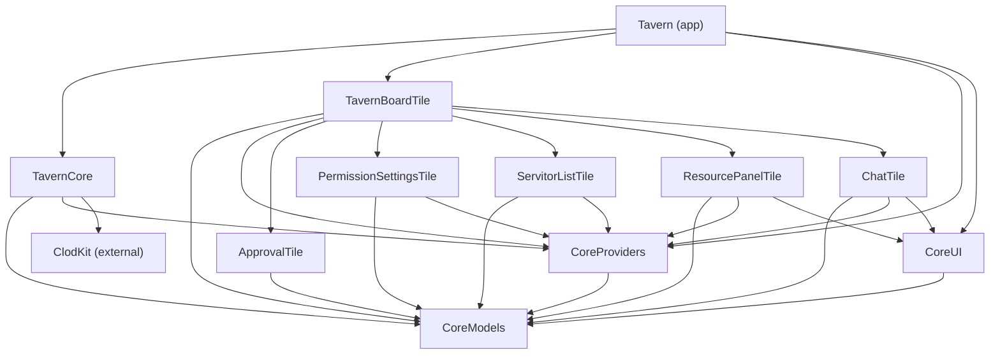
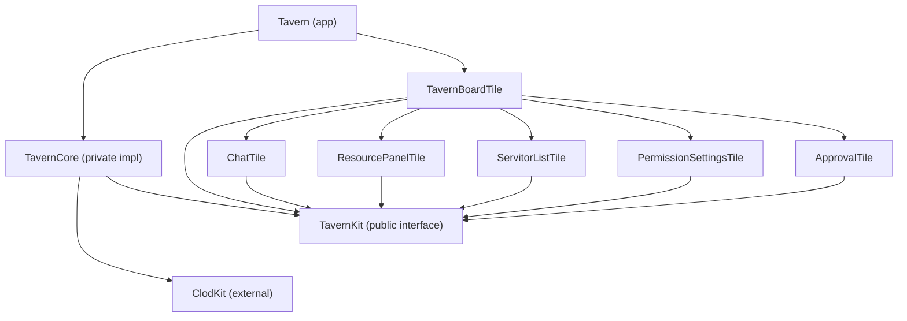

# Proposed Module Dependency Graph

Generated 2026-03-01. Exploring a simplified module structure.

## Current: 12 modules

## Proposed: 9 modules

Merge CoreModels + CoreProviders + CoreUI into **TavernKit** (the public interface).
TavernCore becomes the private implementation that imports TavernKit + ClodKit.

### What goes where

**TavernKit** — the public interface, zero ClodKit dependency:

- All value types (ChatMessage, StreamEvent, ServitorState, PermissionMode, TavernError, FileTreeNode, TodoItem, TavernTask, etc.)
- All provider protocols (ServitorProvider, ResourceProvider, CommandProvider, PermissionProvider, ProjectProvider)
- All responder structs (ChatResponder, ServitorListResponder, etc.)
- Shared presentation views (MessageRowView, MultiLineTextInput, LineNumberedText)
- Approval types and typealiases

**TavernCore** — the private implementation, imports ClodKit:

- ClodSession (translation layer)
- ClodSessionManager (implements ServitorProvider)
- DocumentStore (implements ResourceProvider)
- CommandRegistry (implements CommandProvider)
- PermissionSettingsProvider (implements PermissionProvider)
- UnixDirectoryDriver (implements ProjectProvider)
- Jake, Mortal, MortalSpawner, ServitorRegistry
- SessionStore, PermissionManager, SlashCommandDispatcher
- All ClodKit-touching code

### The compiler guarantee

Tiles depend on TavernKit only. TavernCore is not in their dependency list.
If someone adds `import TavernCore` to a tile, SPM refuses to build.
If someone accidentally makes a ClodKit type part of TavernKit's public API, it won't compile (TavernKit has no ClodKit dependency).

### What this eliminates

- CoreModels (merged into TavernKit)
- CoreProviders (merged into TavernKit)
- CoreUI (merged into TavernKit)
- 3 fewer modules, same compiler safety
