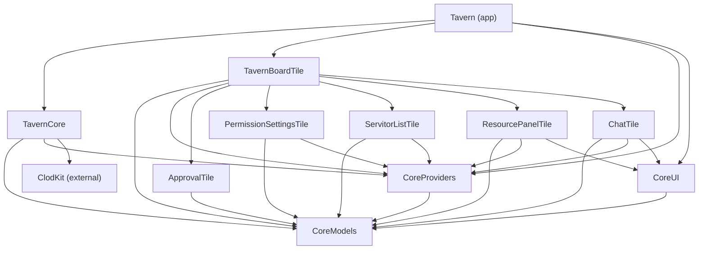
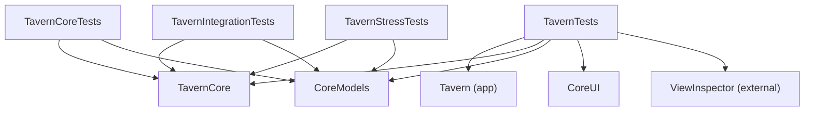

# Module Dependency Graph

Generated 2026-03-01. Edges mean "depends on" (arrow points to the dependency).

## Full Graph

## Declared but Unused Dependencies

These edges exist in Package.swift but are never actually imported in code:

| Source | Declared Dep | Status |
|--------|-------------|--------|
| ApprovalTile | CoreUI | Never imported |
| ServitorListTile | CoreUI | Never imported |
| PermissionSettingsTile | CoreUI | Never imported |
| TavernBoardTile | CoreUI | Never imported |
| Tavern (app) | CoreModels | Never imported |

## CoreUI Actual Consumers

Only 2 tile modules actually import CoreUI:

| Consumer | Types Used |
|----------|-----------|
| ChatTile | `MessageRowView`, `MultiLineTextInput` |
| ResourcePanelTile | `LineNumberedText` |

## Test Targets

