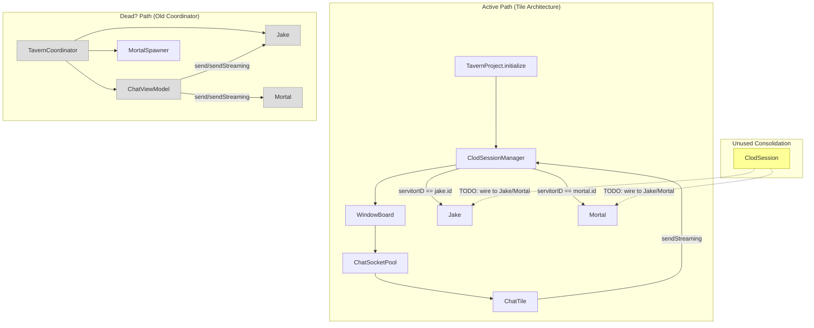
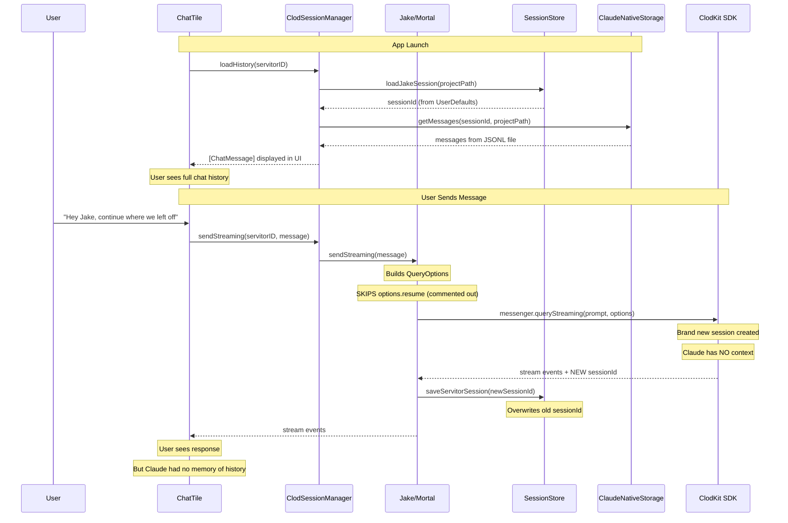
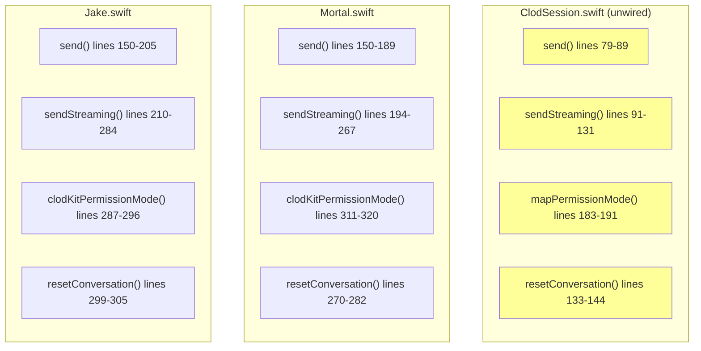

# Session Management Analysis

## Current Architecture

### The Two Parallel Paths




### The Session Lifecycle (What Actually Happens)




### The Six-Way Duplication




## What's Duplicated — Method by Method


### 1. buildOptions() / option construction — 3 copies

All three build `QueryOptions` identically:

**Jake.swift:163-176**

```swift
var options = QueryOptions()
options.systemPrompt = Self.systemPrompt
options.permissionMode = clodKitPermissionMode()
options.workingDirectory = projectURL
// Session resume disabled — stale sessions cause ControlProtocolError.timeout
// TODO: Re-enable with fallback logic (try resume, catch timeout, start fresh)

if let server = currentMcpServer {
    options.sdkMcpServers["tavern"] = server
}
```

**Mortal.swift:160-166**

```swift
var options = QueryOptions()
options.systemPrompt = systemPrompt
options.permissionMode = clodKitPermissionMode()
options.workingDirectory = projectURL
// Session resume disabled — stale sessions cause ControlProtocolError.timeout
// TODO: Re-enable with fallback logic (try resume, catch timeout, start fresh)
```

**ClodSession.swift:148-168**

```swift
var options = QueryOptions()
options.systemPrompt = config.systemPrompt
options.permissionMode = Self.mapPermissionMode(mode)
options.workingDirectory = config.workingDirectory
// Session resume disabled — stale sessions cause ControlProtocolError.timeout
// TODO: Re-enable with fallback logic (try resume, catch timeout, start fresh)

for (key, server) in mcpServers {
    options.sdkMcpServers[key] = server
}
```

Only real differences: Jake has MCP server injection, Mortal doesn't. ClodSession abstracts both via its config.


### 2. Session persistence after response — 6 copies (once per send method)

**Jake.send():187-190**

```swift
if let newSessionId = result.sessionId {
    queue.sync { _sessionId = newSessionId }
    SessionStore.saveJakeSession(newSessionId, projectPath: projectURL.path)
}
```

**Jake.sendStreaming():243-246**

```swift
if let sessionId = info.sessionId, let self {
    self.queue.sync { self._sessionId = sessionId }
    SessionStore.saveJakeSession(sessionId, projectPath: self.projectURL.path)
}
```

**Mortal.send():175-178**

```swift
if let newSessionId = result.sessionId {
    queue.sync { _sessionId = newSessionId }
    SessionStore.saveServitorSession(servitorId: id, sessionId: newSessionId)
}
```

**Mortal.sendStreaming():228-229**

```swift
self.queue.sync { self._sessionId = sessionId }
SessionStore.saveServitorSession(servitorId: self.id, sessionId: sessionId)
```

**ClodSession** — consolidated into one private method:

```swift
private func persistSession(_ sessionId: String) {
    queue.sync { _sessionId = sessionId }
    switch config.sessionKeyScheme {
    case .perProject(let path):  SessionStore.saveJakeSession(sessionId, projectPath: path)
    case .perServitor(let id):   SessionStore.saveServitorSession(servitorId: id, sessionId: sessionId)
    }
}
```


### 3. Permission mode mapping — 3 identical copies

**Jake.swift:287-296**, **Mortal.swift:311-320**, **ClodSession.swift:183-191** — all three:

```swift
switch mode {
case .normal: return .default
case .acceptEdits: return .acceptEdits
case .plan: return .plan
case .bypassPermissions: return .bypassPermissions
case .dontAsk: return .dontAsk
}
```


### 4. resetConversation() — 3 copies

**Jake.swift:299-305**

```swift
queue.sync { _sessionId = nil }
SessionStore.clearJakeSession(projectPath: projectURL.path)
```

**Mortal.swift:270-282**

```swift
queue.sync {
    _sessionId = nil
    if _state != .done { _state = .idle }
}
SessionStore.clearServitorSession(servitorId: id)
```

**ClodSession.swift:133-144** — same pattern with `SessionKeyScheme` switch.


### 5. Error wrapping on session failure — 2 copies (Jake only)

**Jake.send():196-198** and **Jake.sendStreaming():263-265** both do:

```swift
if let sessionId = currentSessionId {
    throw TavernError.sessionCorrupt(sessionId: sessionId, underlyingError: error)
}
```

Mortal does NOT wrap errors this way — it just rethrows. ClodSession does wrap them.


### 6. Streaming state management — different per type (not duplicated)

This is legitimately different per servitor type:

- **Jake**: manages `_isCogitating` flag
- **Mortal**: manages `_state` enum + completion signal detection + commitment verification
- **ClodSession**: has no state management (it's session-only)


## Summary: What's Shared vs. Unique

| Concern | Jake | Mortal | ClodSession | Duplicated? |
|---------|------|--------|-------------|-------------|
| Build QueryOptions | Yes | Yes | Yes | **Yes — 3x** |
| Set resume (disabled) | Yes | Yes | Yes | **Yes — 3x** |
| Persist session after response | Yes (x2) | Yes (x2) | Yes (x2) | **Yes — 6x** |
| Map permission mode | Yes | Yes | Yes | **Yes — 3x** |
| Reset conversation | Yes | Yes | Yes | **Yes — 3x** |
| Error wrapping (sessionCorrupt) | Yes | No | Yes | Partial (2x) |
| `_isCogitating` state | Yes | No | No | Unique to Jake |
| State machine (idle->working->done) | No | Yes | No | Unique to Mortal |
| Completion signal detection | No | Yes | No | Unique to Mortal |
| Commitment verification | No | Yes | No | Unique to Mortal |
| MCP server injection | Yes | No | Yes (via config) | Shared differently |

The clean split: **session mechanics** (build options, resume, persist, reset) are duplicated. **Servitor behavior** (state machines, completion, MCP) is unique per type and should stay that way.


## The Core Problem

Resume is disabled everywhere. The commented-out code appears in these locations:

| File | Line | Method |
|------|------|--------|
| Jake.swift | 168-170 | `send()` |
| Jake.swift | 224-226 | `sendStreaming()` |
| Mortal.swift | 164-166 | `send()` |
| Mortal.swift | 207-209 | `sendStreaming()` |
| ClodSession.swift | 158-162 | `buildOptions()` |

All say the same thing:

```swift
// Session resume disabled — stale sessions cause ControlProtocolError.timeout
// TODO: Re-enable with fallback logic (try resume, catch timeout, start fresh)
```


## Key File Locations

| File | Purpose |
|------|---------|
| `Sources/TavernCore/Servitors/Jake.swift` | Daemon servitor — session logic lines 150-305 |
| `Sources/TavernCore/Servitors/Mortal.swift` | Worker servitor — session logic lines 150-282 |
| `Sources/TavernCore/Sessions/ClodSession.swift` | Consolidated session type (unwired) |
| `Sources/TavernCore/Providers/ClodSessionManager.swift` | ServitorProvider impl — routes to Jake/Mortal |
| `Sources/TavernCore/Persistence/SessionStore.swift` | UserDefaults session ID storage |
| `Sources/TavernCore/Persistence/ClaudeNativeSessionStorage.swift` | JSONL history reader |
| `Sources/TavernCore/Persistence/ClaudeSessionModels.swift` | Data models for stored sessions |
| `Sources/TavernKit/StreamTypes.swift` | StreamEvent enum |
| `Sources/TavernKit/ServitorProvider.swift` | ServitorProvider protocol |
| `Sources/Tiles/ChatTile/ChatTile.swift` | Chat UI tile — consumes StreamEvents |
| `Sources/Tiles/TavernBoard/WindowBoard.swift` | Root board — orchestrates tiles |
| `Sources/Tiles/TavernBoard/Sockets/ChatSocketPool.swift` | Tile cache per servitor |
| `Sources/TavernCore/Coordination/TavernCoordinator.swift` | Old coordinator (may be dead code) |
| `Sources/TavernCore/Errors/TavernErrorMessages.swift` | Error-to-user-message mapping |
| `Sources/TavernCore/Testing/ServitorMessenger.swift` | SDK abstraction protocol |
| `Tests/TavernCoreTests/JakeTests.swift` | Jake tests (resume assertions commented out) |
| `Tests/TavernCoreTests/MortalTests.swift` | Mortal tests (resume assertions commented out) |
