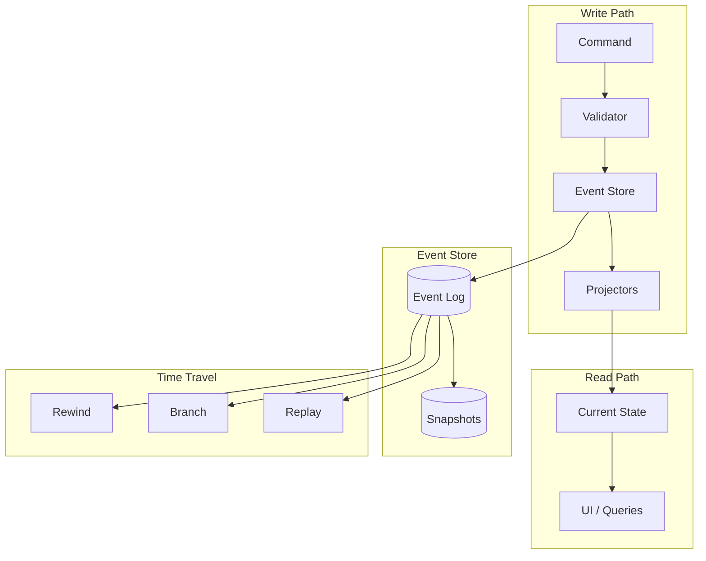

# Event-Sourced Architecture

**One-line summary:** All state changes are immutable events; current state is derived by replaying the event log.

## Core Concept

Event sourcing treats the event log as the single source of truth. Instead of storing current state directly (e.g., "agent is in state X with session Y"), we store a sequence of events describing what happened: AgentSpawned, MessageSent, CommitmentAdded, StateChanged, etc. Current state is a projection computed by replaying these events.

This inverts the typical persistence model. Traditional systems persist current state and lose history; event-sourced systems persist history and derive current state. The event log becomes append-only and immutable, which provides natural auditing, debugging capabilities, and the foundation for rewind/branch operations.

For Tavern, every agent action, state transition, and coordination event becomes a first-class, persisted fact. The Doc Store evolves from storing current documents to storing event streams per agent/project. UI and business logic subscribe to projections built from these events.

## Key Components

## Pros

- **Native rewind/branch** - Time travel is a projection with different parameters, not a separate system

- **Complete audit trail** - Every state change is recorded with timestamp and context

- **Debugging superpower** - Replay exact sequence that led to any state; reproduce bugs deterministically

- **Natural undo** - Any operation can be reversed by projecting without recent events

- **Concurrent modifications** - Append-only log eliminates most concurrency conflicts

- **Temporal queries** - Answer "what was the state at time T?" or "what changed between T1 and T2?"

- **Event-driven UI** - SwiftUI's reactive model aligns with event subscriptions

## Cons

- **Complexity overhead** - Requires event/command separation, projectors, eventual consistency thinking

- **Storage growth** - Event logs grow indefinitely; need snapshot/compaction strategy

- **Schema evolution** - Event formats must be versioned and old events must remain readable

- **Query complexity** - Simple queries require projection; no direct database lookups

- **Eventual consistency** - UI may briefly show stale state between event and projection

- **Learning curve** - Team must understand CQRS patterns and event-driven architecture

## When to Choose This Architecture

**Choose event sourcing when:**

- Rewind/branch is a core feature (PRD Section 13)

- Audit trail and debugging capabilities are critical

- The domain has complex state transitions worth recording

- Concurrent agent operations need conflict resolution

- Temporal queries ("what happened when?") are valuable

**Avoid event sourcing when:**

- Simple CRUD is sufficient

- Real-time consistency is mandatory

- Storage is severely constrained

- Team unfamiliar with event-driven patterns

- Prototype/MVP where simplicity wins
