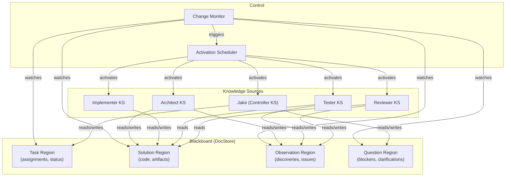

# Blackboard Architecture

**One-line summary:** Shared workspace that all agents read/write; knowledge sources contribute opportunistically.

## Core Concept

The Blackboard architecture treats the system state as a shared, structured workspace where all agents can both observe and contribute. Each agent acts as a "knowledge source" (KS) that monitors specific regions of the blackboard and contributes when its expertise is relevant. This inverts the typical command-and-control pattern: instead of Jake explicitly delegating tasks and awaiting responses, agents notice when they can help and do so autonomously.

In Tavern's context, the blackboard becomes an extension of the DocStore concept already central to the architecture. Agents write partial solutions, observations, and questions to structured regions of the blackboard. A control component schedules which knowledge sources run next based on what data has changed. Jake remains the coordinator but shifts from "commanding officer" to "traffic controller" -- monitoring the blackboard state and occasionally steering focus rather than micromanaging tasks.

The key insight is that blackboard systems excel at problems requiring opportunistic, incremental refinement by diverse specialists. A complex coding task might have one agent contributing architectural insights, another refining implementation details, a third running tests, and a fourth reviewing for style -- all operating on shared state without explicit hand-offs.

## Key Components

## Pros

- **Natural fit for DocStore philosophy** -- "If it's not in a file, it doesn't exist" already aligns with blackboard's shared-state model

- **Emergent collaboration** -- Agents can notice opportunities to contribute without explicit delegation chains

- **Robust to partial failures** -- If one agent stalls, others continue making progress on the shared workspace

- **Excellent for discovery sharing** -- The PRD's "oddities noticed and shared" pattern is a first-class citizen

- **Intrinsically observable** -- All state is visible in the blackboard; debugging and monitoring become file inspection

- **Supports incremental refinement** -- Complex tasks evolve through multiple contributions rather than monolithic handoffs

## Cons

- **Conflict resolution complexity** -- Multiple agents writing to overlapping regions creates merge challenges

- **Control flow becomes implicit** -- Harder to trace "who did what when" compared to explicit delegation

- **Scheduling non-trivial** -- Determining which knowledge source should run next requires sophisticated heuristics

- **Risk of infinite loops** -- Agent A's output triggers Agent B, which triggers Agent A again

- **Memory/context overhead** -- Agents may need to read large portions of blackboard to understand context

- **Verification complexity** -- Commitment verification becomes harder when multiple agents contributed to an outcome

## When to Choose This Architecture

Choose Blackboard when:

- **Problems require diverse expertise** -- Multiple specialists need to collaborate on shared artifacts

- **Task decomposition is unclear upfront** -- Work emerges through exploration rather than predefined plans

- **Discovery is valued** -- Agents should surface findings even when not explicitly asked

- **State is naturally shared** -- The problem domain already involves collaborative document editing

- **Failure isolation is important** -- One agent's failure shouldn't cascade to block all progress

Avoid Blackboard when:

- **Clear hierarchies exist** -- Simple delegation chains are more predictable

- **Low latency is critical** -- Blackboard polling adds overhead vs. direct messaging

- **Strict sequencing required** -- Pipeline-style workflows are harder to enforce
