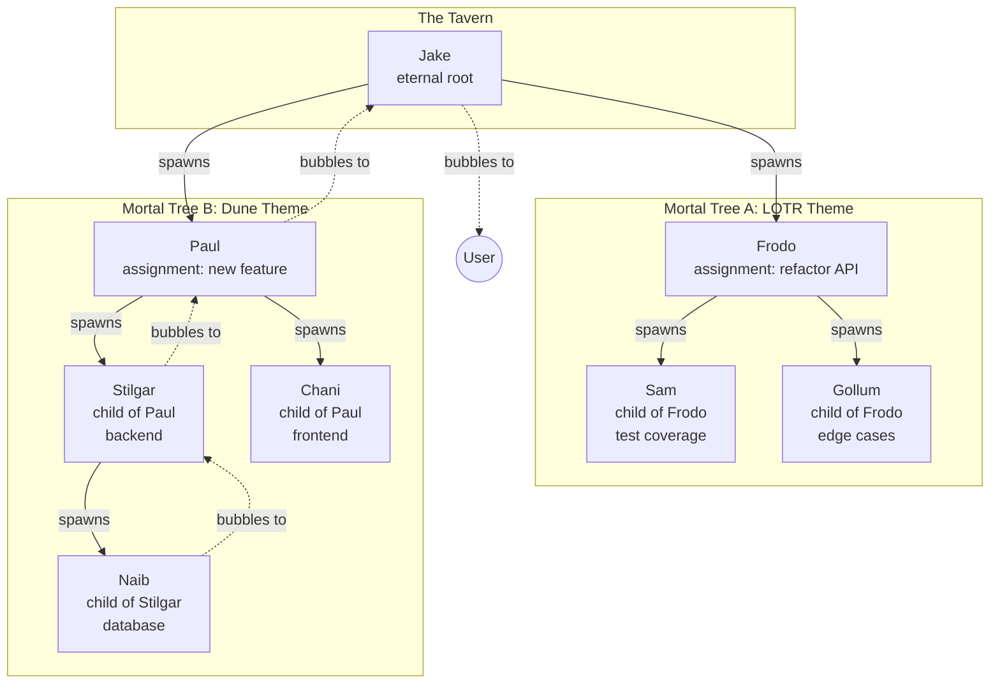

# Architecture Proposal: Hierarchical Tree

**One-line summary:** Strict parent-child ownership where Jake is the root, mortal agents are children, and children can spawn their own children to arbitrary depth.

## Core Concept

The Hierarchical Tree formalizes agent relationships as a strict tree structure. Jake sits at the root and is the only agent spawned directly by the system. Every other agent is spawned by a parent agent and is owned by that parent. When a parent dies (or is dismissed), its entire subtree dies with it. When a child needs user attention, the request bubbles up through ancestors.

This mirrors the PRD's vision of Jake spawning "mortal agent trees" where naming themes are inherited from the tree root, and children can spawn their own children (Erlang-style process trees). The key constraint is strict ownership: an agent's lifecycle is bounded by its parent's lifecycle.

The architecture provides natural isolation boundaries. A runaway subtree can be killed by dismissing its root. Budget enforcement can cascade downward (parent's remaining budget caps children's allocation). Question escalation has a defined path (child to parent to grandparent to Jake to user). Each tree shares a naming theme, making it visually obvious which agents belong together.

## Key Components

## Pros

- **Natural ownership semantics**: Parent death means children death. No orphan agents, no cleanup races.

- **Defined escalation path**: Every agent has exactly one parent. Questions bubble up through a known chain.

- **Theme inheritance**: Naming theme is assigned at tree root, shared by all descendants. User sees "LOTR agents working on API" as a cohesive unit.

- **Budget cascading**: Parent can subdivide its budget among children. No child can exceed what parent allocates.

- **Subtree isolation**: Kill a subtree by dismissing its root. No need to track individual agents.

- **Matches PRD vocabulary**: PRD explicitly describes "mortal agent trees," "children," and "naming theme belongs to tree root."

- **Recursive structure**: Same spawning logic works at every level. Jake spawns mortals the same way mortals spawn children.

## Cons

- **Depth complexity**: Deep trees (4+ levels) make bubbling slow and debugging harder.

- **Parent bottleneck**: If parent agent is busy or blocked, children's questions queue up.

- **Lateral communication is awkward**: Siblings must route through parent. Cousins route through common ancestor.

- **No shared workers**: A drone can only serve one parent. Cannot have a "pool of workers" serving multiple parents.

- **Cascade failures**: Parent crash kills entire subtree, even if children were doing fine.

- **State reconstruction harder**: If we restart a parent, do we restore its children? From where?

## When to Choose This Architecture

Choose Hierarchical Tree when:

1. **Clear delegation chains**: Work naturally breaks into "I delegate to you, you delegate further."

2. **Isolation is critical**: You want to kill a misbehaving subtree without affecting siblings.

3. **Budget inheritance matters**: Parent's remaining tokens should bound children's spending.

4. **Naming themes add value**: Users benefit from seeing "these are all Dune agents" at a glance.

5. **PRD compliance is priority**: The PRD describes this structure explicitly. Following it reduces design risk.

Avoid when lateral collaboration (sibling-to-sibling, cross-tree) is more important than vertical delegation.
