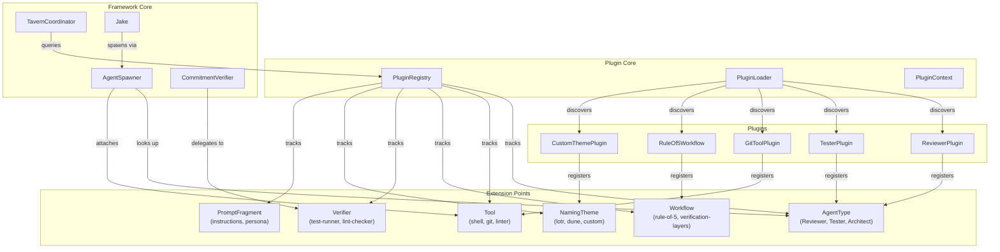

# Plugin Architecture

**One-line summary:** Minimal core with pluggable agent types, tools, behaviors, and workflows that can be registered, discovered, and composed at runtime.

## Core Concept

The Plugin Architecture separates what changes from what stays stable. The core framework provides agent lifecycle, messaging, verification, and persistence primitives. Everything else -- agent personalities, specialized behaviors, workflow templates, tool integrations, and even naming themes -- lives in plugins that register with the core at startup or runtime.

This maps directly to the PRD's "Gang of Experts" concept. Instead of hardcoding Reviewer, Tester, Architect, etc. as distinct agent subclasses, each becomes a plugin that contributes a system prompt, specialized tools, and verification criteria. Jake remains the eternal coordinator, but his capability to "pull in the reviewer" becomes a plugin lookup and spawn operation. Users can customize expert behaviors, add new experts, or swap out entire workflow strategies without touching framework code.

The architecture recognizes that Tavern's value comes from flexibility -- different projects need different experts, different workflows, and different tool integrations. A plugin system makes this extensibility a first-class concern rather than an afterthought. Plugins can be bundled (built into the app), local (per-project), or discovered from external sources.

## Key Components

## Pros

- **Gang of Experts becomes configuration** -- Reviewer, Tester, Architect are plugins with prompt files and tool sets, not hardcoded agent types

- **Workflow templates are first-class** -- Rule-of-5, verification layers, and custom workflows register as workflow plugins with defined steps

- **Per-project customization** -- Projects can include local plugins that override or extend bundled behaviors

- **Clean separation of concerns** -- Framework handles lifecycle, plugins handle domain-specific behavior

- **Testing in isolation** -- Each plugin is testable independently of the framework and other plugins

- **Progressive unlocks map naturally** -- Unlocking new cogitation verbs, naming themes, or expert types is plugin registration gated by engagement metrics

- **Community extensibility** -- External contributors can build and share plugins without framework changes

## Cons

- **Discovery complexity** -- Plugin loading, dependency resolution, and version compatibility add significant machinery

- **Performance overhead** -- Runtime plugin lookups add indirection compared to compiled dispatch

- **API stability burden** -- Plugin interfaces become contracts that are painful to change

- **Debugging across boundaries** -- Stack traces cross plugin boundaries; errors can be harder to trace

- **Over-abstraction risk** -- Simple features might require plugin boilerplate where a direct implementation would suffice

- **Testing combinatorics** -- Plugin interactions create exponential test scenarios

## When to Choose This Architecture

Choose Plugin Architecture when:

- **Extensibility is a primary goal** -- Users and contributors should add new experts, tools, and workflows without framework changes

- **Gang of Experts will grow** -- The PRD lists Reviewer, Tester, Architect as examples; many more specialists are anticipated

- **Workflows are diverse** -- Different projects need different verification layers, different pass structures

- **Progressive unlocks are important** -- The unlock system (new themes, verbs, experts) maps naturally to plugin registration

- **Third-party integration is expected** -- External tools, services, and custom behaviors should plug in cleanly

Avoid Plugin Architecture when:

- **Scope is bounded** -- The expert set and workflow options are known and stable

- **Performance is critical** -- Plugin indirection adds measurable latency to hot paths

- **Simplicity trumps extensibility** -- The team prefers direct code over configuration
