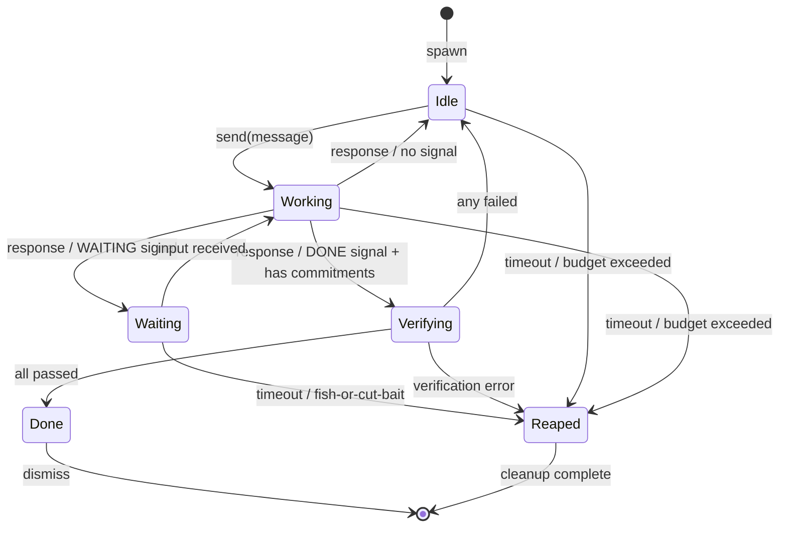

# State Machine Architecture

**One-line summary:** Explicit state machines for all stateful entities; state transitions are first-class citizens with compile-time validation and runtime observability.

## Core Concept

The State Machine architecture formalizes the ad-hoc state management scattered throughout Tavern into explicit, type-safe state machines. Every stateful entity (agents, commitments, sessions, coordination flows) becomes a state machine with clearly defined states, transitions, guards, and effects.

The PRD already defines agent states (Working, Waiting for Input, Waiting for Wakeup, Done, Failed/Reaped) and task modes (Execute, Delegate, Plan, Break up, Unify). Currently, these are implemented as simple enums with imperative transition logic spread across multiple methods. A state machine architecture elevates transitions to first-class operations with explicit guards (conditions that must be true), effects (side effects triggered by transition), and entry/exit actions.

This approach creates a single, auditable source of truth for "what can happen when." Invalid transitions become compile-time errors rather than runtime assertions. The state machine definition serves as living documentation of agent lifecycle, and transition events provide natural hooks for logging, metrics, and UI updates.

## Key Components

## Pros

- **Compile-time correctness** - Invalid state transitions fail at compile time; impossible to reach "agent is working while done"

- **Self-documenting** - State machine definition IS the specification; no drift between docs and code

- **Natural observability** - Every transition is an event; metrics, logging, and UI updates hook into transitions

- **Testable in isolation** - State machines are pure functions of (state, event) -> (state, effects); unit tests become exhaustive

- **PRD alignment** - Agent states and task modes map directly to state machine concepts

- **Rewind/branch foundation** - State machine with history enables time-travel debugging (store transition log, replay to any point)

## Cons

- **Verbosity overhead** - Explicit state machines require more boilerplate than ad-hoc transitions

- **Rigid structure** - Adding new states or transitions requires modifying the machine definition

- **Learning curve** - Team must understand state machine patterns (guards, effects, hierarchical states)

- **Distributed state coordination** - Inter-machine synchronization (parent-child agents) adds complexity

- **Swift tooling gap** - No first-class state machine support; requires library or hand-rolled implementation

## When to Choose This Architecture

Choose State Machines when:

1. **State transitions are central to correctness** - The PRD emphasizes agent lifecycle management; incorrect transitions break invariants

2. **Observability is non-negotiable** - Logging and metrics requirements in PRD Section 9 align with transition-based events

3. **Testing exhaustiveness matters** - Enumerating all (state, event) pairs catches edge cases before production

4. **Multiple concurrent state machines** - Many agents each running their own machine; isolation by construction

5. **Temporal reasoning required** - Rewind/branch (PRD Section 13) needs a transition log; state machines provide this naturally
