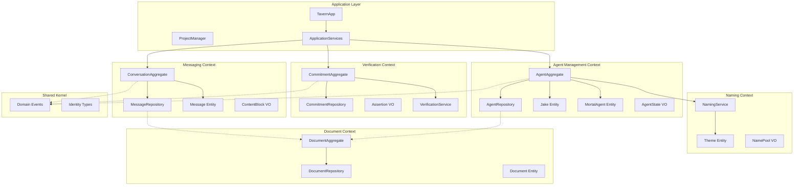

# Domain-Driven Design Architecture

**One-line summary:** Organize the codebase around explicit bounded contexts (Agent Management, Messaging, Verification, Document Storage, Naming) with ubiquitous language, aggregates, and repository patterns.

## Core Concept

Domain-Driven Design (DDD) treats the Tavern as a collection of distinct subdomains, each with its own internal model, language, and rules. Instead of organizing by technical layer (views, models, persistence), DDD organizes by business capability. The Agent Management domain owns agent lifecycle and state transitions. The Messaging domain owns conversations and message flow. The Verification domain owns commitment definitions and assertion execution. Each domain exposes a clean interface and hides internal complexity.

The key insight is that the current codebase already has implicit domain boundaries. `Agents/` contains agent lifecycle logic. `Chat/` handles messaging. `Commitments/` manages verification. `Naming/` generates identifiers. `DocStore/` persists documents. DDD makes these boundaries explicit through formal aggregates (entities with identity that control access to related objects), repositories (abstraction over storage), and domain events (notifications that cross boundaries).

This architecture shines when domains need to evolve independently, when ubiquitous language reduces miscommunication between team members, and when domain logic becomes complex enough that isolating it from infrastructure pays dividends. It introduces ceremony (explicit context boundaries, repository interfaces, domain events) that may feel heavyweight for a small team but prevents tangled dependencies as the system grows.

## Key Components

## Pros

- **Explicit domain boundaries**: Each context owns its invariants. Agent Management cannot directly mutate Verification state. Changes propagate through events or application services.

- **Ubiquitous language**: Developers, agents, and documentation use the same terms. "Commitment" means the same thing in code, tests, and conversation.

- **Testable in isolation**: Each bounded context can be tested independently with mock repositories and event handlers.

- **Scales with complexity**: As domains grow (e.g., Verification gains sandboxing, Naming gains progressive unlocks), changes stay local to that context.

- **Clear ownership**: When a bug appears in commitment verification, the Verification Context owns the fix. No hunting across multiple layers.

- **Evolution-friendly**: A context can be rewritten, extracted to a separate service, or replaced without touching other contexts.

## Cons

- **Upfront modeling cost**: Defining aggregates, repositories, and context boundaries requires design work before implementation.

- **Ceremony overhead**: Small operations require crossing context boundaries through application services or events. Simple features feel bureaucratic.

- **Mapping layer proliferation**: Each context may have its own internal models that must be mapped to/from external contracts and persistence.

- **Learning curve**: Developers unfamiliar with DDD patterns (aggregates, repositories, domain events) need ramp-up time.

- **Overkill for v1 scope**: The current PRD scope (chat with Jake, spawn mortals, basic verification) may not justify full DDD infrastructure.

- **Event consistency challenges**: Cross-context operations (spawn agent AND create conversation) require careful coordination to maintain consistency.

## When to Choose This Architecture

Choose Domain-Driven Design when:

- The domain is complex enough that isolating business logic from infrastructure significantly reduces cognitive load
- Multiple teams or AI agents will work on different bounded contexts independently
- The ubiquitous language will reduce miscommunication and prevent model divergence
- You anticipate significant evolution in one domain (e.g., Verification) that should not ripple through others
- The system will grow beyond v1 scope into multi-agent collaboration, workflow templates, and metrics collection

Avoid Domain-Driven Design when:

- The team is small and can maintain a shared mental model without formal boundaries
- Rapid prototyping is more valuable than long-term architectural clarity
- The domain is simple enough that a single coordinator can manage all concerns
- The overhead of repositories, aggregates, and events outweighs the isolation benefits
