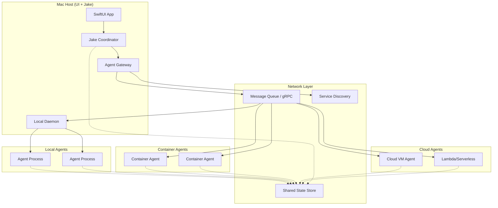

# Distributed-First Architecture

**One-line summary:** Design for multi-machine execution from day one; agents can run anywhere with network-transparent communication.

## Core Concept

Distributed-First architecture treats location transparency as a foundational principle rather than a future migration target. Every agent, regardless of whether it currently runs on the local Mac, is addressed and communicated with through network-capable abstractions. This means the local Mac app becomes one node in a potentially larger system of execution environments.

The key insight is that the PRD's sandbox primitives (Platform, Isolation, Software) already envision agents running on containers, cloud instances, or hybrid environments. Rather than building a monolithic local-only system and retrofitting distribution later, this architecture builds the network boundary into the core abstractions from day one. Agent communication happens via message passing over well-defined protocols, agent state lives in network-accessible storage, and the coordinator becomes a distributed orchestration service.

This approach inverts the typical "start local, scale out" pattern. By paying the complexity cost of distribution upfront, future transitions from Mac-only to Mac+container or Mac+cloud become configuration changes rather than architectural rewrites. The local Mac remains the primary UI and coordination point, but agents spawned there are indistinguishable from agents spawned elsewhere.

## Key Components

## Pros

- **No rewrite for scale** - When you need container or cloud agents, it's a deployment decision not an architecture change

- **PRD alignment** - Directly implements Platform primitive ("Mac, container, cloud, hybrid") as first-class concern

- **True isolation** - Network boundaries provide hard process isolation; agent crashes cannot affect others

- **Heterogeneous execution** - Run macOS-only tools locally, Linux containers for specific workloads, cloud VMs for heavy compute

- **Geographic distribution** - Agents can run near data sources or in specific cloud regions when needed

- **Fault tolerance foundation** - Network-based communication naturally enables retry, timeout, and failover patterns

## Cons

- **Complexity overhead** - Network protocols, serialization, service discovery add significant complexity vs direct method calls

- **Latency cost** - Every agent interaction incurs network round-trip even when agents are local

- **Operational burden** - Requires message queue infrastructure, potentially container orchestration, monitoring

- **Debugging difficulty** - Distributed tracing required to follow request flow; local debugging less straightforward

- **Overkill for v1** - PRD explicitly defers cloud agents; paying distribution cost now for features needed later

- **Cold start penalty** - Spawning agents on remote platforms adds significant latency vs local process fork

## When to Choose This Architecture

**Choose Distributed-First when:**

1. **Multi-machine is a near-term certainty** - You know within 3-6 months you'll need agents on containers or cloud

2. **Isolation is paramount** - The Isolation primitive matters more than latency; you want hard boundaries between agents

3. **Heterogeneous platforms required** - Some agents need macOS, others need Linux, some need GPU instances

4. **Team has distributed systems experience** - The complexity is manageable given existing expertise

5. **The "big refactor later" pattern has burned you** - You've seen projects fail the local-to-distributed migration

**Avoid Distributed-First when:**

- V1 scope is truly local-only and you want to ship faster
- Latency sensitivity is high (real-time agent coordination)
- Operational complexity is a concern (solo developer, small team)
- The benefits of distribution are speculative rather than planned
