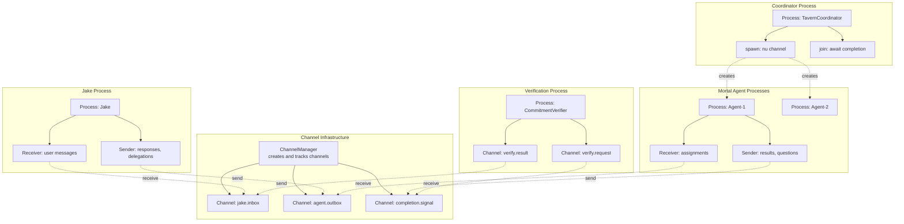

# Architecture Proposal: Process Calculus

**One-line summary:** Formal model based on pi-calculus and CSP where agents are processes, communication is typed channels, and concurrency properties are mathematically provable.

## Core Concept

Process Calculus architecture treats the Tavern as a concurrent system whose behavior can be formally specified and reasoned about. Each agent is a *process* in the pi-calculus sense: an independent execution context that communicates exclusively through *channels*. Channels are first-class values that can be created, passed between processes, and used for bidirectional or unidirectional message exchange.

The key insight is that Swift's structured concurrency already provides the building blocks for this model. AsyncSequence and AsyncStream implement channels. Actors provide process isolation. Task groups enable process spawning with structured lifetimes. By formalizing these relationships, we gain the ability to prove properties like deadlock freedom, livelock avoidance, and message delivery guarantees at design time rather than discovering failures at runtime.

CSP (Communicating Sequential Processes) provides the synchronization discipline: processes block on channel operations until both sender and receiver are ready. This makes communication points explicit and prevents the subtle race conditions that emerge from shared mutable state. The "bubbling" mechanism from the PRD maps naturally to channel hierarchies, where child processes send on parent-provided channels.

## Key Components

## Pros

- **Provable concurrency properties:** Deadlock freedom, channel equivalence, and message ordering can be verified mathematically using process algebra

- **Natural fit for agent communication:** The PRD's bubbling, delegation, and parent-child messaging map directly to channel-based communication primitives

- **Clean separation of concerns:** Processes encapsulate behavior; channels handle communication; the type system enforces the protocol

- **Compositional reasoning:** Small process behaviors combine predictably; understanding pieces implies understanding the whole

- **Swift concurrency alignment:** AsyncStream is a channel, structured tasks are process spawning, actor isolation is process boundaries

- **Explicit synchronization points:** Every channel operation is a potential suspension point, making concurrency visible in the code structure

## Cons

- **Steep learning curve:** Pi-calculus and CSP are academic formalisms unfamiliar to most Swift developers

- **Verification tooling gap:** No production-ready Swift tools for process calculus model checking; formal proofs are manual

- **Performance overhead:** Channel-based communication adds indirection compared to direct method calls on actors

- **Over-specification risk:** Not all properties need formal verification; pragmatic testing may suffice for v1

- **Impedance mismatch:** Swift is not a process calculus language; mapping is approximate, not isomorphic

- **Debugging complexity:** Channel-based flows are harder to trace than object method calls in traditional debuggers

## When to Choose This Architecture

Choose Process Calculus when:

1. **Concurrency correctness is critical:** Agent miscommunication could cause data loss, infinite loops, or user frustration

2. **The team values formal methods:** Engineers are willing to learn and apply pi-calculus/CSP reasoning to design decisions

3. **Inter-agent protocols are complex:** The PRD envisions hierarchical delegation, bubbling, and coordination; formal channels prevent protocol violations

4. **Long-term evolution is expected:** Formal models document the communication invariants, making future changes safer

5. **Swift structured concurrency is the target:** The architecture leverages rather than fights Swift's async/await and actor model

Do not choose this architecture if:

- The team prefers pragmatic testing over formal verification
- Inter-agent communication remains simple (request-response only)
- Development velocity matters more than provable correctness
- The overhead of channel abstractions is unacceptable for performance
