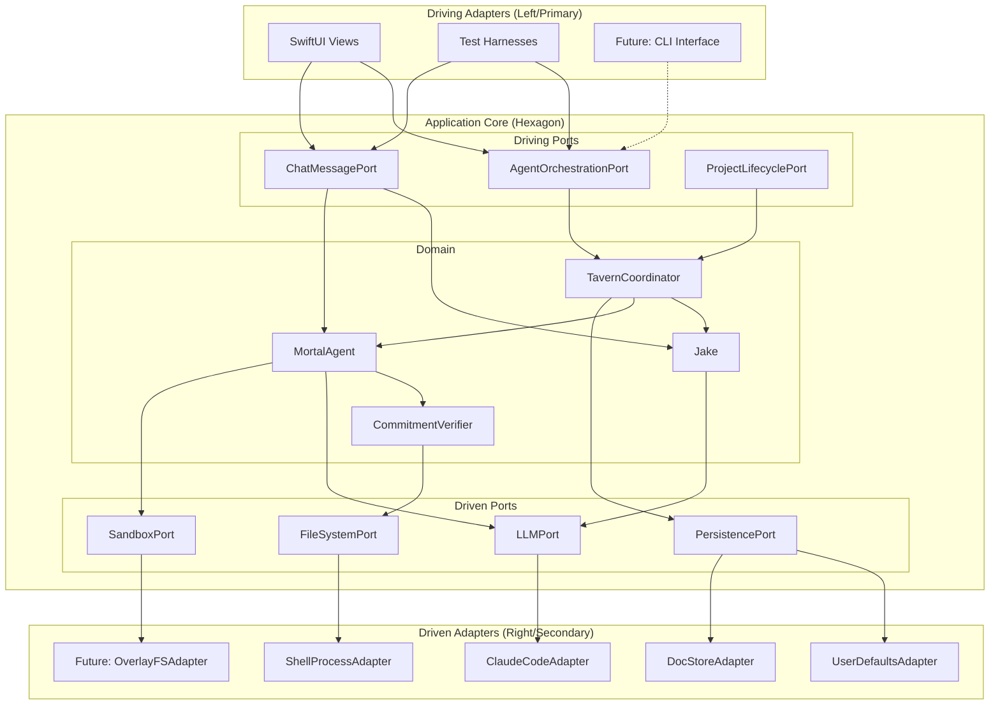

# Hexagonal Architecture (Ports & Adapters)

**One-liner:** Core domain logic has zero external dependencies; all infrastructure flows through explicit ports with swappable adapters.

## Core Concept

Hexagonal Architecture, conceived by Alistair Cockburn, structures applications around the principle that business logic should be completely isolated from infrastructure concerns. The "hexagon" metaphor represents the application core, with ports arranged around its perimeter like connection points. Each port defines a contract (protocol/interface) that the core uses to communicate with the outside world, and adapters implement these contracts for specific technologies.

The architecture distinguishes between two types of ports: **driving ports** (primary/inbound) through which external actors trigger domain operations, and **driven ports** (secondary/outbound) through which the domain reaches out to external systems. For Tavern, SwiftUI views and test harnesses drive the application through ports like `AgentOrchestrationPort`, while the domain drives external systems through ports like `LLMPort` and `PersistencePort`.

This creates a dependency inversion: instead of Jake depending on ClaudeCodeSDK directly, Jake depends on an abstract `LLMPort` protocol, and `ClaudeCodeAdapter` implements that protocol. The result is a domain that can be fully tested with mock adapters and trivially extended with new infrastructure without touching business logic.

## Key Components

## Pros

- **Perfect testability**: Mock any adapter without touching domain code; the entire agent orchestration can be tested without Claude API calls

- **Technology flexibility**: Swap Claude for another LLM (GPT, local models) by implementing a new adapter; the domain never knows

- **Explicit dependencies**: Every external touch point is documented in a port protocol; impossible to accidentally couple domain to infrastructure

- **Parallel development**: Teams can work on adapters independently once port contracts are defined

- **Clean migration path**: Current codebase already has protocols (`ClaudeCode`, `AssertionRunner`); these become ports with minimal renaming

- **PRD alignment**: Supports "deterministic shell around non-deterministic agents" perfectly - the shell is the port layer

## Cons

- **Protocol proliferation**: Every external interaction requires a port protocol; can feel like boilerplate for simple operations

- **Indirection overhead**: Following code flow requires jumping through port/adapter boundaries; debugging is less linear

- **Async complexity**: Swift's actor isolation and async/await can clash with port boundaries; careful design needed to avoid Sendable headaches

- **Over-engineering risk**: For truly simple adapters (e.g., UserDefaults), the port abstraction may add more code than it saves

- **Learning curve**: Developers new to hexagonal need time to internalize port vs adapter distinction

## When to Choose This Architecture

Choose Hexagonal when:

1. **Multiple infrastructure options are likely** - Tavern will eventually support multiple LLM backends, various sandboxing approaches, and different persistence strategies

2. **Testability is non-negotiable** - The PRD's "every feature must be testable" invariant aligns perfectly with hexagonal's mock-friendly design

3. **The domain is complex and evolving** - Agent orchestration, commitment verification, and work queues form a rich domain worth protecting

4. **External systems are unstable** - ClaudeCodeSDK is a local fork with ongoing changes; isolating it behind a port absorbs that volatility

5. **Team will grow** - Clear port contracts enable parallel development without stepping on each other
