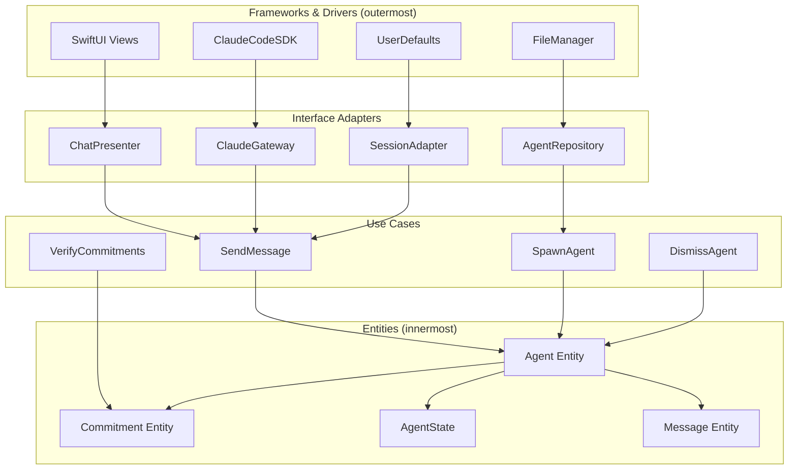

# Clean Architecture

**One-line summary:** Uncle Bob's concentric circles with dependencies pointing inward: Entities at center, Use Cases around them, Interface Adapters outside, Frameworks at the edge.

## Core Concept

Clean Architecture enforces a strict dependency rule: code in inner circles knows nothing about code in outer circles. The innermost layer contains pure domain entities (Agent, Commitment, AgentState) with no dependencies. The next layer contains use cases (SpawnAgent, VerifyCommitment, DismissAgent) that orchestrate entities. Interface adapters translate between use cases and external concerns (ClaudeCodeSDK, SwiftUI). The outermost layer contains frameworks and drivers.

This inversion means domain logic never imports SDK types, UI frameworks, or persistence mechanisms. Instead, inner layers define protocols that outer layers implement. An agent entity defines what it means to communicate; an adapter implements that communication via ClaudeCodeSDK. This enables testing domain logic without any external dependencies and swapping implementations (mock Claude, different UI framework) without touching core logic.

For Tavern, this would mean Jake and MortalAgent become pure entities with no ClaudeCodeSDK imports. Use cases like `SendMessage` or `SpawnAgent` orchestrate these entities through protocol-defined ports. Adapters bridge to ClaudeCodeSDK, SessionStore (UserDefaults), and SwiftUI. The SDK, persistence, and UI become pluggable implementation details.

## Key Components

## Pros

- **Pure domain logic**: Entities and use cases have zero external dependencies; can be tested with simple unit tests, no mocks of SDK or UI required.

- **Framework independence**: Swap ClaudeCodeSDK for another AI backend, SwiftUI for AppKit, UserDefaults for CoreData without touching domain code.

- **Explicit boundaries**: Each layer has a clear role; violations are caught at compile time via import restrictions.

- **Testability at each layer**: Entities test with value assertions. Use cases test with mock repositories. Adapters test with real frameworks but mock use cases.

- **Long-term maintainability**: As codebase grows, the structure scales; new features slot into existing layers without architectural drift.

- **Parallel development**: Teams can work on adapters, use cases, and entities independently once interfaces are defined.

## Cons

- **Significant upfront investment**: Current 28 files would become 50+ files across layers; substantial refactoring required.

- **Boilerplate overhead**: Every cross-layer communication needs a protocol, a use case, an adapter; simple features require multiple files.

- **Indirection tax**: Following a request from UI to entity requires traversing 4+ layers; debugging is more complex.

- **Overkill for current scale**: ~2000 lines of core logic does not justify this ceremony; benefits emerge at 10K+ lines.

- **Protocol proliferation**: Each port between layers becomes a protocol; dozens of protocols for a mid-size app.

- **Learning curve**: Team must understand and consistently apply the dependency rule; easy to accidentally violate.

## When to Choose This Architecture

Choose Clean Architecture when:

- The application will live for 5+ years with ongoing development
- Multiple implementations of adapters are anticipated (different AI backends, UI frameworks)
- The team has 4+ developers who need clear boundaries to avoid stepping on each other
- Testability without external dependencies is a hard requirement
- The domain model is complex enough to justify isolation (10+ entities, 20+ use cases)

Avoid Clean Architecture when:

- Rapid prototyping is the priority (v1 proof of concept)
- The team is small (1-3 developers) and communicates easily
- The codebase is under 5000 lines
- Framework lock-in is acceptable (SwiftUI only, ClaudeCodeSDK only)
- Simpler patterns (MVC, MVVM) provide sufficient organization
