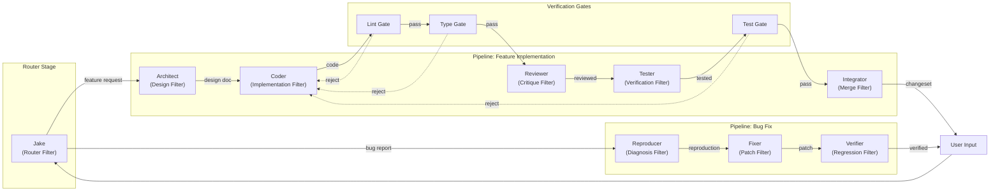

# Pipes & Filters Architecture

**One-line summary:** Agents are processing stages (filters) connected by typed channels (pipes); work items flow through pipelines that transform, validate, and route them.

## Core Concept

Pipes & Filters decomposes agent orchestration into a data flow problem. Each agent is a **filter** — a processing unit with typed inputs and outputs. Filters connect via **pipes** — bounded channels that carry work items between stages. A **pipeline** is a composition of filters that transforms an initial request into a final deliverable.

This maps naturally to the PRD's workflow templates. The "Rule of 5" becomes a linear pipeline with five filter stages, each refining the output of the previous. Verification layers become a series of gate filters — linting → code structure → architecture → performance — where each gate either passes work through or rejects it back to an earlier stage for rework.

The key insight is that agent coordination becomes pipeline topology. Jake isn't a coordinator in the traditional sense; he's a **router filter** that inspects incoming work and dispatches it to the appropriate pipeline. Mortal agents are filters within those pipelines. The document store becomes a **persistent pipe** — work items written to files that subsequent filters read, transform, and rewrite.

## Key Components

## Pros

- **Composable workflows** — New pipelines are assembled from existing filters; adding a security review is inserting a filter

- **Parallelizable** — Independent pipelines run concurrently; a feature and a bug fix proceed in parallel naturally

- **Deterministic verification** — Gate filters are deterministic checkers that enforce the "commitments verified independently" invariant

- **Natural logging** — Every pipe is an observation point; work items carry their history through the pipeline

- **Easy to visualize** — Pipeline topology is intuitive for users; dashboard shows work flowing through stages

- **Reorderable** — Changing workflow order is rewiring pipes, not rewriting coordination logic

## Cons

- **Sequential bottlenecks** — Strict pipeline stages can serialize work that could be parallelized

- **Rigid topology** — Adapting to unexpected situations (e.g., agent discovers new issue mid-pipeline) requires escape hatches

- **Fan-out complexity** — Work that needs to split (one design → multiple implementations) requires explicit splitter/merger filters

- **Feedback loops are awkward** — Rejection from a gate back to an earlier stage is a reverse flow that complicates the DAG

- **Not naturally conversational** — User interaction is a "side channel" that doesn't fit the data-flow model cleanly

## When to Choose This Architecture

Choose Pipes & Filters when:

1. Workflows are well-defined and repeatable (most tasks follow similar patterns)

2. Verification gates are the primary control mechanism (pass/fail decisions dominate)

3. You want to visualize agent work as a progress bar through stages

4. Reordering and composing workflows is a frequent operation

5. Parallelization is at the pipeline level (many independent tasks) rather than within a single task

Avoid if tasks are highly exploratory, frequently branch into unexpected directions, or require deep back-and-forth conversation between agents and users.
