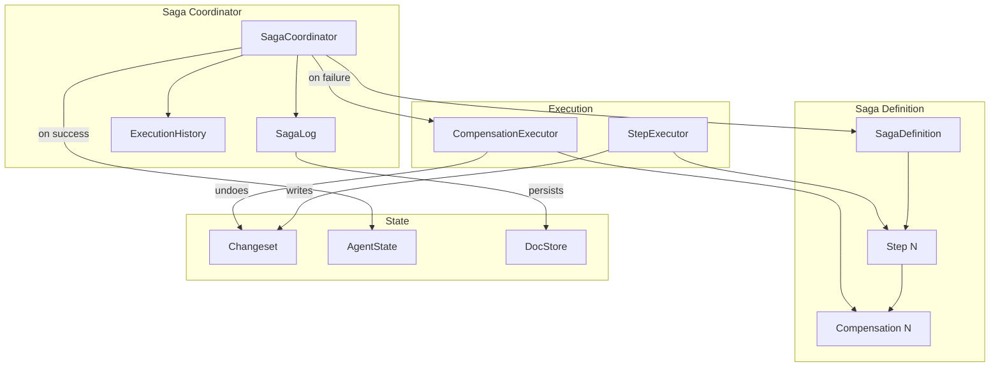

# Saga Pattern Architecture

**One-line summary:** Long-running agent operations are sequences of steps with explicit compensation handlers for rollback on failure.

## Core Concept

The Saga pattern models complex agent work as multi-step transactions where each step has a compensating action. When an agent says "I'll refactor this module," that's actually: (1) analyze current code, (2) create new structure, (3) migrate functions, (4) update imports, (5) run tests. If step 4 fails, the saga coordinator invokes compensation for steps 3, 2, 1 in reverse order, returning the system to a consistent state.

This pattern originates from distributed database systems where traditional ACID transactions are impossible across services. Instead of all-or-nothing locks, sagas embrace eventual consistency through explicit undo operations. For Tavern, this maps directly to the PRD's changeset model: each step writes to an overlay, and compensation means discarding those overlay changes.

The key insight is that agent work is inherently saga-like. An agent doesn't atomically transform code — it executes a series of file reads, analyses, writes, and verifications. By making these steps explicit and pairing each with a compensation action, we gain the ability to gracefully handle partial failures, implement the PRD's "fish or cut bait" triggers with surgical precision, and provide meaningful rollback rather than complete restart.

## Key Components

## Pros

- **Graceful partial failure handling** - When step 4 of 7 fails, undo steps 3, 2, 1 rather than leaving system in inconsistent state

- **Maps naturally to agent work** - Agent tasks are already sequences of discrete operations (read, analyze, write, test)

- **Enables surgical "fish or cut bait"** - Can roll back specific saga without affecting unrelated work

- **Changeset integration** - Compensation often means "discard overlay changes from this step"

- **Explicit reasoning about failure** - Forces upfront design of what happens when each step fails

- **Parallel saga execution** - Multiple independent sagas can run concurrently with isolated failure domains

- **Resumable work** - Saga log enables restart from last successful step after crash

## Cons

- **Compensation design burden** - Every step requires a matching undo action, which may not be straightforward

- **Semantic compensation complexity** - Some actions can't be truly undone (sent messages, external API calls)

- **Coordination overhead** - Saga coordinator adds latency and complexity to every operation

- **Testing multiplication** - Must test both forward path and all compensation paths

- **Eventual consistency** - System may be in inconsistent state during saga execution

- **Log management** - Saga logs grow and require cleanup strategy

## When to Choose This Architecture

**Choose saga pattern when:**

- Operations naturally decompose into discrete steps with clear undo semantics

- Partial failure must be handled gracefully (not just "kill and restart")

- The PRD's changeset/overlay model is implemented (compensation = discard overlay)

- Multiple agents may work on overlapping resources requiring conflict resolution

- Long-running operations need crash recovery (resume from last step)

**Avoid saga pattern when:**

- Operations are atomic or short enough that retry-from-scratch is acceptable

- Compensation is impossible or prohibitively complex for most operations

- Real-time performance is critical (saga overhead too high)

- Team unfamiliar with distributed transaction patterns

- MVP/prototype where simplicity trumps robustness
