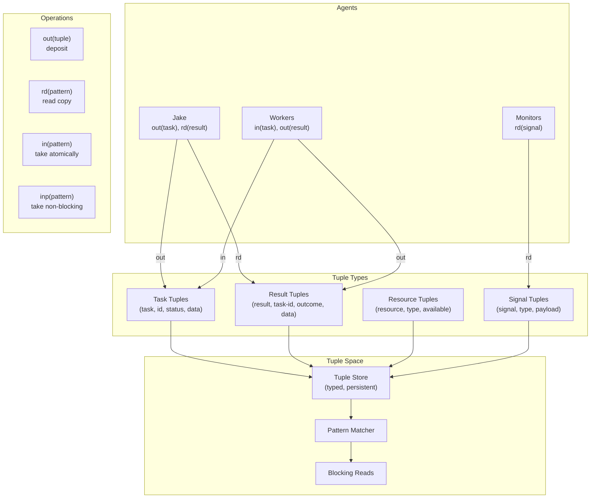

# Tuple Space Architecture

**One-line summary:** Linda-style associative memory where agents coordinate by writing/reading/taking tuples via pattern matching.

## Core Concept

The Tuple Space architecture implements the Linda coordination language model: a shared associative memory where agents communicate indirectly by depositing and retrieving tuples. Unlike direct message passing or explicit delegation, agents interact with an anonymous space -- they neither know nor care which agent produced a tuple they consume. Coordination emerges from matching patterns rather than addressing specific recipients.

In Tavern's context, the tuple space becomes a typed, persistent coordination layer built atop DocStore. Agents write tuples like `("task", "implement-feature-x", "pending", timestamp)` and read or take tuples matching patterns like `("task", _, "pending", _)`. The key primitive operations are: `out` (deposit a tuple), `rd` (read matching tuple without removing), and `in` (read and remove -- atomic claim). This atomicity is crucial: when Agent A takes a task tuple, no other agent can claim it.

The distinction from Blackboard is fundamental: Blackboard is about shared state that multiple agents observe and modify collaboratively. Tuple Space is about anonymous coordination tokens that agents claim exclusively. A Blackboard question region might have multiple agents commenting on the same question; a Tuple Space has agents taking the question tuple to claim ownership of answering it. This makes Tuple Space naturally suited to work distribution, resource allocation, and producer-consumer patterns.

## Key Components

## Pros

- **Atomic claiming prevents conflicts** -- When an agent takes a tuple, it's gone; no race conditions on task assignment

- **Complete decoupling** -- Agents never address each other directly; pure producer-consumer coordination

- **Natural work distribution** -- Multiple workers can `in(task, _, "pending", _)` and each gets exactly one task

- **Temporal decoupling** -- Producer and consumer need not exist simultaneously; tuples persist until claimed

- **Pattern matching expressiveness** -- Wildcards enable flexible queries: "any high-priority task", "any result for my task"

- **Formal semantics** -- Linda has proven properties; reasoning about correctness is tractable

- **Excellent for resource management** -- Tokens representing limited resources (API quota, file locks) naturally model scarcity

## Cons

- **No collaboration on shared state** -- Tuples are claimed exclusively; ill-suited for collaborative editing

- **Matching overhead** -- Pattern matching against large tuple spaces can become expensive

- **Tuple proliferation** -- Without cleanup, spaces accumulate stale tuples

- **Less natural for conversations** -- Multi-turn dialogues require awkward tuple protocols

- **Limited observability** -- Reading (`rd`) shows what's available; harder to see history or flow

- **Schema enforcement complexity** -- Untyped tuples in classic Linda; need discipline for structured data

## When to Choose This Architecture

Choose Tuple Space when:

- **Work distribution is primary** -- Many workers pulling from shared task queues
- **Resources are scarce** -- Tokens represent limited resources that must be claimed atomically
- **Producers and consumers are independent** -- No need for direct agent-to-agent relationships
- **Ordering is less important than fairness** -- Any worker can claim any matching tuple
- **Parallelism is embarrassingly parallel** -- Tasks are independent and don't require coordination during execution

Avoid Tuple Space when:

- **Collaborative editing is needed** -- Multiple agents refining the same artifact requires Blackboard patterns
- **Conversations matter** -- Chat-style interaction with history needs different primitives
- **Strict ordering required** -- FIFO semantics need explicit sequencing tuples
- **Rich queries needed** -- Pattern matching is limited compared to full query languages
