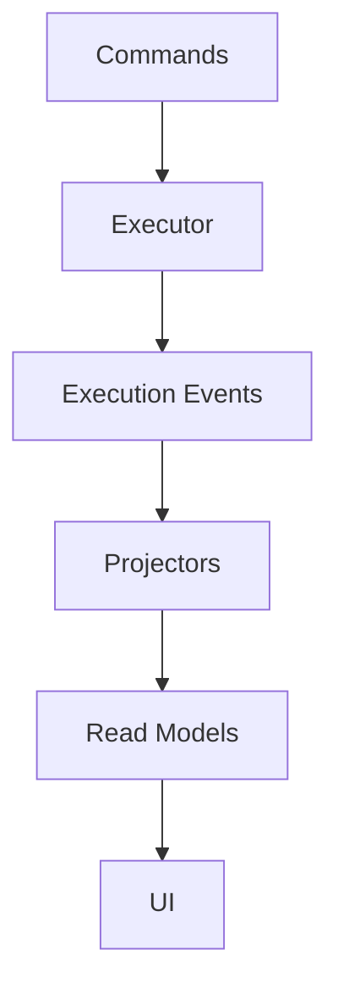

# Command Sourcing Architecture: Complete Analysis

This document contains the full research, analysis, and trade-off considerations for adopting a command-sourced architecture in Tavern.


## Research Findings


### Current State Management Patterns

The codebase currently uses several state management approaches that blend command issuance with state mutation:


**Message Sending (ChatViewModel)**

When a user sends a message, the flow is:

```swift
// ChatViewModel.swift
public func sendMessage() async {
    let text = inputText.trimmingCharacters(in: .whitespacesAndNewlines)
    guard !text.isEmpty else { return }

    inputText = ""  // Immediate UI update
    messages.append(userMessage)  // Optimistic update

    let response = try await agent.send(text)  // Execute command
    messages.append(agentMessage)  // Record result
}
```

The "command" (send this text) is immediately executed. There's no intermediate storage of the intent separate from the execution. If the command fails, there's no record of what was attempted beyond the UI state.


**Agent Spawning (TavernCoordinator)**

```swift
// TavernCoordinator.swift
public func spawnAgent(assignment: String, selectAfterSpawn: Bool = true) throws -> MortalAgent {
    let agent = try spawner.spawn(assignment: assignment)
    agentListViewModel.cacheAssignment(agentId: agent.id, assignment: assignment)
    // ... update state
}
```

The spawn command (`assignment: String`) is passed directly to the spawner. The assignment is cached for display, but the original command (spawn with this assignment, this model, these constraints) is not persisted as a first-class entity.


**Agent State Transitions (MortalAgent)**

```swift
// MortalAgent.swift
private func checkForCompletionSignal(in response: String) async {
    let upperResponse = response.uppercased()
    if upperResponse.contains("DONE") || upperResponse.contains("COMPLETED") {
        await handleCompletionAttempt()
    }
}
```

State transitions happen reactively based on response content. The "command" that triggered the transition (the prompt that led to "DONE") is implicitly linked but not stored as a discrete, replayable unit.


**Session Persistence (SessionStore)**

```swift
// SessionStore.swift
public static func saveJakeSession(_ sessionId: String?, projectPath: String) {
    let key = jakeSessionKey(for: projectPath)
    defaults.set(id, forKey: key)
}
```

Only the current session ID is persisted. The sequence of commands that built that session is delegated to Claude CLI's native storage (which stores events/messages, not the user's original commands).


### Key Observations

1. **Commands and execution are tightly coupled** -- No separation between "intent to do X" and "actually doing X"

2. **No command replay capability** -- Cannot re-execute a sequence of user actions with modifications

3. **Intent is lost on failure** -- If `agent.send()` fails, the original prompt is only in the UI state

4. **Assignments are cached, not stored** -- The `cacheAssignment()` call is a display optimization, not a command record

5. **Claude CLI is the implicit event store** -- Session history (events) lives in external JSONL files; Tavern doesn't own this data


## How Command Sourcing Differs from Event Sourcing


### The Fundamental Distinction

| Aspect | Event Sourcing | Command Sourcing |
|--------|----------------|------------------|
| **What is stored** | Facts: what happened | Intent: what was requested |
| **Mutability** | Immutable after emission | Mutable until executed |
| **Replay semantics** | Deterministic: same events = same state | Non-deterministic: same commands may produce different results |
| **Undo model** | Emit compensating event | Don't execute / rollback command |
| **Time travel** | Project state from events | Re-execute commands from checkpoint |
| **"What if" scenarios** | Requires branching event stream | Native: edit command and re-execute |

The existing Event Sourcing proposal (#05) describes:

> Event sourcing treats the event log as the single source of truth. Instead of storing current state directly, we store a sequence of events describing what happened: AgentSpawned, MessageSent, CommitmentAdded, StateChanged, etc.

Command Sourcing instead stores:

> The sequence of commands describing what was requested: SpawnAgentCommand, SendMessageCommand, AddCommitmentCommand, etc.

Events are *past tense* (MessageSent -- it happened). Commands are *imperative* (SendMessage -- do this).


### Practical Example: Rewind Scenario

**Event Sourcing Rewind:**

1. Replay events up to checkpoint time T
2. State at T is reconstructed
3. To continue differently, branch from T with new events
4. Original events remain (you can return to them)

**Command Sourcing Rewind:**

1. Find command N that you want to redo differently
2. Edit command N (change the prompt text, model selection, etc.)
3. Re-execute from command N forward
4. New execution produces new events/state
5. Original command can be preserved or replaced


### When Each Shines

**Event Sourcing excels when:**
- You need to answer "what exactly happened at time T?"
- Audit trail of actual outcomes is critical
- Events are the natural domain language (transactions, state changes)
- Replay must be deterministic

**Command Sourcing excels when:**
- You need to answer "what was the user/agent trying to do?"
- "What if we had done X differently?" is a common question
- Commands naturally have parameters that can be tweaked
- The execution context (LLM responses, external APIs) is non-deterministic anyway


## Mapping to PRD Requirements


### Section 13: Rewind and Branch

> General capability to checkpoint, tweak prompt, fork new timeline. Works at both agent and changeset level.

Command Sourcing directly enables "tweak prompt" because prompts are stored as commands:

```swift
struct SendMessageCommand: Command {
    let agentId: UUID
    let content: String
    let timestamp: Date
    var status: CommandStatus  // .pending, .executing, .executed, .failed

    // For replay/edit
    var originalContent: String?  // If edited
    var executionResult: ExecutionResult?
}
```

To tweak a prompt:
1. Find the SendMessageCommand at the rewind point
2. Modify `content`
3. Mark commands after it as `.pending` again
4. Re-execute from that point


### Section 4.2: Agent States and Transitions

Commands map naturally to state transitions:

```swift
enum AgentCommand: Command {
    case spawn(SpawnAgentCommand)
    case sendMessage(SendMessageCommand)
    case addCommitment(AddCommitmentCommand)
    case verifyCommitments(VerifyCommitmentsCommand)
    case markDone(MarkDoneCommand)
    case dismiss(DismissAgentCommand)
}
```

Each command, when executed, may trigger state transitions. The command is the cause; state change is the effect. Storing commands preserves causality.


### Section 4.5: The Document Store

> The doc store IS the filesystem. A file is a document.

Commands can be stored as documents:

```
.tavern/commands/
├── 2026-01-24T10-30-00_spawn-agent-gandalf.json
├── 2026-01-24T10-30-05_send-message-jake.json
├── 2026-01-24T10-30-10_send-message-gandalf.json
└── ...
```

Each command file contains:
- The command type and parameters
- Timestamp and sequence number
- Execution status
- Execution result (optional, for replay verification)


### Section 4.7: Deterministic Shell

> Minimizing reliance on non-deterministic LLM behavior

Command Sourcing acknowledges that LLM responses are non-deterministic, so:
1. Store the command (deterministic input)
2. Store the execution result (capture the non-deterministic output)
3. On replay, offer choice: re-execute fresh OR use cached result

This is similar to how property-based testing captures shrunk failure cases.


### Section 6.3: Work Queues

> Parents create them. Agents attach at spawn or mid-task.

Work queues are naturally command queues:

```swift
struct WorkQueue {
    let id: UUID
    var pendingCommands: [AgentCommand]
    var executedCommands: [AgentCommand]
}
```

Commands are added to `pendingCommands`, executed by attached agents, and moved to `executedCommands`. This matches the PRD's model exactly.


### Section 12: Fish or Cut Bait

> Triggers to kill and restart rather than continue

Command Sourcing enables an alternative: instead of killing an agent going down the wrong path, rewind to a good checkpoint and continue from there with a better prompt. The command history provides natural checkpoints.


### Section 17: Testability Requirements

> Every feature must be testable

Command logs are highly testable:
- Commands can be serialized and replayed in tests
- Execution results can be mocked
- Test scenarios are reproducible sequences of commands
- "What if" tests are natural: execute same commands with different mocks


## Trade-offs Considered


### Non-Determinism Challenge

The biggest challenge with Command Sourcing is that re-executing commands may produce different results. When you send the same prompt to Claude, you get a different response.

**Mitigation strategies:**

1. **Capture and replay results**
   ```swift
   struct SendMessageCommand {
       let prompt: String
       var cachedResponse: String?  // From previous execution
       var replayMode: ReplayMode   // .fresh, .useCached, .useCachedWithFallback
   }
   ```

2. **Seed-based determinism** (where available)
   - Some LLM providers offer temperature=0 or seed parameters
   - Not universally available, but useful when supported

3. **User choice at replay time**
   - "Do you want to re-execute this command fresh or use the cached response?"
   - Appropriate for interactive rewind scenarios

4. **Hybrid approach**
   - Store commands AND events
   - Commands for replay/edit capability
   - Events for audit trail of what actually happened


### External Side Effects

Commands may trigger side effects beyond Tavern's control:
- File system modifications
- Git commits
- External API calls
- Process execution

**Mitigation strategies:**

1. **Changeset isolation** (PRD Section 4.6)
   - File writes go to overlay
   - Replay can reset overlay
   - Only "apply changeset" has permanent effect

2. **Effect tracking**
   ```swift
   struct CommandExecution {
       let command: Command
       let result: ExecutionResult
       let sideEffects: [SideEffect]  // What external things changed
   }
   ```

3. **Reversible vs. irreversible classification**
   - Mark commands as `.reversible` or `.irreversible`
   - Warn user before replaying past irreversible commands


### Two Storage Layers

Command Sourcing requires maintaining both:
1. **Command Store** -- The log of intents
2. **Execution State** -- Current derived state

This is similar to Event Sourcing's event store + projections, but with different semantics.

**Complexity considerations:**

- Sync issues: commands and state can diverge
- Storage overhead: both layers persist data
- Query complexity: some queries need command history, others need current state

**Mitigation:**

- Clear ownership: Command Store is source of truth for "what was tried"
- State is always derivable from commands (may require re-execution)
- Index commands for common queries (by agent, by type, by time)


### Schema Evolution

Commands must remain executable as the codebase evolves.

```swift
// v1
struct SpawnAgentCommand_v1 {
    let assignment: String
}

// v2 adds model selection
struct SpawnAgentCommand_v2 {
    let assignment: String
    let model: ModelSelection?  // Optional for v1 compatibility
}
```

**Mitigation:**

- Version field in all commands
- Upcast old commands to current schema
- Defaults for new optional fields
- Never remove fields, only deprecate


## Implementation Complexity


### Phase 1: Command Infrastructure (2 weeks)

1. Define `Command` protocol and base types
2. Implement Command Store (JSONL-based, append-only)
3. Create simple command executor framework
4. Migrate `sendMessage()` as proof of concept

```swift
protocol Command: Codable, Identifiable {
    var id: UUID { get }
    var timestamp: Date { get }
    var status: CommandStatus { get set }
    associatedtype Result
}

enum CommandStatus: String, Codable {
    case pending
    case executing
    case executed
    case failed
    case cancelled
}
```


### Phase 2: Agent Commands (2 weeks)

1. Define all agent lifecycle commands
   - SpawnAgentCommand
   - SendMessageCommand
   - AddCommitmentCommand
   - VerifyCommitmentsCommand
   - DismissAgentCommand

2. Implement command handlers
3. Migrate `TavernCoordinator` to issue commands instead of direct mutations
4. Add command execution logging


### Phase 3: Result Capture (2 weeks)

1. Capture execution results alongside commands
2. Implement result caching for replay
3. Add replay mode selection (fresh vs. cached)
4. Handle non-deterministic execution paths


### Phase 4: Rewind/Branch UI (3-4 weeks)

1. Implement command history viewer
2. Add rewind-to-command capability
3. Build command editor UI
4. Implement branch creation from checkpoint
5. Add "what if" preview mode


### Phase 5: Work Queue Integration (2 weeks)

1. Implement work queues as command queues
2. Add command prioritization
3. Implement agent attachment to queues
4. Add empty-queue policies


### Total Estimate: 11-13 weeks

Comparable to Event Sourcing estimate (10-14 weeks), but with different capabilities:
- Event Sourcing: Better audit trail, deterministic replay
- Command Sourcing: Better "what if" scenarios, editable intent


## Migration Path from Current State


### Step 1: Wrap Existing Operations in Commands

Without changing behavior, wrap current operations:

```swift
// Before
public func sendMessage() async {
    let response = try await agent.send(text)
}

// After
public func sendMessage() async {
    let command = SendMessageCommand(agentId: agent.id, content: text)
    commandStore.append(command)
    let response = try await executeCommand(command)
}
```

Commands are logged but execution is unchanged.


### Step 2: Add Result Capture

Capture execution results:

```swift
func executeCommand(_ command: SendMessageCommand) async throws -> String {
    command.status = .executing
    let result = try await agent.send(command.content)
    command.status = .executed
    command.executionResult = .success(result)
    return result
}
```


### Step 3: Implement Replay

Add ability to re-execute commands:

```swift
func replay(from commandIndex: Int, using mode: ReplayMode) async throws {
    let commands = commandStore.commands(from: commandIndex)
    for command in commands {
        switch mode {
        case .fresh:
            try await executeCommand(command)
        case .useCached:
            applyCache(command.executionResult)
        }
    }
}
```


### Step 4: Add Edit Capability

Allow command modification before replay:

```swift
func editCommand(_ commandId: UUID, newContent: String) {
    var command = commandStore.get(commandId)
    command.content = newContent
    command.status = .pending
    commandStore.update(command)
    invalidateCommandsAfter(commandId)
}
```


### Risks and Mitigations

**Risk:** Commands and state diverge during migration
**Mitigation:** Dual-track verification -- compare command replay state with direct state

**Risk:** Performance regression from command logging overhead
**Mitigation:** Async command persistence, batched writes

**Risk:** Non-determinism causes confusion during replay
**Mitigation:** Clear UI indication of fresh vs. cached execution


## Relationship to Other Architectures


### Combining with CQRS (#12)

Command Sourcing pairs naturally with CQRS:
- Commands are the write model (intent store)
- Read models project from executed commands
- Separation enables optimization of each path




### Combining with Event Sourcing (#05)

Hybrid approach: store both commands AND events

```swift
struct ExecutedCommand {
    let command: Command
    let resultingEvents: [Event]  // What happened when command ran
}
```

- Commands enable "what if" and editing
- Events enable audit trail and deterministic replay of past execution
- Best of both worlds, at cost of storage and complexity


### Relationship to Actor Model (#02)

Commands flow naturally through actor boundaries:
- User sends command to coordinator actor
- Coordinator dispatches to appropriate agent actor
- Agent executes and returns result
- All via async message passing

Actor isolation ensures commands are processed serially per agent.


## Open Questions


### Command Granularity

How fine-grained should commands be?

**Option A: Coarse-grained (user actions)**
```swift
enum UserCommand {
    case sendMessage(agentId: UUID, content: String)
    case spawnAgent(assignment: String)
}
```

**Option B: Fine-grained (system operations)**
```swift
enum SystemCommand {
    case startCogitation(agentId: UUID)
    case updateAgentState(agentId: UUID, newState: AgentState)
    case appendMessage(agentId: UUID, message: ChatMessage)
}
```

Recommendation: Start coarse-grained (user intent), add fine-grained only where needed for replay precision.


### Command vs. Event Boundary

When does a command become an event?

**Option A: Commands all the way down**
- Everything is a command
- Events are just executed commands
- Simpler model, less distinction

**Option B: Commands produce events**
- Commands are intent; events are outcomes
- Store both for different purposes
- More storage, clearer semantics

Recommendation: Start with Option A, evolve to B if audit requirements demand it.


### Replay Determinism

How much non-determinism is acceptable?

- Fully deterministic: Mock all external calls during replay
- Partially deterministic: Use cached LLM responses, fresh tool results
- Non-deterministic: Re-execute everything fresh

Recommendation: User-selectable per replay operation. Default to cached for speed, offer fresh for exploration.


### Command Storage Format

JSONL (like events) or structured database?

**JSONL:**
- Append-only, simple
- Matches Claude CLI pattern
- Harder to query

**SQLite:**
- Queryable
- Transactional
- More complexity

Recommendation: JSONL for v1 (consistency with existing patterns), consider SQLite if query patterns demand it.


## Conclusion

Command Sourcing offers a compelling alternative to Event Sourcing for Tavern's rewind/branch requirements:

1. **Intent preservation** -- Commands capture "what was requested," enabling meaningful replay and editing

2. **Natural "what if"** -- Editing and re-executing commands is the core model, not an afterthought

3. **Work queue alignment** -- PRD's work queues are naturally command queues

4. **Acknowledges non-determinism** -- LLM responses vary; Command Sourcing embraces this rather than fighting it

The main trade-off is that Command Sourcing requires handling non-deterministic replay, while Event Sourcing provides deterministic state reconstruction. For Tavern, where "what if I had prompted differently?" is a natural user question, Command Sourcing may be the better fit.

Recommendation: Consider Command Sourcing if the primary use case is user-directed exploration and steering of agent behavior. Consider Event Sourcing if the primary use case is audit trail and deterministic state reconstruction. Consider a hybrid approach (commands that produce events) if both are important.
