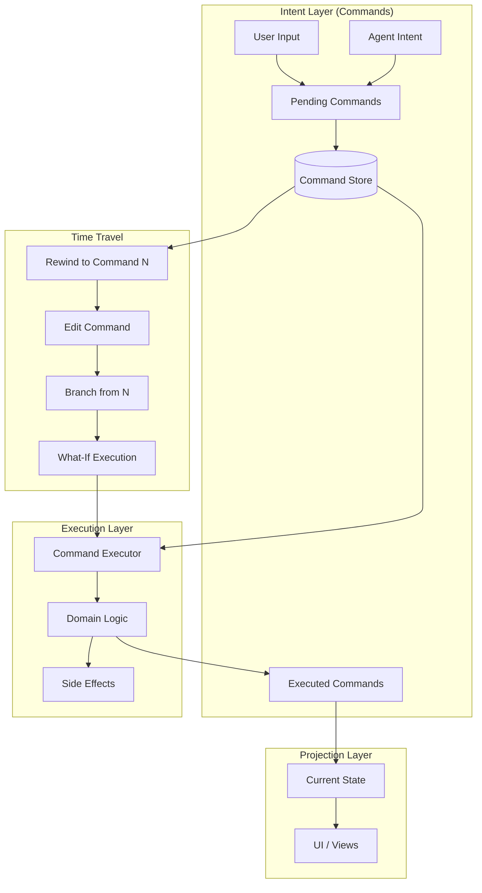

# Command Sourcing Architecture

**One-line summary:** Store what was requested (commands/intent), not what happened (events/facts); commands can be re-executed, modified, or rejected, enabling "what if" scenarios.

## Core Concept

Command Sourcing inverts the Event Sourcing paradigm by storing user and agent *intent* as the primary record rather than the resulting state changes. Where Event Sourcing records "what happened" (AgentStateChanged, MessageSent, CommitmentVerified), Command Sourcing records "what was requested" (SpawnAgent, SendMessage, VerifyCommitment). The event log stores past facts; the command log stores pending and historical intentions.

This distinction is crucial for Tavern's rewind/branch capability. When rewinding, the system doesn't just replay events to reach a prior state -- it re-examines the commands that were issued and allows them to be modified, reordered, or rejected before re-execution. A command like `SpawnAgent(assignment: "Fix the bug")` remains a live entity that can be tweaked to `SpawnAgent(assignment: "Fix the bug with more context")` before replay. Events, once emitted, are immutable facts; commands are mutable intentions.

The architecture separates storage into a Command Store (append-only log of intents) and derived Execution State (what actually happened when commands ran). Re-execution of the command log produces the execution state, but commands themselves remain editable up until they're marked as executed. This enables speculative execution, "what if" branching, and user-directed steering that pure event sourcing cannot easily support.

## Key Components

## Pros

- **Native "what if" scenarios** -- Commands can be modified and re-executed to explore alternative paths without losing the original intent

- **User-directed steering** -- Rewind to command N, tweak the command, and replay from there; enables precise control over agent behavior

- **Intent preservation** -- Records *why* something was attempted, not just *that* it happened; invaluable for debugging agent behavior

- **Deferred execution** -- Commands can be queued, reordered, or batched before execution; supports work queue patterns from PRD Section 6.3

- **Speculative branching** -- Fork command streams to test different approaches without committing to any; merge back the best result

- **Natural undo** -- Undo is "don't execute this command" rather than "emit a compensating event"

- **Audit trail of intent** -- Separate record of what users/agents tried to do vs what the system did in response

## Cons

- **Re-execution side effects** -- If commands have external side effects (API calls, file writes), re-execution may not be idempotent

- **Non-determinism** -- Re-executing the same command may produce different results (LLM responses vary); need to capture or mock non-deterministic inputs

- **Complexity in failure handling** -- Failed commands need careful handling: retry, abort, or manual intervention?

- **Two storage layers** -- Must maintain both command log and execution state; synchronization is critical

- **Query complexity** -- Current state requires projecting executed commands, similar to event sourcing overhead

- **Command schema evolution** -- Changing command formats requires migration strategy; old commands must remain executable

## When to Choose This Architecture

**Choose Command Sourcing when:**

- "What if" exploration is a core use case -- users want to tweak and replay agent actions

- Intent preservation matters more than fact recording -- debugging why an agent attempted something

- Commands are naturally editable units of work (PRD's assignments, prompts, messages)

- Deferred/batched execution is valuable (work queues, merge queues)

- The domain has clear command boundaries (SendMessage, SpawnAgent, VerifyCommitment)

**Avoid Command Sourcing when:**

- Commands have non-idempotent external side effects that cannot be replayed

- Strong auditability of actual outcomes is more important than intentions

- The system needs to answer "what exactly happened at time T?" rather than "what was requested?"

- Re-execution latency is unacceptable (replaying commands may be slower than replaying events)

- Team is more familiar with event sourcing patterns
