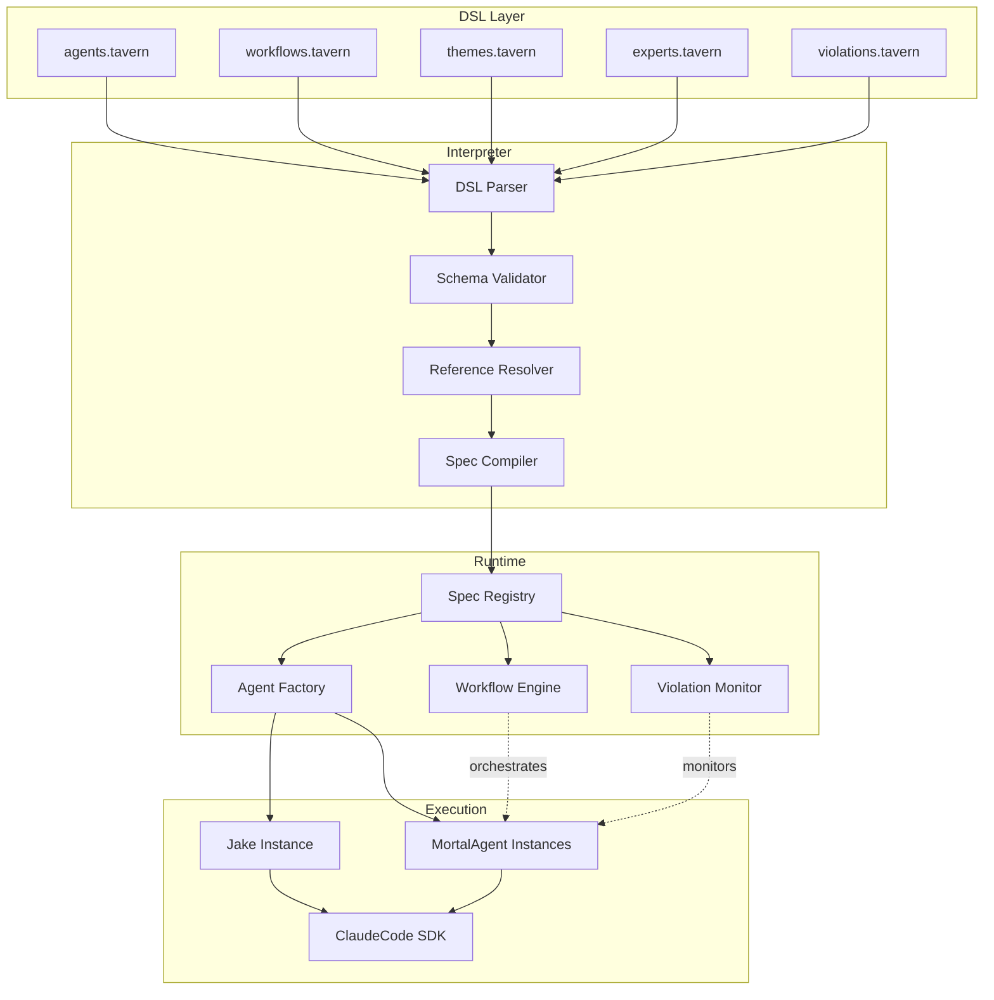

# Interpreter/DSL Architecture

**One-line summary:** Agent behavior, workflows, and verification rules defined in a declarative domain-specific language that is interpreted at runtime, enabling hot-reloading and non-programmer customization.

## Core Concept

The Interpreter/DSL architecture separates agent behavior specification from agent execution. Instead of encoding agent types, workflows, and verification rules in Swift code, these concerns are expressed in declarative configuration files using a purpose-built DSL. A runtime interpreter reads these specifications and instantiates the appropriate agents, wires up workflows, and enforces rules dynamically.

This approach treats the current Swift implementation as the "execution engine" while lifting the "what to do" into human-readable configuration. Jake's personality, mortal agent system prompts, Gang of Experts prompts, workflow templates (Rule of 5, verification layers), naming themes, and commitment assertions all become DSL documents rather than compiled code. The interpreter validates these documents at load time and translates them into runtime behavior.

The key insight is that many of Tavern's configurable elements are already quasi-declarative: NamingTheme is essentially structured data, Jake's systemPrompt is a string, commitments are description+assertion pairs. The DSL formalizes this pattern and extends it to workflows, agent spawning rules, and verification pipelines. Hot-reloading allows users to tweak behavior without recompiling the app.

## Key Components

## Pros

- **Non-programmer customization:** Users can modify agent behavior, add experts, create workflows without touching Swift code

- **Hot-reloading:** DSL files can be reloaded at runtime, enabling rapid iteration without app restart

- **Separation of concerns:** Business logic (what agents do) is cleanly separated from technical implementation (how they do it)

- **Version control friendly:** DSL files are human-readable text, making changes easy to review in PRs

- **Testable specifications:** DSL documents can be validated independently of execution; schema tests catch errors early

- **Progressive disclosure:** Simple configs for simple use cases, advanced syntax available when needed

- **PRD alignment:** The PRD explicitly mentions "workflow templates" and "Gang of Experts prompts" as user-customizable concepts

## Cons

- **Additional abstraction layer:** Another language to design, document, and debug; increases cognitive overhead

- **Runtime errors:** Errors that Swift catches at compile-time become runtime validation failures in DSL

- **Performance overhead:** Interpretation adds latency compared to compiled code (though minimal for LLM-bound work)

- **Tooling requirements:** Good editor support (syntax highlighting, autocomplete, error checking) requires investment

- **Migration complexity:** Existing Swift-encoded behavior must be extracted and rewritten in DSL

- **Debugging difficulty:** Stack traces cross the DSL/Swift boundary, complicating issue diagnosis

- **Feature creep risk:** DSLs tend to grow features until they become general-purpose languages

## When to Choose This Architecture

Choose the Interpreter/DSL architecture when:

1. **User customization is paramount** - The PRD mentions users modifying workflow templates and experts; DSL makes this first-class

2. **Iteration speed matters more than raw performance** - Hot-reloading enables rapid experimentation without compile cycles

3. **You want to enable a plugin ecosystem** - Third parties can share DSL configurations without shipping Swift code

4. **Agent behavior is highly variable** - Different projects, different teams, different workflows; DSL centralizes variation

5. **You're building for non-technical users** - Declarative configs are more approachable than Swift code

Do not choose this architecture if:

- Agent behavior is stable and unlikely to change frequently
- The team is small and comfortable editing Swift directly
- Compile-time safety is more important than runtime flexibility
- The overhead of designing and maintaining a DSL is unacceptable
- Integration with Swift types requires tight coupling that DSL cannot express
