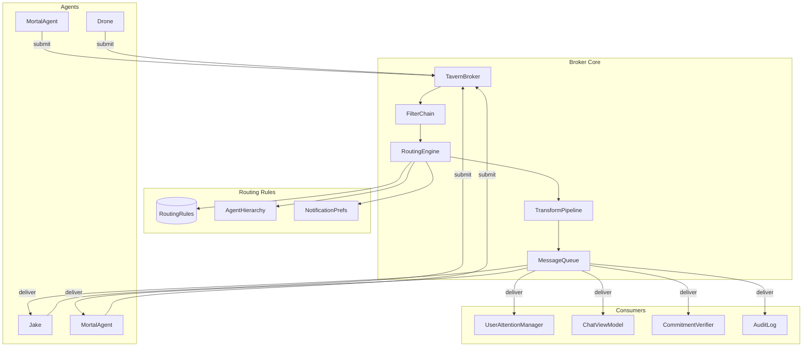

# Broker Pattern Architecture

**One-line summary:** All agent communication flows through a central broker that routes, filters, transforms, and queues messages based on configurable routing rules.

## Core Concept

The Broker Pattern introduces an intermediary component that mediates all communication between agents, between agents and the user, and between agents and system services. Unlike the Message Bus (proposal 15) where components publish to topics and subscribers receive all matching messages, the Broker is an active participant that inspects each message and makes explicit routing decisions.

The broker does not simply relay messages; it owns the routing logic. When a child agent raises a question, the broker consults routing rules to determine whether to forward it to the parent agent, aggregate it with other pending questions, escalate directly to the user, or hold it for later delivery. The broker can transform messages in transit (adding context, stripping sensitive data), filter them (suppressing duplicate requests), queue them (for batch delivery or rate limiting), and apply cross-cutting concerns (logging, authorization, metrics).

This architecture maps naturally to the PRD's bubbling requirements (Section 5.3), where routing is "context-dependent, based on zoom level and user attention." The broker embodies this context: it knows which agent the user is viewing, what questions are pending, and how parent agents have configured their notification policies. Rather than encoding routing logic in each agent or in a distributed routing configuration, the broker centralizes it in one place where it can be inspected, tested, and modified.

## Key Components

## Pros

- **Centralized routing logic** - All routing decisions happen in one place; no distributed configuration to synchronize

- **Active mediation** - Broker can queue, batch, rate-limit, and transform messages; not just passive relay

- **Cross-cutting concerns in one place** - Logging, authorization, metrics, and error handling applied uniformly

- **Natural bubbling implementation** - Broker traverses agent hierarchy, applies parent preferences, and decides escalation path

- **Testable routing** - Routing rules can be unit tested independently of agents; deterministic behavior

- **Runtime reconfiguration** - Routing rules can change without restarting agents; dynamic policy updates

- **Filtering and deduplication** - Broker can suppress duplicate questions, aggregate similar requests, or batch notifications

## Cons

- **Single point of failure** - If the broker fails, all communication stops; requires careful reliability design

- **Potential bottleneck** - All messages flow through one component; must be efficient

- **Added latency** - Each message incurs broker processing overhead; may matter for high-frequency operations

- **Complexity for simple cases** - Direct method calls are simpler when routing is static and known at compile time

- **Requires explicit enrollment** - All components must be modified to submit through the broker; no implicit routing

- **State management** - Broker must track in-flight messages, pending queues, and routing state; non-trivial

- **Debugging indirection** - "Why did this message go there?" requires understanding broker rules, not just code

## When to Choose This Architecture

Choose the Broker Pattern when:

- **Routing decisions are complex and context-dependent** - The PRD describes bubbling, parent-controlled notification, and user attention awareness that require active routing logic

- **Cross-cutting concerns must be applied uniformly** - Logging, rate limiting, authorization, and metrics should not be duplicated across agents

- **Messages need transformation or enrichment** - Adding context (user presence, agent depth, timestamp) to messages in transit

- **Queuing and batching are requirements** - Parent agents want periodic summaries rather than immediate forwarding

- **Routing rules should be modifiable at runtime** - Policy changes without code changes or restarts

- **The system needs an audit trail** - All messages pass through a single point that can log them

Avoid the Broker Pattern when:

- Communication is simple and static (current v1 scope with direct agent-to-user chat)

- Latency is critical and broker overhead is unacceptable

- The team prefers explicit point-to-point calls over centralized mediation

- Failure domains need isolation (broker failure affects all communication)
