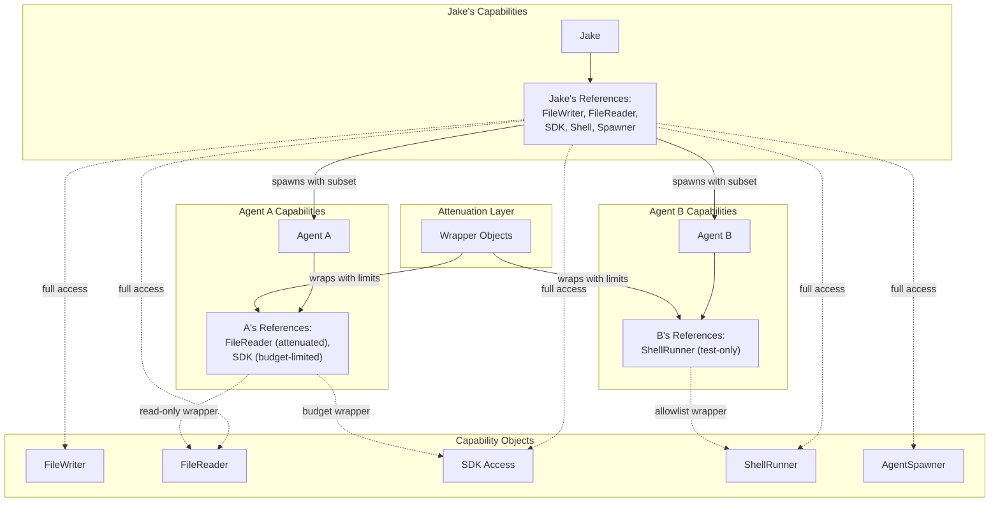

# Object Capability Model Architecture

**One-line summary:** Capabilities are unforgeable object references; having a reference IS the permission — no tokens, no registry, no policy checks needed.

## Core Concept

The Object Capability Model (OCaM) originates from the E programming language and represents a more fundamental approach to capability security than token-based systems. The core insight is profound: **access control is reference control**. If an agent has a reference to an object, that reference IS the capability. If the agent doesn't have the reference, it cannot even name the protected resource, let alone access it.

This differs fundamentally from Capability-Based (#7) which uses tokens checked by a registry. In OCaM, there is no separate checking step. The `FileWriter` object itself embodies the capability to write files. You cannot write a file without having a `FileWriter` reference — and you cannot obtain that reference without someone explicitly passing it to you. References cannot be forged, guessed, or manufactured from thin air.

The power of this model emerges from three principles: (1) **Designation is authorization** — naming something grants access to it; (2) **No ambient authority** — nothing is globally accessible; agents start with nothing; (3) **Capabilities flow through explicit channels** — parents pass capabilities to children at spawn time. This creates a mathematical guarantee: if an agent misbehaves, trace back who gave it the capability. The blame is always traceable to explicit delegation.

## Key Components

## Pros

- **Unforgeable by construction** — No token validation needed; type system prevents forging references

- **No ambient authority** — Agents cannot access global singletons; everything must be passed explicitly

- **Traceable delegation** — If an agent has a capability, someone gave it to them; audit trail is automatic

- **Attenuation** — Parents can wrap capabilities to restrict before passing (read-only, budget-limited, path-restricted)

- **Zero checking overhead** — Having the reference IS the check; no registry lookups at runtime

- **Compile-time guarantees** — Swift's type system can encode capability constraints; wrong code won't compile

- **Natural Swift fit** — Swift's strong reference semantics and lack of global mutation make OCaM implementation clean

## Cons

- **Reference passing discipline required** — Every resource access must flow through explicit parameters; viral changes

- **Initialization complexity** — Jake must receive all root capabilities at app start; bootstrap is intricate

- **No revocation** — Once a reference is passed, it cannot be "unshared" (mitigation: wrapper objects with revocation flags)

- **Debugging challenges** — "Where did this capability come from?" requires tracing the full call chain

- **Unfamiliar pattern** — Most Swift developers haven't seen pure OCaM; onboarding cost

- **Dynamic capabilities harder** — Runtime capability decisions require factory patterns rather than simple grants

## When to Choose This Architecture

Choose Object Capability Model when:

1. **Maximum security assurance is needed** — You want mathematical guarantees, not just policy enforcement

2. **Audit trails must be complete** — Every capability must trace back to explicit delegation

3. **Compile-time safety is paramount** — You want the type system to prevent unauthorized access

4. **No global state is acceptable** — You're willing to plumb every dependency explicitly

5. **Swift's reference semantics are already embraced** — Your team is comfortable with explicit dependency injection everywhere

Avoid when:

- Rapid prototyping is the priority (the discipline overhead slows iteration)
- Dynamic capability decisions at runtime are frequent
- Global configuration/singletons are deeply embedded in the codebase
- The team prefers convention over explicit plumbing
