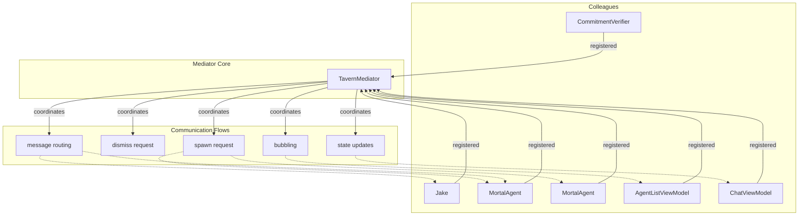

# Mediator Pattern Architecture

**One-line summary:** A central mediator coordinates all inter-object communication; components never reference each other directly, reducing coupling and centralizing interaction logic.

## Core Concept

The Mediator Pattern, from the Gang of Four, introduces a central object that encapsulates how a set of objects interact. Instead of objects maintaining references to each other and calling methods directly, they send messages to the mediator, which routes and coordinates responses. This reduces the number of interconnections from O(n^2) to O(n) and localizes all coordination logic in one place.

In Tavern, `TavernCoordinator` already exhibits mediator-like qualities: it orchestrates Jake, AgentSpawner, AgentListViewModel, and ChatViewModels without these components directly referencing each other. The Mediator Pattern proposal formalizes and extends this role. The coordinator becomes the explicit owner of all inter-component communication, including agent-to-agent messaging, bubbling, and user attention management. Components register with the mediator and communicate exclusively through it.

This differs from the Message Bus (#15) and Broker Pattern (#32) in a key way: the mediator is tightly coupled to its colleagues' interfaces and knows their concrete types, whereas buses and brokers decouple through topics or routing rules. The mediator owns interaction logic directly in code, not in configuration. This trades flexibility for simplicity and compile-time safety.

## Key Components

## Pros

- **Centralized coordination logic** - All interaction rules live in one place; no distributed knowledge of who talks to whom

- **Reduced coupling** - Components only know the mediator interface, not each other; adding new component types requires no changes to existing components

- **Natural evolution of TavernCoordinator** - The current architecture already follows this pattern partially; formalizing it requires minimal conceptual shift

- **Compile-time safety** - Unlike message buses, the mediator uses typed method calls; errors are caught at compile time

- **Easier debugging** - All coordination flows through one class; breakpoints and logging in the mediator capture all interactions

- **Testable in isolation** - Components can be tested with a mock mediator; the mediator can be tested with mock components

- **Good fit for PRD bubbling model** - Mediator naturally implements the "route to parent, then user" logic described in Section 5.3

## Cons

- **Mediator can become a god object** - All interaction logic accumulates in one class; requires discipline to keep methods focused

- **Tight coupling to mediator interface** - Components depend on the mediator's API; interface changes ripple to all components

- **Less flexible than pub/sub** - Adding new routing rules requires code changes, not configuration

- **Potential single point of complexity** - The mediator must understand all interaction patterns; can become hard to maintain

- **Not suitable for dynamic routing** - If routing rules change at runtime based on policy, a broker or bus is more appropriate

- **Limited to single process** - Mediator pattern assumes in-process communication; distributed agents need different patterns

## When to Choose This Architecture

Choose the Mediator Pattern when:

- **Interaction patterns are well-defined and stable** - The PRD describes clear flows: spawn, dismiss, bubble, verify. These are unlikely to change frequently.

- **The current architecture already approximates a mediator** - TavernCoordinator owns Jake, Spawner, and ViewModels. Formalizing this requires less refactoring than introducing a bus or broker.

- **Compile-time type safety is valued over runtime flexibility** - Method calls catch errors at compile time; topic mismatches in a bus only fail at runtime.

- **The team prefers explicit code over configuration** - Routing logic in Swift methods is debuggable and grep-able; routing rules in config files are not.

- **The system runs in a single process** - All agents and components live in the same Swift app; no distributed coordination needed yet.

Avoid the Mediator Pattern when:

- Routing rules should be configurable at runtime without code changes

- The system will grow to many distinct component types with complex interaction permutations

- Distributed agents across processes or machines are a near-term requirement

- The team prefers event-driven architectures with loose coupling
