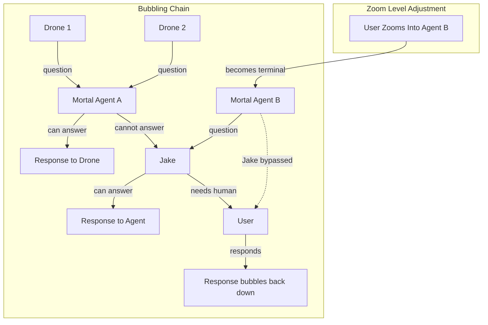
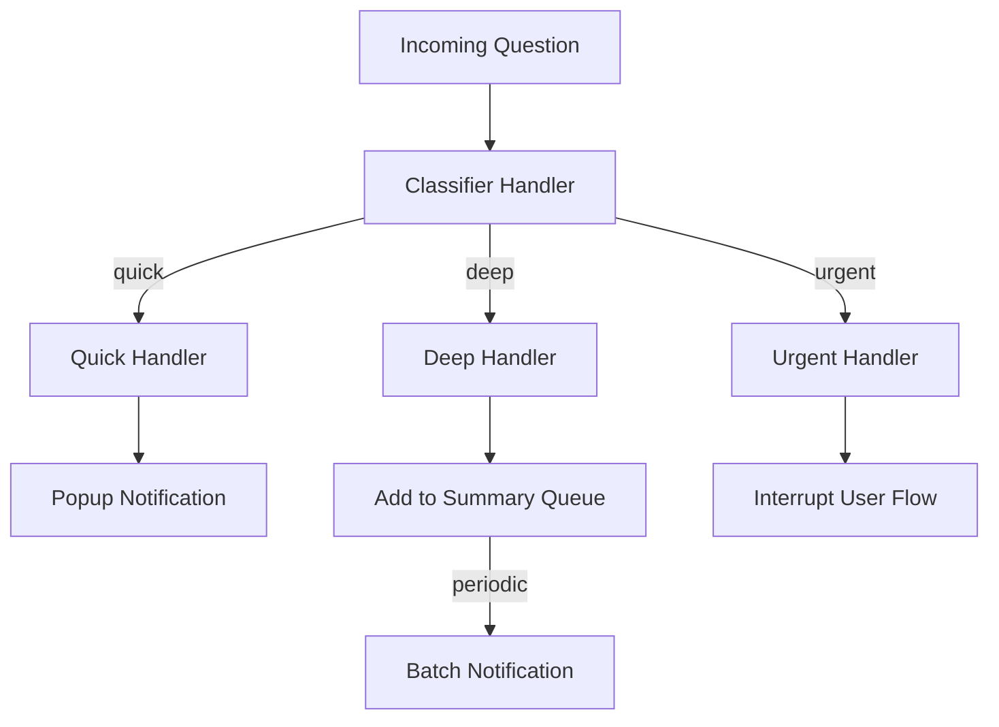

# Chain of Responsibility Architecture: Complete Analysis

This document contains the full analysis and reasoning behind the Chain of Responsibility architectural proposal for The Tavern at the Spillway.


## Research Findings


### Current Codebase State

The existing Tavern implementation has structures that could support Chain of Responsibility:

**Agent Hierarchy:**
- `Jake` - Eternal top-level agent, one per project (potential chain terminal)
- `MortalAgent` - Task-scoped workers (intermediate handlers)
- Future: `Drone` (request originators) and `Monitor Daemons` (specialized handlers)

**Current Communication Flow:**
- `ChatViewModel` wraps agents and manages message sending
- `TavernCoordinator` routes messages to the appropriate agent based on selection
- No inter-agent communication exists - all messages go user-to-agent directly
- No mechanism for agents to "bubble up" questions to parents

**Existing Request/Response Pattern:**
```swift
// Current: User sends directly to agent
public func send(_ message: String) async throws -> String {
    // Agent processes and returns response
    // No chain, no passing to other handlers
}
```

**Agent Protocol (potential Handler base):**
```swift
public protocol Agent: AnyObject, Identifiable, Sendable {
    var id: UUID { get }
    var name: String { get }
    var state: AgentState { get }
    func send(_ message: String) async throws -> String
    func resetConversation()
}
```

**State Management:**
- `AgentState` enum: `idle`, `working`, `waiting`, `verifying`, `done`
- `waiting` state implies agent needs input - this is where bubbling would trigger
- No explicit "pending question" or "awaiting decision" tracking

**Relevant Infrastructure:**
- `TavernLogger` categories provide tracing (would help debug chain traversal)
- `AgentRegistry` tracks all agents (could provide chain membership lookup)
- `AgentSpawner` creates agents (could configure successor relationships)


### Gang of Four Chain of Responsibility Pattern

The original pattern from Design Patterns (GoF):

**Intent:** Avoid coupling the sender of a request to its receiver by giving more than one object a chance to handle the request. Chain the receiving objects and pass the request along the chain until an object handles it.

**Structure:**

```
Client ──► Handler ──► Handler ──► Handler
              │            │            │
              ▼            ▼            ▼
          handleRequest handleRequest handleRequest
              │            │            │
              └───► successor ─► successor ─►
```

**Participants:**
- **Handler**: Defines interface for handling requests; optionally implements successor link
- **ConcreteHandler**: Handles requests it is responsible for; can access successor; either handles or forwards
- **Client**: Initiates request to a ConcreteHandler on the chain

**Consequences:**
1. Reduced coupling between sender and receiver
2. Added flexibility in assigning responsibilities to objects
3. Receipt isn't guaranteed - request can fall off the end of the chain

**Classic Implementation:**

```swift
protocol Handler {
    var successor: Handler? { get set }
    func handleRequest(_ request: Request) -> Response?
}

class ConcreteHandler: Handler {
    var successor: Handler?

    func handleRequest(_ request: Request) -> Response? {
        if canHandle(request) {
            return processRequest(request)
        } else if let next = successor {
            return next.handleRequest(request)
        } else {
            return nil  // Unhandled
        }
    }

    private func canHandle(_ request: Request) -> Bool { ... }
    private func processRequest(_ request: Request) -> Response { ... }
}
```


### Variations and Extensions

**Pure Forwarding Chain:**
Every handler processes the request (logging, enrichment) then passes it on. The terminal handler produces the final result.

**First-Match Chain:**
Classic GoF - first handler that can process the request handles it, breaking the chain.

**Hybrid Chain:**
Handlers can partially process (enrich, classify) and still forward. Common in middleware patterns.

**Bidirectional Chain:**
Requests go up the chain; responses flow back down. Each handler can modify the response on its way back.

**Event-Based Chain:**
Handlers subscribe to request events. Routing is implicit based on subscription rather than explicit successor links.


## Mapping to PRD Requirements


### Bubbling (Section 5.3)

PRD describes bubbling as context-dependent routing:
> Routing is context-dependent, based on zoom level and user attention. CEO model: delegate most things, pay closer attention to specific teams when needed.
> - Can be upward (child to parent to grandparent to user)
> - Can be lateral (siblings collaborating)
> - Can be direct to user (with oversight)

**Chain of Responsibility Mapping:**



**Implementation Sketch:**

```swift
protocol QuestionHandler: Actor {
    var successor: QuestionHandler? { get set }
    func handleQuestion(_ question: AgentQuestion) async -> QuestionResponse
}

struct AgentQuestion {
    let originatorId: UUID
    let content: String
    let classification: QuestionClassification
    let context: [String: Any]
    let chainPath: [UUID]  // Track traversal for debugging
}

enum QuestionResponse {
    case answered(String)
    case forwarded(to: UUID)
    case needsHuman(classification: NotificationPriority)
    case unhandled
}

actor MortalAgentHandler: QuestionHandler {
    let agent: MortalAgent
    var successor: QuestionHandler?

    func handleQuestion(_ question: AgentQuestion) async -> QuestionResponse {
        // Add ourselves to chain path for tracing
        var enrichedQuestion = question
        enrichedQuestion.chainPath.append(agent.id)

        // Can we answer this?
        if await canAnswer(question) {
            let answer = await formulate(question)
            return .answered(answer)
        }

        // Pass to successor (parent or Jake)
        guard let next = successor else {
            return .needsHuman(classification: .medium)
        }

        return await next.handleQuestion(enrichedQuestion)
    }

    private func canAnswer(_ question: AgentQuestion) async -> Bool {
        // Check if question is within our assignment scope
        // Check if we have necessary context
        // Check if we're authorized to make this decision
        ...
    }
}
```

**Lateral Communication:**

For sibling-to-sibling communication, the chain model extends with routing:

```swift
actor JakeHandler: QuestionHandler {
    var successor: QuestionHandler?  // User
    var children: [UUID: QuestionHandler] = [:]

    func handleQuestion(_ question: AgentQuestion) async -> QuestionResponse {
        // Check if this should route to a sibling instead of up
        if let targetSibling = determineTargetSibling(question) {
            return await children[targetSibling]?.handleQuestion(question) ?? .unhandled
        }

        // Standard upward bubbling
        if await canAnswer(question) {
            return .answered(await formulate(question))
        }

        return await successor?.handleQuestion(question) ?? .needsHuman(classification: .high)
    }
}
```


### Question Triage (Section 5.5)

PRD requirement:
> Questions classified as quick vs deep
> Notifications convey complexity so user knows what they're getting into
> Parent agent chooses notification approach for its children (popup vs periodic summary)

**Chain of Responsibility Mapping:**

Question triage is a specialized chain where handlers classify and route:



**Implementation:**

```swift
protocol TriageHandler {
    var successor: TriageHandler? { get set }
    func triage(_ question: AgentQuestion) async -> TriageResult
}

enum TriageResult {
    case routed(to: NotificationChannel, priority: NotificationPriority)
    case classified(as: QuestionClassification, passTo: TriageHandler)
    case handled
}

enum NotificationChannel {
    case popup
    case summaryQueue
    case interrupt
    case agentContext  // Handle within agent chat, don't notify user
}

actor ClassifierHandler: TriageHandler {
    var successor: TriageHandler?
    let classifier: QuestionClassifier  // ML model or heuristics

    func triage(_ question: AgentQuestion) async -> TriageResult {
        let classification = await classifier.classify(question)
        question.classification = classification

        // Route to appropriate handler based on classification
        switch classification {
        case .quick:
            return .classified(as: .quick, passTo: quickHandler)
        case .deep:
            return .classified(as: .deep, passTo: deepHandler)
        case .urgent:
            return .classified(as: .urgent, passTo: urgentHandler)
        case .routine:
            // Try to handle without user involvement
            return await successor?.triage(question) ?? .routed(to: .summaryQueue, priority: .low)
        }
    }
}

actor QuickHandler: TriageHandler {
    var successor: TriageHandler?

    func triage(_ question: AgentQuestion) async -> TriageResult {
        // Quick questions get popup notifications
        await NotificationService.shared.showPopup(
            title: "Quick question from \(question.originatorName)",
            body: question.content.prefix(100),
            action: .openAgentChat(question.originatorId)
        )
        return .routed(to: .popup, priority: .medium)
    }
}

actor DeepHandler: TriageHandler {
    var successor: TriageHandler?
    let summaryAggregator: SummaryAggregator

    func triage(_ question: AgentQuestion) async -> TriageResult {
        // Deep questions aggregate into periodic summaries
        await summaryAggregator.add(question)
        return .routed(to: .summaryQueue, priority: .low)
    }
}
```

**Parent-Controlled Triage:**

PRD says parent agents choose notification approach for children:

```swift
actor MortalAgentHandler: QuestionHandler {
    // Parent configures how this agent's children notify
    var childNotificationPolicy: NotificationPolicy = .default

    func configureChildNotification(_ policy: NotificationPolicy) {
        self.childNotificationPolicy = policy
    }

    func handleChildQuestion(_ question: AgentQuestion) async -> QuestionResponse {
        // Apply parent-configured policy before bubbling
        switch childNotificationPolicy {
        case .popup:
            question.preferredChannel = .popup
        case .summary:
            question.preferredChannel = .summaryQueue
        case .aggregate(let interval):
            await aggregator.add(question, flushAfter: interval)
            return .forwarded(to: aggregator.id)
        case .silent:
            // Parent handles without user notification
            return await handleQuestion(question)
        }

        return await successor?.handleQuestion(question) ?? .needsHuman(classification: .medium)
    }
}
```


### Attention Model (Section 5.2)

PRD describes attention as zoom level and engagement:
> User sees tabs/UX for agents they're engaged with
> Can zoom in on any agent at any depth
> Zooming in on busy agent: see "cogitating" status, can steer/interrupt/wait

**Dynamic Chain Reconfiguration:**

When user zooms into an agent, they become the terminal handler for that agent's chain:

```swift
actor AttentionManager {
    var currentFocus: UUID?  // Agent user is zoomed into
    var defaultChain: [QuestionHandler]  // Normal bubbling path

    func userZoomedInto(_ agentId: UUID) {
        currentFocus = agentId

        // Reconfigure chain: user becomes immediate successor of focused agent
        if let agentHandler = findHandler(agentId) {
            let userHandler = UserDirectHandler()
            agentHandler.successor = userHandler
        }
    }

    func userZoomedOut() {
        currentFocus = nil

        // Restore normal chain hierarchy
        rebuildDefaultChain()
    }
}
```

**"User Joined" Message Injection:**

PRD mentions deterministic code injecting "user joined" messages:

```swift
actor UserHandler: QuestionHandler {
    var successor: QuestionHandler?
    var activeSession: AgentSession?

    func userJoined(_ session: AgentSession) {
        activeSession = session
        // Inject message so agent knows user is present
        await session.inject(SystemMessage("User has joined the session"))
    }

    func userLeft() {
        if let session = activeSession {
            await session.inject(SystemMessage("User has left the session"))
        }
        activeSession = nil
    }

    func handleQuestion(_ question: AgentQuestion) async -> QuestionResponse {
        if let session = activeSession, session.agentId == question.originatorId {
            // User is directly engaged - show immediately
            await displayToUser(question, immediate: true)
        } else {
            // User not focused here - use normal notification
            await NotificationService.shared.notify(question)
        }
        return .needsHuman(classification: question.classification.priority)
    }
}
```


### Agent Hierarchy and Spawning (Sections 4.1, 6.2)

PRD defines agent types with natural hierarchy:
- Jake (daemon) - top coordinator
- Mortal (task-scoped) - can spawn children
- Drone (single task) - leaf workers

**Chain Construction at Spawn Time:**

```swift
extension AgentSpawner {
    func spawn(assignment: String, parent: QuestionHandler?) throws -> MortalAgent {
        let agent = MortalAgent(name: name, assignment: assignment, claude: claude)
        let handler = MortalAgentHandler(agent: agent)

        // Wire into chain
        if let parentHandler = parent {
            handler.successor = parentHandler
        } else {
            // No parent specified - default to Jake
            handler.successor = jakeHandler
        }

        // Register handler for chain lookup
        handlerRegistry[agent.id] = handler

        try registry.register(agent)
        return agent
    }

    func spawnDrone(task: String, parent: MortalAgentHandler) -> Drone {
        let drone = Drone(task: task, claude: cheapClaude)
        let handler = DroneHandler(drone: drone)

        // Drones always bubble to their parent
        handler.successor = parent

        // Drone registration...
        return drone
    }
}
```


### Operating Modes (Section 4.4)

PRD defines chat mode vs perseverance mode:
> Chat mode - Open chat window, pings user when agent stops
> Perseverance mode - Background thread, system auto-prompts to continue, agent must explicitly request user attention

**Mode-Aware Handlers:**

```swift
actor MortalAgentHandler: QuestionHandler {
    var operatingMode: OperatingMode = .chat

    func handleQuestion(_ question: AgentQuestion) async -> QuestionResponse {
        switch operatingMode {
        case .chat:
            // Normal bubbling - questions go up the chain
            if await canAnswer(question) {
                return .answered(await formulate(question))
            }
            return await successor?.handleQuestion(question) ?? .needsHuman(classification: .medium)

        case .perseverance:
            // Only explicitly flagged questions bubble up
            guard question.requiresUserAttention else {
                // Try to self-resolve or defer
                return await attemptSelfResolve(question)
            }
            // Explicit user attention request - bubble with high priority
            question.classification = .urgent
            return await successor?.handleQuestion(question) ?? .needsHuman(classification: .urgent)
        }
    }

    private func attemptSelfResolve(_ question: AgentQuestion) async -> QuestionResponse {
        // Try answering with best guess
        // Log that we're proceeding without user input
        // Continue working
        return .answered("Proceeding with best judgment: ...")
    }
}
```


## Trade-offs Considered


### Chain vs Direct Reference

**Chain Approach:**
- Agents don't know who handles their questions
- Routing logic centralized in handlers
- Easy to reconfigure without changing agents
- Harder to reason about where requests end up

**Direct Reference:**
- Each agent holds reference to its parent
- Simple `parent.askQuestion()` calls
- Clear ownership but tight coupling
- Difficult to insert intermediate handlers

**Decision:** Chain of Responsibility is preferred for Tavern because:
1. The "zoom in" feature requires dynamic routing reconfiguration
2. Question triage naturally fits the handler chain model
3. Future lateral communication (sibling-to-sibling) is easier to add
4. Matches the PRD's language about "bubbling"


### Synchronous vs Asynchronous Chains

**Synchronous:**
- Request blocks until handled
- Simple to implement and reason about
- Can cause cascading delays
- Natural for request/response patterns

**Asynchronous:**
- Request returns immediately with future/callback
- Better for long-running questions
- More complex state management
- Better matches LLM response times

**Decision:** Asynchronous with Swift actors. Agent questions may require Claude API calls to answer - these must not block the chain.


### Single Chain vs Multiple Chains

**Single Chain:**
- All request types use same handler hierarchy
- Simple to maintain
- May not fit all routing needs

**Multiple Chains:**
- Different chains for questions, errors, notifications, decisions
- Each chain optimized for its request type
- More complex but more flexible

**Decision:** Multiple specialized chains, sharing handler instances:

```swift
class MortalAgentHandler: QuestionHandler, ErrorHandler, NotificationHandler {
    // Same handler participates in multiple chains
    var questionSuccessor: QuestionHandler?
    var errorSuccessor: ErrorHandler?
    var notificationSuccessor: NotificationHandler?
}
```


### Handler Responsibility Scope

**Narrow Handlers:**
- Each handler does one thing
- Many handlers in chain
- Fine-grained control
- More objects to manage

**Wide Handlers:**
- Handlers do multiple things
- Fewer handlers
- Simpler chain
- Less flexibility

**Decision:** Moderate scope - each agent type is a handler, but classification/triage is separate:

```
[Agent Handlers] ──► [Triage Handlers] ──► [Notification Handlers]
```


## Implementation Complexity


### Core Infrastructure Required

**Handler Protocol:**

```swift
public protocol RequestHandler: Actor {
    associatedtype Request
    associatedtype Response

    var successor: (any RequestHandler)? { get set }
    func canHandle(_ request: Request) async -> Bool
    func handle(_ request: Request) async -> Response
}
```

**Chain Builder:**

```swift
public actor ChainBuilder {
    func buildBubblingChain(from agent: Agent) -> [any QuestionHandler] {
        var chain: [any QuestionHandler] = []
        var current: Agent? = agent

        while let c = current {
            if let handler = handlerRegistry[c.id] {
                chain.append(handler)
            }
            current = parentRegistry[c.id]
        }

        // Always end with Jake and User
        chain.append(jakeHandler)
        chain.append(userHandler)

        return chain
    }

    func wireChain(_ handlers: [any QuestionHandler]) {
        for i in 0..<handlers.count - 1 {
            handlers[i].successor = handlers[i + 1]
        }
    }
}
```

**Request Types:**

```swift
public struct AgentQuestion: Sendable {
    let id: UUID
    let originatorId: UUID
    let content: String
    var classification: QuestionClassification
    var context: [String: String]
    var chainPath: [UUID]
    let timestamp: Date
    var requiresUserAttention: Bool
}

public enum QuestionClassification: Sendable {
    case quick      // Can be answered briefly
    case deep       // Requires thought/context
    case urgent     // Needs immediate attention
    case routine    // Can be batched
    case decision   // Requires authorization
}
```


### Estimated Lines of Code

| Component | LOC | Complexity |
|-----------|-----|------------|
| Handler protocols | ~50 | Low |
| AgentHandler base | ~150 | Medium |
| JakeHandler | ~100 | Medium |
| DroneHandler | ~80 | Low |
| UserHandler | ~120 | Medium |
| TriageHandlers | ~200 | Medium |
| ChainBuilder | ~100 | Medium |
| Request types | ~80 | Low |
| Tests | ~500 | Medium |
| **Total** | ~1,380 | **Medium** |


### Integration Points

**TavernCoordinator:**

```swift
@MainActor
public final class TavernCoordinator: ObservableObject {
    // Add chain management
    private let chainBuilder: ChainBuilder
    private var handlerRegistry: [UUID: any QuestionHandler] = [:]

    public func spawnAgent(assignment: String, parent: UUID? = nil) throws -> MortalAgent {
        let agent = try spawner.spawn(assignment: assignment)
        let handler = MortalAgentHandler(agent: agent)

        // Wire into chain
        let parentHandler = parent.flatMap { handlerRegistry[$0] } ?? jakeHandler
        handler.successor = parentHandler
        handlerRegistry[agent.id] = handler

        return agent
    }

    public func userZoomedInto(_ agentId: UUID) {
        // Reconfigure chain
        if let handler = handlerRegistry[agentId] {
            handler.successor = userDirectHandler
        }
        updateAttentionState(focused: agentId)
    }
}
```

**ChatViewModel:**

```swift
@MainActor
public final class ChatViewModel: ObservableObject {
    // Handle questions bubbled to user
    private var pendingQuestions: [AgentQuestion] = []

    func receiveQuestion(_ question: AgentQuestion) {
        pendingQuestions.append(question)
        // Trigger UI update
    }

    func answerQuestion(_ questionId: UUID, answer: String) async {
        guard let question = pendingQuestions.first(where: { $0.id == questionId }) else { return }
        // Send answer back down the chain
        await questionRouter.routeAnswer(question, answer: answer)
    }
}
```


## Migration Path from Current State


### Phase 1: Handler Infrastructure (Non-Breaking)

Add handler protocols and base implementations without changing existing behavior:

```swift
// New files - don't touch existing code
public protocol QuestionHandler: Actor { ... }
public struct AgentQuestion { ... }
public actor MortalAgentHandler: QuestionHandler { ... }
```

**Effort:** 3-4 days
**Risk:** None - purely additive


### Phase 2: Jake Handler Integration

Add chain support to Jake while maintaining existing direct communication:

```swift
// Jake.swift - add optional handler behavior
public final class Jake: Agent, @unchecked Sendable {
    // Existing code unchanged

    // New: handler support
    var questionHandler: JakeHandler?

    func enableChainSupport() {
        questionHandler = JakeHandler(jake: self)
    }
}
```

**Effort:** 2-3 days
**Risk:** Low - handler is optional


### Phase 3: Agent Hierarchy

Extend MortalAgent with parent references and handler wiring:

```swift
public final class MortalAgent: Agent, @unchecked Sendable {
    // Existing properties

    // New: hierarchy support
    weak var parent: Agent?
    var handler: MortalAgentHandler?

    init(..., parent: Agent? = nil) {
        self.parent = parent
        // ... existing init
        self.handler = MortalAgentHandler(agent: self)
        handler?.successor = parent?.handler ?? Jake.shared.handler
    }
}
```

**Effort:** 3-4 days
**Risk:** Medium - touches existing code


### Phase 4: Question Bubbling

Implement actual bubbling behavior - agents can emit questions:

```swift
extension MortalAgent {
    func askQuestion(_ content: String, classification: QuestionClassification = .routine) async -> String? {
        let question = AgentQuestion(
            originatorId: id,
            content: content,
            classification: classification
        )

        let response = await handler?.handle(question)

        switch response {
        case .answered(let answer):
            return answer
        case .needsHuman:
            state = .waiting
            return nil  // Will be answered later
        default:
            return nil
        }
    }
}
```

**Effort:** 4-5 days
**Risk:** Medium - new behavior


### Phase 5: Triage Integration

Add classification and routing handlers:

**Effort:** 3-4 days
**Risk:** Low - new subsystem


### Phase 6: Attention Integration

Connect chain reconfiguration to user zoom behavior:

**Effort:** 2-3 days
**Risk:** Medium - touches UI flow


### Total Migration Estimate

| Phase | Days | Cumulative |
|-------|------|------------|
| 1. Infrastructure | 3-4 | 3-4 |
| 2. Jake Handler | 2-3 | 5-7 |
| 3. Agent Hierarchy | 3-4 | 8-11 |
| 4. Bubbling | 4-5 | 12-16 |
| 5. Triage | 3-4 | 15-20 |
| 6. Attention | 2-3 | 17-23 |

**Total: 17-23 days** for full implementation with tests


## Open Questions


### 1. Response Flow Direction

Chain of Responsibility classically handles requests going one direction. How do responses flow back?

**Options:**
a) Store originator reference, direct response delivery
b) Responses traverse chain in reverse
c) Separate "response chain" for answers

**Recommendation:** Option (a) - store originator ID in question, route answers directly via registry lookup.


### 2. Chain Persistence

Should handler chains be persisted to DocStore for recovery after app restart?

**Considerations:**
- Agents already persist sessions
- Chain structure is derivable from agent hierarchy
- Rebuild chains on launch rather than persist

**Recommendation:** Don't persist chains. Rebuild from agent hierarchy on launch.


### 3. Chain Modification During Traversal

What happens if chain is modified while a request is in flight?

**Options:**
a) Lock chain during traversal (blocks spawning)
b) Snapshot chain at request start
c) Allow modification, accept race conditions

**Recommendation:** Option (b) - snapshot chain path at request creation time.


### 4. Timeout and Cancellation

How long does a question wait at each handler before forwarding?

**Considerations:**
- Handlers involving Claude API calls may take 30+ seconds
- User questions should not wait indefinitely
- Different classifications need different timeouts

**Recommendation:** Configurable timeout per handler, with default escalation on timeout.


### 5. Handler Failure

What happens if a handler throws an error during processing?

**Options:**
a) Fail entire chain, surface error to originator
b) Skip failed handler, continue to successor
c) Retry with backoff, then escalate

**Recommendation:** Option (b) with logging - skip and continue, let terminal handler (user) deal with it.


### 6. Multiple Simultaneous Questions

Can an agent have multiple questions in flight?

**Considerations:**
- Drones may have many questions during a task
- Questions should not block each other
- Need to track which questions are pending

**Recommendation:** Yes, allow multiple questions. Track pending questions per agent in handler state.


### 7. Question Priority Inversion

What if a low-priority question reaches the user before a high-priority one?

**Considerations:**
- Questions traverse at different speeds based on handler processing time
- User sees them in arrival order, not priority order

**Recommendation:** Triage handlers reorder queue before presenting to user.


### 8. Integration with Commitments

Should commitment verification use the chain for failure reporting?

**Considerations:**
- Commitments already have their own verification flow
- Failure reporting could bubble through handlers
- May be over-engineering for v1

**Recommendation:** Keep commitments separate for now. Consider chain integration post-v1.


## Conclusion

Chain of Responsibility provides an elegant architectural fit for Tavern's bubbling and triage requirements. The pattern's core strength - decoupling senders from receivers - maps directly to the PRD's vision of questions flowing through agent hierarchies without tight coupling.

**Strengths for Tavern:**
- Natural fit for child-to-parent-to-user bubbling
- Clean model for question triage (specialized handler chains)
- Supports dynamic reconfiguration (user zoom changes chain)
- Each handler can enrich questions before passing along
- Testable in isolation

**Weaknesses to mitigate:**
- Must handle "no one answered" case explicitly
- Response routing requires additional mechanism
- Debugging chain traversal needs good logging

**Verdict:** Recommended for the bubbling/triage subsystem, potentially combined with another architecture (like Supervisor Trees) for lifecycle management. Chain of Responsibility excels at routing but doesn't address agent creation, failure recovery, or state persistence.
