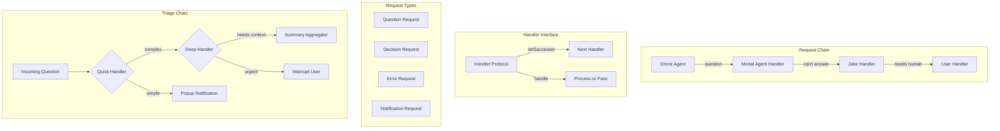

# Architecture Proposal: Chain of Responsibility

**One-line summary:** Requests pass through a handler chain until one handles it - perfect for bubbling questions and routing decisions through agent hierarchies.

## Core Concept

Chain of Responsibility decouples the sender of a request from its receiver by giving multiple objects a chance to handle the request. A request travels along a chain of potential handlers until one accepts responsibility for processing it - or until it reaches the end of the chain.

In Tavern's context, this maps naturally to the PRD's "bubbling" requirement: questions and decisions flow from child agents upward through parent agents to Jake and ultimately to the user. Each level in the hierarchy can either handle the request (answer the question, make the decision) or pass it along. The pattern also applies to Jake's question triage - classifying incoming requests as quick vs deep and routing them to appropriate notification channels.

The key insight is that handlers don't need to know about each other. A drone asking for clarification doesn't know whether its parent mortal agent, Jake, or the user will ultimately respond. It just emits the request, and the chain handles routing. This creates clean separation between request origination and request handling.

## Key Components

**Handler Chain Elements:**

- **AgentHandler**: Each agent acts as a handler; can process requests within its scope or pass upward
- **Request**: Encapsulates the question/decision/notification with context and metadata
- **HandlerChain**: Maintains the succession of handlers based on agent hierarchy
- **TerminalHandler**: User-facing endpoint that surfaces requests to the UI

## Pros

- **Natural fit for bubbling**: PRD explicitly describes child to parent to user routing; Chain of Responsibility is this pattern codified

- **Decoupled agents**: Senders don't know who will handle their requests; handlers don't know where requests originate

- **Dynamic routing**: The chain can be reconfigured at runtime (user zooms into an agent, becomes the new terminal handler)

- **Incremental enrichment**: Each handler can add context before passing along (drone's question gets parent's perspective before reaching user)

- **Clean question triage**: Quick vs deep classification is just a specialized chain with different handlers for each category

- **Testable in isolation**: Each handler can be unit tested without the full chain; mock successors verify pass-through behavior

- **Matches PRD attention model**: User joins/leaves agent sessions by becoming/removing themselves from that agent's handler chain

## Cons

- **No guaranteed handling**: If no handler accepts, the request falls through; must design for this case

- **Debugging complexity**: Tracing a request through multiple handlers requires good logging; not immediately obvious where a request stopped

- **Ordering matters**: Handler precedence affects behavior; misconfigured chains produce wrong results

- **Overhead for simple cases**: If most requests go straight to Jake anyway, the chain adds indirection without benefit

- **State management**: Handlers may need access to shared state to make routing decisions; breaks the pattern's simplicity

- **Not bidirectional by default**: Classic Chain of Responsibility is one-way; responses flowing back require additional mechanism

## When to Choose This Architecture

Choose Chain of Responsibility when:

1. **Routing is hierarchical**: Requests naturally flow through levels of authority or specificity

2. **Multiple handlers are valid**: Any of several objects might handle a request, determined at runtime

3. **Sender independence matters**: You want request originators decoupled from processing logic

4. **Enrichment during routing**: Each handler adds value (context, classification) even if it doesn't fully handle the request

5. **Dynamic reconfiguration**: The chain changes based on user attention, agent state, or configuration

This architecture excels for question bubbling and notification routing but may be overkill if most messages go directly between user and Jake with minimal intermediaries.
