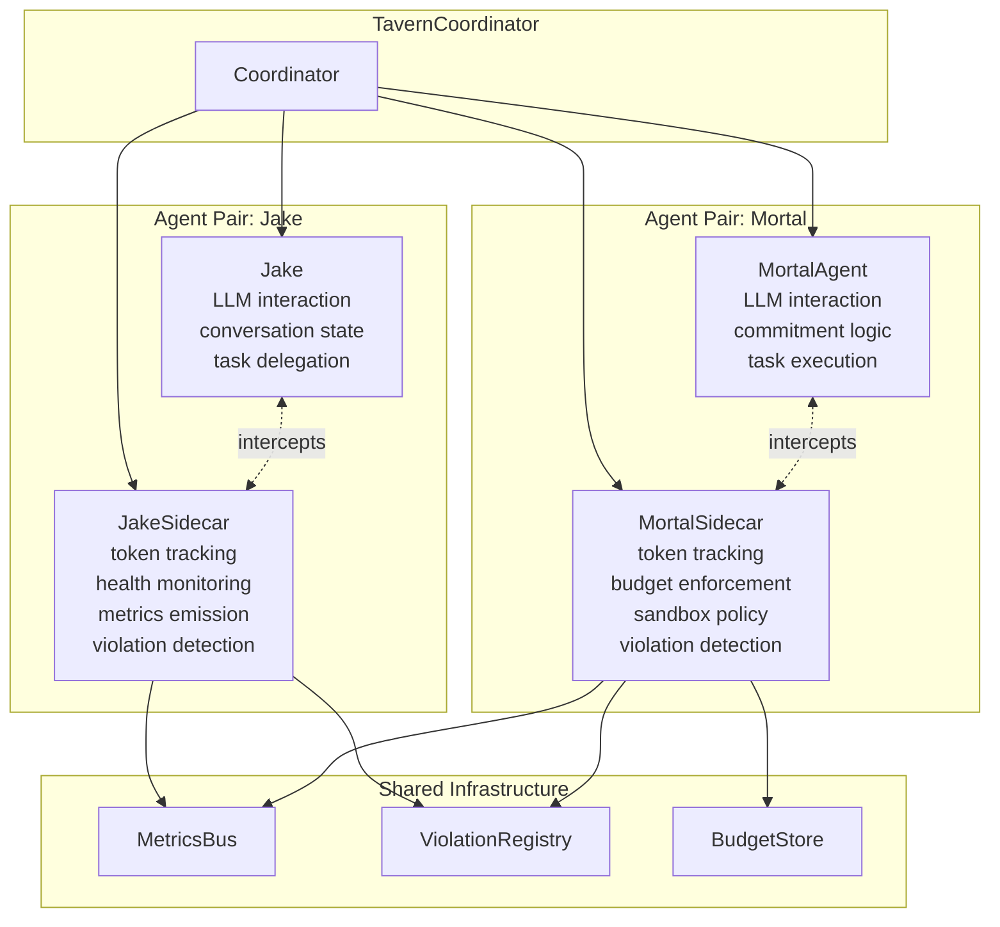

# Architecture Proposal: Sidecar Pattern

**One-line summary:** Each agent has a companion process handling cross-cutting concerns (metrics, monitoring, sandbox enforcement) while the agent focuses on LLM work.

## Core Concept

The Sidecar Pattern separates business logic from operational concerns by pairing each agent with a dedicated companion process. The agent handles its core responsibility - interacting with Claude, processing prompts, managing conversation state. The sidecar handles everything else: token tracking, budget enforcement, violation monitoring, health checks, and metrics collection.

This pattern comes from Kubernetes and microservices architectures, where sidecars handle logging (Fluentd), service mesh (Envoy), security (Vault agent), and observability without contaminating application code. Applied to Tavern, it means Jake and mortal agents remain focused on their domain - understanding tasks, generating responses, managing work - while sidecars enforce the operational invariants the PRD demands.

The key insight is that agents are non-deterministic (LLM behavior varies) while operational concerns are deterministic (budget math, violation rules, timing). Mixing these creates code that's hard to test and reason about. Sidecars create a clean boundary: the agent is pure business logic; the sidecar is pure operations.

## Key Components

**Component Responsibilities:**

- **Agent**: Prompt handling, Claude SDK calls, response parsing, state machine transitions
- **Sidecar**: Request/response interception, token counting, timing measurement, rule enforcement, event emission

## Pros

- **Clean separation of concerns**: Agents stay focused on LLM logic; sidecars own all operational code

- **Independent testability**: Test agent behavior without metrics overhead; test sidecar enforcement without LLM mocking

- **Maps directly to PRD metrics**: Token time, tool time, wall clock, utilization - all naturally computed by sidecars intercepting calls

- **Natural fit for violation monitoring**: Sidecar intercepts every action; perfect place to check against violation rules before execution

- **Observability without contamination**: Agent code has zero logging for metrics/monitoring; that's all in the sidecar

- **Budget enforcement at the boundary**: Sidecar can reject requests before they reach Claude, preventing overspend

- **Pattern proven in production**: Kubernetes ecosystem has validated sidecar pattern at massive scale

## Cons

- **Doubled object count**: Every agent needs a companion sidecar; more objects to manage, more coordination

- **Interception complexity**: Sidecar must intercept all Claude calls without agents bypassing it; requires careful API design

- **Latency overhead**: Every request/response goes through sidecar processing; adds microseconds (acceptable) but also complexity

- **Deployment coupling**: Agent and sidecar must be started/stopped together; adds lifecycle coordination

- **State synchronization**: Sidecar state (token counts, timing) must survive agent restarts; persistence complexity

- **Testing the pair**: While components test independently, integration testing the agent-sidecar pair adds a testing layer

## When to Choose This Architecture

Choose Sidecar Pattern when:

1. **Metrics and monitoring are first-class requirements**: PRD Section 9 demands detailed time/token tracking; sidecars make this trivial

2. **Violation rules are complex and evolving**: Section 16's configurable violations benefit from centralized enforcement in sidecars

3. **Agents should remain pure**: You want agent code to be readable, testable, and focused solely on LLM interaction

4. **Budget enforcement must be bulletproof**: Sidecars can hard-stop requests before they incur API costs

5. **Multiple cross-cutting concerns stack up**: When you need metrics AND monitoring AND violation detection AND budget tracking, sidecar consolidation pays off

This architecture excels when operational requirements are as important as functional requirements - when "runs correctly" matters as much as "behaves correctly."
