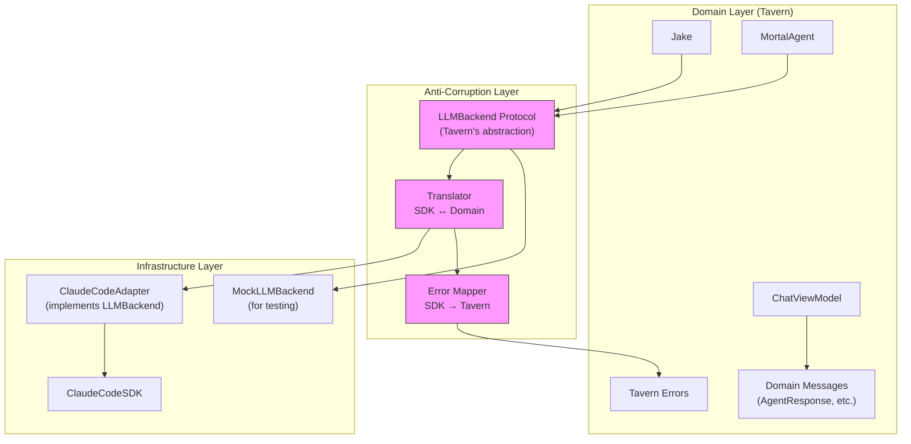

# Anti-Corruption Layer Architecture

**One-liner:** Isolate domain logic from external system quirks (especially ClaudeCodeSDK) through a translation layer that protects the Tavern's conceptual model.

## Core Concept

The Anti-Corruption Layer (ACL) pattern, from Domain-Driven Design, creates an explicit boundary between your domain model and external systems. When integrating with third-party libraries or services that have their own conceptual models, the ACL translates between worlds, preventing the external model from "corrupting" your domain's vocabulary, behaviors, and invariants.

For the Tavern, ClaudeCodeSDK represents an external system with its own model: `ClaudeCodeResult` (text/json/stream), `ResultMessage`, `ClaudeStoredMessage`, `StoredContentBlock`, `ClaudeCodeConfiguration`, etc. These types and concepts don't perfectly align with Tavern's domain: agents, cogitation, commitments, the Slop Squad. Currently, SDK types leak directly into domain code, creating tight coupling.

An ACL would define a clean interface representing what the Tavern needs from an "LLM backend" in Tavern's own terms, with adapter implementations that translate to/from the SDK's specifics. This enables: swapping SDKs without domain changes, easier testing via domain-native mocks, cleaner error handling through domain-appropriate error types, and protection against SDK breaking changes.

## Key Components

## Pros

- **SDK independence** — Domain code speaks Tavern's language, not SDK's. Swap to different SDK (or mock) without touching agents.

- **Cleaner testing** — Domain mocks don't need to replicate SDK internals like `ResultMessage` JSON factories.

- **Error isolation** — `ClaudeCodeError` stays in infrastructure; domain sees `TavernError` with appropriate semantics.

- **Type safety at boundaries** — Explicit translation catches SDK changes at compile time via adapter, not at runtime across the codebase.

- **Vocabulary alignment** — Domain uses concepts like "cogitation result" or "agent response," not "ClaudeCodeResult.json(ResultMessage)."

- **Protection against upstream changes** — When SDK evolves, only adapter changes. Domain remains stable.

## Cons

- **Additional abstraction layer** — More types, more files, more indirection. Small codebase may not need it.

- **Translation overhead** — Every SDK call goes through translation. Performance impact negligible but cognitive load exists.

- **Risk of under-abstraction** — If abstraction mirrors SDK too closely, it adds noise without value.

- **Risk of over-abstraction** — If abstraction is too different, translation becomes complex and leaky.

- **Maintenance burden** — Two models to keep aligned. SDK adds feature, adapter needs update to expose it.

- **Upfront investment** — Requires designing the domain abstraction correctly before benefits materialize.

## When to Choose This Architecture

**Choose ACL when:**

- The external system (SDK) has a fundamentally different conceptual model than your domain
- You anticipate the SDK may change or you may switch to a different SDK
- Multiple parts of your codebase interact with the external system
- Testing is painful because mocks must replicate SDK internals
- SDK errors don't translate well to domain error-handling semantics
- The SDK re-exports types that pollute your module's public API

**Avoid ACL when:**

- The SDK's model closely aligns with your domain already
- You're the only consumer and unlikely to switch SDKs
- The integration surface is minimal (one or two call sites)
- The added abstraction cost outweighs isolation benefits
- You're in rapid prototyping phase where boundaries are fluid

**For the Tavern specifically:** The codebase already has SDK types scattered throughout (`@_exported import ClaudeCodeSDK`, `ClaudeCode` protocol in agents, SDK types in `ChatViewModel`). An ACL would formalize what's partly emerging organically and enable cleaner separation as the system grows.
