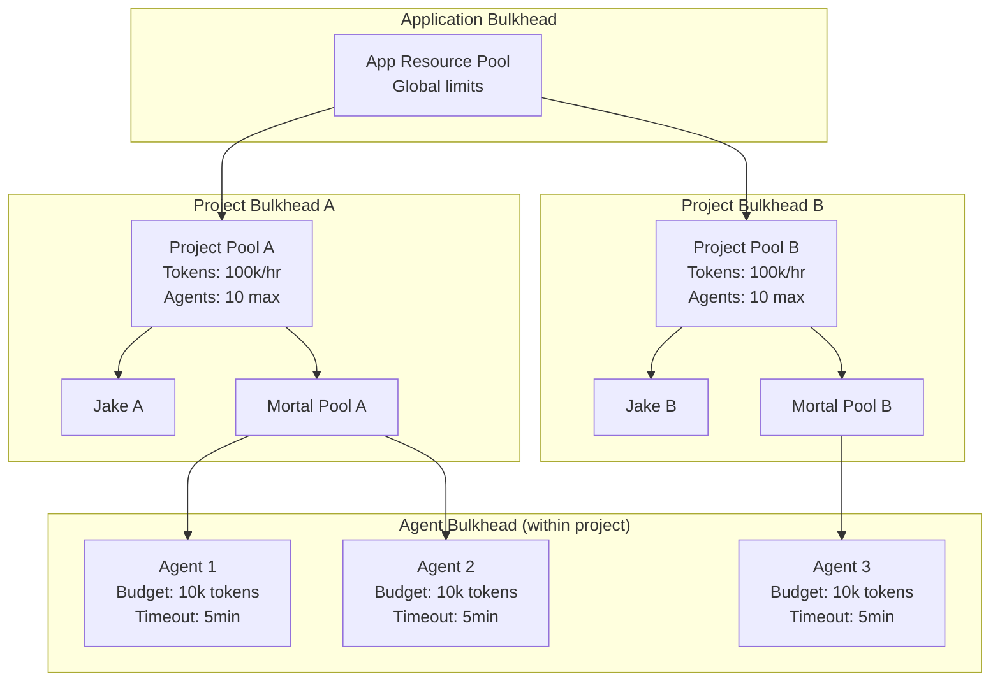

# Architecture Proposal: Bulkhead Pattern

**One-line summary:** Failure isolation compartments prevent cascade failures across agents, projects, and resources.

## Core Concept

The Bulkhead pattern comes from ship construction: watertight compartments prevent water from flooding the entire vessel when one section is breached. Applied to software, bulkheads isolate components so that failure in one cannot cascade to others.

In the Tavern context, bulkheads create isolation boundaries between agents, agent groups, and projects. A runaway agent consuming all API quota cannot starve other agents. A spinning drone cannot freeze Jake. A corrupted project cannot poison other projects. Each compartment has its own resource pool, failure domain, and recovery boundary.

Unlike Supervisor Trees (which focus on restarting failed components), Bulkheads focus on containment - ensuring that problems stay localized regardless of whether or when recovery happens. The two patterns are complementary: supervisors handle what to do when things fail; bulkheads ensure the damage stays contained while that happens.

## Key Components

**Isolation Levels:**

- **Application Bulkhead**: Global resource limits, protects host system
- **Project Bulkhead**: Per-project quotas, projects cannot starve each other
- **Agent Bulkhead**: Per-agent budgets and timeouts, individual agent containment
- **Task Bulkhead** (optional): Per-task isolation for parallel work within an agent

## Pros

- **Natural fit for multi-project**: Each project gets its own isolation domain, matching the PRD's multi-project support

- **Resource fairness guaranteed**: Token budgets, timeouts, and agent limits prevent any single component from monopolizing resources

- **Complements existing architecture**: Works alongside current `TavernProject` → `TavernCoordinator` → agents hierarchy

- **Supports Fish-or-Cut-Bait**: Bulkhead boundaries define where to "cut" - reap everything within the breached compartment

- **Sandbox primitive alignment**: Maps directly to PRD's sandbox primitives (Changeset, Platform, Isolation, Outputs, Software)

- **Progressive implementation**: Can add bulkheads incrementally - start with project-level, add agent-level later

- **Testable isolation**: Each bulkhead can be stress-tested independently

## Cons

- **Configuration complexity**: Each bulkhead needs limits configured; too many knobs to tune

- **Resource fragmentation**: Reserved capacity in each bulkhead may sit idle while others are starved

- **Overhead per compartment**: Each bulkhead requires its own monitoring, accounting, and enforcement

- **Not a recovery mechanism**: Bulkheads contain failure but don't fix it; still need supervisors or manual intervention

- **Cross-bulkhead communication complexity**: Agents in different compartments need explicit coordination protocols

## When to Choose This Architecture

Choose the Bulkhead pattern when:

1. **Multi-tenancy matters**: Multiple projects or agent groups must not interfere with each other

2. **Resource exhaustion is a real threat**: Token budgets, API rate limits, or compute resources are constrained

3. **Partial degradation is acceptable**: Better to have 3 working projects and 1 failed than all 4 degraded

4. **Blast radius must be limited**: A single bad prompt or runaway agent cannot take down the system

5. **PRD sandbox primitives are being implemented**: Bulkheads provide the containment layer those primitives need

This pattern excels when you have multiple independent workloads that should not be able to affect each other's availability or performance.
