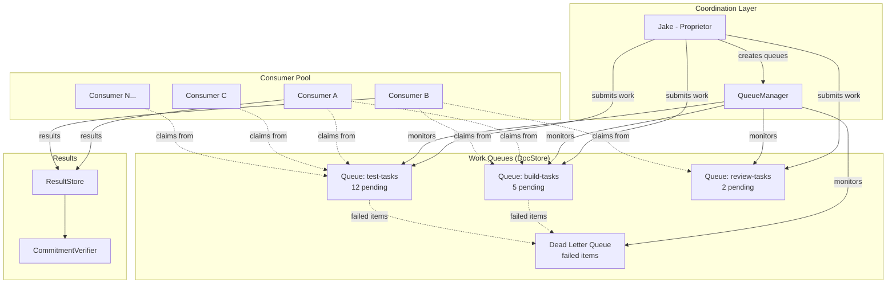

# Competing Consumers Architecture

**One-line summary:** Multiple agents consume from shared queues; work is distributed dynamically as agents become available, with failed work automatically retried by different consumers.

## Core Concept

The Competing Consumers pattern organizes work distribution around shared queues where multiple agents compete to claim and process work items. Unlike Work-Stealing (#8) where agents have "home" queues and steal from others when idle, Competing Consumers treats all consumers as equal peers with no queue affinity. When a work item enters a queue, the next available agent claims it, regardless of which agent handled previous items.

This is a classic enterprise integration pattern (EIP) that maps directly to the PRD's drone concept: "Meeseeks-style, one task then terminate, cheap to fail." Drones are interchangeable workers. They don't maintain task context across items. They claim, execute, report, and move on. If one fails, another drone picks up the failed work item from the same queue -- the work item doesn't care which drone processes it.

The pattern's power lies in its simplicity and fault tolerance. The queue is the coordination mechanism. Agents don't need to know about each other; they only need to know how to claim from queues and report results. This decoupling enables natural horizontal scaling: add more drones to increase throughput, remove them when demand drops. Queue depth becomes the primary scaling signal.

## Key Components

## Pros

- **Simple mental model** -- Agents are interchangeable; queues hold work; agents claim and process. No complex routing or stealing logic.

- **Natural fault tolerance** -- When a consumer fails mid-task, the work item returns to the queue (after visibility timeout) and another consumer picks it up.

- **Horizontal scalability** -- Add consumers to increase throughput; remove them when demand drops. Queue depth is the scaling signal.

- **No coordination between consumers** -- Consumers don't communicate with each other; they only interact with queues. Fewer failure modes.

- **Exactly-once semantics achievable** -- With proper visibility timeouts and acknowledgment, each item is processed exactly once.

- **Natural metrics** -- Queue depth, consumer count, processing rate, failure rate are all directly observable.

## Cons

- **No task affinity** -- If a task benefits from being processed by the same agent (conversational continuity), this pattern doesn't support it.

- **Queue contention** -- Many consumers claiming from the same queue can cause contention. Requires efficient queue implementation.

- **Visibility timeout tuning** -- Too short and items get processed twice; too long and failed items wait unnecessarily.

- **No priority within queue** -- Standard FIFO ordering; priority requires multiple queues or priority-aware queue implementation.

- **Dead letter queue management** -- Permanently failed items accumulate; need monitoring and manual intervention.

- **Limited to homogeneous work** -- All consumers process all queues (or a configured subset). Specialization requires multiple consumer pools.

## When to Choose This Architecture

Choose Competing Consumers when:

- **Work items are independent and interchangeable** -- Each item can be processed by any available agent without context from previous items.

- **Fault tolerance is critical** -- The system must continue operating even when individual consumers fail.

- **Throughput scales with consumer count** -- You want the ability to add/remove consumers to match demand.

- **Simplicity trumps sophistication** -- You prefer a well-understood pattern over custom coordination logic.

- **Work distribution is naturally queue-based** -- Tasks decompose into items that can wait in queues.

Avoid Competing Consumers when:

- **Tasks require conversational continuity** -- Multi-turn interactions where context matters.

- **Work items have complex dependencies** -- Items that must be processed in specific order or by specific agents.

- **Agent specialization matters** -- Different agents have different capabilities that should match task types.

- **Low-latency is required** -- Queue polling adds latency compared to direct dispatch.
