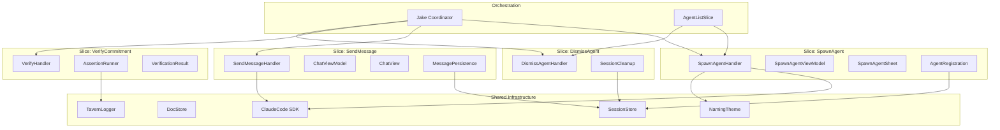

# Vertical Slices Architecture

**One-line summary:** Organize code by feature/use-case rather than technical layer, with each slice containing all the code (UI, business logic, persistence) needed to complete a single user operation.

## Core Concept

The current architecture organizes code by technical responsibility: agents in `Agents/`, chat logic in `Chat/`, persistence in `Persistence/`, coordination in `Coordination/`. Each layer is internally cohesive but operations like "spawn an agent" require traversing multiple directories and understanding the contracts between them.

Vertical Slices inverts this structure. Each slice represents a complete user operation: `SpawnAgent`, `SendMessage`, `VerifyCommitment`, `DismissAgent`, etc. Within each slice lives everything needed to execute that operation: the view model, the business logic, the persistence calls, and the tests. The question shifts from "where is the agent code?" to "what happens when a user spawns an agent?"

This pattern comes from Jimmy Bogard's work on CQRS and feature-driven development. The key insight is that coupling is inevitable. Code that changes together belongs together. When you add a new field to the spawn flow, you touch the UI, the coordinator, the spawner, and the tests. In a layered architecture, these live in four directories. In a sliced architecture, they live in one folder. The slice becomes the unit of change.

Slices can share infrastructure (the `ClaudeCode` SDK wrapper, the `DocStore`, common protocols) but the feature logic is isolated. Cross-cutting concerns like logging, authentication, or error handling are injected into slices rather than imported from a shared layer.

## Key Components

## Pros

- **Cohesive changes**: Adding a feature means adding a folder. Modifying a feature means changing one slice. No more "where else does this touch?"

- **Parallel development**: Different developers work on different slices without merge conflicts in shared layers.

- **Clear ownership**: Each slice has a single responsibility. Code review scope is obvious.

- **Easier testing**: Slice tests are focused and complete. No need to mock the entire layer beneath.

- **Feature flags trivial**: Enable/disable entire slices without touching shared code.

- **Deletion is safe**: Removing a feature means removing a folder. No orphaned layer code.

- **Onboarding clarity**: New developers trace a single slice end-to-end rather than building a mental model of all layers first.

## Cons

- **Duplication risk**: Similar code across slices (error handling patterns, UI boilerplate) may diverge. Requires discipline to extract truly shared code to infrastructure.

- **Cross-slice coordination**: Operations involving multiple features (spawn then immediately send message) require explicit wiring or a thin orchestration layer.

- **Unfamiliar to many Swift developers**: Most iOS/macOS projects use layered architecture. Vertical slices require mindset shift.

- **Directory explosion**: Many small folders instead of few large ones. IDE navigation changes character.

- **Shared state management**: When multiple slices need the same state (agent list), you either duplicate or introduce shared state containers that partially resurrect layers.

- **Refactoring friction**: Extracting common patterns from established slices requires touching multiple folders.

## When to Choose This Architecture

Choose Vertical Slices when:

- The application is feature-rich with many independent operations
- Features change frequently and independently
- Multiple developers work on different features simultaneously
- You want to minimize coordination overhead between team members
- Feature toggles and A/B testing are common requirements
- You are comfortable with some code duplication in exchange for isolation

Avoid Vertical Slices when:

- The application has few features with deep cross-cutting behavior
- Most operations share significant logic that would be duplicated
- The team is small and changes everything together anyway
- The codebase follows established iOS/macOS patterns that newcomers expect
- Shared domain model is more important than feature isolation
