# Contract-First Architecture

**One-line summary:** Define all interfaces (Swift protocols) before implementation; contracts are the source of truth that enable parallel development, better testing, and clear boundaries.

## Core Concept

Contract-First architecture inverts the typical development flow. Instead of writing implementations and extracting protocols later, you define the protocols (contracts) first. These contracts become the authoritative specification for how components interact. Implementation follows contracts, not the other way around.

In the Tavern context, this means every major component has a protocol that specifies its public interface. The `Agent` protocol already exists; Contract-First extends this pattern to `AgentCoordinating`, `AgentSpawning`, `AgentStoring`, `CommitmentVerifying`, `DocumentStoring`, `SessionPersisting`, and more. Each protocol captures the contract between components, documented with preconditions, postconditions, and semantic expectations.

The power comes from treating protocols as design artifacts, not implementation details. A protocol change triggers architectural discussion. Implementation changes within a contract are routine. This separation enables multiple developers (or AI agents) to work in parallel on different implementations of the same contract, confident their code will integrate cleanly.

## Key Components

```mermaid
graph TD
    subgraph "Contract Layer (Protocols)"
        PA[Agent]
        PC[AgentCoordinating]
        PS[AgentSpawning]
        PR[AgentStoring]
        PCV[CommitmentVerifying]
        PDS[DocumentStoring]
        PSS[SessionPersisting]
        PCL[ClaudeCodeProviding]
    end

    subgraph "Implementation Layer"
        Jake[Jake: Agent]
        MA[MortalAgent: Agent]
        TC[TavernCoordinator: AgentCoordinating]
        AS[AgentSpawner: AgentSpawning]
        AR[AgentRegistry: AgentStoring]
        CV[CommitmentVerifier: CommitmentVerifying]
        DS[DocStore: DocumentStoring]
        SS[SessionStore: SessionPersisting]
        CC[ClaudeCodeClient: ClaudeCodeProviding]
    end

    subgraph "Test Doubles Layer"
        MockA[MockAgent: Agent]
        MockTC[MockCoordinator: AgentCoordinating]
        MockAS[MockSpawner: AgentSpawning]
        MockAR[MockRegistry: AgentStoring]
        MockCV[MockVerifier: CommitmentVerifying]
        MockDS[MockDocStore: DocumentStoring]
        MockSS[MockSessionStore: SessionPersisting]
        MockCC[MockClaudeCode: ClaudeCodeProviding]
    end

    PA -.->|conforms| Jake
    PA -.->|conforms| MA
    PA -.->|conforms| MockA

    PC -.->|conforms| TC
    PC -.->|conforms| MockTC

    PS -.->|conforms| AS
    PS -.->|conforms| MockAS

    PR -.->|conforms| AR
    PR -.->|conforms| MockAR

    PCV -.->|conforms| CV
    PCV -.->|conforms| MockCV

    PDS -.->|conforms| DS
    PDS -.->|conforms| MockDS

    PSS -.->|conforms| SS
    PSS -.->|conforms| MockSS

    PCL -.->|conforms| CC
    PCL -.->|conforms| MockCC
```

## Pros

- **Parallel development**: Multiple developers/agents can implement different components simultaneously against stable contracts. No waiting for others to finish.

- **Testability by design**: Every component is injectable because every dependency is a protocol. Mocks are trivial to create and maintain.

- **Clear boundaries**: Protocols make component boundaries explicit. You cannot accidentally depend on implementation details.

- **Documentation as code**: Protocol declarations with doc comments become living documentation. The compiler enforces that implementations match the contract.

- **Migration safety**: Changing implementations (e.g., swapping `ClaudeCodeClient` for a different SDK) requires only conformance to the existing protocol.

- **Design review focus**: Protocol changes are the architectural decisions. Implementation changes are routine. Code reviews focus on what matters.

- **Incremental adoption**: Can be adopted protocol-by-protocol. No big-bang migration required.

## Cons

- **Upfront design cost**: Requires thinking through interfaces before writing code. This slows initial development but accelerates later stages.

- **Protocol explosion risk**: Overzealous protocol extraction creates indirection without benefit. Discipline required to extract only meaningful contracts.

- **Swift protocol limitations**: Swift protocols cannot have stored properties, associated types add complexity, and existential types (`any Protocol`) have performance overhead.

- **Over-abstraction danger**: Protocols that mirror their single implementation add ceremony without value. Must resist "every class needs a protocol" thinking.

- **Versioning complexity**: Protocol changes affect all conforming types. Breaking changes require careful coordination.

- **Discoverability**: New developers must learn protocol structure before understanding implementations. Indirection adds cognitive load.

## When to Choose This Architecture

Choose Contract-First when:

- Multiple developers/agents will work on different subsystems in parallel
- You need comprehensive test coverage with isolated unit tests
- The project has stable requirements where interfaces can be designed upfront
- External dependencies (like ClaudeCodeSDK) need abstraction for testing and future replacement
- You want explicit architectural boundaries enforced by the compiler
- Code review should focus on interface design rather than implementation details

Avoid Contract-First when:

- Requirements are highly uncertain and interfaces will change frequently
- The team is very small (1-2 developers) and parallel development is rare
- Rapid prototyping is more valuable than architectural cleanliness
- The codebase is exploratory and will be rewritten anyway
- Swift protocol limitations (associated types, existentials) create significant friction
