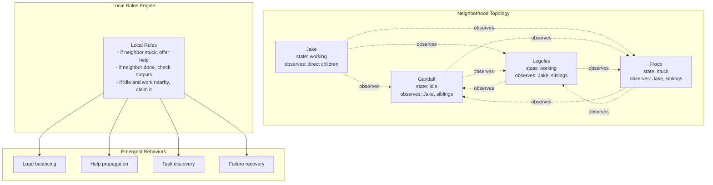

# Cellular/Emergent Architecture

**One-line summary:** Simple local rules produce emergent global behavior; agents observe neighbors and react without central coordination, like Conway's Game of Life or ant colonies.

## Core Concept

Cellular/Emergent architecture draws inspiration from biological systems and cellular automata. Each agent operates with only local awareness - observing the states of its immediate "neighbors" and applying simple rules to decide its own behavior. No agent has global knowledge. No central coordinator directs the orchestra. Yet complex, adaptive coordination emerges from the aggregate of simple local interactions.

Think of an ant colony: no ant knows the colony's goals. Each ant follows simple rules like "if you encounter food, carry it toward the nest" and "if you smell pheromone trail, follow it." From millions of ants following these rules, sophisticated foraging behavior emerges. Tavern's agents could operate similarly - each agent observes nearby agents (defined by assignment similarity, parent-child relationship, or shared resources), applies local rules ("if my neighbor is stuck, offer help"), and the system self-organizes.

The key distinction from choreography is the absence of explicit events and handlers. In choreography, agents publish events and subscribe to event types - there is still a communication protocol. In cellular/emergent, agents simply observe state. There is no "TaskCompleted event" - an agent's neighbor notices that the agent's state changed to `.done` and reacts accordingly. This makes the system more implicit but also more organic.

## Key Components

## Pros

- **Extreme decentralization** - No single point of failure or bottleneck; the system has no central coordinator to crash

- **Organic adaptation** - New coordination patterns emerge without explicit design; the system evolves naturally

- **Simplicity of individual components** - Each agent follows simple rules, making individual agents easy to understand and test

- **Resilience** - Local failures remain local; neighbors adapt without system-wide cascades

- **Aligns with Discovery Sharing (PRD 9.3)** - Agents noticing and sharing oddities becomes a natural local rule

- **Natural load balancing** - "If I'm idle and neighbor is overwhelmed" rules distribute work automatically

- **No protocol negotiation** - Agents observe state, not messages; no schema evolution or version compatibility

## Cons

- **Emergent behavior is unpredictable** - The system may exhibit surprising, undesigned behaviors that are difficult to debug

- **Global guarantees are hard** - Verifying system-wide invariants requires understanding emergent properties

- **Debugging requires simulation** - "Why did the system do X?" often requires replaying the entire state evolution

- **Neighborhood definition is critical and unclear** - Wrong topology produces wrong emergent behavior

- **Jake's authority dissolves** - The Proprietor becomes just another cell following rules

- **PRD commitment verification conflict** - "Commitments verified independently" requires authority that emergence lacks

- **Observation overhead** - Continuous state polling may be expensive compared to event notification

## When to Choose This Architecture

**Choose Cellular/Emergent when:**

- Adaptive, self-healing behavior matters more than predictable control flow

- Agent coordination patterns are unknown and need to evolve organically

- Resilience to partial failures is critical

- The system has many similar agents that benefit from local cooperation

- Research or experimentation with emergent coordination is the goal

**Avoid Cellular/Emergent when:**

- Strict hierarchical control is required (PRD invariants)

- Predictable, debuggable coordination is essential for v1

- The number of agents is small (emergent patterns need density)

- Deterministic verification of commitments must be enforced

- Jake's character as "The Proprietor in charge" is core to the product
