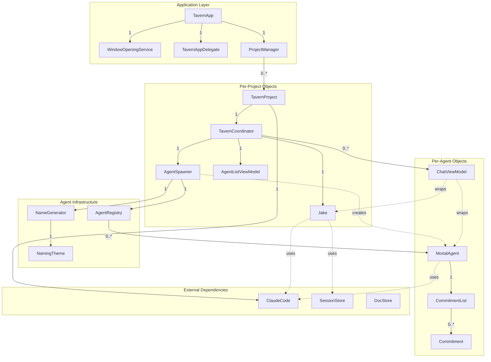
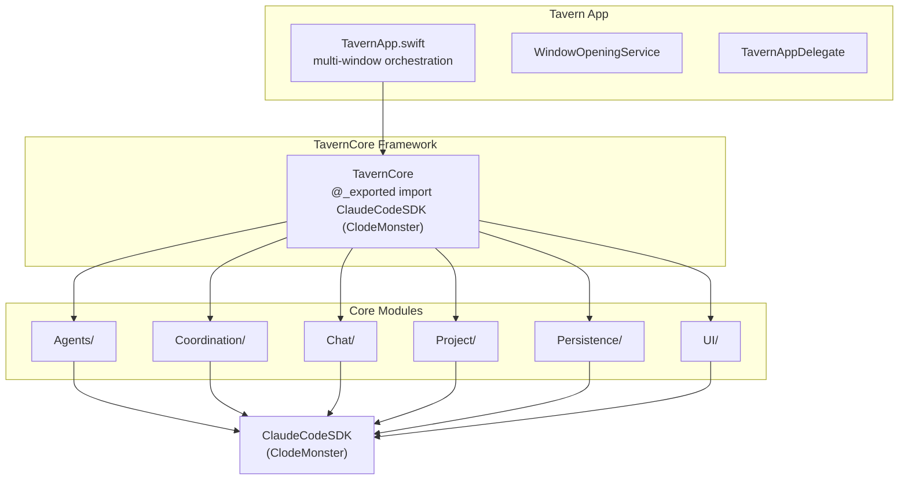
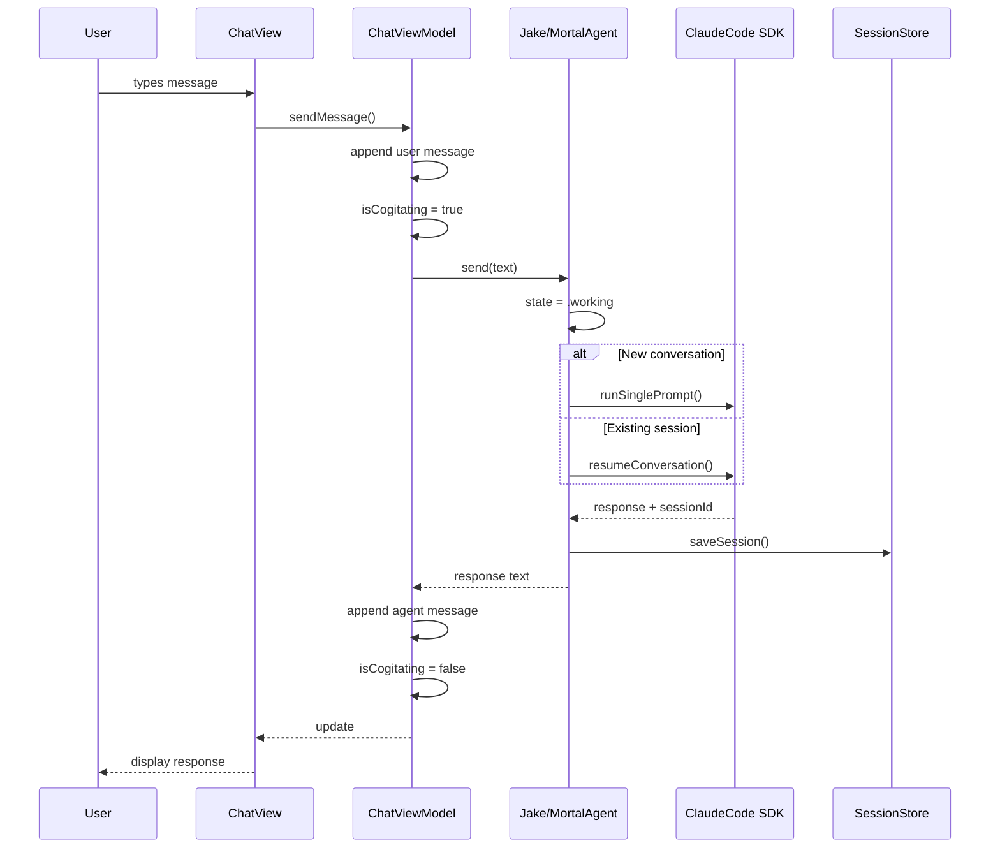
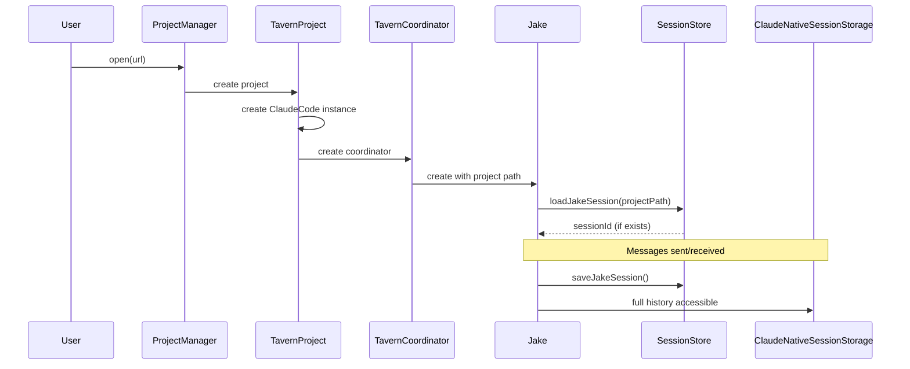
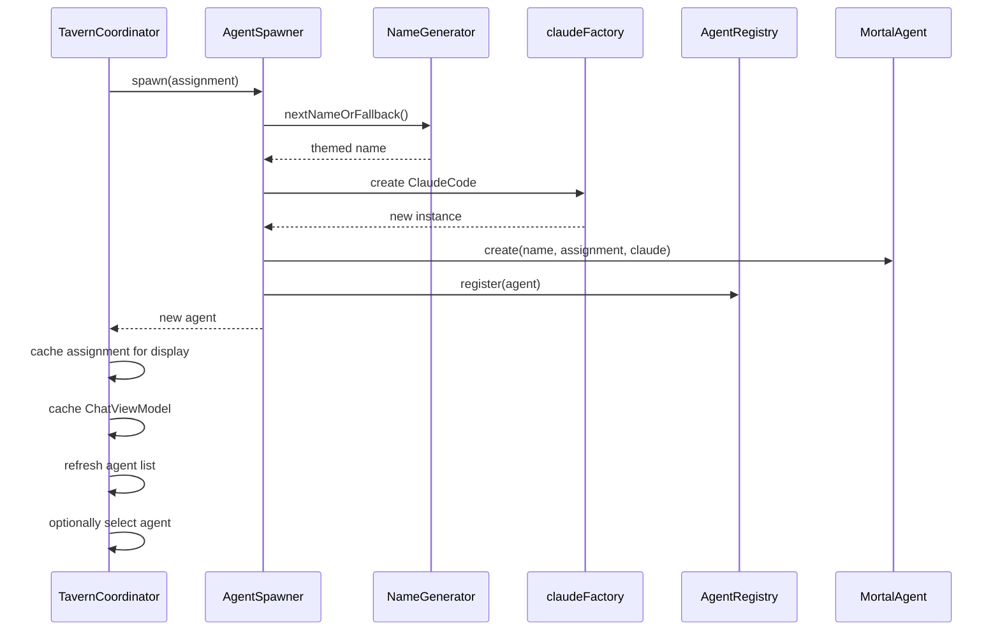
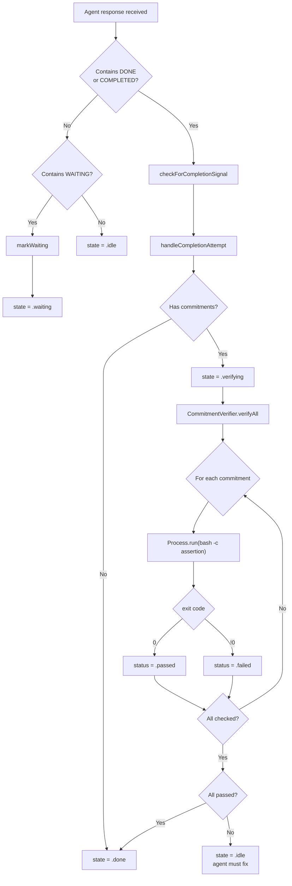
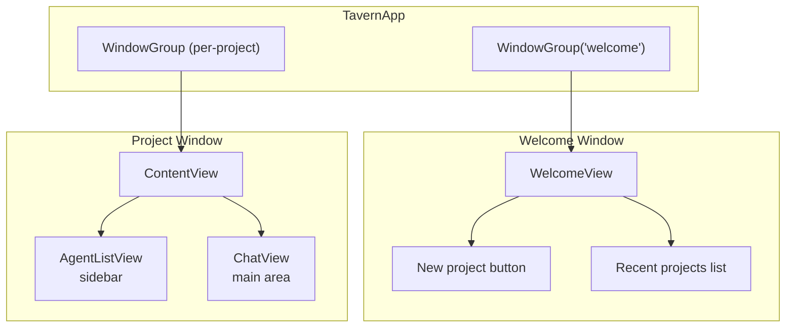
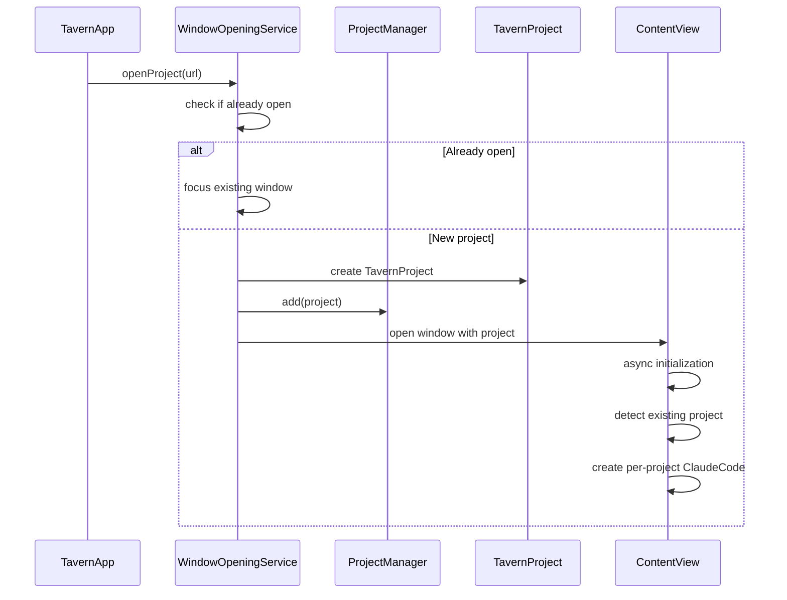

# Tavern v1 Architecture

A code inspection guide for the multi-agent orchestrator.


## Directory Structure

```
Tavern/
├── Package.swift              # SPM manifest
├── project.yml                # XcodeGen config
├── Sources/
│   ├── Tavern/                # SwiftUI App (thin shell)
│   │   ├── TavernApp.swift    # Entry point, multi-window management
│   │   └── Views/
│   │       ├── ChatView.swift
│   │       ├── AgentListView.swift
│   │       └── WelcomeView.swift
│   │
│   └── TavernCore/            # All business logic (testable, no UI)
│       ├── TavernCore.swift   # Module exports
│       ├── Agents/            # Agent system
│       ├── Chat/              # Chat view models
│       ├── Coordination/      # Orchestration
│       ├── Commitments/       # Verification system
│       ├── Errors/            # Error types and messages
│       ├── Logging/           # TavernLogger
│       ├── Naming/            # Themed name generation
│       ├── Persistence/       # DocStore, SessionStore
│       ├── Project/           # Multi-project support
│       ├── Registry/          # AgentRegistry
│       ├── Testing/           # Mocks and fixtures
│       └── UI/                # View models (bridge layer)
│
└── Tests/
    ├── TavernCoreTests/       # Unit tests for core
    └── TavernTests/           # Integration tests
```


## Object Ownership Hierarchy

This diagram shows the runtime object graph from the application entry point down to leaf objects. Cardinality annotations show ownership relationships.



**Legend:**
- Solid arrows (`-->`) = ownership (parent creates/destroys child)
- Dashed arrows (`-.->`) = usage/reference (no ownership)
- `1` = exactly one
- `0..*` = zero or more
- `1..*` = one or more


## Module Dependency Graph




## Core Types


### Project System (`Sources/TavernCore/Project/`)

The codebase supports **multi-project orchestration**. Each project is a separate directory with its own Jake instance, coordinator, and Claude configuration.

**`TavernProject`** — Represents an open project directory.

- File: `TavernProject.swift`
- Contains: project URL, display name, coordinator reference
- Each project has its own `TavernCoordinator` and `ClaudeCode` instance

**`ProjectManager`** — Manages multiple open projects.

- File: `ProjectManager.swift`
- Tracks all open projects
- Persists recent projects list
- Handles project open/close lifecycle


### Agents (`Sources/TavernCore/Agents/`)

**`Agent` protocol** — Common interface for all agents.

```swift
public protocol Agent: AnyObject, Identifiable, Sendable {
    var id: UUID { get }
    var name: String { get }
    var state: AgentState { get }
    func send(_ message: String) async throws -> String
    func resetConversation()
}
```

**`AgentState`** — Lifecycle states: `idle`, `working`, `waiting`, `verifying`, `done`.


**`Jake`** — The Proprietor. Eternal top-level agent.

- File: `Jake.swift`
- Has a static `systemPrompt` defining his character
- Uses `ClaudeCode` to communicate with Claude
- Maintains `_sessionId` and `_projectPath` for per-project session continuity
- Restores sessions via `SessionStore.loadJakeSession(projectPath:)`
- Saves sessions per-project after responses
- Thread-safe via `DispatchQueue`


**`MortalAgent`** — Worker agents spawned for tasks.

- File: `MortalAgent.swift`
- Has an `assignment` (their purpose)
- Has `CommitmentList` for verification before completion
- **Completion signals:** Detects both "DONE" and "COMPLETED" in responses
- **Waiting signal:** Detects "WAITING" to pause for external action
- **State methods:** `addCommitment()`, `markWaiting()`, `markDone()`
- **Computed properties:** `allCommitmentsPassed`, `hasFailedCommitments`
- Auto-transitions through: `idle` → `working` → `waiting`/`verifying` → `done`


**`AnyAgent`** — Type-erased wrapper for heterogeneous collections.


**`AgentRegistry`** — Thread-safe registry of all agents.

- File: `AgentRegistry.swift`
- Stores agents by ID and name
- Enforces name uniqueness


**`AgentSpawner`** — Factory for creating mortal agents.

- File: `AgentSpawner.swift`
- Depends on: `AgentRegistry`, `NameGenerator`, `ClaudeCode` factory
- Creates agents, registers them, handles dismissal


### Coordination (`Sources/TavernCore/Coordination/`)

**`TavernCoordinator`** — Central hub for a single project.

- File: `TavernCoordinator.swift`
- `@MainActor` (UI-bound)
- Owns: `Jake`, `AgentSpawner`
- Publishes: `agentListViewModel`, `activeChatViewModel`
- **View model caching:** Chat view models are cached per-agent and reused
- **Selection state:** `selectAgent()` updates `activeChatViewModel` dynamically
- Handles: agent selection, spawning, dismissal


### UI Layer (`Sources/TavernCore/UI/`)

Bridge between SwiftUI views and core logic.

**`AgentListViewModel`** — View model managing agent list and selection.

- File: `AgentListViewModel.swift`
- `@MainActor` (UI-bound)
- Manages agent list display
- Tracks current selection

**`AgentListItem`** — Display model for list items.

- File: `AgentListItem.swift`
- Contains display-ready agent info


### Chat (`Sources/TavernCore/Chat/`)

**`ChatMessage`** — Single message with role (`.user` or `.agent`).

- File: `ChatMessage.swift`


**`ChatViewModel`** — View model for a conversation.

- File: `ChatViewModel.swift`
- `@MainActor` (UI-bound)
- Wraps any `Agent` via `AnyAgent`
- Manages: `messages`, `isCogitating`, `inputText`, `error`
- Has "cogitation verbs" for thinking indicator ("Pondering", "Scheming", etc.)


### Commitments (`Sources/TavernCore/Commitments/`)

**`Commitment`** — A verifiable assertion.

- File: `Commitment.swift`
- Contains: `description`, `assertion` (shell command), `status`
- Statuses: `pending`, `verifying`, `passed`, `failed`


**`CommitmentList`** — Thread-safe collection of commitments.

- File: `CommitmentList.swift`


**`CommitmentVerifier`** — Runs shell commands to verify assertions.

- File: `CommitmentVerifier.swift`
- Executes `assertion` via `/bin/bash -c`
- Success = exit code 0


### Persistence (`Sources/TavernCore/Persistence/`)

**Session Storage Architecture:**

Session persistence operates at two levels:
1. **Session IDs** — Stored in UserDefaults with path-encoded keys
2. **Full History** — Accessible via `ClaudeNativeSessionStorage` (Claude CLI's native storage)

**`SessionStore`** — Session ID persistence.

- File: `SessionStore.swift`
- **Per-project sessions for Jake:** `loadJakeSession(projectPath:)`, `saveJakeSession(_:projectPath:)`
- **Per-agent sessions:** `loadAgentSession(agentId:)`, `saveAgentSession(_:agentId:)`
- **Path encoding:** Uses URL-safe encoding matching Claude CLI's scheme
- **History loading:** `loadJakeSessionHistory()` retrieves full conversation history from Claude's native storage


**`Document`** — Markdown with YAML frontmatter.

- File: `Document.swift`
- Contains: `id`, `title`, `metadata`, `content`, timestamps


**`DocStore`** — File-based document storage.

- File: `DocStore.swift`
- CRUD operations on markdown files
- Thread-safe via `DispatchQueue`


**`AgentNode`** — Document representing an agent's state.

- File: `AgentNode.swift`
- Serializes agent state to/from documents


**`AgentPersistence`** — Save/restore agents via DocStore.

- File: `AgentPersistence.swift`


### Errors (`Sources/TavernCore/Errors/`)

**`TavernError`** — Typed error enum for all failure modes.

- File: `TavernError.swift`
- Cases include: `sessionCorrupt`, `agentNotFound`, `spawnFailed`, etc.

**`TavernErrorMessages`** — User-facing error message generation.

- File: `TavernErrorMessages.swift`


### Naming (`Sources/TavernCore/Naming/`)

**`NamingTheme`** — Tiered list of themed names.

- File: `NamingTheme.swift`
- Built-in themes: `.lotr`, `.dune`, `.greek`, `.norse`, `.arthurian`
- Tiers for priority (heroes first, then secondary characters)


**`NameGenerator`** — Generates unique names.

- File: `NameGenerator.swift`
- Tracks used names
- Falls back to "Agent-N" when theme exhausted


### Logging (`Sources/TavernCore/Logging/`)

**`TavernLogger`** — Centralized logging via Apple's unified logging system.

- File: `TavernLogger.swift`
- Subsystem: `com.tavern.spillway`
- Categories: `agents`, `chat`, `coordination`, `claude`


### Testing (`Sources/TavernCore/Testing/`)

**`MockClaudeCode`** — Test double for `ClaudeCode`.

- File: `MockClaudeCode.swift`
- Queue responses, capture sent prompts
- Simulate errors via `errorToThrow` property
- Simulate delays


**`TestFixtures`** — Factory for test objects.

- File: `TestFixtures.swift`


## Data Flow


### Message Flow (User → Agent → Response)




### Per-Project Session Flow




### Agent Spawning Flow




### Commitment Verification Flow




## Thread Safety Model

All mutable state is protected by serial `DispatchQueue`:

| Type | Queue Label | Protected State |
|------|-------------|-----------------|
| Jake | `com.tavern.Jake` | `_sessionId`, `_projectPath`, `_isCogitating` |
| MortalAgent | `com.tavern.MortalAgent` | `_state`, `_sessionId` |
| AgentRegistry | `com.tavern.AgentRegistry` | `_agents`, `_nameToId` |
| NameGenerator | `com.tavern.NameGenerator` | `_usedNames`, indices |
| CommitmentList | `com.tavern.CommitmentList` | `_commitments` |
| DocStore | `com.tavern.DocStore` | file operations |
| MockClaudeCode | `com.tavern.MockClaudeCode` | all mock state |

UI-bound types (`TavernCoordinator`, `ChatViewModel`, `AgentListViewModel`) use `@MainActor`.

**Native Storage Access:** `ClaudeNativeSessionStorage` provides thread-safe access to Claude CLI's native session storage.


## Entry Point

**`TavernApp.swift`** manages multi-window orchestration:


### Key Components

**`WindowOpeningService`** — Bridges AppKit window management to SwiftUI.

- Tracks open project URLs
- Manages welcome window lifecycle
- Opens new project windows

**`TavernAppDelegate`** — AppKit integration.

- Provides Dock icon right-click menu
- Lists recent projects in Dock menu
- Opens projects from Dock


### Window Architecture



**Window restoration:** App restores previously open projects on restart.


### Project Initialization




## Logging & Observability

The Tavern uses Apple's unified logging system (`os.log`) for instrumentation.


### Logger Categories

All loggers use the subsystem `com.tavern.spillway`:

| Category | Logger | Purpose |
|----------|--------|---------|
| `agents` | `TavernLogger.agents` | Agent lifecycle, state transitions, session management |
| `chat` | `TavernLogger.chat` | Message flow, conversation state |
| `coordination` | `TavernLogger.coordination` | Agent spawn/dismiss, selection changes |
| `claude` | `TavernLogger.claude` | SDK calls, API interactions, responses |


### Viewing Logs

**Console.app:**
1. Open Console.app (Applications > Utilities)
2. Filter by: `subsystem:com.tavern.spillway`
3. Optional: further filter by category (e.g., `category:agents`)

**Terminal (streaming):**
```bash
log stream --predicate 'subsystem == "com.tavern.spillway"' --level debug
```


### Log Levels

| Level | When to Use | Example |
|-------|-------------|---------|
| `.debug` | Verbose development info | Entry/exit of functions, parameter values |
| `.info` | Key events | Message sent, agent spawned, state changed |
| `.error` | Failures | API call failed, verification failed |

**Note:** `.debug` logs are stripped from release builds by default.


### Adding New Logging

```swift
import os.log

// In your file, use the appropriate logger:
TavernLogger.agents.info("Agent \(name) spawned with assignment: \(assignment)")
TavernLogger.agents.debug("State transition: \(oldState) -> \(newState)")
TavernLogger.agents.error("Spawn failed: \(error.localizedDescription)")

// For private data that shouldn't appear in release logs:
TavernLogger.claude.debug("API response: \(response, privacy: .private)")
```


### Instrumentation Principle

Debug builds must be instrumented thoroughly enough that issues can be diagnosed from logs alone — without needing screenshots, videos, or human reproduction.

**What to log:**
- All SDK/API calls with parameters and results
- State transitions (agent state changes, UI state changes)
- Error conditions with full context
- Timing information for async operations


## Testing Strategy

**Unit Tests** (`TavernCoreTests/`):
- All core logic is in `TavernCore` with no UI dependencies
- `MockClaudeCode` allows testing without API calls
- Inject mocks via constructor (dependency injection pattern)

**Key Test Files**:
- Agent state transitions
- Registry operations
- Name generation exhaustion
- Commitment verification
- DocStore CRUD

**Example Test Pattern**:

```swift
func testAgentTransitionsToWorking() async throws {
    let mock = MockClaudeCode()
    mock.queueJSONResponse(result: "Hello", sessionId: "test")

    let agent = MortalAgent(name: "Test", assignment: "Do stuff", claude: mock)
    XCTAssertEqual(agent.state, .idle)

    _ = try await agent.send("Go")
    // State was .working during call, back to .idle after
    XCTAssertEqual(agent.state, .idle)
}
```

**App Previews:** `TavernApp.swift` includes SwiftUI Previews using mock setup for development.


## What's Not Implemented Yet

Per `v1-implementation-plan.md`, these are deferred:

- **Real Claude for spawned agents** — Currently mock
- **Sandboxing/overlays** — Agents have full access
- **Persistent agent recovery** — Mortal agents lost on app restart (Jake sessions persist)
- **Streaming responses** — Batch only
- **Multi-agent coordination** — Jake doesn't delegate yet
- **Agent-to-agent communication** — No direct messaging between agents
